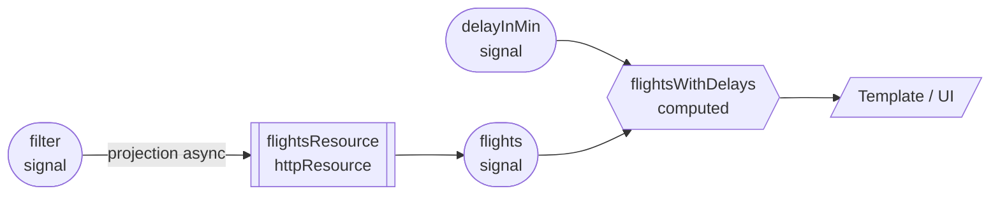

# 03 · Reactive Design with Signals
> 📖 cap.3 · pp.71-93 — *Modern Angular* v1.0.4

Finora i [[signal]] servivano solo a dire ad Angular *quando* aggiornare i binding del template. Qui si fa il salto: si usano i signal per un design **reattivo e dichiarativo**. Invece di descrivere *come* aggiornare i valori dipendenti, si descrive *da cosa* sono derivati; il framework tiene tutto in sync. L'analogia è il foglio di calcolo: definisci formule che derivano valori da altre celle, e quando cambia la sorgente le dipendenti si aggiornano da sole.

I mattoni sono tre — **computed signals**, **resources**, **effects** — più la semantica sottostante (auto-tracking, untracking, glitch-free). Si chiude assemblando il tutto in un **reactive flow** sulla `flight-search` del [[02-signal-based-components|cap.2]].

## Computed Signals
> 📖 pp.71-72

Un [[computed]] definisce un signal di sola lettura che **deriva** il proprio valore da altri signal; quando le dipendenze cambiano, ricalcola.

```ts
@Component({ /* ... */ })
export class FlightSearch {
  protected readonly filter = signal({ from: 'Hamburg', to: 'Graz' });
  protected readonly filterForm = form(this.filter);

  // si aggiorna automaticamente quando cambia filter
  protected readonly flightRoute = computed(
    () => `${this.filter().from} to ${this.filter().to}`,
  );
}
```

```html
<h2>Search Route: {{ flightRoute() }}</h2>
```

I computed sono **lazy**: ricalcolano solo quando qualcuno li legge (template o getter). Se un blocco osserva un signal per i cambiamenti, si dice che lo **traccia** (track). Per leggere un signal *senza* tracciarlo si usa [[untracked]]:

```ts
protected readonly from = computed(() => this.filter().from);
protected readonly to = computed(() => this.filter().to);

// traccia solo 'from', non 'to'
protected readonly flightRoute = computed(() => {
  const origin = this.from();                      // tracked
  const destination = untracked(() => this.to());  // NON tracked
  return `${origin} → ${destination}`;
});
```

Qui `flightRoute` si aggiorna solo quando cambia `from`, non `to`: controllo fine della reattività.

> [!tip] Take-away
> Preferisci sempre `computed` quando devi derivare un valore: è dichiarativo, lazy e tracciato automaticamente. Lascia gli `effect` solo agli effetti collaterali veri.

Collegamenti: [[computed]] · [[untracked]] · [[signal]]

## Resources: dati asincroni
> 📖 pp.73-78

I computed derivano valori **sincroni**; per i dati **asincroni** (es. fetch dal backend) servono le [[resource]]. Tutte proiettano signal di input in signal di output in modo asincrono. Angular ne offre tre implementazioni: `httpResource`, `rxResource` e `resource` (Promise-based).

### httpResource
Già visto nel [[02-signal-based-components|cap.2]]: API di alto livello per il caso più comune (richiesta HTTP). La prima funzione ritorna la richiesta ed è convertita internamente in un computed → traccia i signal letti al suo interno e ri-fetcha quando cambiano (e parte subito alla creazione). Ritornando `undefined` la si **disattiva**.

```ts
protected readonly flightsResource = httpResource<Flight[]>(
  () => {
    const filter = this.filter();
    if (!filter.from || !filter.to) {
      return undefined;                 // disattiva la resource
    }
    return {
      url: `https://demo.angulararchitects.io/api/flight`,
      params: { from: filter.from, to: filter.to },
    };
  },
  {
    defaultValue: [],
    parse: (raw) => FlightZodSchema.array().parse(raw),  // valida + trasforma
  },
);

protected readonly flights = this.flightsResource.value;
protected readonly isLoading = this.flightsResource.isLoading;
protected readonly error = this.flightsResource.error;
```

La novità qui è `parse`: trasforma e **valida** la risposta grezza prima di metterla in `value`. Delegando a uno schema Zod si riportano in vita anche i tipi persi nella serializzazione JSON (es. una proprietà `date` torna `Date`). Sotto il cofano usa `HttpClient`, quindi supporta gli interceptor (cap.12).

### rxResource
Usa una proprietà `stream` che ritorna un `Observable` (può emettere più valori nel tempo) per popolare `isLoading`, `error`, `value`.

```ts
protected readonly flightsResource = rxResource({
  params: () => ({ ...this.filter() }),
  stream: (loaderParams) => {
    const c = loaderParams.params;        // dati semplici, NON signal
    return this.find(c.from, c.to);
  },
  defaultValue: [],
});
```

Come per `httpResource`, `params` diventa un computed: cambia un signal letto lì → il loader si ri-triggera (e parte alla creazione; `undefined` lo disattiva). Al loader arrivano i parametri come **dati ordinari**, non come signal. È l'ideale quando hai già un servizio basato su Observable o ti serve la potenza di RxJS.

> [!tip] Take-away
> `rxResource` vive in `@angular/core/rxjs-interop`, il package per fare da ponte tra RxJS e signal: `toSignal` (Observable → Signal) e `toObservable` (il contrario).

### resource (Promise-based)
È l'implementazione base che sta sotto sia a `httpResource` sia a `rxResource`. Si usa raramente in modo diretto. Differenza: un `loader` che ritorna una **Promise** invece di uno `stream` che ritorna un Observable.

```ts
protected readonly flightsResource = resource({
  params: () => ({ from: this.filter().from, to: this.filter().to }),
  loader: (loaderParams) => {
    const c = loaderParams.params;
    const abortSignal = loaderParams.abortSignal;   // per la cancellazione
    return this.findPromise(c.from, c.to, abortSignal);
  },
  defaultValue: [],
});
```

Tutte le resource gestiscono le **race condition**: con richieste in rapida successione si usa solo il risultato dell'ultima. `httpResource` e `rxResource` *cancellano* le richieste obsolete; `resource`, lavorando con le Promise (non cancellabili), ne **ignora** semplicemente il risultato. Per cancellare davvero, la funzione chiamata deve rispettare un `AbortSignal` (API del browser, **niente a che vedere** con i signal di Angular):

```ts
findPromise(
  from: string,
  to: string,
  abortSignal?: AbortSignal,
): Promise<Flight[]> {
  const aborted = new Subject<void>();
  abortSignal?.addEventListener('abort', () => aborted.next());
  const flightsObservable = this.find(from, to).pipe(takeUntil(aborted));
  return firstValueFrom(flightsObservable);
}
```

`takeUntil(aborted)` completa l'Observable quando l'abort emette → unsubscribe → richiesta HTTP cancellata. `firstValueFrom` converte l'Observable in Promise.

> [!warning] Gotcha
> `AbortSignal` non è un signal Angular: è l'API del browser per cancellare operazioni async. Non confondere i due "signal".

> [!warning] Gotcha
> In un'app reale `findPromise` non lo scriveresti: terresti l'Observable che già hai e useresti `rxResource`. Esiste solo a scopo dimostrativo.

Collegamenti: [[resource]] · [[02-signal-based-components]] (intro a `httpResource`)

## Effects
> 📖 pp.79-81

Come un computed, un [[effect]] ri-esegue quando cambia un signal che legge; ma **non ritorna un valore**: esegue un side effect (logging, DOM, canvas, librerie terze).

```ts
constructor() {
  // gira ad ogni cambio di filter
  effect(() => {
    const filter = this.filter();
    console.log('From:', filter.from);
    console.log('To:', filter.to);
  });
}
```

Gli effect vanno creati in un **injection context** ([[injection-context|cap.5]]): costruttore e field initializer del componente lo sono sempre. Il costruttore è il posto giusto (metafora: cabli la casa quando la costruisci, poi la usi). Vanno usati con **parsimonia**: una catena di effect che si triggerano a vicenda è un incubo da debuggare → preferisci i computed.

Regola pratica: usa gli effect per il **rendering** non esprimibile via data binding — toast, disegno su canvas, librerie ignare dei signal. Esempio reale: mostrare un toast d'errore con `MatSnackBar`.

```ts
private showError() {
  effect(() => {
    const error = this.error();
    if (error || this.filter().to === 'error') {
      this.snackBar.open('Error loading flights: ' + error, 'OK');
    }
  });
}
```

Per logica che **legge/manipola il DOM**, l'effect deve girare *dopo* il rendering. Angular offre una famiglia di API dedicate:

```ts
afterRenderEffect(() => { /* manipolazione DOM, reattiva ai signal */ });
afterNextRender(()   => { /* dopo il PROSSIMO ciclo, una volta sola */ });
afterEveryRender(()  => { /* dopo OGNI ciclo, indipendente dai signal */ });
```

`afterRenderEffect` per misurare dimensioni, scrollare, integrare charting; `afterNextRender`/`afterEveryRender` per logica DOM dopo i cicli di rendering a prescindere dai cambi di signal.

> [!tip] Take-away
> "Rendering" qui è in senso largo: l'ultimo miglio verso il *data sink*, di solito la UI ma anche console (logging) o localStorage.

Collegamenti: [[effect]] · [[injection-context]]

## Signal Semantics
> 📖 pp.82-88

### Signal e lifecycle del componente
Un effect creato nel costruttore non parte subito: Angular **ne rinvia l'esecuzione** finché il componente non è inizializzato. Quindi quando gira può leggere in sicurezza gli input.

```ts
export class FlightCard {
  readonly item = input.required<Flight>();
  constructor() {
    // console.log('Item:', this.item());  // ❌ input non ancora inizializzato
    effect(() => console.log('Item:', this.item()));  // ✅ OK
  }
  // per lo stesso motivo è sicuro leggere gli input dentro un computed:
  protected readonly flightRoute = computed(
    () => `${this.item().from} to ${this.item().to}`,
  );
}
```

### Auto-tracking e reactive context
Angular traccia automaticamente tutti i signal letti dentro un [[reactive-context]]. Dal punto di vista dello sviluppatore i contesti reattivi sono **due**: **template** ed **effect**. I signal letti dentro un computed sono tracciati quando il computed è letto in un template o in un effect (si usa il contesto di questi ultimi). Il tracking è **transitivo**: vale anche per i signal letti in un metodo/funzione chiamato dentro il contesto.

```ts
constructor() {
  // l'effect traccia tutti i signal letti in logCriteria
  effect(() => { this.logCriteria(); });
}
private logCriteria(): void {
  const filter = this.filter();   // tracciato automaticamente
  console.log('Criteria:', filter.from, '→', filter.to);
}
```

> [!warning] Gotcha
> Il tracking transitivo è insidioso: guardando l'effect non è ovvio cosa traccia. Non chiamare **business logic** dentro un effect:
> ```ts
> effect(() => {
>   const criteria = this.criteria();
>   this.businessService.executeLogic(criteria);  // ❌
> });
> ```
> Se `executeLogic` legge altri signal (`isLoading`, `userId`...), anche quelli vengono tracciati → re-run inattesi (es. cancella altri record). Inoltre, a differenza della Resource API, **l'effect non gestisce le race condition**: chiamate sovrapposte possono sovrascriversi.

### Explicit effects (controverso)
Con [[untracked]] dentro un effect si traccia *solo* ciò che si vuole esplicitamente:

```ts
// 👍 si ri-esegue solo quando cambia criteria
effect(() => {
  const criteria = this.criteria();
  untracked(() => {
    this.businessService.executeLogic(criteria);
  });
});
```

Risolve il problema sopra ma rende il codice meno trasparente, non è nello spirito reattivo, può creare catene difficili da debuggare e **non** affronta le race condition. Pattern molto dibattuto nella community.

### Untracking automatico
Per evitare memory leak Angular smette di tracciare quando il blocco (es. il componente) è distrutto, **e** quando un signal non viene più letto durante un run:

```ts
effect(() => {
  if (isDelayed()) {
    console.log(delay());   // delay tracciato solo se isDelayed è true
  }
});
```

Se `isDelayed` diventa `false`, `delay` non è più letto → non più tracciato → i suoi cambi non ri-triggerano l'effect. Per tracciarlo **sempre**, leggilo fuori dalla condizione (di solito all'inizio):

```ts
effect(() => {
  const isDelayedValue = isDelayed();
  const delayValue = delay();          // sempre letto → sempre tracciato
  if (isDelayedValue) {
    console.log(delayValue);
  }
});
```

Vale identico per `computed` e per i signal usati nei template.

### Glitch-free property
I signal sono **glitch-free**: un consumer reattivo (template/effect) non vede mai stati intermedi incoerenti. Se cambi più signal di fila, il contesto gira **una sola volta** con i valori finali.

```ts
constructor() {
  effect(() => {
    const filter = this.filter();
    console.log('from:', filter.from, '| to:', filter.to);
  });
  setTimeout(() => {
    this.filter.update((f) => ({ ...f, from: 'Paris' }));
    this.filter.update((f) => ({ ...f, from: 'Frankfurt' }));
    this.filter.update((f) => ({ ...f, from: 'New York' }));
    this.filter.update((f) => ({ ...f, to: 'Berlin' }));
    this.filter.update((f) => ({ ...f, to: 'Zurich' }));
    this.filter.update((f) => ({ ...f, to: 'London' }));
  }, 2000);
}
```

Dopo 2 secondi l'effect gira **una volta** e stampa `New York` / `London`. Vantaggio: niente stati incoerenti né rendering inutili.

> [!warning] Gotcha
> Proprio perché glitch-free, i signal **non** servono a rappresentare eventi o stream temporali: i messaggi rapidamente seguiti da altri vanno persi. Per quegli scenari usa RxJS/Observable.

### Equality e immutability
Su `set`/`update` Angular controlla se il valore è **davvero** cambiato, per evitare aggiornamenti inutili. Di default usa l'uguaglianza stretta `===`. Su primitivi va bene; su **oggetti/array** `===` confronta il *riferimento*, non il contenuto.

```ts
const count = signal(0);
count.set(0); count.set(0); count.set(0);   // nessun update: 0 === 0
```

Quindi per gli oggetti devi creare **nuove istanze** copiando le parti immutate (spread):

```ts
flight.update((flight) => ({
  ...flight,        // shallow copy
  date: newDate,
  delayed: true,
}));
```

Questa è l'**immutabilità**: non si modifica il contenuto, si creano nuove versioni. Serve anche al change detection **OnPush**: nel `@for ... track flight.id`, Angular fa un `===` tra il vecchio e il nuovo `flight` per capire quale `FlightCard` aggiornare. Se il riferimento non cambia, non aggiorna nulla.

> [!warning] Gotcha
> Aggiornare un oggetto/array **mutandolo** (push, assegnazione di proprietà) lascia lo stesso riferimento → `===` dà `true` → Angular **non** rileva il cambio e la UI non si aggiorna. Crea sempre nuove istanze.

Puoi passare una **equality function** custom (secondo parametro di `signal`), ma serve raramente e di solito confonde più che aiutare.

Collegamenti: [[reactive-context]] · [[untracked]] · [[equality-immutability]] · [[linked-signal]] (per stato che dipende da una sorgente ma resta scrivibile)

## Establishing a Reactive Flow
> 📖 pp.89-93

### Pensare per signal graph
Angular mantiene in background un **signal graph**: la struttura che dice come signal, computed e consumer (effect, template) dipendono tra loro — cioè come i dati fluiscono nell'app. Ragionare per grafo rende naturale costruire il flusso. Esempio: oltre ai `flights` c'è un `delayInMin`; il flow parte da `filter`, è proiettato asincronamente in `flights` via `flightsResource`, poi `flights` si combina con `delayInMin` in un computed `flightsWithDelays`, che è ciò che il template mostra.



### Implementare il flow
Si aggiungono `delayInMin` e il computed `flightsWithDelays` al componente:

```ts
export class FlightSearch {
  protected readonly filter = signal({ from: 'Graz', to: 'Hamburg' });
  protected readonly filterForm = form(this.filter);
  protected readonly flightsResource = httpResource<Flight[]>(/* ... */);
  protected readonly flights = this.flightsResource.value;
  protected readonly error = this.flightsResource.error;
  protected readonly isLoading = this.flightsResource.isLoading;

  protected readonly delayInMin = signal(0);
  protected readonly flightsWithDelays = computed(() =>
    toFlightsWithDelays(this.flights(), this.delayInMin()),
  );
  protected readonly basket = signal<Record<number, boolean>>({});

  protected search(): void {
    this.flightsResource.reload();
  }

  protected delay(): void {
    this.delayInMin.update((delayInMin) => delayInMin + 15);
  }
}
```

Il computed delega a una **funzione pura** fuori dalla classe, che rispetta l'immutabilità (nuovo flight + nuovo array):

```ts
function toFlightsWithDelays(flights: Flight[], delay: number): Flight[] {
  if (flights.length === 0) {
    return [];
  }
  const ONE_MINUTE = 1000 * 60;
  const oldFlight = flights[0];
  const oldDate = new Date(oldFlight.date);
  const newDate = new Date(oldDate.getTime() + delay * ONE_MINUTE);
  const newFlight = { ...oldFlight, date: newDate.toISOString() };
  return [newFlight, ...flights.slice(1)];   // nuovo array, nuovo oggetto
}
```

> [!tip] Take-away
> Funzioni pure fuori dalla classe > metodi: non accedono allo stato dell'istanza (più facili da ragionare) e, non prendendo signal come argomenti, ti **obbligano** a leggere i signal *dentro* il `computed` → vedi a colpo d'occhio quali signal influenzano il valore derivato.

Il punto chiave del design: `delay()` aggiorna **solo** `delayInMin`, non l'array `flights`. Nell'approccio classico dovresti ricordare *quando e dove* aggiornare l'array, perdendo la visione d'insieme e rendendo difficile capire come si è arrivati a un certo stato. Il template lega `flightsWithDelays` invece di `flights`:

```html
<button type="button" (click)="delay()" [disabled]="flights().length === 0">Delay</button>

@for (flight of flightsWithDelays(); track flight.id) {
  <div class="col-xs-12 col-sm-6 col-md-4 col-lg-3">
    <app-flight-card [item]="flight" [selected]="basket()[flight.id]"
                     (selectedChange)="updateBasket(flight.id, $event)" />
  </div>
}
```

Collegamenti: [[computed]] · [[resource]] · [[equality-immutability]] · [[02-signal-based-components]]

## 🔁 Ripasso lampo
1. Perché preferire `computed` a `effect` per derivare un valore? Cosa significa che i computed sono *lazy*?
2. Tre resource a confronto: differenza tra `httpResource`, `rxResource` e `resource`? Come si **disattiva** una resource e come gestiscono le race condition?
3. Quali sono i due *reactive context* dal punto di vista dello sviluppatore? Cos'è il tracking transitivo e perché rende rischioso chiamare business logic in un effect?
4. Cosa garantisce la proprietà *glitch-free*? Perché i signal non sono adatti agli stream di eventi?
5. Perché aggiornando un oggetto/array bound devi creare una nuova istanza? Che relazione c'è con `===` e con OnPush?

**Take-away del capitolo:**
- Design reattivo = **dichiarativo**: descrivi le relazioni tra valori (computed/resource), Angular propaga i cambi. I `computed` derivano valori sincroni e lazy; le `resource` proiettano async input → output gestendo le race condition.
- Gli `effect` solo per i side effect dell'"ultimo miglio" (toast, canvas, logging), creati nell'injection context (costruttore), con parsimonia. Per il DOM post-render: `afterRenderEffect`/`afterNextRender`/`afterEveryRender`.
- Semantica: auto-tracking (transitivo) nei reactive context; `untracked` per escludere; glitch-free (un run coi valori finali); equality `===` → **immutabilità obbligatoria** per oggetti/array.
- Si ragiona per **signal graph** e si delega ai computed (con funzioni pure esterne): lo stato sorgente si aggiorna in un punto solo, i valori derivati seguono.
