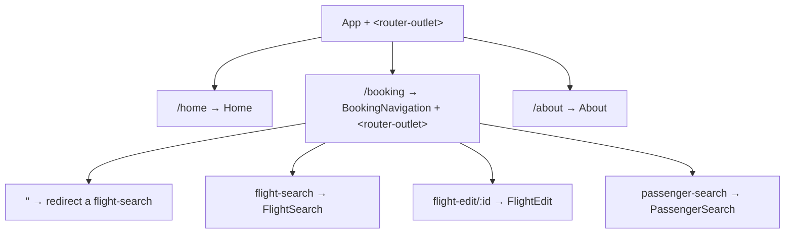

# 04 · Navigation & Lazy Loading with the Router
> 📖 cap.4 · pp.99-131 — *Modern Angular* v2.0.0

In una SPA le "pagine" si simulano mostrando e nascondendo componenti, ma non basta: perché back button, bookmark e history del browser funzionino, ogni cambio di stato deve riflettersi nell'**URL**. Il **Router** di Angular automatizza tutto questo: mappa **path** → **componenti** e li attiva in un **placeholder** (`<router-outlet>`), tenendo l'URL sincronizzato con la vista corrente. Il capitolo copre: configurazione del routing, navigazione (link e programmatica), route parametrizzate, child routes, [[glossario#lazy-loading|lazy loading]] e preloading, query string e hash fragment, e le due strategie di location (path vs hash).

> [!tip]
> In un'app Angular convivono più configurazioni di routing: `app.routes.ts` contiene le route necessarie fin dall'avvio; altre config vengono caricate **on demand** per singola feature o dominio (vedi lazy loading).

## Setting up Routing Configuration
> 📖 pp.101-103

Le route sono un array di tipo `Routes`. Ogni voce mappa un `path` a un `component` (oppure a una redirect o a un lazy import).

```ts
// src/app/app.routes.ts
import { Routes } from '@angular/router';
import { FlightSearch } from './domains/ticketing/feature-booking/flight-search/flight-search';
import { PassengerSearch } from './domains/ticketing/feature-booking/passenger-search/passenger-search';
import { About } from './shell/about/about';
import { Home } from './shell/home/home';

export const routes: Routes = [
  {
    path: '',                 // default route: URL senza path appeso
    pathMatch: 'full',        // confronta l'INTERO path, non come prefisso
    redirectTo: 'home',
  },
  { path: 'home', component: Home },
  { path: 'flight-search', component: FlightSearch },
  { path: 'passenger-search', component: PassengerSearch },
  { path: 'about', component: About },
  {
    path: '**',               // catch-all: deve essere SEMPRE l'ultima
    redirectTo: 'home',
  },
];
```

> [!warning]
> Di default Angular fa **prefix matching**: `path: 'myRoute'` matcha anche `/myRoute/something-else`. Poiché in JavaScript la stringa vuota è prefisso di qualsiasi altra stringa, la default route `path: ''` matcherebbe sempre → serve `pathMatch: 'full'` perché Angular confronti l'URL per intero.

> [!warning]
> Le route si valutano **dall'alto verso il basso** e vince la **prima** che matcha. Le route specifiche vanno quindi **prima** di quelle generiche, e il catch-all `**` va sempre **ultimo**: funge da rete di sicurezza per ogni path sconosciuto.

La config va registrata con la **provider function** `provideRouter` in `app.config.ts` (la CLI lo prepara già in fase di generazione):

```ts
// src/app/app.config.ts
import { ApplicationConfig } from '@angular/core';
import { provideRouter } from '@angular/router';
import { routes } from './app.routes';

export const appConfig: ApplicationConfig = {
  providers: [
    provideRouter(routes),
  ],
};
```

Collegamenti: [[providers]] · [[12-initialization-route-changes]] (guards/resolver lungo i route change).

## RouterOutlet: il placeholder
> 📖 pp.103-104

Invece di referenziare un componente concreto, `App` espone un **placeholder** `<router-outlet>` dove il Router monta il componente attivato. Va importato `RouterOutlet` (e si può rimuovere l'import di `FlightSearch`, ora attivato dal Router).

```ts
// src/app/app.ts
import { Component } from '@angular/core';
import { RouterOutlet } from '@angular/router';
import { Navbar } from './shell/navbar/navbar';
import { Sidebar } from './shell/sidebar/sidebar';

@Component({
  selector: 'app-root',
  imports: [Navbar, Sidebar, RouterOutlet],  // aggiungi RouterOutlet
  templateUrl: './app.html',
  styleUrl: './app.css',
})
export class App {}
```

```html
<!-- src/app/app.html -->
<div class="content">
  <router-outlet />
</div>
```

## routerLink & routerLinkActive
> 📖 pp.104-107

I link dichiarativi usano la directive `routerLink`, riferita al `path` della route. `routerLinkActive` assegna una classe CSS quando quel link (o un suo figlio) è attivo, per evidenziare la voce di menu corrente. Entrambe vanno importate nel componente.

```ts
// src/app/shell/sidebar/sidebar.ts
import { ChangeDetectionStrategy, Component } from '@angular/core';
import { RouterLink, RouterLinkActive } from '@angular/router';

@Component({
  selector: 'app-sidebar',
  imports: [RouterLink, RouterLinkActive],
  templateUrl: './sidebar.html',
  changeDetection: ChangeDetectionStrategy.OnPush,
})
export class Sidebar {}
```

```html
<!-- src/app/shell/sidebar/sidebar.html -->
<li routerLinkActive="active">
  <a routerLink="home"><p>Home</p></a>
</li>
<li routerLinkActive="active">
  <a routerLink="flight-search"><p>Flights</p></a>
</li>
```

> [!info] Angular 22+
> Per il solo **highlighting dichiarativo** `routerLinkActive` resta la scelta naturale (ed è quella che il libro usa ovunque). A volte però ti serve lo stato di attivazione **come valore**, per alimentare un `computed`, un `effect` o altra logica reattiva oltre il semplice toggle di una classe. Da **Angular 21.1** la funzione `isActive(path, router)` restituisce un `Signal<boolean>`, ri-valutato a ogni cambio di route.
> ```ts
> // src/app/shell/sidebar/sidebar.ts
> import { ChangeDetectionStrategy, Component, inject } from '@angular/core';
> import { isActive, Router, RouterLink } from '@angular/router';
>
> @Component({
>   selector: 'app-sidebar',
>   imports: [RouterLink],
>   templateUrl: './sidebar.html',
>   changeDetection: ChangeDetectionStrategy.OnPush,
> })
> export class Sidebar {
>   private readonly router = inject(Router);
>   protected readonly homeActive = isActive('/home', this.router);
>   // un signal per voce di menu → [class.active]="homeActive()"
> }
> ```
> Il terzo argomento opzionale di `isActive` accetta un `IsActiveMatchOptions` e regola la rigidità del match: di default vale `paths: 'subset'` (la route è attiva quando è prefisso dell'URL corrente); con `{ paths: 'exact' }` serve un match esatto — utile per route il cui stato altrimenti "trasborderebbe" sui sibling. Opzioni analoghe esistono per `matrixParams`, `queryParams` e `fragment`.

Collegamenti: [[02-signal-based-components]] (struttura componenti e `imports`).

## Navigazione programmatica con Router
> 📖 p.107

Per cambiare route via codice si fa [[inject]] del `Router` e si chiama il metodo `navigate`.

```ts
import { Router } from '@angular/router';

@Component({ /* ... */ })
export class MyComponent {
  private readonly router = inject(Router);

  protected goHome(): void {
    this.router.navigate(['/home']);
  }
}
```

`navigate` prende il path come **array**: ogni elemento è un segmento dell'URL, viene URL-encodato (i caratteri speciali come spazi o `/` vengono convertiti in una forma sicura per l'URL, es. lo spazio diventa `%20`) e i segmenti vengono concatenati per identificare la route di destinazione.

```ts
this.router.navigate(['/a', 'b', id]); // con id=17 → attiva /a/b/17
```

Collegamenti: [[inject]].

## Parameterized Routes
> 📖 pp.109-113

Quando si cambia route spesso serve passare informazioni alla route di destinazione (es. l'ID del volo da editare): a questo servono i **routing parameters**. Angular supporta tre notazioni:

| Posizione | Esempio |
|---|---|
| URL Segment | `flight-edit/17` |
| Matrix Parameter | `flight-edit/17;showDetails=true` |
| Query String | `flight-edit/17?expertMode=true` |

I parametri di segmento sono riconosciuti per **posizione**; matrix e query per **nome** (l'ordine non conta, dato che il nome è esplicito). Per i parametri nominati il Router usa di **default i matrix parameter**: a differenza della più nota query string, un matrix parameter si riferisce sempre al **segmento URL corrente**, quindi il Router può associarlo a quel segmento (e dunque a un componente):

```
flight-edit/17;showDetails=true/passengers;orderBy=name
```

Qui `showDetails` si riferisce al segmento `flight-edit/17`, mentre `orderBy` si riferisce al segmento `passengers`.

### Reading Parameters with ActivatedRoute

Approccio classico: [[inject]] di `ActivatedRoute` e subscribe a `paramMap` (un Observable). I parametri sono **sempre stringhe** → vanno convertiti a mano.

```ts
// src/app/domains/ticketing/feature-booking/flight-edit/flight-edit.ts
import { ActivatedRoute } from '@angular/router';

export class FlightEdit {
  private readonly route = inject(ActivatedRoute);
  protected readonly id = signal(0);
  protected readonly showDetails = signal(false);

  constructor() {
    this.route.paramMap.subscribe((paramsMap) => {
      const flightId = parseInt(paramsMap.get('id') ?? '0');
      this.id.set(flightId);
      const showDetails = paramsMap.get('showDetails') === 'true';
      this.showDetails.set(showDetails);
    });
  }
}
```

### withComponentInputBinding() (alternativa)

Feature di `provideRouter`: lega automaticamente parametri di segmento e matrix a **input del componente** con lo stesso nome.

```ts
// src/app/app.config.ts
import { provideRouter, withComponentInputBinding } from '@angular/router';

provideRouter(
  routes,
  withComponentInputBinding(),   // abilita il binding automatico
);
```

```ts
// src/app/domains/ticketing/feature-booking/flight-edit/flight-edit.ts
import {
  booleanAttribute,
  ChangeDetectionStrategy,
  Component,
  effect,
  input,
  numberAttribute,
} from '@angular/core';

@Component({
  selector: 'app-flight-edit',
  imports: [],
  templateUrl: './flight-edit.html',
  changeDetection: ChangeDetectionStrategy.OnPush,
})
export class FlightEdit {
  // i parametri arrivano come stringa → transformer built-in per convertirli
  protected readonly id = input.required({ transform: numberAttribute });
  protected readonly showDetails = input({ transform: booleanAttribute });

  constructor() {
    effect(() => {
      console.log('id', this.id());
      console.log('showDetails', this.showDetails());
    });
  }
}
```

> [!tip]
> `withComponentInputBinding` elimina il subscribe manuale: gli [[signal-input|input()]] diventano la fonte reattiva dei parametri. Usa i transformer (piccole funzioni che convertono il valore in ingresso prima che arrivi all'input) `numberAttribute` / `booleanAttribute` per la conversione di tipo, dato che i routing parameter sono sempre stringhe.

### Configuring & Linking parameterized routes

Nella config vanno dichiarati **solo** i parametri di **segmento**, prefissati con i due punti (`:`). Matrix e query non si dichiarano: Angular li riconosce a runtime.

```ts
{ path: 'flight-edit/:id', component: FlightEdit },
```

`routerLink` accetta un **array** di segmenti più un oggetto per i matrix parameter. Il bottone viene passato a `FlightCard` via [[content-projection]] (così la card non sa nulla del routing e resta riutilizzabile):

```html
<!-- .../ticketing/feature-booking/flight-search/flight-search.html -->
<app-flight-card
  [item]="flight"
  [selected]="basket()[flight.id]"
  (selectedChange)="updateBasket(flight.id, $event)">
  <button [routerLink]="['../flight-edit', flight.id, { showDetails: true }]">
    Edit
  </button>
</app-flight-card>
<!-- con flight.id=3 → ../flight-edit/3;showDetails=true -->
```

> [!warning]
> Le proprietà dell'oggetto passato nell'array diventano **matrix parameter**. Il prefisso `../` è necessario perché `flight-edit` è **sibling** di `flight-search`, non sua figlia.

Collegamenti: [[signal-input]] · [[content-projection]] · [[02-signal-based-components]].

## Hierarchical Routing with Child Routes
> 📖 pp.114-120

Un componente attivato dal Router può a sua volta contenere un `<router-outlet>` → **child routes** (viste annidate/gerarchiche). Esempio: un `BookingNavigation` con un menu in alto e, sotto, un placeholder interno in cui attivare `flight-search` / `passenger-search`.



Il componente padre importa `RouterOutlet` (per il placeholder interno) e `RouterLink` (per i link alle child route):

```ts
// src/app/domains/ticketing/feature-booking/booking-navigation.ts
import { Component } from '@angular/core';
import { RouterLink, RouterOutlet } from '@angular/router';

@Component({
  selector: 'app-booking-navigation',
  imports: [RouterLink, RouterOutlet],
  templateUrl: './booking-navigation.html',
})
export class BookingNavigation {}
```

```html
<!-- src/app/domains/ticketing/feature-booking/booking-navigation.html -->
<ul class="nav nav-secondary">
  <li><a routerLink="./flight-search">Flight</a></li>
  <li><a routerLink="./passenger-search">Passenger</a></li>
</ul>
<router-outlet />
```

Le child route vanno nell'array `children` del nodo padre, con una default route a path vuoto:

```ts
{
  path: 'booking',
  component: BookingNavigation,
  children: [
    { path: '', pathMatch: 'full', redirectTo: 'flight-search' },
    { path: 'flight-search', component: FlightSearch },
    { path: 'flight-edit/:id', component: FlightEdit },
    { path: 'passenger-search', component: PassengerSearch },
  ],
},
```

`booking/flight-search` attiva `FlightSearch` dentro il placeholder di `BookingNavigation`, che a sua volta sta dentro `App`. La child route a path vuoto è la default route di `booking`: chiamare solo `booking` redirige a `booking/flight-search`.

> [!warning]
> Path relativi in `routerLink`: `./x` appende alla route corrente (è il default, quindi omettibile). `../x` punta a un **sibling** — es. da `./booking/flight-search` a `./booking/passenger-search` con `../passenger-search`.

## Lazy Loading of Routes
> 📖 pp.120-124

Di default all'avvio Angular carica **tutte** le feature → startup lento nelle app grandi. Il lazy loading risolve caricando parti dell'app su richiesta. Se la parte ha più route, le si dà una propria config (qui per dominio: `ticketing.routes.ts`).

```ts
// src/app/domains/ticketing/ticketing.routes.ts
export const ticketingRoutes: Routes = [
  {
    path: 'booking',
    component: BookingNavigation,
    children: [
      { path: '', pathMatch: 'full', redirectTo: 'flight-search' },
      { path: 'flight-search', component: FlightSearch },
      { path: 'flight-edit/:id', component: FlightEdit },
      { path: 'passenger-search', component: PassengerSearch },
    ],
  },
];
```

`app.routes.ts` la referenzia con `loadChildren` + **dynamic import**:

```ts
// src/app/app.routes.ts
{
  path: 'ticketing',
  loadChildren: () =>
    import('./domains/ticketing/ticketing.routes').then(
      (m) => m.ticketingRoutes,
    ),
},
```

`loadChildren` punta a una lambda (una funzione anonima, la `() => ...`) che carica le route on demand e le ritorna via Promise (un valore "promesso" che arriva quando il caricamento è finito). Il dynamic `import()` carica un modulo TypeScript; il `.then` mappa quel modulo alla config di routing che esporta. Se il file ha un **default export**, si salta il `.then`:

```ts
// src/app/domains/ticketing/ticketing.routes.ts
export default ticketingRoutes;

// src/app/app.routes.ts
{
  path: 'ticketing/booking',
  loadChildren: () => import('./domains/ticketing/ticketing.routes'),
},
```

> [!warning]
> Il segmento del path (`ticketing`) viene **prefissato a tutte** le child route del file lazy. Con `path: 'ticketing'` + `booking/flight-search` interno → l'URL completo è `ticketing/booking/flight-search`. Aggiorna i `routerLink` di conseguenza (es. nel `Sidebar`).

### Lazy loading di un singolo componente

Oltre alle intere config di route, si può caricare lazy un **singolo componente** (utile per componenti grandi usati in casi eccezionali) con `loadComponent`:

```ts
{ path: 'about', loadComponent: () => import('./shell/about/about').then((c) => c.About) },
// con default export:
{ path: 'about', loadComponent: () => import('./shell/about/about') },
```

Verifica nel browser: nell'output di `ng serve` compare un **bundle separato**; nel tab **Network** di Chrome DevTools si vede che viene scaricato solo al bisogno. In dev mode Angular carica diversi file extra (il dev server compila on demand per velocizzare lo startup); in produzione vengono caricati solo i lazy bundle effettivamente richiesti.

> [!tip]
> `loadChildren` → config di route lazy; `loadComponent` → singolo componente lazy. Entrambi passano per un dynamic `import()`; con un `default export` puoi omettere il `.then`.

## Preloading
> 📖 p.125

Il preloading si costruisce sul lazy loading: usa le risorse idle (i tempi morti in cui browser e rete non hanno nulla da fare) **dopo l'avvio** per caricare in background i bundle lazy prima che servano, così quando il Router ne ha bisogno sono già disponibili. Si attiva con la feature `withPreloading` più una strategia.

```ts
// src/app/app.config.ts
import { PreloadAllModules, provideRouter, withComponentInputBinding, withPreloading } from '@angular/router';

provideRouter(
  routes,
  withComponentInputBinding(),
  withPreloading(PreloadAllModules),
);
```

`PreloadAllModules` (built-in) precarica **tutte** le route lazy subito dopo lo startup: l'app parte veloce (senza i lazy) e poi li scarica in background, così è molto probabile che siano pronti al bisogno. Se l'utente attiva una route lazy prima che il preloading la carichi, si torna al lazy loading classico.

> [!tip]
> Strategie out-of-the-box (già pronte, incluse in Angular senza installare nulla): `NoPreloading` (default) e `PreloadAllModules`. Per logiche custom implementa un service che soddisfa l'interfaccia `PreloadingStrategy` — ma prima verifica se le due built-in (o soluzioni di terze parti come `ngx-quicklink`, che precarica le route i cui link entrano nel viewport, o `guess.js`, che usa il machine learning per predire la prossima route che l'utente visiterà) bastano già.

## Query Strings & Hash Fragments
> 📖 pp.126-127

Oltre a segmenti e matrix, il Router supporta la classica **query string** (`url?param1=value1&param2=value2`) e l'**hash fragment** (`url#info-in-hash-fragment`) — poco usati in Angular, ma utili per impostazioni applicative globali.

Programmaticamente via il 2° argomento di `navigate`, un oggetto `NavigationExtras`:

```ts
this.router.navigate(['/next-flights'], {
  queryParams: { expertMode: true },
});
```

Opzioni utili dell'oggetto: `queryParamsHandling` (`'preserve'` mantiene la query string corrente durante il route change, `'merge'` la estende con quanto specificato in `queryParams`), `hash` (definisce il fragment) e `preserveHash` (mantiene il fragment corrente).

Dichiarativamente via `routerLink` + data binding:

```html
<button
  [routerLink]="['.', { ticketId: ticket.id }]"
  [queryParams]="{ expertMode: true }"
  queryParamsHandling="merge"
  fragment="confirmation">
  Check-in
</button>
```

In lettura, `ActivatedRoute` espone gli Observable `queryParamMap` (coppie chiave-valore della query string) e `fragment` (l'hash come singola stringa):

```ts
this.activatedRoute.queryParamMap.subscribe((queryParamMap) => {
  console.log('queryParamMap', queryParamMap);
});
this.activatedRoute.fragment.subscribe((fragment) => {
  console.log('fragment', fragment);
});
```

> [!warning]
> Con `withComponentInputBinding` anche i **query parameter** vengono legati a input omonimi, ma **non l'hash fragment**: Angular lo tratta come stringa singola, non come coppie chiave-valore.

## Path Routing vs. Hash Routing
> 📖 pp.128-130

Per restare flessibile, il Router delega la gestione dell'URL a una **strategia** intercambiabile.

**PathLocationStrategy** (default) → path routing: `http://localhost:4200/booking/flight-search`. La sfida è far capire al web server quale parte dell'URL gestire server-side e quale lasciare alla SPA come route: il server va configurato per **reindirizzare a `index.html`** ogni richiesta sotto l'URL dell'app (`ng serve` lo fa già). Un elemento `<base>` in `index.html` dice quale parte dell'URL il Router deve interpretare (la parte dopo l'`href`); aiuta anche il browser a risolvere correttamente i path verso gli asset statici (immagini, font):

```html
<base href="/">
```

Il default `href="/"` assume che l'app stia nella root del dominio. Se sta in una sottocartella, va riflessa in `href` (es. `/flight-app`). Si può impostare al build con `ng build --base-href flight-app` (la CLI scrive il valore nell'attributo `href` dell'app generata in `dist/`), oppure via DI col token `APP_BASE_HREF`:

```ts
import { APP_BASE_HREF } from '@angular/common';

{ provide: APP_BASE_HREF, useValue: '/flight-app' }
```

> [!warning]
> Con `APP_BASE_HREF` Angular sa quale parte dell'URL usare per il routing, ma il browser **non** sa più risolvere i path verso asset statici (immagini, font): vanno gestiti a mano, es. usando solo path **assoluti**.

**HashLocationStrategy** → hash routing: `http://localhost:4200#/booking/flight-search`. La route sta nell'hash fragment. Si attiva con la feature `withHashLocation`:

```ts
import { provideRouter, withComponentInputBinding, withHashLocation } from '@angular/router';

provideRouter(
  routes,
  withComponentInputBinding(),
  withPreloading(PreloadAllModules),
  withHashLocation(),   // attiva HashLocationStrategy
);
```

Vantaggio: niente redirect server-side né `<base>` da configurare — la separazione tra parte server-side e route client-side è data direttamente dall'hash nell'URL.

> [!warning]
> Con `HashLocationStrategy` l'URL appare meno "naturale" all'utente e **non funziona il [[glossario#ssr-server-side-rendering|server-side rendering]]** delle singole route ([[17-defer-ssr-hydration|cap.17]]): l'hash fragment non viene inviato al server.

Collegamenti: [[providers]] · [[17-defer-ssr-hydration]].

## 🔁 Ripasso lampo

**1.** Perché la default route `path: ''` richiede `pathMatch: 'full'` e perché il catch-all `**` va per ultimo?
> [!success]- Risposta
> Di default Angular fa **prefix matching** e in JavaScript la stringa vuota è prefisso di qualunque stringa: senza `pathMatch: 'full'` la default route `path: ''` matcherebbe **sempre**. `pathMatch: 'full'` la fa scattare solo quando l'intero path è vuoto. Il `**` va ultimo perché le route si valutano dall'alto e vince la prima che matcha: essendo un catch-all, se messo prima "ingoierebbe" tutte le route successive.

**2.** `ActivatedRoute.paramMap` vs `withComponentInputBinding()`: come leggi un parametro nei due modi e che vantaggio dà il secondo?
> [!success]- Risposta
> Con `ActivatedRoute` fai `inject(ActivatedRoute)` e ti **subscribi** a `paramMap` (Observable), leggendo i valori con `paramMap.get('id')` (sempre stringhe, da convertire a mano). Con `withComponentInputBinding()` (feature di `provideRouter`) il Router lega automaticamente i parametri a [[signal-input|input()]] omonimi: niente subscribe manuale, gli input diventano la fonte reattiva, e usi i transformer `numberAttribute` / `booleanAttribute` per la conversione di tipo.

**3.** Come configuri un parametro di segmento nelle route, e cosa diventa un oggetto passato nell'array di `routerLink`?
> [!success]- Risposta
> Nella config dichiari solo i parametri di **segmento**, prefissati con i due punti: `{ path: 'flight-edit/:id', component: FlightEdit }`. Matrix e query non si dichiarano (riconosciuti a runtime). In `routerLink` un **oggetto** dentro l'array diventa un insieme di **matrix parameter**: `['../flight-edit', 3, { showDetails: true }]` → `../flight-edit/3;showDetails=true`.

**4.** Differenza tra `loadChildren` e `loadComponent`? Quando puoi omettere il `.then`?
> [!success]- Risposta
> `loadChildren` carica lazy un'intera **config di route** (un array `Routes`); `loadComponent` carica lazy un **singolo componente**. Entrambi usano una lambda con un dynamic `import()`. Puoi omettere il `.then` quando il file importato espone un **default export** (`export default ...`): il Router lo prende automaticamente.

**5.** Cosa fa `PreloadAllModules` e in cosa differisce dal lazy loading puro?
> [!success]- Risposta
> `PreloadAllModules` (attivata con `withPreloading`) precarica **tutte** le route lazy in background subito dopo lo startup: l'app parte veloce senza i bundle lazy, che vengono scaricati durante i tempi morti così da essere pronti al bisogno. Il lazy loading puro scarica un bundle **solo** quando la sua route viene attivata. Se l'utente attiva una route prima che il preloading l'abbia caricata, si ricade comunque nel lazy loading classico.

**6.** `PathLocationStrategy` vs `HashLocationStrategy`: cosa richiede ciascuna e perché l'hash routing rompe l'SSR?
> [!success]- Risposta
> `PathLocationStrategy` (default) mette la route nel path (`/booking/flight-search`): richiede che il server **rediriga a `index.html`** ogni richiesta dell'app e un elemento `<base href>` in `index.html`. `HashLocationStrategy` (attivata con `withHashLocation`) mette la route nell'hash (`#/booking/flight-search`): non serve né redirect server-side né `<base>`, perché la separazione client/server è data dall'hash. Proprio per questo rompe l'**SSR** delle singole route: l'hash fragment **non viene inviato al server**, quindi il server non sa quale route renderizzare.

**In sintesi:**
- Il Router mappa **path → componenti**, attivati in un `<router-outlet>`; `provideRouter(routes)` lo registra. Navighi con `routerLink`/`routerLinkActive` o programmaticamente con `Router.navigate([...])`; da Angular 21.1 `isActive(path, router)` dà lo stato attivo come `Signal<boolean>`.
- I **parametri** passano via segmenti (`:id`), matrix (`;k=v`) o query (`?k=v`); leggili con `ActivatedRoute` o, meglio, legandoli a [[signal-input|input()]] con `withComponentInputBinding()` (più i transformer `numberAttribute`/`booleanAttribute`).
- Le **child routes** (`children` + outlet annidato) creano gerarchie; il **lazy loading** (`loadChildren`/`loadComponent` + dynamic `import()`) e il **preloading** (`withPreloading`) migliorano lo startup.
- Due **location strategy**: path (default, serve redirect server-side + `<base>`) vs hash (`withHashLocation`, niente config server ma niente SSR).
