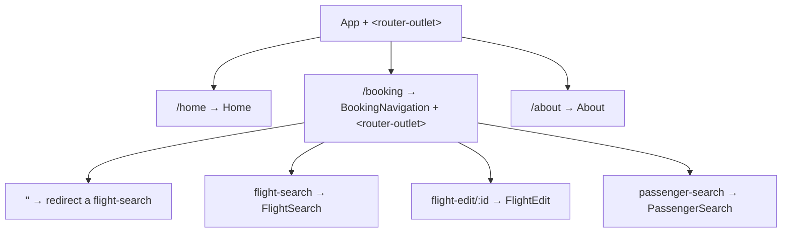

# 04 · Navigation & Lazy Loading with the Router
> 📖 cap.4 · pp.94-125 — *Modern Angular* v1.0.4

In una SPA le "pagine" si simulano mostrando/nascondendo componenti. Il **Router** di Angular automatizza questo: mappa **path** → **componenti** e li attiva in un **placeholder** (`<router-outlet>`), tenendo l'URL sincronizzato con lo stato (così back button, bookmark e history funzionano). Il capitolo copre: routing config, navigazione (link e programmatica), route parametrizzate, child routes, lazy loading + preloading, query string/hash fragment, e le due strategie di location (path vs hash).

> [!tip] Take-away
> Più config di routing coesistono: `app.routes.ts` ha le route necessarie all'avvio; altre config vengono caricate **on demand** per feature/dominio (vedi lazy loading).

## Setting up Routing Configuration
> 📖 pp.96-98

Le route sono un array `Routes`. Ogni voce mappa un `path` a un `component` (o a una redirect / lazy import).

```ts
// src/app/app.routes.ts
import { Routes } from '@angular/router';

export const routes: Routes = [
  {
    path: '',                 // default route: URL senza path appeso
    pathMatch: 'full',        // confronta l'INTERO path, non come prefisso
    redirectTo: 'home',
  },
  { path: 'home', component: Home },
  { path: 'flight-search', component: FlightSearch },
  { path: 'passenger-search', component: PassengerSearch },
  { path: 'about', component: About },
  {
    path: '**',               // catch-all: deve essere SEMPRE l'ultima
    redirectTo: 'home',
  },
];
```

> [!warning] Gotcha
> Di default Angular fa **prefix matching**: `path: 'myRoute'` matcha anche `/myRoute/altro`. Poiché in JS la stringa vuota è prefisso di tutto, la default route `path: ''` matcherebbe sempre → serve `pathMatch: 'full'` per confrontare l'URL per intero.

> [!warning] Gotcha
> Le route si valutano **dall'alto verso il basso**, vince la prima che matcha. Le route specifiche vanno **prima** delle generiche, e il catch-all `**` va **ultimo**.

La config va registrata col **provider function** `provideRouter` (la CLI lo prepara già):

```ts
// src/app/app.config.ts
import { ApplicationConfig } from '@angular/core';
import { provideRouter } from '@angular/router';
import { routes } from './app.routes';

export const appConfig: ApplicationConfig = {
  providers: [
    provideRouter(routes),
  ],
};
```

Collegamenti: [[providers]] · [[12-initialization-route-changes]] (guards/resolver lungo le route changes).

## RouterOutlet: il placeholder
> 📖 pp.98-99

Invece di referenziare un componente concreto, `App` espone un **placeholder** `<router-outlet>` dove il Router monta il componente attivato. Va importato `RouterOutlet`.

```ts
import { RouterOutlet } from '@angular/router';

@Component({
  selector: 'app-root',
  imports: [Navbar, Sidebar, RouterOutlet],  // aggiungi RouterOutlet
  templateUrl: './app.html',
  styleUrl: './app.css',
})
export class App {}
```

```html
<!-- src/app/app.html -->
<div class="content">
  <router-outlet />
</div>
```

## routerLink & routerLinkActive
> 📖 pp.99-101

I link dichiarativi usano la directive `routerLink` (riferita al `path` della route). `routerLinkActive` applica una classe CSS quando quel link (o un figlio) è attivo, per evidenziare la voce di menu corrente. Entrambe vanno importate nel componente.

```ts
// src/app/shell/sidebar/sidebar.ts
import { RouterLink, RouterLinkActive } from '@angular/router';

@Component({
  selector: 'app-sidebar',
  imports: [RouterLink, RouterLinkActive],
  templateUrl: './sidebar.html',
  changeDetection: ChangeDetectionStrategy.OnPush,
})
export class Sidebar {}
```

```html
<!-- src/app/shell/sidebar/sidebar.html -->
<li routerLinkActive="active">
  <a routerLink="home"><p>Home</p></a>
</li>
<li routerLinkActive="active">
  <a routerLink="flight-search"><p>Flights</p></a>
</li>
```

Collegamenti: [[02-signal-based-components]] (struttura componenti e `imports`).

## Navigazione programmatica con Router
> 📖 p.101

Per cambiare route via codice si fa [[inject]] del `Router` e si chiama `navigate`.

```ts
import { Router } from '@angular/router';

export class MyComponent {
  private readonly router = inject(Router);

  protected goHome(): void {
    this.router.navigate(['/home']);
  }
}
```

`navigate` prende il path come **array**: ogni elemento è un segmento di URL, vengono URL-encodati e concatenati.

```ts
this.router.navigate(['/a', 'b', id]); // con id=17 → attiva /a/b/17
```

Collegamenti: [[inject]].

## Parameterized Routes
> 📖 pp.102-107

Per passare info alle route (es. ID del volo da editare) si usano i **routing parameters**. Tre notazioni:

| Posizione | Esempio |
|---|---|
| URL Segment | `flight-edit/17` |
| Matrix Parameter | `flight-edit/17;showDetails=true` |
| Query String | `flight-edit/17?expertMode=true` |

I parametri di segmento sono riconosciuti per **posizione**; matrix e query per **nome**. Per i parametri nominati il Router usa di **default i matrix parameter**: a differenza della query string, un matrix parameter si riferisce sempre al **segmento URL corrente**, quindi è associabile a un segmento (e a un componente):

```
flight-edit/17;showDetails=true/passengers;orderBy=name
```

### Reading Parameters with ActivatedRoute

Approccio classico: [[inject]] di `ActivatedRoute` e subscribe a `paramMap` (Observable). I parametri sono **sempre stringhe**: convertili a mano.

```ts
import { ActivatedRoute } from '@angular/router';

export class FlightEdit {
  private readonly route = inject(ActivatedRoute);
  protected readonly id = signal(0);
  protected readonly showDetails = signal(false);

  constructor() {
    this.route.paramMap.subscribe((paramMap) => {
      this.id.set(parseInt(paramMap.get('id') ?? '0'));
      this.showDetails.set(paramMap.get('showDetails') === 'true');
    });
  }
}
```

### withComponentInputBinding() (alternativa)

Feature di `provideRouter`: lega automaticamente parametri URL e matrix a **input del componente** con lo stesso nome.

```ts
// app.config.ts
import { provideRouter, withComponentInputBinding } from '@angular/router';

provideRouter(routes, withComponentInputBinding());
```

```ts
import { booleanAttribute, input, numberAttribute } from '@angular/core';

export class FlightEdit {
  // i parametri arrivano come stringa → transform built-in per convertirli
  protected readonly id = input.required({ transform: numberAttribute });
  protected readonly showDetails = input({ transform: booleanAttribute });

  constructor() {
    effect(() => {
      console.log('id', this.id());
      console.log('showDetails', this.showDetails());
    });
  }
}
```

> [!tip] Take-away
> `withComponentInputBinding` elimina il subscribe manuale: gli [[signal-input|input()]] diventano la fonte reattiva dei parametri. Usa i transformer `numberAttribute` / `booleanAttribute` per la conversione di tipo.

### Configuring & Linking parameterized routes

Nella config solo i parametri di **segmento** vanno dichiarati, prefissati con `:`. Matrix e query NON si dichiarano (riconosciuti a runtime).

```ts
{ path: 'flight-edit/:id', component: FlightEdit },
```

`routerLink` accetta un **array** di segmenti + un oggetto per i matrix parameter. Il bottone è passato a `FlightCard` via [[content-projection]] (così la card non sa nulla del routing):

```html
<app-flight-card [item]="flight" [selected]="basket()[flight.id]"
                 (selectedChange)="updateBasket(flight.id, $event)">
  <button [routerLink]="['../flight-edit', flight.id, { showDetails: true }]">
    Edit
  </button>
</app-flight-card>
<!-- con flight.id=3 → ../flight-edit/3;showDetails=true -->
```

> [!warning] Gotcha
> Le proprietà dell'oggetto nell'array diventano **matrix parameter**. Il prefisso `../` è necessario perché `flight-edit` è **sibling** di `flight-search`, non figlia.

Collegamenti: [[signal-input]] · [[content-projection]] · [[02-signal-based-components]].

## Hierarchical Routing with Child Routes
> 📖 pp.108-114

Un componente attivato dal Router può avere a sua volta un `<router-outlet>` → **child routes** (viste annidate). Esempio: un `BookingNavigation` con menu in alto e un placeholder interno per `flight-search`/`passenger-search`.



Il componente padre importa `RouterOutlet` (per il placeholder interno) e `RouterLink`:

```ts
// src/app/domains/ticketing/feature-booking/booking-navigation.ts
import { RouterLink, RouterOutlet } from '@angular/router';

@Component({
  selector: 'app-booking-navigation',
  imports: [RouterLink, RouterOutlet],
  templateUrl: './booking-navigation.html',
})
export class BookingNavigation {}
```

```html
<!-- booking-navigation.html -->
<ul class="nav nav-secondary">
  <li><a routerLink="./flight-search">Flight</a></li>
  <li><a routerLink="./passenger-search">Passenger</a></li>
</ul>
<router-outlet />
```

Le child route vanno nell'array `children` del nodo padre, con una default route a path vuoto:

```ts
{
  path: 'booking',
  component: BookingNavigation,
  children: [
    { path: '', pathMatch: 'full', redirectTo: 'flight-search' },
    { path: 'flight-search', component: FlightSearch },
    { path: 'flight-edit/:id', component: FlightEdit },
    { path: 'passenger-search', component: PassengerSearch },
  ],
},
```

`booking/flight-search` attiva `FlightSearch` dentro il placeholder di `BookingNavigation`, che a sua volta sta dentro `App`.

> [!warning] Gotcha
> Path relativi in `routerLink`: `./x` appende alla route corrente (è il default, omettibile). `../x` punta a un **sibling** — es. da `./booking/flight-search` a `./booking/passenger-search` con `../passenger-search`.

## Lazy Loading of Routes
> 📖 pp.114-118

Di default all'avvio Angular carica **tutto** → startup lento nelle app grandi. Il lazy loading carica parti su richiesta. Se la parte ha più route, si dà una sua config (qui per dominio: `ticketing.routes.ts`).

`app.routes.ts` la referenzia con `loadChildren` + **dynamic import**:

```ts
{
  path: 'ticketing',
  loadChildren: () =>
    import('./domains/ticketing/ticketing.routes').then(
      (m) => m.ticketingRoutes
    ),
},
```

`loadChildren` è una lambda che carica le route on demand e le ritorna via Promise. Se il file ha un **default export**, si salta il `.then`:

```ts
// ticketing.routes.ts
export default ticketingRoutes;

// app.routes.ts
{
  path: 'ticketing/booking',
  loadChildren: () => import('./domains/ticketing/ticketing.routes'),
},
```

> [!warning] Gotcha
> Il segmento del path (`ticketing`) viene **prefissato a tutte** le child route del file lazy. Con `path: 'ticketing'` + `booking/flight-search` interno → l'URL completo è `ticketing/booking/flight-search`. Aggiorna i `routerLink` di conseguenza.

### Lazy loading di un singolo componente

Per un componente isolato (grande, usato raramente) si usa `loadComponent`:

```ts
{ path: 'about', loadComponent: () => import('./shell/about/about').then((c) => c.About) },
// con default export:
{ path: 'about', loadComponent: () => import('./shell/about/about') },
```

Verifica nel browser: nell'output di `ng serve` compare un **bundle separato**; nel tab **Network** di Chrome DevTools si vede che viene scaricato solo al bisogno. In dev mode Angular carica file extra (compilazione on demand); in produzione vengono caricati solo i lazy bundle.

> [!tip] Take-away
> `loadChildren` → config di route lazy; `loadComponent` → singolo componente lazy. Entrambi via dynamic `import()`; con un `default export` ometti il `.then`.

## Preloading
> 📖 p.119

Il preloading carica i bundle lazy **in background** durante i tempi morti dopo l'avvio, così sono già pronti al bisogno. Si attiva con la feature `withPreloading` + una strategia.

```ts
// app.config.ts
import { PreloadAllModules, provideRouter, withPreloading } from '@angular/router';

provideRouter(
  routes,
  withComponentInputBinding(),
  withPreloading(PreloadAllModules),
);
```

`PreloadAllModules` (built-in) precarica **tutte** le route lazy subito dopo lo startup: l'app parte veloce (senza i lazy) e poi li scarica in background. Se l'utente attiva una route prima che il preloading la carichi, si torna al lazy loading classico.

> [!tip] Take-away
> Strategie out-of-the-box: `NoPreloading` (default) e `PreloadAllModules`. Per logiche custom implementa un service che fa l'interfaccia `PreloadingStrategy` — ma prima verifica se le due built-in (o soluzioni come `ngx-quicklink` / `guess.js`) bastano.

## Query Strings & Hash Fragments
> 📖 pp.120-121

Oltre a segmenti/matrix, il Router supporta la classica **query string** (`url?p1=v1&p2=v2`) e il **hash fragment** (`url#frammento`) — utili per impostazioni applicative globali.

Programmaticamente via il 2° argomento di `navigate` (`NavigationExtras`):

```ts
this.router.navigate(['/next-flights'], {
  queryParams: { expertMode: true },
});
```

Opzioni utili: `queryParamsHandling` (`'preserve'` mantiene la query corrente, `'merge'` la estende con `queryParams`), `hash` (definisce il fragment), `preserveHash`.

Dichiarativamente via `routerLink` + binding:

```html
<button
  [routerLink]="['.', { ticketId: ticket.id }]"
  [queryParams]="{ expertMode: true }"
  queryParamsHandling="merge"
  fragment="confirmation">
  Check-in
</button>
```

In lettura, `ActivatedRoute` espone gli Observable `queryParamMap` e `fragment`:

```ts
this.activatedRoute.queryParamMap.subscribe((m) => console.log('queryParamMap', m));
this.activatedRoute.fragment.subscribe((f) => console.log('fragment', f));
```

> [!warning] Gotcha
> Con `withComponentInputBinding` anche i **query parameter** vengono legati a input omonimi, ma **non il hash fragment**: Angular lo tratta come stringa singola, non come coppie chiave-valore.

## Path Routing vs. Hash Routing
> 📖 pp.122-124

Il Router delega la gestione dell'URL a una **strategia** intercambiabile.

**PathLocationStrategy** (default) → path routing: `http://localhost:4200/booking/flight-search`. Richiede che il **web server reindirizzi** ogni richiesta a `index.html` (`ng serve` lo fa già). Un elemento `<base>` in `index.html` dice quale parte dell'URL è client-side:

```html
<base href="/">
```

Se l'app sta in una sottocartella, va riflessa in `href` (es. `/flight-app`). Si può impostare al build con `ng build --base-href flight-app`, oppure via DI col token `APP_BASE_HREF`:

```ts
import { APP_BASE_HREF } from '@angular/common';

{ provide: APP_BASE_HREF, useValue: '/flight-app' }
```

> [!warning] Gotcha
> Con `APP_BASE_HREF` Angular sa quale parte dell'URL usare per il routing, ma il browser **non** sa più risolvere i path verso asset statici (immagini, font): gestiscili a mano, es. usando solo path **assoluti**.

**HashLocationStrategy** → hash routing: `http://localhost:4200#/booking/flight-search`. La route sta nel hash fragment. Si attiva con la feature `withHashLocation`:

```ts
import { provideRouter, withComponentInputBinding, withHashLocation } from '@angular/router';

provideRouter(
  routes,
  withComponentInputBinding(),
  withPreloading(PreloadAllModules),
  withHashLocation(),   // attiva HashLocationStrategy
);
```

Vantaggio: niente redirect server-side né `<base>` da configurare (la separazione client/server è data dall'hash).

> [!warning] Gotcha
> Con `HashLocationStrategy` l'URL è meno "naturale" e **non funziona il server-side rendering** delle singole route ([[17-defer-ssr-hydration|cap.17]]): il hash fragment non viene inviato al server.

Collegamenti: [[providers]] · [[17-defer-ssr-hydration]].

## 🔁 Ripasso lampo
1. Perché la default route `path: ''` richiede `pathMatch: 'full'` e perché il catch-all `**` va per ultimo?
2. `ActivatedRoute.paramMap` vs `withComponentInputBinding()`: come leggi un parametro nei due modi e che vantaggio dà il secondo?
3. Come configuri un parametro di segmento nelle route, e cosa diventa un oggetto passato nell'array di `routerLink`?
4. Differenza tra `loadChildren` e `loadComponent`? Quando puoi omettere il `.then`?
5. Cosa fa `PreloadAllModules` e in cosa differisce dal lazy loading puro?
6. `PathLocationStrategy` vs `HashLocationStrategy`: cosa richiede ciascuna e perché l'hash routing rompe l'SSR?

**Take-away del capitolo:**
- Il Router mappa **path → componenti**, attivati in un `<router-outlet>`; `provideRouter(routes)` lo registra. Navighi con `routerLink`/`routerLinkActive` o programmaticamente con `Router.navigate([...])`.
- I **parametri** passano via segmenti (`:id`), matrix (`;k=v`) o query (`?k=v`); leggili con `ActivatedRoute` o, meglio, legandoli a [[signal-input|input()]] con `withComponentInputBinding()`.
- Le **child routes** (`children` + outlet annidato) creano gerarchie; il **lazy loading** (`loadChildren`/`loadComponent` + dynamic import) e il **preloading** (`withPreloading`) migliorano lo startup.
- Due **location strategy**: path (default, serve redirect server-side + `<base>`) vs hash (`withHashLocation`, niente config server ma niente SSR).
