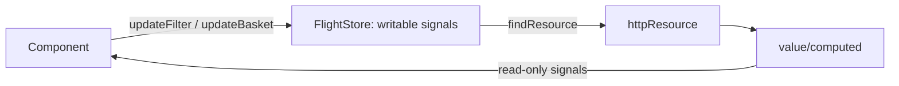

# 05 · State Management with Services & Signals
> 📖 cap.5 · pp.132-156 — *Modern Angular* v2.0.0

Finora tutta la logica viveva nei componenti. Crescendo l'app conviene separare le responsabilità in **service**: classi riusabili, scambiabili e iniettabili. Il capitolo costruisce un `FlightClient` per l'accesso ai dati, esplora la **Dependency Injection** (inject, injection context, dipendenze tra service, providers/scope) e poi implementa uno **store** signal-based per la gestione dello stato della feature `flight-search`.

## Generating a Service
> 📖 p.132-133

Come per i componenti, lo si genera con la CLI:

```bash
ng generate service domains/ticketing/data/flight-client
# short-hand
ng g s domains/ticketing/data/flight-client
```

Lo Style Guide aggiornato **non aggiunge più il suffisso** `Service`. Conviene un suffisso semantico proprio per categoria: qui i service di data access usano `Client` (come `HttpClient`). Il risultato è una classe decorata con [[service|@Service()]]:

```ts
// flight-client.ts
import { Service } from '@angular/core';

@Service()              // singleton in root (default)
export class FlightClient {}
```

> [!tip] Take-away
> `@Service()` crea di default **una sola istanza** (singleton) per tutta l'app, accessibile da chiunque conosca il tipo `FlightClient`. È il default adatto alla maggior parte dei casi.

> [!info] Angular 22+ · `@Service` vs `@Injectable`
> Il decoratore **`@Service()`** (Angular 22) è la forma usata in tutto il libro dalla 2ª edizione. Equivale a `@Injectable({ providedIn: 'root' })`: **stessa semantica**, solo più conciso. Più avanti vedrai `@Service({ autoProvided: false })` per i servizi scambiabili (= il vecchio `@Injectable()` senza `providedIn`). Dettagli in [[service]].
> Negli snippet di questo vault può comparire ancora `@Injectable({ providedIn: 'root' })`: leggilo come `@Service()`.

## Implementing a Service
> 📖 p.133-134

Il service espone un metodo che restituisce l'`httpResource` di cui ha bisogno il componente. Riceve i criteri come **signal** e li legge dentro la lambda reattiva:

```ts
// flight-client.ts
import { httpResource } from '@angular/common/http';
import { Injectable, Signal } from '@angular/core';
import { Flight } from './flight';

@Injectable({ providedIn: 'root' })
export class FlightClient {
  private readonly baseUrl = 'https://demo.angulararchitects.io/api';

  findResource(from: Signal<string>, to: Signal<string>) {
    return httpResource<Flight[]>(
      () => {
        if (!from() || !to()) {
          return undefined;            // niente criteri → niente richiesta
        }
        return {
          url: `${this.baseUrl}/flight`,
          headers: { Accept: 'application/json' },
          params: { from: from(), to: to() },
        };
      },
      { defaultValue: [] },
    );
  }
}
```

Se `from` o `to` sono vuoti la lambda ritorna `undefined` → la [[resource|httpResource]] non parte.

## Injecting a Service
> 📖 p.134-135

Il componente richiede l'istanza con [[inject]] (niente `new`: è Angular a fornirla in base alla config). Da notare che la Signal Form rappresenta `from`/`to` come signal annidati, con un `value` signal per il valore corrente:

```ts
// flight-search.ts
import { FlightClient } from '../../data/flight-client';
import { form } from '@angular/forms/signals';

@Component({ /* ... */ })
export class FlightSearch {
  private flightClient = inject(FlightClient);

  protected readonly filter = signal({ from: 'Graz', to: 'Hamburg' });
  protected readonly filterForm = form(this.filter);

  protected readonly flightsResource = this.flightClient.findResource(
    this.filterForm.from().value,
    this.filterForm.to().value,
  );
  protected readonly flights = this.flightsResource.value;
  protected readonly error = this.flightsResource.error;
  protected readonly isLoading = this.flightsResource.isLoading;
}
```

Collegamenti: [[inject]].

## Injection Context
> 📖 p.135-136

`inject` va chiamato in un **injection context** valido: field initializer (come sopra) e constructor. Angular e le librerie definiscono altre aree eseguite in injection context, e se ne può crearne una con `runInInjectionContext` passando un `Injector`:

```ts
import {
  assertInInjectionContext,
  inject,
  Injector,
  runInInjectionContext,
} from '@angular/core';

@Component({ /* ... */ })
export class FlightSearch {
  protected injector = inject(Injector);

  protected searchWithoutInjectionContext() {
    // this.flightClient = inject(FlightClient);          // ❌ fallirebbe
    // assertInInjectionContext(this.searchWithoutInjectionContext); // ❌ fallirebbe

    runInInjectionContext(this.injector, () => {
      const flightClient = inject(FlightClient);
      // ... usa flightClient qui
    });
  }
}
```

`assertInInjectionContext(fn)` a inizio metodo garantisce che venga chiamato solo in un contesto valido: fuori contesto lancia un errore col nome della funzione, facilitando il debug.

> [!warning] Gotcha
> L'esempio serve a capire il concetto: nel codice applicativo **evita `inject` fuori dai contesti validi**, raramente serve davvero.

Collegamenti: [[injection-context]] · [[inject]].

## Services with Dependencies
> 📖 p.137-138

Un service può dipendere da altri service. Il `FlightClient` può iniettare un `ConfigService` per la base URL:

```ts
// config-service.ts
@Injectable({ providedIn: 'root' })
export class ConfigService {
  readonly baseUrl = 'https://demo.angulararchitects.io/api';
}
```

```ts
// flight-client.ts
import { ConfigService } from '../../shared/util-common/config-service';

@Injectable({ providedIn: 'root' })
export class FlightClient {
  private configService = inject(ConfigService);

  findResource(from: Signal<string>, to: Signal<string>) {
    return httpResource<Flight[]>(() => {
      if (!from() || !to()) return undefined;
      return { url: `${this.configService.baseUrl}/flight`, /* ... */ };
    }, { defaultValue: [] });
  }
}
```

## Exchanging Services with Providers
> 📖 p.138-141

La DI permette di **scambiare** un'implementazione via configurazione (utile per test con mock, o per adattarsi a clienti/configurazioni diverse). Esempio: un `LanguageService` con due strategie. Si usa una **classe astratta** come contratto:

```ts
// language.ts
export abstract class LanguageService {
  abstract getUserLang(): string;
}

@Service({ autoProvided: false })   // Angular 22; pre-22: @Injectable() senza providedIn
export class DefaultLanguageService implements LanguageService {
  getUserLang(): string { return 'en (default)'; }
}

@Service({ autoProvided: false })
export class BrowserLanguageService implements LanguageService {
  getUserLang(): string { return navigator.language + ' (browser)'; }
}
```

> [!info] Angular 22+
> `@Service({ autoProvided: false })` rende la classe iniettabile **ma non la registra in root**: la fornisci tu via [[providers]]. È l'equivalente del vecchio `@Injectable()` (senza `providedIn`). Perfetto per le implementazioni scambiabili dietro un base type.

Si configura un **provider** (di solito in `app.config.ts`): `provide` è il **token** (cosa chiedi), `useClass` l'implementazione (cosa ottieni):

```ts
// app.config.ts
export const appConfig: ApplicationConfig = {
  providers: [
    { provide: LanguageService, useClass: BrowserLanguageService },
  ],
};
```

Così `inject(LanguageService)` restituisce un `BrowserLanguageService`; cambiando solo questa riga si passano tutti i consumer a `DefaultLanguageService`.

> [!warning] Gotcha
> Il token è una **classe astratta**, non un'interfaccia: TypeScript rimuove le interfacce in compilazione, mentre serve il tipo base **a runtime** per `inject`. Le implementazioni usano `implements` (non `extends`): il compilatore verifica solo che forniscano gli stessi membri, senza ereditarietà.

Oltre a `useClass`, lo stesso token può essere risolto con altre strategie di provider (DI standard Angular):

```ts
providers: [
  { provide: LanguageService, useClass: BrowserLanguageService }, // istanza di una classe
  { provide: API_URL, useValue: 'https://api.example.io' },       // valore costante / token non-classe
  { provide: LanguageService, useFactory: () => new DefaultLanguageService() }, // factory (può avere deps)
  { provide: LanguageService, useExisting: DefaultLanguageService },            // alias verso un token già fornito
];
```

> [!tip] Take-away
> Il **token** esprime *cosa chiedi*, la strategia (`useClass`/`useValue`/`useFactory`/`useExisting`) esprime *cosa ottieni*. `useExisting` non crea una nuova istanza: punta (alias) a una già provista.

Una volta configurato il provider, lo si consuma con `inject`:

```ts
import { LanguageService } from '../../../shared/util-common/language';

@Component({ /* ... */ })
export class FlightSearch {
  private languageService = inject(LanguageService);
  constructor() {
    console.log('languageService', this.languageService.getUserLang());
  }
}
```

Collegamenti: [[providers]] · [[inject]].

## Short-Hand Syntax for Providers
> 📖 p.141-141

Per fornire un service **senza tipo base**, la classe fa da token e da implementazione:

```ts
providers: [
  { provide: FlightClient, useClass: FlightClient },
];
```

Forma abbreviata equivalente:

```ts
providers: [
  FlightClient,
];
```

Un provider così in `app.config.ts` equivale a mettere `@Injectable({ providedIn: 'root' })` sulla classe stessa.

## Provider Functions
> 📖 p.141-142

Configurare il provider a mano costringe il consumer a **conoscere l'implementazione**. Le librerie (Angular incluso) offrono **provider function** col prefisso `provide`, che incapsulano i dettagli e accettano parametri di configurazione; ritornano un provider o un array di provider:

```ts
// language.ts
export type LanguageConfig = 'default' | 'browser';

export function provideLanguageService(
  config: LanguageConfig = 'default',
): Provider[] {
  if (config === 'browser') {
    return [{ provide: LanguageService, useClass: BrowserLanguageService }];
  } else {
    return [{ provide: LanguageService, useClass: DefaultLanguageService }];
  }
}
```

```ts
// app.config.ts
export const appConfig: ApplicationConfig = {
  providers: [
    provideLanguageService('browser'),
  ],
};
```

> [!tip] Take-away
> Una provider function può restituire un **array** di provider; Angular **appiattisce** automaticamente gli array annidati nella property `providers`, quindi il nesting non è un problema.

## Component-local Services
> 📖 p.142-144

I service sono singleton **per scope**. Lo scope finora era quello root; ma anche ogni **componente ha il suo injector**. Fornendo un service nello scope del componente, **ogni istanza** del componente ottiene la propria istanza del service. Si configura nella property `providers` del decorator `@Component`:

```ts
import { LanguageService, DefaultLanguageService } from '../../../shared/util-common/language';

@Component({
  // ...
  providers: [{ provide: LanguageService, useClass: DefaultLanguageService }],
})
export class FlightSearch {
  private languageService = inject(LanguageService);
  constructor() {
    console.log('languageService', this.languageService.getUserLang());
  }
}
```

La config vale per il componente **e per tutti i suoi figli**, che ricevono la stessa istanza. Utile quando un gruppo di sotto-componenti strettamente accoppiati condivide stato (es. `TabbedPane`/`Tab`, [[10-signal-queries-component-communication|cap.10]]); per componenti poco accoppiati meglio comunicare via input/output. Vale anche la short-hand (`providers: [DefaultLanguageService]` + `inject(DefaultLanguageService)`).

**Stesso token a livelli diversi** — lo scope più interno fa **shadowing**:

```ts
// Application-level
{ provide: LanguageService, useClass: BrowserLanguageService }
// Component-level → vince qui dentro
{ provide: LanguageService, useClass: DefaultLanguageService }
```

`FlightSearch` e i suoi figli ricevono `DefaultLanguageService`; il resto dell'albero ancora `BrowserLanguageService`.

> [!warning] Gotcha
> Anche fornendo la **stessa** implementazione a due livelli, **ogni scope ha la sua istanza**. Con service stateless non cambia nulla; con stato, le due istanze possono divergere — a volte voluto (un'istanza per `TabbedPane` evita interferenze tra pannelli), a volte no.

Collegamenti: [[providers]] · [[injection-context]].

## Route-local Services & Auto Cleanup
> 📖 p.145-148

Gli **Environment Provider** definiscono un altro scope DI per intere parti dell'app; il router li usa per fornire service ai componenti di una rotta. Si aggiunge `providers` alla config della route:

```ts
// ticketing.routes.ts
export const bookingRoutes: Routes = [
  {
    path: 'booking',
    component: BookingNavigation,
    providers: [
      { provide: LanguageService, useClass: DefaultLanguageService },
    ],
  },
];
```

Il service è disponibile al componente della rotta **e a tutti i figli raggiungibili via child route** → stato/funzionalità condivisi in una feature multi-route.

Di default Angular **non distrugge** gli Environment Provider: vivono finché l'app è aperta. Da **Angular 21.1** l'**Auto Cleanup** li distrugge (con le istanze create) quando si naviga via dalla rotta. Si attiva nel router:

```ts
// app.config.ts
import {
  provideRouter,
  withComponentInputBinding,
  withExperimentalAutoCleanupInjectors,
} from '@angular/router';

export const appConfig: ApplicationConfig = {
  providers: [
    provideRouter(
      routes,
      withComponentInputBinding(),
      withExperimentalAutoCleanupInjectors(),
    ),
  ],
};
```

> [!warning] Gotcha
> `withExperimentalAutoCleanupInjectors` è ancora **sperimentale** (nome eloquente): cautela in produzione.

Collegamenti: [[04-router-navigation-lazy-loading]] · [[providers]].

## Lazy Service Injection con `injectAsync`
> [!info] Angular 22+ · `injectAsync`
> Alcuni servizi portano con sé bundle pesanti, o servono a pochi utenti: meglio caricarli **solo quando servono**. **`injectAsync`** (Angular 22) riceve una lambda che ritorna una `Promise` del servizio e ti dà una funzione. La **prima** chiamata fa l'import dinamico e crea l'istanza; le successive riusano la stessa.

```ts
// checkin-page.ts
import { injectAsync, onIdle } from '@angular/core';

export class CheckinPage {
  private readonly upgradeService = injectAsync(
    () => import('./upgrade-service').then((m) => m.UpgradeService),
    { prefetch: () => onIdle() },   // pre-carica a browser idle
  );

  protected async upgrade(): Promise<void> {
    const svc = await this.upgradeService();   // import al primo uso
    svc.upgrade(/* ... */);
  }
}
```

L'`import(...)` dinamico mette `UpgradeService` in un bundle separato, caricato solo quando serve. L'opzione `prefetch` elimina il ritardo del primo uso pre-caricando in background (`onIdle()` → `requestIdleCallback`, con fallback `setTimeout`; opzionale `onIdle({ timeout: 100 })`). Il servizio target **deve** essere auto-provided ([[service|@Service()]]). Vedi [[inject]].

Collegamenti: [[inject]] · [[service]].

## State Management — perché serve uno store
> 📖 p.148-149

Le SPA mantengono stato lato client (voli selezionati, criteri di filtro, dati già caricati). Ma navigando via da una rotta Angular **distrugge il componente** (idem un `@if` che diventa `false`): lo stato nei componenti **va perso** e al ritorno se ne crea uno nuovo.

Per farlo **sopravvivere** lo si mette in un service nello scope **root** (non distrutto per tutta la vita dell'app). I service che gestiscono stato — root o altro scope — si chiamano **store**: garantiscono che lo stato cambi solo in modo **controllato**, alleggerendo i componenti.

Collegamenti: [[lightweight-store]] · [[08-sustainable-architectures]].

## Implementing a Store with Signals
> 📖 p.149-151

Lo store incapsula i [[signal]] e le resource. I signal **scrivibili sono privati** (`_from`), si espone la **read-only view** via `asReadonly`, più [[computed]] derivati e metodi di update:

```ts
// flight-store.ts
import { computed, inject, Injectable, signal } from '@angular/core';
import { Flight } from '../../data/flight';
import { FlightClient } from '../../data/flight-client';

@Injectable({ providedIn: 'root' })
export class FlightStore {
  private flightClient = inject(FlightClient);

  private readonly _from = signal('Graz');
  readonly from = this._from.asReadonly();

  private readonly _to = signal('Hamburg');
  readonly to = this._to.asReadonly();

  private readonly _basket = signal<Record<number, boolean>>({});
  readonly basket = this._basket.asReadonly();

  private readonly _delay = signal(0);
  readonly delayInMin = this._delay.asReadonly();

  private readonly flightsResource = this.flightClient.findResource(this.from, this.to);
  readonly flights = this.flightsResource.value;
  readonly flightsIsLoading = this.flightsResource.isLoading;
  readonly flightsError = this.flightsResource.error;
  readonly flightsIsLoaded = computed(() => this.flightsResource.status() === 'resolved');

  readonly flightsWithDelays = computed(() =>
    toFlightsWithDelays(this.flights(), this.delayInMin()),
  );

  updateFilter(from: string, to: string): void {
    this._from.set(from);
    this._to.set(to);
  }
  updateFrom(from: string): void { this._from.set(from); }
  updateTo(to: string): void { this._to.set(to); }

  updateBasket(flightId: number, selected: boolean): void {
    this._basket.update((basket) => ({ ...basket, [flightId]: selected }));
  }

  reload(): void { this.flightsResource.reload(); }
  delay(): void { this._delay.update((delay) => delay + 15); }
}
```

La funzione di derivazione del delay (immutabile, ritorna un nuovo array):

```ts
function toFlightsWithDelays(flights: Flight[], delay: number): Flight[] {
  if (flights.length === 0) return [];
  const ONE_MINUTE = 1000 * 60;
  const oldFlight = flights[0];
  const oldDate = new Date(oldFlight.date);
  const newDate = new Date(oldDate.getTime() + delay * ONE_MINUTE);
  const newFlight = { ...oldFlight, date: newDate.toISOString() };
  return [newFlight, ...flights.slice(1)];
}
```

I consumer vedono **solo signal read-only e metodi**: lo store nasconde writable signal, resource e `FlightClient`. Cruciale quando più componenti lavorano sullo stesso stato (wizard, multi-step form).

**Unidirectional data flow** dello store:



Collegamenti: [[signal]] · [[computed]] · [[lightweight-store]].

## Consuming the Store
> 📖 p.151-153

Il componente inietta `FlightStore` e delega a signal/metodi: niente più gestione di signal e resource al suo interno. Problema: i filter signal dello store sono **read-only**, non bindabili agli input. Soluzione: un [[linked-signal|linkedSignal]] con copia di lavoro locale, su cui si crea la Signal Form:

```ts
protected readonly filter = linkedSignal(() => ({
  from: this.store.from(),
  to: this.store.to(),
}));
```

Aggiornare gli input cambia **solo la copia locale** (lo store resta intatto); se lo store cambia (es. caricando le preferenze utente) la copia viene sovrascritta.

```ts
// flight-search.ts
@Component({
  selector: 'app-flight-search',
  imports: [FormField, FlightCard, JsonPipe, RouterLink],
  templateUrl: './flight-search.html',
  changeDetection: ChangeDetectionStrategy.OnPush,
})
export class FlightSearch {
  private readonly store = inject(FlightStore);
  private readonly snackBar = inject(MatSnackBar);

  protected readonly filter = linkedSignal(() => ({
    from: this.store.from(),
    to: this.store.to(),
  }));
  protected readonly filterForm = form(this.filter);

  protected readonly flights = this.store.flightsWithDelays;
  protected readonly isLoading = this.store.flightsIsLoading;
  protected readonly error = this.store.flightsError;
  protected readonly basket = this.store.basket;
  protected readonly flightRoute = computed(
    () => this.filter().from + ' - ' + this.filter().to,
  );

  constructor() { this.showError(); }

  protected search(): void {
    this.store.updateFilter(this.filter().from, this.filter().to);
    this.store.reload();   // riparte anche se il filtro non è cambiato
  }
  protected updateBasket(flightId: number, selected: boolean): void {
    this.store.updateBasket(flightId, selected);
  }
  protected delay(): void { this.store.delay(); }

  private showError() {
    effect(() => {
      const error = this.error();
      if (error || this.filter().to === 'error') {
        this.snackBar.open('Error loading flights: ' + error, 'OK');
      }
    });
  }
}
```

> [!warning] Gotcha
> Con il `linkedSignal` si **perde la reattività**: prima (senza store) cambiare i filtri ritriggerava la resource; ora serve il bottone *Search*. L'incapsulamento nello store impedisce alla Signal Form di scrivere direttamente i valori — risolve la sezione successiva.

Collegamenti: [[linked-signal]] · [[effect]] · [[signal-input|Signal Forms (cap.6)]].

## Delegated Signals
> 📖 p.153-155

Per una UX reattiva serve chiamare `updateFilter` **a ogni** modifica di `from`/`to`. Un **delegated signal** delega lettura e scrittura ad altre parti del sistema: qui delega l'intero `filter` allo store. Non è (ancora) parte di Angular: nell'example project sta in `delegated-signal.ts` (cartella `shared/util-common`), implementato come `linkedSignal` che fa override di `set`/`update`.

`delegatedSignal(read, write)` prende la funzione di lettura (come `linkedSignal`) e una di scrittura, chiamata a ogni update per riscrivere nello store:

```ts
import { delegatedSignal } from '../../../shared/util-common/delegated-signal';

@Component({ /* ... */ })
export class FlightSearch {
  private readonly store = inject(FlightStore);

  protected readonly filter = delegatedSignal(
    () => ({ from: this.store.from(), to: this.store.to() }),
    (value) => this.store.updateFilter(value.from, value.to),
  );
  protected readonly filterForm = form(this.filter);
}
```

Per non triggerare la resource a ogni tasto, si **debounce** assegnando uno schema alla `filterForm`:

```ts
import { debounce, form } from '@angular/forms/signals';

protected readonly filterForm = form(this.filter, (path) => {
  debounce(path.from, 300);
  debounce(path.to, 300);
});
```

> [!tip] Take-away
> Alternative al delegated signal: rilassare l'incapsulamento esponendo signal scrivibili, oppure un handler sull'evento `input` che chiama il metodo di update dello store. Gli schema della Signal Form sono approfonditi nel [[06-signal-forms|cap.6]].

Collegamenti: [[linked-signal]] · [[06-signal-forms]].

## Lifetime & Scopes
> 📖 p.155-156

Il **lifetime** dello store dipende dallo scope in cui lo registri:

- **root** (`providedIn: 'root'`): lo stato vive quanto l'app → tornando su una rotta si riprende da dove si era; rischio di stato **obsoleto** → serve cleanup manuale (es. metodo `reset`).
- **component-level**: ogni istanza del componente ha il suo store → utile per componenti riusabili complessi (es. un calendario con viste daily/weekly/monthly che condividono le date); distrutto il componente, lo stato si pulisce **automaticamente**.
- **route-local** (Environment Provider): condiviso da componente di rotta e child route → stato di feature multi-route; con **Auto Cleanup** viene distrutto navigando via, senza stato residuo.

Collegamenti: [[lightweight-store]] · [[providers]].

## Outlook: NgRx Signal Store
> 📖 p.156

Implementare store con service + signal è semplice (incapsulare signal/resource, fornire routine di update controllato, delegare al data access). Ma genera **boilerplate ripetitivo**. La libreria signal-based più popolare per ridurlo è il **NgRx Signal Store**: snellisce l'implementazione e offre helper utili — dettagli nel [[09-ngrx-signal-store|cap.9]].

## 🔁 Ripasso lampo
1. Cosa garantisce `{ providedIn: 'root' }` e qual è la relazione con `providers: [FlightClient]` in `app.config.ts`?
2. Cos'è un injection context valido? Cosa fanno `runInInjectionContext` e `assertInInjectionContext`?
3. Perché il token di un service scambiabile è una classe astratta e non un'interfaccia? Differenza tra `useClass`, `useValue`, `useFactory`, `useExisting`?
4. Stesso token fornito a livello app e componente: chi vince e quante istanze esistono?
5. Perché lo store espone signal `asReadonly()` e tiene privati i writable? Come si ricostruisce un valore bindabile da un signal read-only?
6. Quale problema risolve il `delegatedSignal` rispetto al `linkedSignal`, e perché serve il `debounce`?
7. Come cambia il lifetime dello stato tra scope root, component-local e route-local? Cosa aggiunge l'Auto Cleanup?

**Take-away del capitolo:**
- I **service** sono classi iniettabili e **scambiabili** via providers (`useClass`/`useValue`/`useFactory`/`useExisting`); il token dice *cosa chiedi*, la strategia *cosa ottieni*. Per i tipi base usa classi astratte (sopravvivono alla compilazione).
- La DI ha **scope** gerarchici: root (singleton globale), component-local (un'istanza per componente + figli, shadowing), route-local (Environment Provider, con Auto Cleanup sperimentale).
- Uno **store** è un service che incapsula lo stato in [[signal]]/[[computed]], espone read-only + metodi di update controllati, e fa sopravvivere lo stato alla distruzione dei componenti.
- Bindare uno stato read-only allo template: [[linked-signal]] (copia locale, perde reattività) o `delegatedSignal` (delega read/write allo store, con debounce). Per ridurre il boilerplate → [[09-ngrx-signal-store]].
