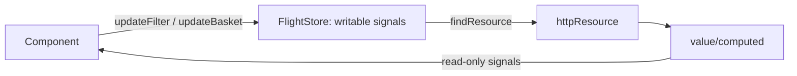

# 05 · State Management with Services & Signals
> 📖 cap.5 · pp.132-156 — *Modern Angular* v2.0.0

Finora tutta la logica è vissuta nei componenti. Crescendo, all'app conviene separare le responsabilità spostando la funzionalità riusabile in service: classi riusabili che si possono **scambiare** con altre implementazioni dello stesso contratto (cioè che espongono gli stessi metodi). Lo scambio serve a due cose — supportare configurazioni diverse (es. clienti diversi) e migliorare la **testabilità** (sostituire l'accesso al backend con un mock, una finta implementazione che restituisce dati statici). Il capitolo costruisce un `FlightClient` per l'accesso ai dati, percorre i dettagli della **[[glossario#dependency-injection-di|Dependency Injection]]** (il meccanismo con cui Angular fornisce ai componenti le istanze dei service di cui hanno bisogno: [[inject]], injection context, dipendenze tra service, providers e scope) e infine implementa uno **[[glossario#store|store]]** signal-based per gestire lo stato della feature `flight-search`.

## Generating a Service
> 📖 pp.132-133

Come per i componenti, si genera con la CLI:

```bash
ng generate service domains/ticketing/data/flight-client
# short-hand
ng g s domains/ticketing/data/flight-client
```

Originariamente i service avevano il suffisso `Service`. Oggi la CLI **non aggiunge più alcun suffisso**: conviene scegliere un suffisso che dica a che tipo di service appartiene la classe — qui i service di accesso ai dati usano `Client` (come `HttpClient`). Il risultato è una classe decorata con [[service|@Service()]]:

```ts
// src/app/domains/ticketing/data/flight-client.ts
import { Service } from '@angular/core';

@Service()              // singleton nello scope root (default)
export class FlightClient {}
```

> [!tip]
> `@Service()` registra la classe nel root injector: Angular crea **una sola istanza** (singleton) per tutta l'app, accessibile da chiunque conosca il tipo `FlightClient`. È il default adatto alla maggior parte dei casi.

> [!info] Angular 22+ · `@Service` vs `@Injectable`
> Il decoratore **`@Service()`** è stato introdotto con Angular 22 ed è la forma usata in tutto il libro dalla 2ª edizione. Equivale a `@Injectable({ providedIn: 'root' })`: **stessa semantica**, solo più conciso (cambia lo stile di scrittura, non il comportamento). Più avanti vedrai `@Service({ autoProvided: false })` per i servizi scambiabili (= il vecchio `@Injectable()` *senza* `providedIn`). Dettagli in [[service]].
> Dove un vecchio snippet mostra ancora `@Injectable({ providedIn: 'root' })`, leggilo come `@Service()`.

## Implementing a Service
> 📖 pp.133-134

Il service espone un metodo che restituisce l'`httpResource` di cui ha bisogno il componente. Riceve i criteri di ricerca come **signal** e li legge dentro la lambda reattiva:

```ts
// src/app/domains/ticketing/data/flight-client.ts
import { httpResource } from '@angular/common/http';
import { Service, Signal } from '@angular/core';
import { Flight } from './flight';

@Service()
export class FlightClient {
  private readonly baseUrl = 'https://demo.angulararchitects.io/api';

  findResource(from: Signal<string>, to: Signal<string>) {
    return httpResource<Flight[]>(
      () => {
        if (!from() || !to()) {
          return undefined;            // niente criteri → niente richiesta
        }
        return {
          url: `${this.baseUrl}/flight`,
          headers: { Accept: 'application/json' },
          params: { from: from(), to: to() },
        };
      },
      { defaultValue: [] },
    );
  }
}
```

`findResource` accetta i due signal `from`/`to` e restituisce un `httpResource` che carica i voli corrispondenti. Se `from` o `to` sono vuoti la lambda ritorna `undefined` → la [[resource|httpResource]] non parte.

## Injecting a Service
> 📖 pp.134-135

Il componente richiede l'istanza con [[inject]] (niente `new`: è Angular a fornirla in base alla configurazione). Da notare che la Signal Form rappresenta `from`/`to` come signal **annidati**, con un `value` signal per il valore correntemente bindato (dettagli nel [[06-signal-forms|cap.6]]):

```ts
// src/app/domains/ticketing/feature-booking/flight-search/flight-search.ts
import { FlightClient } from '../../data/flight-client';
import { form } from '@angular/forms/signals';

@Component({ /* ... */ })
export class FlightSearch {
  private flightClient = inject(FlightClient);

  // Signal Form per i criteri di filtro
  protected readonly filter = signal({ from: 'Graz', to: 'Hamburg' });
  protected readonly filterForm = form(this.filter);

  // resource ottenuta dal FlightClient
  protected readonly flightsResource = this.flightClient.findResource(
    this.filterForm.from().value,
    this.filterForm.to().value,
  );
  protected readonly flights = this.flightsResource.value;
  protected readonly error = this.flightsResource.error;
  protected readonly isLoading = this.flightsResource.isLoading;
}
```

Collegamenti: [[inject]].

## Injection Context
> 📖 pp.135-136

`inject` va chiamato in un **injection context** valido: i field initializer (l'inizializzazione di un campo direttamente nella sua dichiarazione, come sopra `private flightClient = inject(...)`) e i constructor. Angular e le librerie definiscono altre aree eseguite in injection context, e se ne può creare una con `runInInjectionContext`, che richiede un'istanza dell'`Injector` di Angular (a sua volta iniettabile):

```ts
import {
  assertInInjectionContext,
  inject,
  Injector,
  runInInjectionContext,
} from '@angular/core';

@Component({ /* ... */ })
export class FlightSearch {
  protected injector = inject(Injector);

  protected searchWithoutInjectionContext() {
    // this.flightClient = inject(FlightClient);                       // ❌ fallirebbe
    // assertInInjectionContext(this.searchWithoutInjectionContext);   // ❌ fallirebbe anche questo

    runInInjectionContext(this.injector, () => {
      const flightClient = inject(FlightClient);
      // ... usa flightClient qui
    });
  }
}
```

`assertInInjectionContext(fn)` a inizio metodo garantisce che venga chiamato solo in un contesto valido: si aspetta come argomento la funzione/metodo corrente e, fuori contesto, lancia un errore che ne include il nome — comodo per individuare il problema.

> [!warning]
> L'esempio serve a capire il concetto. Nel codice applicativo **evita `inject` fuori dai contesti validi** il più possibile: serve davvero di rado.

Collegamenti: [[injection-context]] · [[inject]].

## Services with Dependencies
> 📖 pp.137-138

Un service può dipendere da altri service. Il `FlightClient` può iniettare un `ConfigService` che fornisce la base URL della Web API:

```ts
// src/app/domains/shared/util-common/config-service.ts
import { Service } from '@angular/core';

@Service()
export class ConfigService {
  readonly baseUrl = 'https://demo.angulararchitects.io/api';
}
```

```ts
// src/app/domains/ticketing/data/flight-client.ts
import { httpResource } from '@angular/common/http';
import { ConfigService } from '../../shared/util-common/config-service';
import { Flight } from './flight';

@Service()
export class FlightClient {
  private configService = inject(ConfigService);

  findResource(from: Signal<string>, to: Signal<string>) {
    return httpResource<Flight[]>(
      () => {
        if (!from() || !to()) {
          return undefined;
        }
        return {
          url: `${this.configService.baseUrl}/flight`,
          /* ... */
        };
      },
      { defaultValue: [] },
    );
  }
}
```

## Exchanging Services with Providers
> 📖 pp.138-141

La DI permette di **scambiare** un'implementazione via configurazione — utile per i test (sostituire il data access con un mock) e per adattarsi a clienti o configurazioni diverse. Esempio del secondo tipo: un `LanguageService` con due strategie per determinare la lingua dell'utente. Si usa una **classe astratta** come contratto:

```ts
// src/app/domains/shared/util-common/language.ts
import { Service } from '@angular/core';

export abstract class LanguageService {
  abstract getUserLang(): string;
}

@Service({ autoProvided: false })
export class DefaultLanguageService implements LanguageService {
  getUserLang(): string {
    return 'en (default)';
  }
}

@Service({ autoProvided: false })
export class BrowserLanguageService implements LanguageService {
  getUserLang(): string {
    return navigator.language + ' (browser)';
  }
}
```

> [!info] Angular 22+
> `@Service({ autoProvided: false })` rende la classe iniettabile **ma non la registra nel root injector**: la fornisci tu via [[providers]]. È l'equivalente del vecchio `@Injectable()` (senza `providedIn`): la classe era eleggibile per l'injection ma andava provvista a mano. Perfetto per le implementazioni scambiabili dietro un base type.

> [!warning]
> Il token è una **classe astratta**, non un'interfaccia: TypeScript rimuove le interfacce in compilazione, mentre il base type serve **a runtime** per risolvere `inject(LanguageService)`. Le classi astratte invece sopravvivono alla compilazione. Le implementazioni usano `implements`, non `extends`: il compilatore verifica solo che forniscano gli stessi membri del base type (semantica simil-interfaccia), senza ereditarietà.

Si configura un **provider**, di solito in `app.config.ts`. `provide` è il **[[glossario#injection-token|token]]** (l'identificatore con cui chiedi una dipendenza via `inject` — cosa chiedi), `useClass` l'implementazione (cosa ottieni):

```ts
// src/app/app.config.ts
export const appConfig: ApplicationConfig = {
  providers: [
    { provide: LanguageService, useClass: BrowserLanguageService },
  ],
};
```

Così `inject(LanguageService)` restituisce un `BrowserLanguageService`; cambiando solo questa riga si passano **tutti** i consumer a `DefaultLanguageService` senza toccarli.

Oltre a `useClass`, lo stesso token può essere risolto con altre strategie di provider. *(Il capitolo del libro mostra solo `useClass` + il concetto di token; le altre tre sono DI standard di Angular, aggiunte qui perché utili da conoscere.)*

```ts
providers: [
  { provide: LanguageService, useClass: BrowserLanguageService },               // istanza di una classe
  { provide: API_URL, useValue: 'https://api.example.io' },                     // valore costante / token non-classe
  { provide: LanguageService, useFactory: () => new DefaultLanguageService() }, // factory (può avere dipendenze)
  { provide: LanguageService, useExisting: DefaultLanguageService },            // alias verso un token già fornito
];
```

> [!tip]
> Il **token** esprime *cosa chiedi*, la strategia (`useClass`/`useValue`/`useFactory`/`useExisting`) esprime *cosa ottieni*. `useExisting` non crea una nuova istanza: è un alias verso un token già provisto.

Configurato il provider, lo si consuma con `inject`:

```ts
import { LanguageService } from '../../../shared/util-common/language';

@Component({ /* ... */ })
export class FlightSearch {
  private languageService = inject(LanguageService);
  constructor() {
    console.log('languageService', this.languageService.getUserLang());
  }
}
```

Collegamenti: [[providers]] · [[inject]].

## Short-Hand Syntax for Providers
> 📖 p.141

Per fornire un service **senza tipo base**, la classe fa sia da token sia da implementazione:

```ts
providers: [
  { provide: FlightClient, useClass: FlightClient },
];
```

Forma abbreviata equivalente:

```ts
providers: [
  FlightClient,
];
```

Un provider così in `app.config.ts` equivale a mettere `@Service()` — o, pre-Angular 22, `@Injectable({ providedIn: 'root' })` — sulla classe stessa.

## Provider Functions
> 📖 pp.141-142

Configurare il provider a mano costringe il consumer a **conoscere l'implementazione** corrente — un dettaglio che di solito non interessa. Le librerie (Angular incluso) offrono perciò **provider function** col prefisso `provide`: incapsulano questi dettagli, accettano parametri di configurazione e ritornano un provider o un array di provider:

```ts
// src/app/domains/shared/util-common/language.ts
export type LanguageConfig = 'default' | 'browser';

export function provideLanguageService(
  config: LanguageConfig = 'default',
): Provider[] {
  if (config === 'browser') {
    return [{ provide: LanguageService, useClass: BrowserLanguageService }];
  } else {
    return [{ provide: LanguageService, useClass: DefaultLanguageService }];
  }
}
```

```ts
// src/app/app.config.ts
export const appConfig: ApplicationConfig = {
  providers: [
    provideLanguageService('browser'),
  ],
};
```

> [!tip]
> Una provider function può restituire un **array** di provider; Angular **appiattisce** automaticamente gli array annidati nella property `providers`, quindi il nesting non è un problema.

## Component-local Services
> 📖 pp.142-144

I service sono singleton **per scope**. Finora lo scope era solo quello root (`app.config.ts` o `@Service()` sulla classe). Ma ogni **componente ha il proprio injector**: fornendo un service nello scope di un componente, **ogni istanza** del componente ottiene la propria istanza del service. Si configura nella property `providers` del decorator `@Component`:

```ts
import {
  LanguageService,
  DefaultLanguageService,
} from '../../../shared/util-common/language';

@Component({
  // ...
  // fornisce il DefaultLanguageService a livello di componente
  providers: [{ provide: LanguageService, useClass: DefaultLanguageService }],
})
export class FlightSearch {
  private languageService = inject(LanguageService);
  constructor() {
    console.log('languageService', this.languageService.getUserLang());
  }
}
```

La configurazione vale per il componente **e per tutti i suoi figli**, che ricevono la stessa istanza. È utile quando un gruppo di sotto-componenti strettamente accoppiati condivide stato (es. `TabbedPane`/`Tab`, [[10-signal-queries-component-communication|cap.10]]); per componenti poco accoppiati meglio comunicare via input/output. Vale anche la short-hand (`providers: [DefaultLanguageService]` + `inject(DefaultLanguageService)`): in tal caso componente e figli ricevono la propria istanza del `DefaultLanguageService`.

**Stesso token a livelli diversi** — lo scope più interno fa **shadowing** (oscura quello esterno: chi sta dentro vede la versione più vicina, non quella di livello app):

```ts
// Application-level
{ provide: LanguageService, useClass: BrowserLanguageService }
// Component-level → vince qui dentro
{ provide: LanguageService, useClass: DefaultLanguageService }
```

`FlightSearch` e i suoi figli ricevono `DefaultLanguageService`; il resto dell'albero continua a ricevere `BrowserLanguageService`.

> [!warning]
> Anche fornendo la **stessa** implementazione a due livelli, **ogni scope ottiene la sua istanza**. Con service stateless non cambia nulla; se gestiscono stato, le due istanze possono divergere — a volte è voluto (un'istanza per `TabbedPane` evita interferenze tra pannelli diversi), a volte no.

Collegamenti: [[providers]] · [[injection-context]].

## Route-local Services & Auto Cleanup
> 📖 pp.145-146

Gli **Environment Provider** (provider validi per un intero "ambiente", cioè una porzione dell'app, non per un singolo componente) definiscono un altro scope DI per intere parti dell'app; il router li usa per fornire service a tutti i componenti associati a una rotta. Si aggiunge la property `providers` alla config della route:

```ts
// src/app/domains/ticketing/ticketing.routes.ts
export const bookingRoutes: Routes = [
  {
    path: 'booking',
    component: BookingNavigation,
    providers: [
      { provide: LanguageService, useClass: DefaultLanguageService },
    ],
  },
];
```

Il service è disponibile al componente della rotta **e a tutti i figli raggiungibili via child route** → stato/funzionalità condivisi in una feature che si estende su più rotte.

Di default Angular **non distrugge** gli Environment Provider: vivono finché l'app è aperta. Da **Angular 21.1** l'**Auto Cleanup** li distrugge (con le istanze che hanno creato) quando l'utente naviga via dalla rotta. Si attiva aggiungendo la feature al router:

```ts
// src/app/app.config.ts
import {
  provideRouter,
  withComponentInputBinding,
  withExperimentalAutoCleanupInjectors,
} from '@angular/router';
import { routes } from './app.routes';

export const appConfig: ApplicationConfig = {
  providers: [
    provideRouter(
      routes,
      withComponentInputBinding(),
      withExperimentalAutoCleanupInjectors(),
    ),
  ],
};
```

> [!info] Angular 22+
> L'**Auto Cleanup** per gli Environment Provider è disponibile da Angular 21.1, attivabile con `withExperimentalAutoCleanupInjectors()`.

> [!warning]
> Come dice il nome, `withExperimentalAutoCleanupInjectors` è ancora **sperimentale**: cautela negli ambienti di produzione.

Collegamenti: [[04-router-navigation-lazy-loading]] · [[providers]].

## Lazy Service Injection con `injectAsync`
> 📖 pp.146-148

> [!info] Angular 22+ · `injectAsync`
> Alcuni servizi portano con sé bundle troppo pesanti per essere caricati eagerly (subito, all'avvio dell'app), o servono solo a una piccola parte di utenti: caricarne il codice **solo quando serve** è un'ottimizzazione utile. **`injectAsync`** (Angular 22) riceve una lambda che ritorna una `Promise` del servizio e restituisce una funzione: la **prima** chiamata fa l'import dinamico e crea l'istanza; le successive riusano la stessa, senza roundtrip di rete (senza dover riscaricare di nuovo il codice dal server).

Esempio reale: la `CheckinPage` integra un `UpgradeService` solo quando l'utente richiede davvero un upgrade.

```ts
// src/app/domains/checkin/feature-checkin/checkin-page.ts
import { injectAsync, onIdle } from '@angular/core';

@Component({ /* ... */ })
export class CheckinPage {
  private readonly upgradeService = injectAsync(
    () => import('./upgrade-service').then((m) => m.UpgradeService),
    { prefetch: () => onIdle() },   // pre-carica a browser idle
  );

  protected async upgrade(): Promise<void> {
    const flightNumber = this.checkinFormModel().ticketId;
    const upgradeService = await this.upgradeService();   // import al primo uso
    upgradeService.upgrade(flightNumber);
  }
}
```

L'`import('./upgrade-service')` dinamico mette `UpgradeService` in un bundle separato, caricato solo on demand (solo al momento del bisogno). Il primo uso ha però un piccolo ritardo (il bundle va scaricato): l'opzione `prefetch` lo elimina pre-caricando il bundle in background appena la sua `Promise` si risolve. L'helper `onIdle` delega a `requestIdleCallback` (con fallback `setTimeout` dove non supportato), così il bundle parte quando il browser è idle (libero, senza altro lavoro in corso). Per forzare un timeout dopo cui il prefetch parte comunque: `onIdle({ timeout: 100 })`.

Perché la lazy injection (l'iniezione pigra, caricata solo all'uso) funzioni, il servizio target **deve essere auto-provided** (registrato in automatico nel root injector, senza bisogno di metterlo nei `providers`), cioè decorato con [[service|@Service()]] (pre-Angular 22: `@Injectable({ providedIn: 'root' })`):

```ts
// src/app/domains/checkin/feature-checkin/upgrade-service.ts
import { inject, Service } from '@angular/core';
import { MatSnackBar } from '@angular/material/snack-bar';

@Service()
export class UpgradeService {
  private readonly snackBar = inject(MatSnackBar);

  upgrade(flightNumber: string): void {
    console.log('upgrade requested for flight', flightNumber);
    this.snackBar.open('You are upgraded now!', 'OK', { duration: 3000 });
  }
}
```

Collegamenti: [[inject]] · [[service]].

## State Management — perché serve uno store
> 📖 pp.148-149

Le SPA mantengono stato lato client (voli selezionati, criteri di filtro, dati già caricati dal backend). Ma navigando via da una rotta Angular **distrugge il componente** corrispondente (idem quando un `@if` diventa `false`): lo stato tenuto nel componente **va perso** e al ritorno se ne crea uno nuovo.

Per farlo **sopravvivere** lo si mette in un service nello scope **root**, che non viene distrutto per tutta la vita dell'app. I service che gestiscono stato — root o altro scope — si chiamano **store**: garantiscono che lo stato cambi solo in modo **controllato** e alleggeriscono i componenti da questa responsabilità, rendendoli più mantenibili.

Collegamenti: [[lightweight-store]] · [[08-sustainable-architectures]].

## Implementing a Store with Signals
> 📖 pp.149-151

Lo store incapsula i [[signal]] e le resource. I signal **scrivibili restano privati** (`_from`), si espone la **read-only view** via `asReadonly()`, più [[computed]] derivati e metodi di update:

```ts
// src/app/domains/ticketing/feature-booking/flight-search/flight-store.ts
import { computed, inject, Service, signal } from '@angular/core';
import { Flight } from '../../data/flight';
import { FlightClient } from '../../data/flight-client';

@Service()
export class FlightStore {
  private flightClient = inject(FlightClient);

  private readonly _from = signal('Graz');
  readonly from = this._from.asReadonly();

  private readonly _to = signal('Hamburg');
  readonly to = this._to.asReadonly();

  private readonly _basket = signal<Record<number, boolean>>({});
  readonly basket = this._basket.asReadonly();

  private readonly _delay = signal(0);
  readonly delayInMin = this._delay.asReadonly();

  private readonly flightsResource = this.flightClient.findResource(this.from, this.to);
  readonly flights = this.flightsResource.value;
  readonly flightsIsLoading = this.flightsResource.isLoading;
  readonly flightsError = this.flightsResource.error;
  readonly flightsIsLoaded = computed(() => this.flightsResource.status() === 'resolved');

  readonly flightsWithDelays = computed(() =>
    toFlightsWithDelays(this.flights(), this.delayInMin()),
  );

  updateFilter(from: string, to: string): void {
    this._from.set(from);
    this._to.set(to);
  }
  updateFrom(from: string): void { this._from.set(from); }
  updateTo(to: string): void { this._to.set(to); }

  updateBasket(flightId: number, selected: boolean): void {
    this._basket.update((basket) => ({ ...basket, [flightId]: selected }));
  }

  reload(): void { this.flightsResource.reload(); }
  delay(): void { this._delay.update((delay) => delay + 15); }
}
```

La funzione di derivazione del delay (immutabile, ritorna un nuovo array):

```ts
function toFlightsWithDelays(flights: Flight[], delay: number): Flight[] {
  if (flights.length === 0) {
    return [];
  }
  const ONE_MINUTE = 1000 * 60;
  const oldFlights = flights;
  const oldFlight = oldFlights[0];
  const oldDate = new Date(oldFlight.date);
  const newDate = new Date(oldDate.getTime() + delay * ONE_MINUTE);
  const newFlight = { ...oldFlight, date: newDate.toISOString() };
  return [newFlight, ...flights.slice(1)];
}
```

I consumer vedono **solo signal read-only e metodi**: lo store nasconde writable signal, resource e `FlightClient`. È cruciale quando più componenti lavorano sullo stesso stato (wizard, multi-step form).

**Unidirectional data flow** dello store (flusso di dati a senso unico: i componenti chiedono modifiche con i metodi, i dati tornano indietro come signal read-only — mai scrittura diretta):



Collegamenti: [[signal]] · [[computed]] · [[lightweight-store]].

## Consuming the Store
> 📖 pp.151-153

Il componente inietta `FlightStore` e delega a signal/metodi: si semplifica nettamente, non gestisce più signal e resource al proprio interno. C'è però una piccola sfida: i filter signal dello store sono **read-only** e non si possono bindare direttamente agli input del template. Soluzione: un [[linked-signal|linkedSignal]] con copia di lavoro **locale**, su cui si crea la Signal Form. Un `linkedSignal` è come un `computed`, ma la sua copia locale è aggiornabile — e l'update **non** tocca il signal originale dello store.

```ts
protected readonly filter = linkedSignal(() => ({
  from: this.store.from(),
  to: this.store.to(),
}));
```

Aggiornare gli input cambia **solo la copia locale** (lo store resta intatto); se invece cambia lo store (es. caricando le preferenze utente) la copia viene sovrascritta.

```ts
// src/app/domains/ticketing/feature-booking/flight-search/flight-search.ts
import { JsonPipe } from '@angular/common';
import {
  ChangeDetectionStrategy,
  Component,
  computed,
  effect,
  inject,
  linkedSignal,
} from '@angular/core';
import { form, FormField } from '@angular/forms/signals';
import { MatSnackBar } from '@angular/material/snack-bar';
import { RouterLink } from '@angular/router';
import { FlightCard } from '../../ui/flight-card/flight-card';
import { FlightStore } from './flight-store';

@Component({
  selector: 'app-flight-search',
  imports: [FormField, FlightCard, JsonPipe, RouterLink],
  templateUrl: './flight-search.html',
  changeDetection: ChangeDetectionStrategy.OnPush,
})
export class FlightSearch {
  private readonly store = inject(FlightStore);
  private readonly snackBar = inject(MatSnackBar);

  protected readonly filter = linkedSignal(() => ({
    from: this.store.from(),
    to: this.store.to(),
  }));
  protected readonly filterForm = form(this.filter);

  protected readonly flights = this.store.flightsWithDelays;
  protected readonly isLoading = this.store.flightsIsLoading;
  protected readonly error = this.store.flightsError;
  protected readonly basket = this.store.basket;
  protected readonly flightRoute = computed(
    () => this.filter().from + ' - ' + this.filter().to,
  );

  constructor() {
    this.showError();
  }

  protected search(): void {
    this.store.updateFilter(this.filter().from, this.filter().to);
    this.store.reload();   // riparte anche se il filtro non è cambiato
  }
  protected updateBasket(flightId: number, selected: boolean): void {
    this.store.updateBasket(flightId, selected);
  }
  protected delay(): void {
    this.store.delay();
  }

  private showError() {
    effect(() => {
      const error = this.error();
      // il check sulla stringa 'error' è solo a scopo dimostrativo
      if (error || this.filter().to === 'error') {
        this.snackBar.open('Error loading flights: ' + error, 'OK');
      }
    });
  }
}
```

`search` chiama `updateFilter` per scrivere il filtro nello store, poi `reload()` per ritriggerare la resource **anche** quando il filtro non è cambiato.

> [!warning]
> Con il `linkedSignal` si **perde la reattività** del filtro: prima (senza store) cambiare `from`/`to` ritriggerava la resource; ora serve il bottone *Search*. L'incapsulamento nello store impedisce alla Signal Form di scrivere direttamente i valori — lo risolve la sezione successiva.

Collegamenti: [[linked-signal]] · [[effect]] · [[06-signal-forms|Signal Forms (cap.6)]].

## Delegated Signals
> 📖 pp.153-155

Per una UX reattiva serve chiamare `updateFilter` **a ogni** modifica di `from`/`to`. Un **delegated signal** delega (affida ad altri) sia la lettura sia la scrittura: invece di tenere il valore al proprio interno, legge e scrive su un'altra parte del sistema — qui sullo store, per l'intero oggetto `filter`. Non fa (ancora) parte di Angular — ci sono discussioni in corso per aggiungerlo — quindi nell'example project sta in `delegated-signal.ts` (cartella `src/app/domains/shared/util-common`), implementato come `linkedSignal` che fa override di `set` e `update`.

`delegatedSignal(read, write)` accetta due parametri: il primo è la funzione di lettura (come per `linkedSignal`); il secondo è una funzione chiamata a ogni update, usata per riscrivere il nuovo valore nello store.

```ts
// src/app/domains/ticketing/feature-booking/flight-search/flight-search.ts
import { form } from '@angular/forms/signals';
import { delegatedSignal } from '../../../shared/util-common/delegated-signal';

@Component({ /* ... */ })
export class FlightSearch {
  private readonly store = inject(FlightStore);

  protected readonly filter = delegatedSignal(
    () => ({
      from: this.store.from(),
      to: this.store.to(),
    }),
    (value) => this.store.updateFilter(value.from, value.to),
  );
  protected readonly filterForm = form(this.filter);
}
```

Per evitare che il `delegatedSignal` triggeri la resource a **ogni** tasto, si fa **[[glossario#debounce-debouncing|debounce]]** dell'input (si aspetta una breve pausa di digitazione prima di reagire, così non parte una richiesta a ogni carattere) assegnando uno schema alla `filterForm`:

```ts
import { debounce, form } from '@angular/forms/signals';
import { delegatedSignal } from '../../../shared/util-common/delegated-signal';

protected readonly filter = delegatedSignal(
  () => ({ from: this.store.from(), to: this.store.to() }),
  (value) => this.store.updateFilter(value.from, value.to),
);

protected readonly filterForm = form(this.filter, (path) => {
  debounce(path.from, 300);
  debounce(path.to, 300);
});
```

> [!tip]
> Alternative al delegated signal: rilassare l'incapsulamento esponendo signal scrivibili dallo store, oppure un handler sull'evento `input` che chiama il metodo di update dello store a ogni modifica. Gli schema della Signal Form sono approfonditi nel [[06-signal-forms|cap.6]].

Collegamenti: [[linked-signal]] · [[06-signal-forms]].

## Lifetime & Scopes
> 📖 pp.155-156

Il **lifetime** dello store dipende dallo scope in cui lo registri:

- **root** (`@Service()` / `providedIn: 'root'`): lo stato vive quanto l'app → tornando su una rotta si riprende da dove si era; rischio di stato **obsoleto** che resta più del dovuto → serve cleanup manuale (es. un metodo `reset`).
- **component-level**: ogni istanza del componente ha il suo store → utile per componenti riusabili complessi (es. un calendario con viste daily/weekly/monthly che condividono le date); distrutto il componente, lo stato si pulisce **automaticamente**.
- **route-local** (Environment Provider): condiviso da componente di rotta e child route → stato di una feature multi-route; con **Auto Cleanup** viene distrutto navigando via, senza stato residuo.

Collegamenti: [[lightweight-store]] · [[providers]].

## Outlook: NgRx Signal Store
> 📖 p.156

Implementare store con service + signal è abbastanza semplice (incapsulare signal e resource, fornire routine di update controllato, delegare al data access). Ma dopo qualche store ti accorgi che genera molto **lavoro ripetitivo e boilerplate** (codice standard che riscrivi quasi identico ogni volta). La libreria signal-based più popolare per ridurlo è il **NgRx Signal Store**: snellisce l'implementazione e offre diversi helper utili — dettagli nel [[09-ngrx-signal-store|cap.9]].

## 🔁 Ripasso lampo

**1.** Cosa garantisce `@Service()` (o `{ providedIn: 'root' }`) e qual è la relazione con `providers: [FlightClient]` in `app.config.ts`?
> [!success]- Risposta
> `@Service()` registra la classe nel **root injector**: una sola istanza (singleton) per tutta l'app, accessibile da chiunque conosca il tipo. Mettere `FlightClient` (o `{ provide: FlightClient, useClass: FlightClient }`) nei `providers` di `app.config.ts` è **equivalente**: configura lo stesso provider a livello applicazione anziché tramite il decoratore.

**2.** Cos'è un injection context valido? Cosa fanno `runInInjectionContext` e `assertInInjectionContext`?
> [!success]- Risposta
> È un'area dove `inject` è lecito: **field initializer** e **constructor** (più le aree definite da Angular/librerie). `runInInjectionContext(injector, fn)` crea un contesto valido attorno a `fn` passando un `Injector`. `assertInInjectionContext(fn)` a inizio metodo lancia un errore (con il nome della funzione/metodo) se viene chiamato fuori da un contesto valido.

**3.** Perché il token di un service scambiabile è una **classe astratta** e non un'interfaccia? Differenza tra `useClass`, `useValue`, `useFactory`, `useExisting`?
> [!success]- Risposta
> Perché TypeScript **rimuove le interfacce** in compilazione, mentre `inject` ha bisogno del base type **a runtime**: le classi astratte sopravvivono alla compilazione. Strategie: `useClass` = istanza di una classe; `useValue` = valore costante (anche per token non-classe); `useFactory` = factory che può avere dipendenze; `useExisting` = **alias** verso un token già provisto (non crea una nuova istanza).

**4.** Stesso token fornito a livello app **e** a livello componente: chi vince e quante istanze esistono?
> [!success]- Risposta
> Lo scope più interno fa **shadowing**: il componente (e i suoi figli) riceve l'implementazione provista a livello componente, il resto dell'albero quella a livello app. E anche con la **stessa** implementazione a entrambi i livelli, **ogni scope ottiene la sua istanza** → con stato possono divergere.

**5.** Perché lo store espone signal `asReadonly()` e tiene privati i writable? Come si ricostruisce un valore bindabile da un signal read-only?
> [!success]- Risposta
> Per impedire manipolazioni dirette dall'esterno: i consumer vedono solo signal read-only e metodi di update **controllato**, mentre i writable (`_from`, ...), la resource e il `FlightClient` restano incapsulati. Per bindare un read-only a un input si usa un [[linked-signal|linkedSignal]] (copia di lavoro locale aggiornabile, che non tocca l'originale).

**6.** Quale problema risolve il `delegatedSignal` rispetto al `linkedSignal`, e perché serve il `debounce`?
> [!success]- Risposta
> Con il `linkedSignal` si **perde la reattività**: l'update tocca solo la copia locale, quindi serve un'azione esplicita (bottone *Search*) per scrivere nello store. Il `delegatedSignal` accetta anche una funzione di **scrittura** che richiama `updateFilter` a ogni modifica → riscrive subito nello store. Il `debounce` (via schema della `filterForm`) evita di ritriggerare la resource a ogni tasto.

**7.** Come cambia il lifetime dello stato tra scope **root**, **component-local** e **route-local**? Cosa aggiunge l'Auto Cleanup?
> [!success]- Risposta
> **root**: lo stato vive quanto l'app (cleanup manuale per evitare stato obsoleto). **component-local**: un'istanza per componente, ripulita automaticamente quando il componente è distrutto. **route-local** (Environment Provider): condiviso su componente di rotta e child route; di default non distrutto, ma con **Auto Cleanup** (`withExperimentalAutoCleanupInjectors`, da Angular 21.1, sperimentale) viene distrutto navigando via.

**In sintesi:**
- I **service** sono classi iniettabili e **scambiabili** via providers (`useClass`/`useValue`/`useFactory`/`useExisting`); il token dice *cosa chiedi*, la strategia *cosa ottieni*. Per i tipi base usa classi astratte (sopravvivono alla compilazione, a differenza delle interfacce).
- La DI ha **scope** gerarchici: root (`@Service()`, singleton globale), component-local (un'istanza per componente + figli, con shadowing), route-local (Environment Provider, con Auto Cleanup sperimentale). `injectAsync` (Angular 22) consente la **lazy injection** di service in bundle separati.
- Uno **store** è un service che incapsula lo stato in [[signal]]/[[computed]], espone solo read-only + metodi di update controllati, e fa **sopravvivere** lo stato alla distruzione dei componenti.
- Per bindare uno stato read-only al template: [[linked-signal]] (copia locale, perde reattività) o `delegatedSignal` (delega read/write allo store, con `debounce`). Per ridurre il boilerplate → [[09-ngrx-signal-store]].
