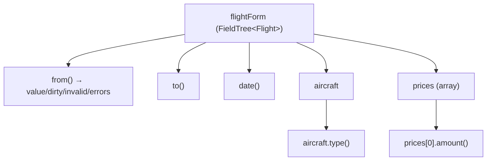

# 06 · Signal Forms
> 📖 cap.6 · pp.157-203 — *Modern Angular* v2.0.0

I **Signal Forms** colmano il divario fra la reattività basata su [[signal]] e l'interazione utente: stato della form, validazione e logica di submit diventano tutti signal, quindi reattivi e componibili. Il capitolo estende il componente `FlightEdit`, partendo da una form semplice fino a custom validator, subform e custom control.

> [!warning]
> Signal Forms è l'**API moderna ma ancora sperimentale** di Angular (package `@angular/forms/signals`). È raccomandata per i nuovi progetti, ma l'API può ancora cambiare. La `form()` era già comparsa di sfuggita nel [[02-signal-based-components|cap.2]] (`filterForm`).

## A First Signal Form
> 📖 pp.157-162

Lo [[glossario#store|store]] (`FlightDetailStore`, sullo stile del [[05-state-management-services-signals|cap.5]]) è responsabile della consistenza dei dati, quindi pubblica solo dati **read-only**. La form deve invece modificarli con un two-way binding (legame a doppio senso: ciò che l'utente digita aggiorna il dato e viceversa), quindi serve una **copia di lavoro locale**, rappresentata da un [[linked-signal|linkedSignal]].

```ts
// src/app/domains/ticketing/feature-booking/flight-edit/flight-edit.ts
import { linkedSignal } from '@angular/core';
import { form, minLength, required } from '@angular/forms/signals';

@Component({ /* ... */ })
export class FlightEdit {
  private readonly store = inject(FlightDetailStore);

  protected readonly flight = linkedSignal(() =>
    normalizeFlight(this.store.flight()),
  );

  // form(stato, schema): lo schema raccoglie le regole di validazione
  protected readonly flightForm = form(this.flight, (path) => {
    required(path.from);
    required(path.to);
    required(path.date);
    minLength(path.from, 3);   // su campo vuoto NON scatta (supporta i campi opzionali)
  });
}
```

- `form(signal, schema)` riceve il `linkedSignal` e uno **schema** con le regole. Validatori built-in: `required`, `minLength`, `maxLength`, `min`, `max`, `pattern` (regex).
- Il parametro `path` (tipo `SchemaPathTree`) referenzia le singole proprietà da validare (`path.from`, `path.to`, ...).
- `form()` ritorna un **FieldTree**, da legare ai controlli del template.

`normalizeFlight` converte la data nel formato richiesto da `<input type="datetime-local">`: una stringa ISO **senza** designatore di timezone (cioè senza il suffisso che indica il fuso orario, come la `Z` finale o `+02:00`) — es. `2030-12-24T17:30:00.000`.

```ts
function normalizeFlight(flight: Flight): Flight {
  const localDate = flight.date.substring(0, 16);
  return { ...flight, date: localDate };
}
```

### Understanding the FieldTree
> 📖 pp.159-160

Un **FieldTree** è come un signal profondamente annidato: ogni proprietà del dato è un signal, e lo stato della form di quel campo (`value`, `dirty`, `invalid`, `errors`) è a sua volta esposto da signal. Poiché tutto è signal-based, lo si può legare ai controlli.



```ts
// ogni campo è un signal; il suo stato è esposto da altri signal
const date          = this.flightForm.date().value();
const isDateDirty   = this.flightForm.date().dirty();    // true se l'utente l'ha modificato
const isDateInvalid = this.flightForm.date().invalid();  // true se c'è un errore di validazione
const dateErrors    = this.flightForm.date().errors();   // array di ValidationError

// accesso ai livelli annidati (oggetti e array)
const aircraftType  = this.flightForm.aircraft.type().value();
const firstPriceAmt = this.flightForm.prices[0].amount().value();
```

### Binding to the Template
> 📖 pp.160-162

Si importa la direttiva **`FormField`** (e `JsonPipe` per mostrare gli errori nei primi passi). `[formField]` lega un campo del FieldTree a un controllo `input` / `select` / `textarea`.

```html
<!-- flight-edit.html -->
<fieldset>
  <legend>Flight</legend>
  <div class="form-group">
    <label for="flight-id">ID</label>
    <!-- per i numeri serve type="number": Signal Forms rispetta la semantica HTML -->
    <input class="form-control" [formField]="flightForm.id" type="number" id="flight-id" />
  </div>
  <div class="form-group">
    <label for="flight-from">From</label>
    <input class="form-control" [formField]="flightForm.from" id="flight-from" />
    @if (flightForm.from().invalid()) {
      <div>{{ flightForm.from().errors() | json }}</div>
    }
  </div>
</fieldset>
```

> [!warning]
> Legando un valore numerico usa `<input type="number">`: Signal Forms rispetta la semantica HTML per garantire la type safety. Inoltre `minLength` **non scatta sui campi vuoti** (è il supporto ai campi opzionali): per imporre un valore serve `required`.

## Working with Schemas
> 📖 pp.163-170

Lo schema non definisce solo le regole di validazione, ma anche altri aspetti del comportamento della form: [[glossario#debounce-debouncing|debouncing]], campi disabilitati/read-only/hidden in certe condizioni, validazione contro schemi esterni.

### Using Separate Schemas
> 📖 pp.163-164

Per form grandi, definire lo schema inline diventa scomodo: conviene estrarlo in una costante con `schema<T>(...)` in un file separato (cartella `data/`).

```ts
// src/app/domains/ticketing/data/flight-schema.ts
import { required, minLength, schema } from '@angular/forms/signals';
import { Flight } from './flight';

export const flightSchema = schema<Flight>((path) => {
  required(path.from);
  required(path.to);
  required(path.date);
  minLength(path.from, 3);
});

// flight-edit.ts
protected readonly flightForm = form(this.flight, flightSchema);
```

Gli schemi possono **referenziarsi a vicenda**: con `apply` uno schema include tutte le regole di un altro e ne aggiunge di proprie.

```ts
// data/flight-form-schema.ts
import { apply, minLength, required, schema } from '@angular/forms/signals';
import { flightSchema } from '../../data/flight-schema';

export const flightFormSchema = schema<Flight>((path) => {
  apply(path, flightSchema);   // riusa tutte le regole di flightSchema
  required(path.id);
});
```

### Controlling Behavior
> 📖 pp.164-166

Lo schema può anche dichiarare quando un campo è `disabled`, `readonly` o `hidden`. La condizione si passa nell'oggetto opzioni tramite la proprietà **`when`**, che riceve il `ctx` di validazione (il *context*: un oggetto che dà accesso al valore e allo stato corrente degli altri campi, es. `ctx.valueOf(path.delayed)`).

```ts
// disabilita delay quando il volo NON è in ritardo
disabled(path.delay, {
  when: (ctx) => !ctx.valueOf(path.delayed),
});

// in alternativa, per disabled, la lambda può ritornare una stringa-"reason"
disabled(path.delay, {
  when: (ctx) => (ctx.valueOf(path.delayed) ? false : 'not delayed'),
});
```

> [!info] Angular 22+
> Fino ad Angular 21 la condizione era il **secondo argomento posizionale** — `disabled(path.delay, (ctx) => ...)`. Da Angular 22 si usa la **proprietà `when`** in un oggetto opzioni: forma più coerente fra `disabled`, `readonly` e `hidden`, e — per `disabled` — rende più scopribile la variante stringa-come-reason.

Le "reason" raccolte dalle lambda finiscono nel signal `disabledReasons()` del campo:

```html
@for (reason of flightForm.delay().disabledReasons(); track $index) {
  <p>Disabled because {{ reason.message }}</p>
}
```

`readonly` e `hidden` usano la **stessa forma `when`**, ma ritornano sempre boolean (niente reason):

```ts
readonly(path.delay, { when: (ctx) => ctx.valueOf(path.delayed) });
hidden(path.delay,   { when: (ctx) => !ctx.valueOf(path.delayed) });
```

> [!warning]
> `readonly` blocca **automaticamente** la scrittura sul controllo legato. `hidden` invece è **solo un suggerimento**: Signal Forms non nasconde nulla, perché di solito vanno nascosti anche label e altri elementi UI. Sei tu a usarlo nel template.

```html
@if (!flightForm.delay().hidden()) {
  <div class="form-group">
    <label for="flight-delay">Delay (min)</label>
    <input class="form-control" [formField]="flightForm.delay" type="number" id="flight-delay" />
  </div>
}
```

### Debouncing
> 📖 pp.166-167

Il debouncing si definisce nello schema con `debounce` (utile soprattutto nelle search form, per non sparare una richiesta a ogni tasto).

```ts
protected readonly filterForm = form(this.filter, (path) => {
  debounce(path, 300);          // attende 300 ms dopo l'ultima digitazione
  // debounce(path, 'blur');    // oppure: attende che l'utente esca dal campo
  required(path.from);
  minLength(path.from, 3);
});
```

Per controllare il debouncing da codice si passa una funzione custom che ritorna una `Promise`: quando si risolve, Angular prosegue con l'elaborazione delle modifiche.

```ts
debounce(path, (ctx, _abortSignal) => {
  return new Promise((resolve) => {
    setTimeout(resolve, 300);
  });
});
```

### Validating Against Zod / Standard Schema
> 📖 pp.167-169

`validateStandardSchema` valida la form contro uno schema **Zod** (o Valibot, o qualsiasi libreria conforme allo **Standard Schema** — uno standard comune che diverse librerie di validazione adottano, così Angular può lavorare con tutte allo stesso modo). Spesso queste regole esistono già lato server o sono generate da un JSON Schema/OpenAPI.

```ts
// data/flight-schema.ts
import { validateStandardSchema, schema } from '@angular/forms/signals';
import { FlightZodSchema } from './flight-zod-schema';

export const flightSchema = schema<Flight>((path) => {
  validateStandardSchema(path, FlightZodSchema);
  // ... altre regole
});
```

> [!info] Angular 21.1+ · Schema dinamico (lambda)
> Da **Angular 21.1** il 2° argomento di `validateStandardSchema` può essere una **lambda che ritorna uno schema**. Angular la avvolge in un `computed`, quindi lo schema attivo può dipendere da altri signal: utile per validazioni contestuali (es. alternare un set di regole morbido e uno severo).
> ```ts
> export function validateWithSchema(
>   path: SchemaPathTree<Flight>,
>   strict: Signal<boolean>,
> ) {
>   validateStandardSchema(
>     path,
>     () => (strict() ? StrictFlightZodSchema : FlightZodSchema),
>   );
> }
> // al cambio di strict(), Signal Forms ri-valida contro lo schema aggiornato
> ```

### Visualizing Validation State with CSS Classes
> 📖 pp.169-170

> [!info] Angular 22+
> Reactive e Template-driven Forms aggiungono da sole classi come `ng-valid`/`ng-invalid`/`ng-pending`. Signal Forms è più **esplicito**: mappi i nomi delle classi a predicati sullo stato del campo con **`provideSignalFormsConfig`**. La costante `NG_STATUS_CLASSES` (namespace `@angular/forms/signals/compat`) replica le classi delle form classiche, così i CSS che già hai continuano a funzionare.
> ```ts
> // app.config.ts
> import { provideSignalFormsConfig } from '@angular/forms/signals';
> import { NG_STATUS_CLASSES } from '@angular/forms/signals/compat';
>
> providers: [
>   provideSignalFormsConfig({ classes: NG_STATUS_CLASSES }),
>   // ng-valid, ng-invalid, ng-dirty, ng-pristine, ng-pending
> ]
> ```
> In alternativa puoi scrivere la mappa a mano, ogni classe è un predicato su `field.state()`:
> ```ts
> provideSignalFormsConfig({
>   classes: {
>     'ng-invalid':  (field) => field.state().invalid(),
>     'ng-valid':    (field) => field.state().valid(),
>     'ng-dirty':    (field) => field.state().dirty(),
>     'ng-pristine': (field) => !field.state().dirty(),
>     'ng-pending':  (field) => field.state().pending(),
>   },
> });
> ```

## Submitting Forms
> 📖 pp.170-174

Il submit è forse il miglioramento più grande: la logica si definisce nel nodo `submission` delle opzioni di `form()`, e al template basta un normale bottone di submit.

```ts
// flight-edit.ts  (importa FormRoot tra le imports del componente)
protected readonly flightForm = form(this.flight, flightSchema, {
  submission: {
    action: async (form) => this.save(form),         // eseguita al submit
    ignoreValidators: 'none',                         // none | pending | all
    onInvalid: (form) => this.reportValidationError(form),
  },
});

protected async save(form: FieldTree<Flight>) {
  try {
    await this.store.saveFlight(form().value());
    return null;                                      // nessun errore
  } catch (error) {
    return { kind: 'processing_error', error: extractError(error) };  // errore lato server
  }
}
```

- `action`: funzione eseguita al submit; di default **non parte** se un validatore fallisce o è *pending* (validatore async che non ha ancora un risultato).
- `ignoreValidators`: `none` (default, blocca su failing/pending), `pending` (ignora solo i pending), `all` (ignora tutto).
- `onInvalid`: eseguito quando un validatore fallito blocca il submit.
- `action` può **ritornare un `ValidationError`**: viene piazzato nel grafo della form (la struttura ad albero che rappresenta la form e tutti i suoi campi) e appare in `errorSummary()` (l'elenco di tutti gli errori del campo e dei suoi sotto-campi).

```ts
private reportValidationError(form: FieldTree<Flight>): void {
  this.snackBar.open('Please correct the validation errors', 'OK');
  this.focusInvalid(form);
}
private focusInvalid(form: FieldTree<Flight>) {
  const errors = form().errorSummary();
  if (errors.length > 0) {
    errors[0].fieldTree().focusBoundControl();   // focus sul primo campo invalido
  }
}
```

Gli errori restituiti dal backend appaiono nel grafo della form; per mostrarli si legge l'`errorSummary()` del livello root:

```html
<p>{{ flightForm().errorSummary() | json }}</p>
```

**Template** — basta la direttiva **`formRoot`**:

```html
<!-- flight-edit.html -->
<h1>Flight Edit</h1>
<form [formRoot]="flightForm">
  [...]
  <div>
    <button>Save</button>   <!-- type="submit" è il default -->
  </div>
</form>
```

`formRoot` fa tre cose: disabilita il submit nativo (niente postback al server, cioè niente ricaricamento della pagina con invio dei dati al server come nelle pagine HTML tradizionali), disabilita la validazione HTML del browser (ci pensa Angular), collega l'`action` all'evento submit. Funziona anche premendo Invio.

**Further Submit Actions** — per azioni aggiuntive (es. richiesta di approvazione) si usa un `<button type="button">` con la funzione `submit()`, che esegue la logica solo se la form è valida:

```ts
protected async requestApproval(): Promise<void> {
  await submit(this.flightForm, {
    action: async (form) => { await this.store.requestApproval(form().value()); },
    ignoreValidators: 'none',
    onInvalid: (form) => this.reportValidationError(form),
  });
}
```

> [!tip]
> L'interazione fra errori di validazione **client-side** e quelli ricevuti **durante il submit** dal backend (l'`action` ritorna un `ValidationError`) è una novità chiave: con le form precedenti era difficile da realizzare.

## Custom Validators
> 📖 pp.174-185

Logica di validazione oltre i built-in. Si usa `validate(path, lambda)`: la lambda riceve un `ctx` e ritorna `null` (nessun errore), un `ValidationError`, oppure un array di `ValidationError`. Ogni errore è identificato dalla stringa `kind` (il "tipo" dell'errore) e può avere proprietà libere (campi extra che decidi tu, per portarti dietro dati utili, es. il valore rifiutato).

```ts
// validatore inline nello schema
const allowed = ['Graz', 'Hamburg', 'Zürich'];
validate(path.from, (ctx) => {
  const value = ctx.value();
  if (allowed.includes(value)) {
    return null;
  }
  return { kind: 'city', value, allowed };
});
```

**Refactoring in funzioni** — riusabili, ricevono almeno il `path` da validare (tipo `SchemaPathTree<T>`):

```ts
// data/flight-validators.ts
import { SchemaPathTree, validate } from '@angular/forms/signals';

export function validateCity(path: SchemaPathTree<string>, allowed: string[]) {
  validate(path, (ctx) => {
    const value = ctx.value();
    return allowed.includes(value) ? null : { kind: 'city', value, allowed };
  });
}
// uso nello schema: validateCity(path.from, ['Graz', 'Hamburg', 'Zürich']);
```

**Showing Validation Errors** — i validatori built-in accettano `{ message: '...' }`, che finisce nella proprietà `ValidationError.message`. Un componente riusabile `ValidationErrorsPane` mappa gli errori a stringhe, con fallback `toMessage` per i `kind` noti:

```ts
// .../shared/ui-forms/validation-errors/validation-errors-pane.ts
import { Component, computed, input } from '@angular/core';
import { MinValidationError, ValidationError } from '@angular/forms/signals';

export class ValidationErrorsPane {
  readonly errors = input.required<ValidationError.WithField[]>();
  readonly showFieldNames = input(false);
  protected readonly errorMessages = computed(() =>
    toErrorMessages(this.errors(), this.showFieldNames()),
  );
}

function toMessage(error: ValidationError): string {
  switch (error.kind) {
    case 'required':       return 'Enter a value!';
    case 'roundtrip':
    case 'roundtrip_tree': return 'Roundtrips are not supported!';
    case 'min':            return `Minimum amount: ${(error as MinValidationError).min}`;
    default:               return error.kind ?? 'Validation Error';
  }
}
```

```html
<!-- required con messaggio personalizzato -->
required(path.from, { message: 'Please enter a value!' });

<!-- uso per ogni campo -->
<app-validation-errors-pane [errors]="flightForm.from().errors()" />
```

**Conditional Validation** — `applyWhenValue(path, predicate, schema)` applica uno schema solo se il predicato è `true`:

```ts
applyWhenValue(path, (flight) => flight.delayed, delayedFlight);

export const delayedFlight = schema<Flight>((path) => {
  required(path.delay);
  min(path.delay, 15);
});

// alternative:
applyWhen(path, (ctx) => ctx.valueOf(path.delayed), delayedFlight);  // ctx: valueOf / stateOf
required(path.delay, { when: (ctx) => ctx.valueOf(path.delayed) });  // opzione when del validatore
```

`applyWhen` riceve il `ctx` invece del solo valore: oltre a `ctx.valueOf(path)` espone `ctx.stateOf(path)`, che dà l'intero field state (utile se il predicato deve controllare proprietà come `dirty`).

**Multi-Field Validators** — un validatore sul **genitore comune** può confrontare più campi (es. `from` ≠ `to`):

```ts
export function validateRoundTrip(path: SchemaPathTree<Flight>) {
  validate(path, (ctx) => {
    const from = ctx.fieldTree.from().value();   // oppure ctx.valueOf(path.from)
    const to   = ctx.fieldTree.to().value();
    return from === to ? { kind: 'roundtrip', from, to } : null;
  });
}
```

> [!warning]
> Gli errori restano associati al **livello validato** del FieldTree: qui è il flight intero, non `from`/`to`. Per mostrarli servono `flightForm().errors()` (livello corrente) oppure `flightForm().errorSummary()` (include i livelli inferiori — qui conviene `[showFieldNames]="true"`). Gli errori dei livelli più bassi **non** compaiono in `errors`.

**Accessing Sibling Fields** — in alternativa, validi solo `from` accedendo al sibling `to` (il campo "fratello", cioè un altro campo allo stesso livello) con `ctx.valueOf(path.to)`; così l'errore appare nel campo `from`.

```ts
export function validateRoundTrip2(path: SchemaPathTree<Flight>) {
  validate(path.from, (ctx) => {
    const from = ctx.value();
    const to   = ctx.valueOf(path.to);
    return from === to ? { kind: 'roundtrip', from, to } : null;
  });
}
```

**Tree Validators** — `validateTree` è un multi-field validator speciale che può definire errori per **tutti i livelli**, memorizzando il campo affetto in `field`:

```ts
export function validateRoundTripTree(path: SchemaPathTree<Flight>) {
  validateTree(path, (ctx) => {
    const from = ctx.fieldTree.from().value();
    const to   = ctx.fieldTree.to().value();
    return from === to
      ? { kind: 'roundtrip_tree', field: ctx.fieldTree.from, from, to }  // errore sul campo from
      : null;
  });
}
```

**Asynchronous Validators** — validatori che fanno una chiamata asincrona (tipicamente al server) prima di dare il verdetto. `validateAsync` si configura con quattro funzioni: `params` (dallo stato del campo ricava i parametri della chiamata), `factory` (crea la resource, cioè l'oggetto che esegue la chiamata e ne segue il risultato), `onSuccess` (dal risultato → `ValidationError | null`), `onError` (dall'errore → `ValidationError | null`):

```ts
import { rxResource } from '@angular/core/rxjs-interop';
import { SchemaPathTree, validateAsync } from '@angular/forms/signals';

export function validateCityAsync(path: SchemaPathTree<string>) {
  validateAsync(path, {
    params:  (ctx) => ({ value: ctx.value() }),
    factory: (params) =>
      rxResource({ params, stream: (p) => rxValidateAirport(p.params.value) }),
    onSuccess: (result: boolean, _ctx) => (result ? null : { kind: 'airport_not_found_http' }),
    onError:   (error, _ctx) => { console.error('api error', error); return { kind: 'api-failed' }; },
  });
}
```

> [!warning]
> Finché **almeno un validatore sincrono fallisce**, Angular non esegue quelli asincroni (evita chiamate server inutili). Mentre attende, `field().pending()` è `true` — usalo nel template per mostrare uno stato di caricamento.

```html
@if (flightForm.from().pending()) {
  <div>Waiting for Async Validation Result...</div>
}
```

**HTTP Validators** — `validateHttp` è una versione semplificata che ritorna direttamente una request per un `HttpResource` (niente `params`/`factory`, solo `request`/`onSuccess`/`onError`):

```ts
export function validateCityHttp(path: SchemaPathTree<string>) {
  validateHttp(path, {
    request: (ctx) => ({
      url: 'https://demo.angulararchitects.io/api/flight',
      params: { from: ctx.value() },
    }),
    onSuccess: (result: Flight[], _ctx) =>
      result.length === 0 ? { kind: 'airport_not_found_http' } : null,
    onError: (error, _ctx) => { console.error('api error', error); return { kind: 'api-failed' }; },
  });
}
```

Collegamenti: [[resource|rxResource]] (la factory degli async validator).

## Large and Nested Forms
> 📖 pp.186-193

Signal Forms supporta modelli annidati: oggetti (**form groups**), array ripetuti (**form arrays**) e scomposizione in **subform**.

**Form Groups** — schema separato per l'oggetto annidato, incluso con `apply(path.aircraft, ...)`:

```ts
// data/aircraft-schema.ts
export const aircraftSchema = schema<Aircraft>((path) => {
  required(path.registration);
  required(path.type);
});
// data/flight-schema.ts
apply(path.aircraft, aircraftSchema);
```

```html
<!-- @let crea un alias per evitare catene tipo flightForm.aircraft.type().errors() -->
@let aircraftForm = aircraft();
<input id="type" [formField]="aircraftForm.type" />
<app-validation-errors-pane [errors]="aircraftForm.type().errors()" />
```

**Form Arrays** — gruppo ripetuto (i `prices`). Schema per il singolo elemento, applicato a ciascuno con **`applyEach`** (non `apply`):

```ts
// data/price-schema.ts
export const initialPrice: Price = { flightClass: '', amount: 0 };
export const priceSchema = schema<Price>((path) => {
  required(path.flightClass);
  required(path.amount);
  min(path.amount, 0);
});
// data/flight-schema.ts
applyEach(path.prices, priceSchema);
```

```html
@let pricesForm = prices();
<app-validation-errors-pane [errors]="pricesForm().errors()" />
@for (price of pricesForm(); track $index) {
  <input [formField]="price.flightClass" />
  <input [formField]="price.amount" type="number" />
  <app-validation-errors-pane [errors]="price().errorSummary()" [showFieldNames]="true" />
}
<button (click)="addPrice()" type="button">Add</button>
```

```ts
addPrice(): void {
  const prices = this.prices();
  prices().value.update((prices) => [...prices, { ...initialPrice }]);  // aggiunta immutabile
}
```

**Validating Form Arrays** — anche gli array sono nodi del grafo; un validatore può iterare gli elementi (es. duplicati). Nota il tipo `SchemaPath<Price[]>`:

```ts
import { SchemaPath, validate } from '@angular/forms/signals';

export function validateDuplicatePrices(path: SchemaPath<Price[]>) {
  validate(path, (ctx) => {
    const flightClasses = new Set<string>();
    for (const price of ctx.value()) {
      if (flightClasses.has(price.flightClass)) {
        return {
          kind: 'duplicateFlightClass',
          message: 'There can only be one price per flight class',
          flightClass: price.flightClass,
        };
      }
      flightClasses.add(price.flightClass);
    }
    return null;
  });
}
// nello schema: validateDuplicatePrices(path.prices);
```

**Subforms** — si spezza la form in componenti (`FlightForm`, `PricesForm`, `AircraftForm`), ognuno riceve una porzione del FieldTree via input tipizzato `FieldTree<T>`:

```html
<!-- flight-edit.html: passa porzioni del FieldTree ai sottocomponenti -->
<app-flight   [flight]="flightForm"></app-flight>
<app-prices   [prices]="flightForm.prices"></app-prices>
<app-aircraft [aircraft]="flightForm.aircraft"></app-aircraft>
```

```ts
// aircraft-form.ts
export class AircraftForm {
  aircraft = input.required<FieldTree<Aircraft>>();
}
// prices-form.ts (array)
export class PricesForm {
  readonly prices = input.required<FieldTree<Price[]>>();
  addPrice(): void {
    this.prices()().value.update((prices) => [...prices, { ...initialPrice }]);
  }
}
```

## Working with Form Metadata
> 📖 pp.193-198

I metadata informano l'utente **prima** su cosa ci si aspetta (es. campo richiesto, lunghezza). Molti validatori definiscono metadata sui campi che validano.

**Reading Metadata** — `fieldState.metadata(KEY)` con chiavi built-in `REQUIRED`, `MIN_LENGTH`, `MAX_LENGTH`:

```ts
// .../shared/ui-forms/field-meta-data-pane/field-meta-data-pane.ts
export class FieldMetaDataPane {
  readonly field = input.required<FieldTree<unknown>>();
  protected readonly fieldState = computed(() => this.field()());
  protected readonly isRequired = computed(() => this.fieldState().metadata(REQUIRED)?.() ?? false);
  protected readonly minLength  = computed(() => this.fieldState().metadata(MIN_LENGTH)?.() ?? 0);
  protected readonly maxLength  = computed(() => this.fieldState().metadata(MAX_LENGTH)?.() ?? 30);
  protected readonly length     = computed(() => `(${this.minLength()}..${this.maxLength()})`);
}
```

```html
<!-- display accanto al campo -->
<label for="flight-from">
  From <app-field-meta-data-pane [field]="flightForm.from" />
</label>
```

**Custom Metadata** — `createMetadataKey<T>()` crea una chiave; un **reducer** decide come combinare valori multipli (default: vince l'ultimo definito):

```ts
import { createMetadataKey, MetadataReducer } from '@angular/forms/signals';
export const CITY  = createMetadataKey<boolean>();            // semplice
export const CITY2 = createMetadataKey(MetadataReducer.or()); // OR fra i valori (or/and/min/max/list)

// reducer custom: implementa MetadataReducer<T, U>
const myOr: MetadataReducer<boolean, boolean> = {
  reduce(acc, item) { return acc || item; },
  getInitial() { return false; },
};
```

```ts
// si imposta con metadata(), tipicamente dentro un custom validator
export function validateCityHttp(path: SchemaPathTree<string>) {
  metadata(path, CITY, () => true);
  validateHttp(path, { /* ... */ });
}
// lettura: this.fieldState().metadata(CITY)
```

## Null and Undefined Values
> 📖 pp.198-201

> [!warning]
> Signal Forms **non ammette valori `undefined`**: semanticamente `undefined` significa "il campo non esiste", quindi `form()` non saprebbe che dovrebbe esistere e non troverebbe i suoi metadata. `null` è invece accettato (semantica di "valore vuoto"), ma è ancora meglio un **default sensato** (es. `delay: 0`).

Si distingue il **domain model** (dove un campo può essere opzionale/`undefined`) dal **form model** (dove esiste sempre), con funzioni di mapping:

```ts
export interface FlightDomainModel { /* ... */ delay?: number; }  // delay opzionale
export interface FlightFormModel   { /* ... */ delay: number; }   // delay sempre presente

export function toFlightFormModel(model: FlightDomainModel): FlightFormModel {
  return { ...model, delay: model.delay ?? 0 };
}
export function toFlightDomainModel(model: FlightFormModel): FlightDomainModel {
  return { ...model, delay: model.delayed ? model.delay : undefined };  // il backend non vuole 0 se non delayed
}
```

```ts
// un linkedSignal converte domain → form nel flusso reattivo
protected readonly flightFormModel = linkedSignal(() => toFlightFormModel(this.flightDomainModel()));
protected readonly flightForm = form(this.flightFormModel);

protected save(): void {
  const formModel = this.flightForm().value();
  const domainModel = toFlightDomainModel(formModel);  // riconverti al salvataggio
  // ...
}
```

Per convertire subito dopo la digitazione si può usare un *delegated signal* (vedi [[05-state-management-services-signals|cap.5]]). La stessa strategia vale per i campi condizionali: dal punto di vista della form esistono sempre, anche se nascosti nell'UI.

## Custom Fields
> 📖 pp.201-203

Per usare `[formField]` con widget propri (i tuoi componenti-controllo, es. uno stepper al posto del classico `<input>`), il componente implementa l'interfaccia **`FormValueControl<T>`**, che richiede solo un [[model-signal|ModelSignal]] chiamato `value` (più proprietà opzionali come `disabled`, `errors`). Sostituisce il vecchio, scomodo *Control Value Accessor* (l'interfaccia che nelle form classiche faceva da ponte fra il valore della form e il controllo personalizzato).

```ts
// delay-stepper.ts — widget che incrementa il delay di 15 min
import { Component, effect, input, model } from '@angular/core';
import { FormValueControl, ValidationError } from '@angular/forms/signals';

export class DelayStepper implements FormValueControl<number> {
  readonly value = model(0);                                                   // obbligatorio
  readonly disabled = input(false);                                            // opzionale (da regola schema)
  readonly errors = input<readonly ValidationError.WithOptionalField[]>([]);   // opzionale

  protected inc(): void { this.value.update((v) => v + 15); }
  protected dec(): void { this.value.update((v) => Math.max(v - 15, 0)); }
}
```

```html
<!-- si lega come un campo qualsiasi -->
<app-delay-stepper id="delay" [formField]="flightForm.delay" />
```

> [!tip]
> Per le **checkbox** `FormValueControl` espone una `checked` opzionale, ma esiste l'interfaccia dedicata `FormCheckboxControl` (con `checked` obbligatoria e `value` opzionale).

Collegamenti: [[model-signal]] · [[two-way-binding]] · [[signal-input|input()]].

## 🔁 Ripasso lampo

**1.** Perché lo stato della form parte da un [[linked-signal|linkedSignal]] e non direttamente dal signal dello store?
> [!success]- Risposta
> Lo store pubblica dati **read-only** per garantire la consistenza, ma la form deve modificarli con un two-way binding. Serve quindi una **copia di lavoro locale** scrivibile: il `linkedSignal` la deriva dallo store (qui via `normalizeFlight(this.store.flight())`) e si ri-aggancia quando la sorgente cambia, restando però modificabile dalla form.

**2.** Cos'è un FieldTree e come accedi a `value`/`dirty`/`invalid`/`errors` di un campo annidato?
> [!success]- Risposta
> Un **FieldTree** è come un signal profondamente annidato: ogni proprietà del dato è un signal che invocato (`flightForm.date()`) restituisce il field state, a sua volta fatto di signal. Es.: `flightForm.date().value()`, `.dirty()`, `.invalid()`, `.errors()`. Per i livelli annidati segui la struttura del dato: `flightForm.aircraft.type().value()`, `flightForm.prices[0].amount().value()`.

**3.** Differenza fra `apply`, `applyEach` e `applyWhen`/`applyWhenValue`?
> [!success]- Risposta
> `apply(path, schema)` include un altro schema su un **oggetto** (anche annidato, es. `apply(path.aircraft, aircraftSchema)`). `applyEach(path.array, schema)` applica lo schema a **ogni elemento** di un array. `applyWhenValue(path, predicate, schema)` applica uno schema solo se il **valore** soddisfa il predicato; `applyWhen` è la variante in cui il predicato riceve il `ctx` (con `valueOf`/`stateOf`) invece del solo valore.

**4.** Cosa fa la direttiva `formRoot` e come si definisce la logica di submit? A cosa serve `ignoreValidators`?
> [!success]- Risposta
> `formRoot` fa tre cose: disabilita il submit nativo, disabilita la validazione HTML del browser e collega l'`action` all'evento submit (funziona anche con Invio). La logica si definisce nel nodo `submission` delle opzioni di `form()` (`action`, `onInvalid`). `ignoreValidators` controlla quando il submit può partire: `none` (default, bloccato se un validatore fallisce o è pending), `pending` (ignora solo i pending), `all` (ignora tutto).

**5.** Come scrivi un multi-field validator (es. `from` ≠ `to`) e dove finisce l'errore? Cosa cambia con `validateTree`?
> [!success]- Risposta
> Lo metti su un **livello genitore comune** con `validate(path, ctx => ...)` e confronti i campi via `ctx.fieldTree.from().value()` (o `ctx.valueOf(path.from)`). L'errore resta associato al **livello validato** (il flight intero), quindi va letto da `flightForm().errors()`/`errorSummary()`, non da `from`/`to`. Con `validateTree` puoi invece definire errori per **tutti i livelli**, indicando il campo affetto nella proprietà `field` del `ValidationError`.

**6.** Perché Signal Forms rifiuta `undefined`? Come si gestiscono i campi opzionali?
> [!success]- Risposta
> Perché `undefined` significa semanticamente "il campo non esiste": `form()` non saprebbe che dovrebbe esistere né troverebbe i suoi metadata. Si distingue allora il **domain model** (campo opzionale/`undefined`) dal **form model** (campo sempre presente, con default sensato come `delay: 0`), e si convertono i due con funzioni di mapping (`toFlightFormModel`/`toFlightDomainModel`), tipicamente collegate da un `linkedSignal`.

**7.** Quale interfaccia deve implementare un custom control per funzionare con `[formField]`, e cosa richiede?
> [!success]- Risposta
> **`FormValueControl<T>`**: richiede soltanto un `model()` chiamato `value` (più proprietà opzionali come `disabled` ed `errors`). Sostituisce il vecchio Control Value Accessor. Per le checkbox esiste l'interfaccia dedicata `FormCheckboxControl` (con `checked` obbligatoria e `value` opzionale).

**In sintesi:**
- **Signal Forms** modella stato, valori e validazione come signal: tutto reattivo e componibile (API moderna ma **sperimentale**, package `@angular/forms/signals`).
- La validazione è **dichiarativa** via `schema`: componibile e riusabile (`apply`/`applyEach`), condizionale (`applyWhen`/`applyWhenValue`), built-in + custom + multi-field + tree + async/HTTP + integrazione Zod/Standard Schema.
- Comportamenti di campo (`disabled`/`readonly`/`hidden`) si dichiarano nello schema con la proprietà **`when`** (Angular 22+); `hidden` è solo un hint, `readonly` blocca davvero la scrittura.
- Submit ripensato: `submission`/`formRoot`/`submit()`, con interazione fra errori client-side ed errori dal backend.
- Form complesse = oggetti annidati (`apply`), array (`applyEach`) e **subform** (input `FieldTree<T>`); separare **domain model** e **form model** evita i problemi con `undefined`.
- I **custom control** si integrano con la sola interfaccia `FormValueControl<T>` (un `model()` chiamato `value`), addio Control Value Accessor.
