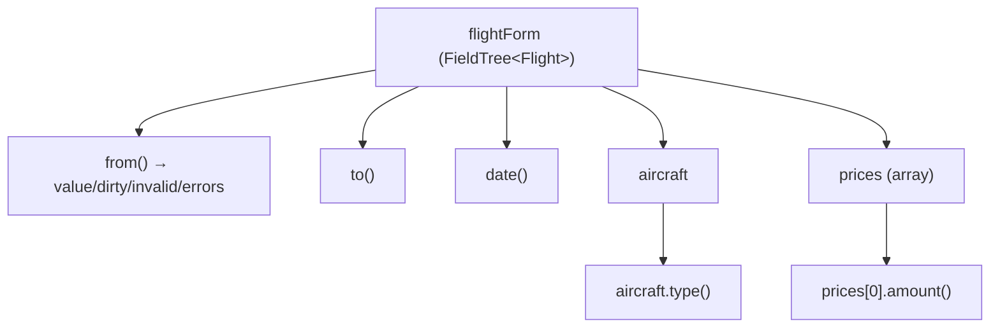

# 06 · Signal Forms
> 📖 cap.6 · pp.157-203 — *Modern Angular* v2.0.0

I **Signal Forms** colmano il divario fra la reattività basata su [[signal]] e l'interazione utente: stato della form, validazione e logica di submit diventano tutti signal, quindi reattivi e componibili. Si estende il componente `FlightEdit`, partendo da una form semplice fino a custom validators, subform e custom controls.

> [!warning] API sperimentale
> Signal Forms è l'**API moderna ma ancora sperimentale** di Angular (package `@angular/forms/signals`). È raccomandata per i nuovi progetti, ma l'API può cambiare. La `form()` è stata introdotta brevemente nel [[02-signal-based-components|cap.2]] (`filterForm`).

## A First Signal Form
> 📖 pp.157-160

Lo store (`FlightDetailStore`, sullo stile del [[05-state-management-services-signals|cap.5]]) pubblica dati **read-only** per garantire la consistenza. La form deve invece modificarli con un two-way binding, quindi serve una **copia di lavoro locale** rappresentata da un [[linked-signal|linkedSignal]].

```ts
// flight-edit.ts
import { linkedSignal } from '@angular/core';
import { form, minLength, required } from '@angular/forms/signals';

export class FlightEdit {
  private readonly store = inject(FlightDetailStore);

  protected readonly flight = linkedSignal(() =>
    normalizeFlight(this.store.flightValue()),
  );

  // form(stato, schema): schema = regole di validazione
  protected readonly flightForm = form(this.flight, (path) => {
    required(path.from);
    required(path.to);
    required(path.date);
    minLength(path.from, 3);   // su empty NON scatta (supporta campi opzionali)
  });
}
```

- `form(signal, schema)` riceve il linkedSignal e uno **schema** con le regole. Validatori built-in: `required`, `minLength`, `maxLength`, `min`, `max`, `pattern` (regex).
- Il parametro `path` (tipo `SchemaPathTree`) referenzia le proprietà da validare (`path.from`, `path.to`).
- `form()` ritorna un **FieldTree**, da legare ai controlli del template.

`normalizeFlight` converte la data nel formato di `<input type="datetime-local">` (ISO senza timezone, es. `2030-12-24T17:30:00.000`).

### Understanding the FieldTree
> 📖 pp.159-160

Un **FieldTree** è come un signal profondamente annidato: ogni proprietà del dato è un signal con lo stato della form.



```ts
// ogni proprietà è un signal; lo stato è esposto da altri signal
const date         = this.flightForm.date().value();
const isDateDirty  = this.flightForm.date().dirty();    // true se l'utente l'ha modificato
const isDateInvalid= this.flightForm.date().invalid();  // true se c'è errore di validazione
const dateErrors   = this.flightForm.date().errors();   // array di ValidationError

// accesso ai livelli annidati
const aircraftType   = this.flightForm.aircraft.type().value();
const firstPriceAmt  = this.flightForm.prices[0].amount().value();
```

### Binding to the Template
> 📖 pp.160-162

Si importa la direttiva **FormField** (e `JsonPipe` per mostrare gli errori nei primi passi). `[formField]` lega un campo del FieldTree a `input` / `select` / `textarea`.

```html
<fieldset>
  <legend>Flight</legend>
  <div class="form-group">
    <label for="flight-id">ID</label>
    <!-- per i numeri serve type="number": Signal Forms rispetta la semantica HTML -->
    <input [formField]="flightForm.id" type="number" id="flight-id" />
  </div>
  <div class="form-group">
    <label for="flight-from">From</label>
    <input [formField]="flightForm.from" id="flight-from" />
    @if (flightForm.from().invalid()) {
      <div>{{ flightForm.from().errors() | json }}</div>
    }
  </div>
</fieldset>
```

> [!warning] Gotcha
> Legando un numero usa `<input type="number">`: Signal Forms rispetta la semantica HTML per garantire la type safety. Inoltre `minLength` **non scatta sui campi vuoti** (supporto ai campi opzionali): per imporre il valore serve `required`.

## Working with Schemas
> 📖 pp.163-167

Lo schema non definisce solo le regole di validazione, ma anche altri comportamenti (debouncing, campi read-only/disabled/hidden, validazione contro schemi esterni).

**Schemi separati e riusabili** — per form grandi conviene estrarre lo schema in una costante (`schema<T>(...)`) in `data/`, e comporlo con `apply`:

```ts
// data/flight-schema.ts
import { required, minLength, schema } from '@angular/forms/signals';
export const flightSchema = schema<Flight>((path) => {
  required(path.from);
  required(path.to);
  required(path.date);
  minLength(path.from, 3);
});

// data/flight-form-schema.ts — include un altro schema e aggiunge regole
import { apply, required, schema } from '@angular/forms/signals';
export const flightFormSchema = schema<Flight>((path) => {
  apply(path, flightSchema);   // riusa tutte le regole di flightSchema
  required(path.id);
});

// flight-edit.ts
protected readonly flightForm = form(this.flight, flightSchema);
```

**Controlling Behavior** (pp.156-157) — `disabled`, `readonly`, `hidden`:

```ts
// disabled accetta un boolean oppure una "reason" stringa
disabled(path.delay, (ctx) => !ctx.valueOf(path.delayed));
disabled(path.delay, (ctx) => ctx.valueOf(path.delayed) ? false : 'not delayed');
```

```html
<!-- le reason sono in disabledReasons() -->
@for (reason of flightForm.delay().disabledReasons(); track $index) {
  <p>Disabled because {{ reason.message }}</p>
}
<!-- hidden è solo un HINT: nascondere label/UI è compito tuo -->
@if (!flightForm.delay().hidden()) {
  <div class="form-group">
    <input [formField]="flightForm.delay" type="number" id="flight-delay" />
  </div>
}
```

> [!warning] Gotcha
> `hidden` e `readonly` ritornano **solo boolean** (niente reason). `readonly` blocca automaticamente la scrittura sul controllo; `hidden` invece è **solo un suggerimento**: Signal Forms non nasconde nulla, perché di solito vanno nascosti anche label e altri elementi UI.

**Debouncing** (pp.157-158) — definito nello schema con `debounce`:

```ts
protected readonly filterForm = form(this.filter, (path) => {
  debounce(path, 300);          // ms
  // debounce(path, 'blur');    // oppure: attende il blur del campo
  // debounce(path, (ctx, _abortSignal) =>           // debouncer custom via Promise
  //   new Promise((resolve) => setTimeout(resolve, 300)));
  required(path.from);
  minLength(path.from, 3);
});
```

**Validating Against Zod / Standard Schema** (p.159) — `validateStandardSchema` valida contro uno schema Zod (o Valibot, o qualsiasi libreria conforme allo **Standard Schema**):

```ts
import { validateStandardSchema, schema } from '@angular/forms/signals';
import { FlightZodSchema } from './flight-zod-schema';

export const flightSchema = schema<Flight>((path) => {
  validateStandardSchema(path, FlightZodSchema);
  // ... altre regole
});
```

> [!info] Angular 22+ · Schema dinamico (lambda)
> Da **Angular 21.1** il 2° argomento di `validateStandardSchema` può essere una **lambda che ritorna uno schema**: Angular la avvolge in un `computed`, così lo schema attivo può dipendere da altri signal (validazione context-dependent, es. switch tra regole lenient/strict).
> ```ts
> validateStandardSchema(
>   path,
>   () => (strict() ? StrictFlightZodSchema : FlightZodSchema),
> );
> // al cambio di strict(), la form ri-valida contro lo schema aggiornato
> ```

### Visualizzare lo stato di validazione con classi CSS
> [!info] Angular 22+
> Reactive/Template-driven Forms aggiungono da sole classi come `ng-valid`/`ng-invalid`/`ng-pending`. Signal Forms è più **esplicito**: mappi i nomi delle classi a predicati sullo stato del campo via **`provideSignalFormsConfig`**. La costante `NG_STATUS_CLASSES` (namespace `compat`) replica le classi delle form classiche → i CSS esistenti continuano a funzionare.
> ```ts
> // app.config.ts
> import { provideSignalFormsConfig } from '@angular/forms/signals';
> import { NG_STATUS_CLASSES } from '@angular/forms/signals/compat';
>
> providers: [
>   provideSignalFormsConfig({ classes: NG_STATUS_CLASSES }),
>   // ng-valid, ng-invalid, ng-dirty, ng-pristine, ng-pending
> ]
> ```

## Submitting Forms
> 📖 pp.170-174

Il submit è forse il miglioramento più grande: la logica si definisce nel nodo `submission` delle opzioni di `form()`, e al template basta un normale bottone di submit.

```ts
// flight-edit.ts  (importa FormRoot tra le imports del componente)
protected readonly flightForm = form(this.flight, flightSchema, {
  submission: {
    action: async (form) => this.save(form),        // eseguita al submit
    ignoreValidators: 'none',                        // none | pending | all
    onInvalid: (form) => this.reportValidationError(form),
  },
});

protected async save(form: FieldTree<Flight>) {
  try {
    await this.store.saveFlight(form().value());
    return null;                                     // nessun errore
  } catch (error) {
    return { kind: 'processing_error', error: extractError(error) };  // errore lato server
  }
}
```

- `action`: funzione eseguita al submit; di default **non parte** se un validatore fallisce o è *pending* (validatori async senza ancora un risultato).
- `ignoreValidators`: `none` (default, blocca su failing/pending), `pending` (ignora solo i pending), `all` (ignora tutto).
- `onInvalid`: eseguito quando un validatore fallito blocca il submit.
- `action` può **ritornare un ValidationError**: viene piazzato nel grafo della form e appare in `errorSummary()`.

```ts
private reportValidationError(form: FieldTree<Flight>): void {
  this.snackBar.open('Please correct the validation errors', 'OK');
  this.focusInvalid(form);
}
private focusInvalid(form: FieldTree<Flight>) {
  const errors = form().errorSummary();
  if (errors.length > 0) {
    errors[0].fieldTree().focusBoundControl();   // mette il focus sul primo campo invalido
  }
}
```

**Template** (p.162) — basta la direttiva **formRoot**:

```html
<form [formRoot]="flightForm">
  [...]
  <button>Save</button>   <!-- type="submit" è il default -->
</form>
```

`formRoot` fa tre cose: disabilita il submit nativo (niente postback al server), disabilita la validazione HTML del browser (ci pensa Angular), collega l'`action` all'evento submit. Funziona anche premendo Invio.

**Further Submit Actions** (p.163) — per azioni aggiuntive (es. richiesta di approvazione) si usa un `<button type="button">` con la funzione `submit()`, che esegue la logica solo se la form è valida:

```ts
protected async requestApproval(): Promise<void> {
  await submit(this.flightForm, {
    action: async (form) => { await this.store.requestApproval(form().value()); },
    ignoreValidators: 'none',
    onInvalid: (form) => this.reportValidationError(form),
  });
}
```

> [!tip] Take-away
> L'interazione fra errori di validazione **client-side** e quelli ricevuti **durante il submit** dal backend (l'`action` ritorna un `ValidationError`) è una novità chiave: con le form precedenti era difficile da realizzare.

## Custom Validators
> 📖 pp.174-185

Logica di validazione oltre i built-in. Si usa `validate(path, lambda)`: la lambda riceve un `ctx` e ritorna `null` (nessun errore), un `ValidationError`, o un array di `ValidationError`. Ogni errore è identificato da una stringa `kind` e può avere proprietà libere.

```ts
// validatore inline nello schema
validate(path.from, (ctx) => {
  const value = ctx.value();
  if (['Graz', 'Hamburg', 'Zürich'].includes(value)) return null;
  return { kind: 'city', value, allowed: ['Graz', 'Hamburg', 'Zürich'] };
});
```

**Refactoring in funzioni** (p.164) — riusabili, ricevono almeno il `path` (tipo `SchemaPathTree<T>`):

```ts
// data/flight-validators.ts
export function validateCity(path: SchemaPathTree<string>, allowed: string[]) {
  validate(path, (ctx) => {
    const value = ctx.value();
    return allowed.includes(value) ? null : { kind: 'city', value, allowed };
  });
}
// uso nello schema: validateCity(path.from, ['Graz', 'Hamburg', 'Zürich']);
```

**Showing Validation Errors** (pp.165-167) — i validatori built-in accettano `{ message: '...' }` che finisce nel `ValidationError.message`. Un componente riusabile `ValidationErrorsPane` mappa gli errori a stringhe (con fallback `toMessage` per `kind` noti):

```ts
export class ValidationErrorsPane {
  readonly errors = input.required<ValidationError.WithField[]>();
  readonly showFieldNames = input(false);
  protected readonly errorMessages = computed(() =>
    toErrorMessages(this.errors(), this.showFieldNames()),
  );
}
function toMessage(error: ValidationError): string {
  switch (error.kind) {
    case 'required': return 'Enter a value!';
    case 'min':      return `Minimum amount: ${(error as MinValidationError).min}`;
    default:         return error.kind ?? 'Validation Error';
  }
}
```

```html
<!-- uso per ogni campo -->
<app-validation-errors-pane [errors]="flightForm.from().errors()" />
```

**Conditional Validation** (pp.167-168) — `applyWhenValue(path, predicate, schema)` applica uno schema solo se il predicato è true:

```ts
applyWhenValue(path, (flight) => flight.delayed, delayedFlight);

export const delayedFlight = schema<Flight>((path) => {
  required(path.delay);
  min(path.delay, 15);
});

// alternative:
applyWhen(path, (ctx) => ctx.valueOf(path.delayed), delayedFlight);  // ctx: valueOf / stateOf
required(path.delay, { when: (ctx) => ctx.valueOf(path.delayed) });  // opzione when
```

**Multi-Field Validators** (pp.168-170) — un validatore su un livello genitore comune può confrontare più campi (es. `from` ≠ `to`):

```ts
export function validateRoundTrip(path: SchemaPathTree<Flight>) {
  validate(path, (ctx) => {
    const from = ctx.fieldTree.from().value();   // oppure ctx.valueOf(path.from)
    const to   = ctx.fieldTree.to().value();
    return from === to ? { kind: 'roundtrip', from, to } : null;
  });
}
```

> [!warning] Gotcha
> Gli errori restano associati al **livello validato** del FieldTree: qui è il flight intero, non `from`/`to`. Per mostrarli servono `flightForm().errors()` (livello corrente) oppure `flightForm().errorSummary()` (include i livelli inferiori — conviene `[showFieldNames]="true"`). Gli errori dei livelli più bassi **non** compaiono in `errors`.

**Accessing Sibling Fields** (p.170) — in alternativa, valida solo `from` accedendo al sibling `to` con `ctx.valueOf(path.to)`; così l'errore appare nel campo `from`.

**Tree Validators** (p.171) — `validateTree` è un multi-field validator speciale che può definire errori per **tutti i livelli**, memorizzando il campo affetto in `field`:

```ts
export function validateRoundTripTree(path: SchemaPathTree<Flight>) {
  validateTree(path, (ctx) => {
    const from = ctx.fieldTree.from().value();
    const to   = ctx.fieldTree.to().value();
    return from === to
      ? { kind: 'roundtrip_tree', field: ctx.fieldTree.from, from, to }  // errore sul campo from
      : null;
  });
}
```

**Asynchronous Validators** (pp.172-174) — `validateAsync` con quattro mapping: `params` (stato → parametri), `factory` (crea una resource), `onSuccess` (risultato → ValidationError|null), `onError` (errore → ValidationError):

```ts
export function validateCityAsync(path: SchemaPathTree<string>) {
  validateAsync(path, {
    params:  (ctx) => ({ value: ctx.value() }),
    factory: (params) => rxResource({ params, stream: (p) => rxValidateAirport(p.params.value) }),
    onSuccess: (result: boolean) => result ? null : { kind: 'airport_not_found_http' },
    onError:   (error) => { console.error('api error', error); return { kind: 'api-failed' }; },
  });
}
```

> [!warning] Gotcha
> Finché **almeno un validatore sincrono fallisce**, Angular non esegue quelli asincroni (evita chiamate server inutili). Mentre attende, `field().pending()` è `true` — usalo nel template per mostrare uno stato di caricamento.

**HTTP Validators** (p.174) — `validateHttp` è una versione semplificata che ritorna direttamente una request per un `HttpResource` (niente `params`/`factory`, solo `request`/`onSuccess`/`onError`):

```ts
export function validateCityHttp(path: SchemaPathTree<string>) {
  validateHttp(path, {
    request:   (ctx) => ({ url: 'https://demo.angulararchitects.io/api/flight',
                           params: { from: ctx.value() } }),
    onSuccess: (result: Flight[]) => result.length === 0 ? { kind: 'airport_not_found_http' } : null,
    onError:   (error) => { console.error('api error', error); return { kind: 'api-failed' }; },
  });
}
```

Collegamenti: [[resource|rxResource]] (la factory degli async validator).

## Large and Nested Forms
> 📖 pp.186-193

Signal Forms supporta modelli annidati: oggetti (**form groups**), array ripetuti (**form arrays**) e scomposizione in **subform**.

**Form Groups** (pp.175-177) — schema separato per l'oggetto annidato, incluso con `apply(path.aircraft, ...)`:

```ts
// data/aircraft-schema.ts
export const aircraftSchema = schema<Aircraft>((path) => {
  required(path.registration);
  required(path.type);
});
// data/flight-schema.ts
apply(path.aircraft, aircraftSchema);
```

```html
<!-- @let crea un alias per evitare catene tipo flightForm.aircraft.registration().errors() -->
@let aircraftForm = aircraft();
<input [formField]="aircraftForm.type" />
<app-validation-errors-pane [errors]="aircraftForm.type().errors()" />
```

**Form Arrays** (pp.177-179) — gruppo ripetuto (i `prices`). Schema per il singolo elemento, applicato a ciascuno con **`applyEach`** (non `apply`):

```ts
// data/price-schema.ts
export const initialPrice: Price = { flightClass: '', amount: 0 };
export const priceSchema = schema<Price>((path) => {
  required(path.flightClass);
  required(path.amount);
  min(path.amount, 0);
});
// data/flight-schema.ts
applyEach(path.prices, priceSchema);
```

```html
@let pricesForm = prices();
<app-validation-errors-pane [errors]="pricesForm().errors()" />
@for (price of pricesForm(); track $index) {
  <input [formField]="price.flightClass" />
  <input [formField]="price.amount" type="number" />
  <app-validation-errors-pane [errors]="price().errorSummary()" [showFieldNames]="true" />
}
<button (click)="addPrice()" type="button">Add</button>
```

```ts
addPrice(): void {
  const prices = this.prices();
  prices().value.update((prices) => [...prices, { ...initialPrice }]);  // aggiunta immutabile
}
```

**Validating Form Arrays** (p.179) — anche gli array sono nodi del grafo; un validatore può iterare gli elementi (es. duplicati):

```ts
export function validateDuplicatePrices(path: SchemaPath<Price[]>) {
  validate(path, (ctx) => {
    const seen = new Set<string>();
    for (const price of ctx.value()) {
      if (seen.has(price.flightClass)) {
        return { kind: 'duplicateFlightClass',
                 message: 'There can only be one price per flight class',
                 flightClass: price.flightClass };
      }
      seen.add(price.flightClass);
    }
    return null;
  });
}
// nello schema: validateDuplicatePrices(path.prices);
```

**Subforms** (pp.180-182) — si spezza la form in componenti (`FlightForm`, `PricesForm`, `AircraftForm`), ognuno riceve una porzione del FieldTree via input tipizzato `FieldTree<T>`:

```html
<!-- flight-edit.html: passa porzioni del FieldTree ai sottocomponenti -->
<app-flight   [flight]="flightForm"></app-flight>
<app-prices   [prices]="flightForm.prices"></app-prices>
<app-aircraft [aircraft]="flightForm.aircraft"></app-aircraft>
```

```ts
// aircraft-form.ts
export class AircraftForm {
  aircraft = input.required<FieldTree<Aircraft>>();
}
// prices-form.ts (array)
export class PricesForm {
  readonly prices = input.required<FieldTree<Price[]>>();
  addPrice(): void {
    this.prices()().value.update((prices) => [...prices, { ...initialPrice }]);
  }
}
```

## Working with Form Metadata
> 📖 pp.193-198

I metadata informano l'utente **prima** su cosa ci si aspetta (es. campo richiesto, lunghezza). Molti validatori definiscono metadata sui campi validati.

**Reading Metadata** (p.183) — `fieldState.metadata(KEY)` con chiavi built-in `REQUIRED`, `MIN_LENGTH`, `MAX_LENGTH`:

```ts
export class FieldMetaDataPane {
  readonly field = input.required<FieldTree<unknown>>();
  protected readonly fieldState = computed(() => this.field()());
  protected readonly isRequired = computed(() => this.fieldState().metadata(REQUIRED)?.() ?? false);
  protected readonly minLength  = computed(() => this.fieldState().metadata(MIN_LENGTH)?.() ?? 0);
  protected readonly maxLength  = computed(() => this.fieldState().metadata(MAX_LENGTH)?.() ?? 30);
}
```

```html
<!-- display accanto al campo (p.185) -->
<label for="flight-from">
  From <app-field-meta-data-pane [field]="flightForm.from" />
</label>
```

**Custom Metadata** (pp.185-187) — `createMetadataKey<T>()` crea una chiave; un **reducer** decide come combinare valori multipli (default: vince l'ultimo definito):

```ts
import { createMetadataKey, MetadataReducer } from '@angular/forms/signals';
export const CITY = createMetadataKey<boolean>();             // semplice
export const CITY2 = createMetadataKey(MetadataReducer.or()); // OR fra i valori (or/and/min/max/list)

// reducer custom: implementa MetadataReducer<T>
const myOr: MetadataReducer<boolean, boolean> = {
  reduce(acc, item) { return acc || item; },
  getInitial() { return false; },
};
```

```ts
// si imposta con metadata(), tipicamente dentro un custom validator
export function validateCityHttp(path: SchemaPathTree<string>) {
  metadata(path, CITY, () => true);
  validateHttp(path, { /* ... */ });
}
// lettura: this.fieldState().metadata(CITY)
```

## Null and Undefined Values
> 📖 pp.198-201

> [!warning] Gotcha
> Signal Forms **non ammette valori `undefined`**: semanticamente `undefined` significa "il campo non esiste", quindi `form()` non saprebbe che dovrebbe esistere. `null` è invece accettato (semantica "valore vuoto"), ma è ancora meglio un **default sensato** (es. `delay: 0`).

Si distingue il **domain model** (dove un campo può essere opzionale/`undefined`) dal **form model** (dove esiste sempre), con funzioni di mapping:

```ts
export interface FlightDomainModel { /* ... */ delay?: number; }  // delay opzionale
export interface FlightFormModel   { /* ... */ delay: number; }   // delay sempre presente

export function toFlightFormModel(m: FlightDomainModel): FlightFormModel {
  return { ...m, delay: m.delay ?? 0 };
}
export function toFlightDomainModel(m: FlightFormModel): FlightDomainModel {
  return { ...m, delay: m.delayed ? m.delay : undefined };  // il backend non vuole 0 se non delayed
}
```

```ts
// un linkedSignal converte domain → form nel flusso reattivo
protected readonly flightFormModel = linkedSignal(() => toFlightFormModel(this.flightDomainModel()));
protected readonly flightForm = form(this.flightFormModel);

protected save(): void {
  const domainModel = toFlightDomainModel(this.flightForm().value());  // riconverti al salvataggio
  // ...
}
```

Per convertire subito dopo la digitazione si può usare un *delegated signal* (vedi [[05-state-management-services-signals|cap.5]]). La stessa strategia vale per i campi condizionali: dal punto di vista della form esistono sempre, anche se nascosti nell'UI.

## Custom Fields
> 📖 pp.201-203

Per usare `[formField]` con widget propri, il componente implementa l'interfaccia **`FormValueControl<T>`**, che richiede solo un [[model-signal|ModelSignal]] chiamato `value` (+ proprietà opzionali come `disabled`, `errors`). Sostituisce il vecchio, scomodo *Control Value Accessor*.

```ts
// delay-stepper.ts — widget che incrementa il delay di 15 min
import { Component, effect, input, model } from '@angular/core';
import { FormValueControl, ValidationError } from '@angular/forms/signals';

export class DelayStepper implements FormValueControl<number> {
  readonly value = model(0);                                              // obbligatorio
  readonly disabled = input(false);                                       // opzionale (da regola schema)
  readonly errors = input<readonly ValidationError.WithOptionalField[]>([]); // opzionale

  protected inc(): void { this.value.update((v) => v + 15); }
  protected dec(): void { this.value.update((v) => Math.max(v - 15, 0)); }
}
```

```html
<!-- si lega come un campo qualsiasi -->
<app-delay-stepper id="delay" [formField]="flightForm.delay" />
```

> [!tip] Take-away
> Per le **checkbox** `FormValueControl` espone una `checked` opzionale, ma esiste l'interfaccia dedicata `FormCheckboxControl` (con `checked` obbligatoria e `value` opzionale).

Collegamenti: [[model-signal]] · [[two-way-binding]] · [[signal-input|input()]].

## 🔁 Ripasso lampo
1. Perché lo stato della form parte da un [[linked-signal|linkedSignal]] e non dal signal dello store?
2. Cos'è un FieldTree e come accedi a `value`/`dirty`/`invalid`/`errors` di un campo annidato?
3. Differenza fra `apply`, `applyEach`, `applyWhen`/`applyWhenValue`?
4. Cosa fa la direttiva `formRoot` e come si definisce la logica di submit? A cosa serve `ignoreValidators`?
5. Come scrivi un multi-field validator (es. `from` ≠ `to`) e dove finisce l'errore? Cosa cambia con `validateTree`?
6. Perché Signal Forms rifiuta `undefined`? Come si gestiscono i campi opzionali (domain vs form model)?
7. Quale interfaccia deve implementare un custom control per funzionare con `[formField]`?

**Take-away del capitolo:**
- **Signal Forms** modella stato, valori e validazione come signal: tutto reattivo e componibile (API moderna ma **sperimentale**, package `@angular/forms/signals`).
- La validazione è **dichiarativa** via `schema`: componibile, riusabile, condizionale; built-in + custom + multi-field + tree + async/HTTP + integrazione Zod/Standard Schema.
- Form complesse = oggetti annidati (`apply`), array (`applyEach`) e **subform** (input `FieldTree<T>`); separare **domain model** e **form model** evita i problemi con `undefined`.
- Submit ripensato: `submission`/`formRoot`/`submit()`, con interazione fra errori client-side e errori dal backend.
- I **custom control** si integrano con la sola interfaccia `FormValueControl<T>` (un `model()` chiamato `value`), addio Control Value Accessor.
