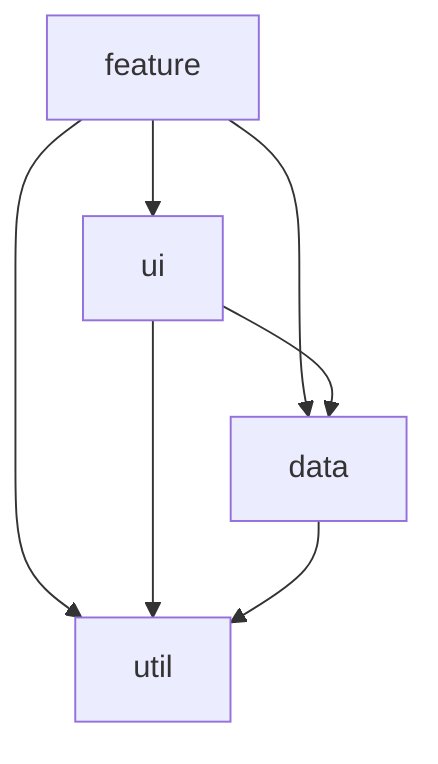
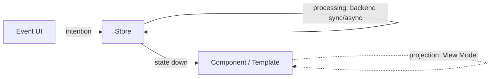
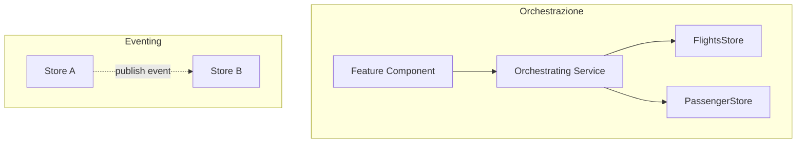

# 08 · Sustainable Architectures for Modern Angular
> 📖 cap.8 · pp.231-253 — *Modern Angular* v2.0.0

Le soluzioni enterprise devono restare **manutenibili nel lungo periodo**. Il capitolo raccoglie approcci architetturali collaudati: aspetti statici e dinamici, pattern e tecniche, e soprattutto come **far rispettare** l'architettura definita (enforcing via linting). Tre blocchi: come tagliare il sistema in **verticali**, come strutturarli (Architecture Matrix + modulith con Sheriff/Detective) e come collocare i **lightweight store** dentro un flusso dati unidirezionale.

## Vertical Slicing — perché
> 📖 pp.231-232

Un'app enterprise va suddivisa in parti più piccole che evolvono separatamente: un cambiamento in una parte non deve generare problemi inattesi altrove. La soluzione è il **vertical slicing** — taglio *verticale* per **business domain**, in contrapposizione al *layering* orizzontale che separa per funzione tecnica. Ogni verticale è responsabile di un dominio (o di una parte ben definita di dominio) e implementa un set di use case correlati sullo **stesso modello di dominio**. I verticali devono sapere il meno possibile l'uno dell'altro, così che le modifiche in un'area non producano effetti collaterali altrove.

Benefici:
- **Low Coupling** — ogni verticale si sviluppa, testa e rilascia in modo il più indipendente possibile; le modifiche restano locali e si riducono le dipendenze tecniche e organizzative.
- **High Cohesion** — ciò che è correlato vive insieme; un cambiamento a uno use case avviene in un contesto coerente, senza attraversare più layer o team.
- **Conway's Law** — i sistemi riflettono le strutture di comunicazione dell'organizzazione. Definire i team in funzione dell'architettura desiderata (**Inverse Conway Maneuver**) evita attriti: idealmente **un team = un verticale** (o più), e **un verticale = un solo team**.
- **Team autonomi** — un verticale ben definito dà a un team responsabilità piena (funzionale e tecnica) → delivery unit indipendenti, ownership chiara, feedback più rapido.
- **Carico cognitivo ridotto** — chi lavora su un verticale coeso affronta un perimetro funzionale/tecnico ben delimitato → più focus, produttività e qualità.

## Trovare i confini (boundaries)
> 📖 pp.232-234

L'idea di verticalizzazione compare in **DDD** e nei **Self-Contained Systems (SCS)**, e oggi si usa per strutturare monoliti, micro servizi e [[18-micro-frontends|micro frontend]]. Lo **Strategic Design** di DDD offre un approccio sistematico: suddivide il sistema in **bounded context**, ciascuno col proprio domain model e responsabile di una parte specifica del dominio. La comunicazione tra contesti avviene con mezzi ben definiti: idealmente **eventing** (loose coupling), ma anche API per comunicazione diretta.

Per identificare i confini si guardano i **processi di business** e il **linguaggio** dei domain expert. Indicatori:
- **Language** — gli stessi termini con lo stesso significato in step diversi → stesso bounded context; stessi termini con **significati diversi** → contesti diversi.
- **Responsibilities** — responsabilità diverse portano spesso a termini e modelli diversi.
- **Pivotal Events** — punti di svolta decisivi nel processo (es. *flight booked*, *passenger checked-in*, *flight boarded*): difficili da annullare, ad alto impatto, spesso un **handover** verso un altro ruolo con un linguaggio diverso (dopo la prenotazione subentra la compagnia aerea, che vede il volo in modo diverso dal cliente). Metafora: i **cambi di scena** in un film — un pezzo di trama è concluso e le scene successive ci costruiscono sopra.

> [!warning]
> Le tre euristiche possono **contraddirsi**: nell'esempio del libro il bounded context che contiene *Check-in Luggage* cambia forma a seconda dell'euristica scelta (l'esempio è scelto apposta). Non deve preoccupare: in architettura **non esiste l'unica soluzione perfetta**, ci sono opzioni con conseguenze. L'architetto moderno non è il decisore ma chi garantisce che si prendano **decisioni consapevoli**, pesando le opzioni insieme a team e domain expert — e la prima decisione **non è scolpita nella pietra**: si raffina con il refactoring.

## Event Storming
> 📖 pp.234-236

Workshop interattivo nato nella community DDD che mette insieme domain expert, sviluppatori e UX designer per combinarne le conoscenze. Con **sticky note colorati** si visualizza il dominio passo passo, in ordine cronologico. Il focus sono i **domain event** (note arancioni): ognuno descrive il completamento di una sottoparte che influenza il processo successivo (es. *flight booked*, *passenger checked in*). Discutendo insieme gli eventi nasce in fretta un **modello visuale** comprensibile a tutti.

Il **Big Picture Event Storming** sviluppa la vista d'insieme → ideale per discutere i confini dei contesti. Legenda tipica:

| Elemento | Sticky | Significato |
|---|---|---|
| Events | arancione | domain event |
| Pivotal Events | arancione con suddivisione gialla verticale | punto di svolta |
| Swimlanes | suddivisioni gialle orizzontali | processi opzionali/paralleli |
| Milestones | note blu in alto | dividono il processo in poche sezioni |

Oltre ai pivotal event, anche le **swimlane** sono buoni candidati per i confini. Per approfondire singole parti del dominio si usano poi i **Process-oriented Event Storming**.

> [!tip]
> Meglio lavorare **on-site** (anche se nei libri si disegna a computer): il valore vero è la comunicazione. Le parti irrilevanti si sostituiscono con `...` (ellissi).

## Different Models & slicing nel frontend
> 📖 pp.236-237

Altra lezione chiave di DDD: **modelli diversi per contesti diversi**. La parola "flight" lo mostra — nel contesto *booking* è un'offerta vendibile (fare class, prezzo, disponibilità posti); nel contesto *boarding* è un processo operativo (gate, posto, stato di sicurezza). Forzare entrambi i significati in **un solo modello** produce campi irrilevanti e validazioni fragili. Tenerli separati è uno degli scopi principali dello strategic design e porta a **verticali disaccoppiati** che evolvono in modo indipendente. La riconciliazione tra contesti avviene spesso via **domain event** nel backend (es. Booking pubblica `TicketCancelled`, Boarding lo riceve e rimuove il passeggero dalla lista).

**Slicing nel frontend.** Nella maggior parte dei progetti lo slicing del frontend **rispecchia quello del backend** → low coupling, high cohesion, allineamento dei team, autonomia, carico cognitivo ridotto. Ma a volte si sceglie deliberatamente uno slicing diverso (es. backend con molti calcoli complessi e frontend semplice; oppure frontend che gestisce workflow fatti di azioni implementate in contesti backend diversi). In quei casi serve **tradurre** il linguaggio del backend in quello del frontend (o del singolo slice frontend): pattern elegante è il **Backend for Frontend (BFF)** — fisicamente nel backend ma **logicamente parte del frontend** e (idealmente) sotto responsabilità del team frontend. Oltre alla traduzione tra bounded context offre anche caching, security e monitoring.

## Structuring Verticals — Architecture Matrix
> 📖 pp.238-239

Per implementare i verticali si suddividono i domini in **moduli** secondo una **Architecture Matrix** (punto di partenza tipico, da adattare al progetto). Righe = domini, colonne/layer = categorie di modulo. **Ogni cella = un modulo nel codice.** Categorie suggerite da Nrwl (in origine per le librerie):

| Categoria | Contenuto | Comunica con il backend? |
|---|---|---|
| **feature** | use case con **smart component** (poco riusabili, focalizzati su una singola feature); parlano col backend, tipicamente via store o service | sì |
| **ui** | **dumb/presentational component** riusabili (design system, componenti tecnici generali come un `ticket`); comunicano solo via properties & events, senza domain knowledge | no |
| **data** | domain model (vista client) + service che ci operano (validazione, backend, state management con i relativi view model) | sì |
| **util** | helper generici: logging, auth, lavoro sulle date | — |

L'area **shared** offre codice per tutti i domini: deve contenere soprattutto codice **tecnico** (il codice domain-specific sta nei singoli domini). Quindi la maggior parte di `ui`/`util` sta in `shared`, mentre `feature`/`data` stanno nei singoli domini.

Due regole semplici ma efficaci basate sulla matrice:
1. **Ogni dominio comunica solo con i propri moduli** (eccezione: `shared`, accessibile da tutti).
2. **Ogni modulo accede solo ai layer più in basso** nella matrice (ogni categoria diventa un layer).



> [!warning]
> Non condividere troppo via `shared` e via moduli `util`. Un sistema che condivide gran parte del codice finisce con **molto coupling** e mina le idee stesse di vertical slicing e layering. Entrambe le regole servono proprio a disaccoppiare ed **evitare cicli**.

> [!tip]
> La matrice è una **reference architecture**: alcuni team riducono layer e regole, altri ne aggiungono; il layer `data` a volte si chiama `domain` o `state`.

## Feature-Local Source Code (VSA)
> 📖 pp.239-241

Combinare verticali e layer può **spargere** il codice di un singolo use case su più moduli/cartelle → più carico cognitivo, meno coesione. La **Vertical Slice Architecture (VSA)** di Jimmy Bogard usa il **feature slicing**: tutto il codice di una feature sta in **un solo posto**. Tradotto al frontend, un feature module include anche i dumb component, gli store e i service di accesso al backend → alta coesione, basso carico cognitivo (ciò che cambia insieme sta insieme).

Il feature slicing funziona al meglio quando **tutti i building block** (model e data access compresi) sono locali alla feature e non riusati altrove. In pratica però feature affini condividono linguaggio, modello, stato e data access; inoltre i verticali aiutano l'allineamento con la struttura dei team. Per questo il feature slicing si **combina** con il vertical slicing per dominio: si parte con building block feature-local (dumb component, service, store) e, **quando** servono in altre feature, li si **promuove** al layer `ui` o `data` del dominio.

> [!warning]
> La VSA richiede un team **esperto** che sappia *quando* è il momento di refactorare. Applicata bene: building block **as local as possible, as global as necessary**. Nell'app d'esempio molti store sono feature-local e ci sono persino dumb component feature-local (`PassengerCard`, `LuggageCard`): questo **aggira** le regole del layering, ma una singola feature dev'essere abbastanza semplice da capire e refactorare on demand.

## Implementation Options
> 📖 pp.241-242

Due modi popolari per tradurre la matrice in codice:
- **Modulith** ("Modular Monolith") — app monolitica strutturata in moduli, **stessa codebase**, deploy unico. Confini imposti via **linting**. Migliore quando ci sono **uno o pochi team**: confini garantiti ma condivisione facile, refactoring sull'intera codebase, impatto delle modifiche visibile subito (es. se rompi qualcosa in un altro modulo).
- **Micro Frontend** — codebase diverse, deploy indipendente → disaccoppiamento più forte ma condivisione più difficile; tecnicamente app diverse presentate come un unico sistema. Aumentano l'autonomia dei team e permettono **stack tecnologici diversi** — utili con molti team su un sistema large-scale per anni. → [[18-micro-frontends|cap.18]].

Il resto del capitolo implementa un **modulith** con Angular.

## Implementing a Modulith — struttura
> 📖 pp.242-243

Modo diretto: tradurre la matrice in **cartelle**. Ogni dominio una cartella, con una sottocartella per modulo; il nome del modulo è **prefissato con la categoria** → a colpo d'occhio si vede dove sta nella matrice.

```text
src/app/domains
├── checkin
│   ├── data
│   └── feature-checkin
├── luggage
│   ├── data
│   └── feature-luggage
├── shared
│   ├── ui-common
│   ├── ui-forms
│   ├── util-auth
│   └── util-common
└── ticketing
    ├── data
    ├── feature-booking
    ├── feature-next-flights
    └── ui
```

Dentro i moduli, i soliti building block Angular: component, directive, pipe, service.

## Information Hiding
> 📖 p.243

Buona pratica: **nascondere i dettagli implementativi** di un modulo. I file privati si cambiano liberamente; quelli esposti vanno mantenuti con cura per evitare breaking change. Un feature module potrebbe esporre **solo le proprie route** — i consumer non assumono nulla sull'implementazione dietro le route, che resta modificabile.

Modo tradizionale JS: **public API via barrel file** (`index.ts`) che ri-esporta i costrutti pubblici.

```ts
// index.ts
export * from './flight-booking.routes';
```

> [!warning]
> I barrel hanno due svantaggi: (1) è noioso ri-esportare tutti i costrutti pubblici in `index.ts`; (2) **rompono tree-shaking e lazy loading** — a runtime si caricano anche costrutti non necessari nascosti dietro lo stesso barrel.

Approccio **convention-based preferito** (barrel-less): tutti i costrutti privati in una cartella con un nome speciale, `internal`. Gli altri moduli non devono accedere a `internal` (lo si fa rispettare con **Sheriff**).

```text
src/app/domains/checkin/data
├── internal
│   ├── confirmations.ts
│   └── validation.ts
├── checkin-info.ts
└── passenger-info.ts
```

## Enforcing con Sheriff
> 📖 pp.244-246

L'architettura poggia su tre convenzioni:
- i moduli comunicano solo con moduli **dello stesso dominio** e con `shared`;
- i moduli comunicano solo con i moduli nei **layer sottostanti**;
- i moduli accedono solo alla **public interface** degli altri moduli.

**Sheriff** (open-source) le impone via **linting**: violazioni segnalate come errori in IDE (feedback istantaneo) e in console (automatizzabile in CI → blocca commit/merge non conformi). Servono due pacchetti: `@softarc/sheriff-core` (Sheriff vero e proprio) e `@softarc/eslint-plugin-sheriff` (il bridge verso eslint).

```bash
# core + bridge eslint
npm i @softarc/sheriff-core @softarc/eslint-plugin-sheriff -D
```

Il bridge va registrato nell'`eslint.config.js` nella root del progetto:

```js
// eslint.config.js (root)
const sheriff = require('@softarc/eslint-plugin-sheriff');

module.exports = defineConfig([
  // [...]
  {
    files: ['**/*.ts'],
    extends: [sheriff.configs.all],
  },
]);
```

Poi un `sheriff.config.ts` nella root (a mano o con `npx sheriff init`): si definiscono **tag** (categorie) per i moduli e **depRules** basate su quei tag.

```ts
// sheriff.config.ts
import { sameTag, SheriffConfig } from '@softarc/sheriff-core';

export const config: SheriffConfig = {
  enableBarrelLess: true,
  modules: {
    'src/app/domains/<domain>': {
      'feature-<name>': ['domain:<domain>', 'type:feature'],
      'ui-<name>': ['domain:<domain>', 'type:ui'],
      'data-<name>': ['domain:<domain>', 'type:data'],
      'util-<name>': ['domain:<domain>', 'type:util'],
      data: ['domain:<domain>', 'type:data'],
      ui: ['domain:<domain>', 'type:ui'],
      util: ['domain:<domain>', 'type:util'],
      ai: ['domain:<domain>', 'type:ai'],
    },
    'src/app/testing': ['testing'],
  },
  depRules: {
    root: '*',
    'domain:*': [sameTag, 'domain:shared'],
    'type:ai': ['type:feature', 'type:ui', 'type:data', 'type:util'],
    'type:feature': ['type:ui', 'type:data', 'type:util'],
    'type:ui': ['type:data', 'type:util'],
    'type:data': ['type:util'],
    'type:util': [],
    testing: '*',
    '*': ['testing'],
  },
};
```

- I **tag** si riferiscono ai **nomi di cartella**; `<domain>`/`<name>` sono placeholder. Una cartella sotto `src/app/domains/booking` che inizia per `feature-` riceve i tag `domain:booking` e `type:feature`.
- `domain:*` può dipendere da `sameTag` (stesso dominio) e da `domain:shared`. Le altre regole impongono che ogni layer veda solo i layer sottostanti.
- `root: '*'` → le cartelle non categorizzate nella root (es. la **shell** dell'app) accedono a tutto; regola analoga per `testing`.

> [!warning]
> Se la cartella di un modulo contiene un `index.ts`, Sheriff lo considera la **public API** e bypassarlo è un errore di lint. Con `enableBarrelLess: true` i barrel **non** sono richiesti: senza `index.ts`, i file in `internal` sono privati e tutto il resto è accessibile dall'esterno.

`npx sheriff list src/main.ts` mostra i tag assegnati alle cartelle — utile ma scomodo per il troubleshooting; per visualizzare meglio si usa **Detective**.

## Visualizing Dependencies con Detective
> 📖 pp.246-248

Per tenere d'occhio il progetto serve visualizzare moduli e dipendenze: lo fa l'open-source **Detective** (`@softarc/detective`).

```bash
npm i @softarc/detective
npx detective
```

Si selezionano le cartelle che rappresentano i moduli e Detective mostra un **dependency graph**. Tecnicamente le dipendenze sono **import tra file di moduli diversi**: cliccando un arco si vede il numero di import, e lo **spessore** dell'arco ne indica la quantità. Detective implementa anche **metodi di analisi forense** per scoprire pattern nascosti sulla salute della modularizzazione → [[19-forensic-architecture-analysis|cap.19]].

## Lightweight Path Mappings
> 📖 p.248

I **path mapping** evitano import relativi illeggibili:

```ts
// invece di
import { FlightClient } from '../../data';
// si usa
import { FlightClient } from '@flights42/ticketing/data';
```

L'import a tre parti riflette la posizione nella matrice: **workspace** (`@flights42`) + **dominio** (`ticketing`) + **modulo** (`data`). Basta un **singolo** mapping in `tsconfig.json` (root), indipendente dal numero di domini/moduli.

```jsonc
{
  "compileOnSave": false,
  "compilerOptions": {
    "baseUrl": "./",
    // [...]
    "paths": {
      "@flights42/*": ["src/app/domains/*"]
    }
  }
  // [...]
}
```

> [!warning]
> Dopo questa modifica **riavvia l'IDE** (es. VS Code) perché ne tenga conto.

## Lightweight Stores & architettura — Unidirectional Data Flow
> 📖 pp.249-250

Le app frontend moderne usano **più store fine-grained e leggeri**; a differenza del classico Redux, lo stato è **sparso** in più punti → dove metterli? quanto grandi? possono accedersi a vicenda?

Nei sistemi reattivi un cambiamento ne innesca un altro, e così via: cascate difficili da capire e mantenere. Il **flusso dati unidirezionale** previene questo: i dati scorrono in **una sola direzione** e per ogni evento (utente) esiste un percorso chiaro. Gli store sono ideali per implementarlo.



- Gli **eventi** (es. UI) mandano una **intention** allo store (qualcosa che l'utente o il sistema vuole ottenere): in Redux è un'*action*; con un service Angular o NgRx Signal Store significa **chiamare un metodo**.
- Lo store **processa** la intention (anche chiamando il backend, sync o async) e, finito il processing, **aggiorna lo stato**.
- I [[lightweight-store|signal]] fanno **scendere** il nuovo stato ai consumer (component/template), dove può essere proiettato in **View Model** specifici per la feature (es. flights with passengers vs passengers with flights).

> [!tip]
> La proiezione può stare **nello store** (proiezioni generali usate da più feature) o **nel component** (proiezioni molto specifiche, es. colore di sfondo di un flight in base allo stato). Il punto chiave: per ogni evento esiste un percorso ben definito — **su, a destra, giù** — quindi è facile ragionare sull'impatto delle modifiche.

## Dove mettere un Lightweight Store?
> 📖 pp.250-251

Sorprendentemente, i lightweight store stanno in **tutti i layer tecnici**:

- **Feature Layer** — a livello *component* (stato del singolo component) o *feature* (più component della stessa feature vi accedono, es. un wizard che delega a component diversi).
- **UI Layer** — anche i component UI hanno stato; alcuni ne hanno di esteso da condividere con i figli (es. uno scheduler sofisticato con più viste implementate da più component figli). Va gestito da uno store connesso al component. **Attenzione**: un component UI generale non deve accedere a uno store feature-specific (romperebbe la riusabilità).
- **Data Layer** — stato condiviso da più feature dello **stesso dominio**, **esposto** dal layer così che il feature layer vi acceda.
- **Util Layer** — di solito le util sono stateless (validazioni, calcoli su date), ma esistono util **stateful**: es. una libreria di auth (utente corrente) o di traduzione (testi).

Uno store a livello **component** è fornito dal component stesso ([[providers]]):

```ts
@Component({
  // [...],
  providers: [MyStore],
})
export class MyComp {
  // [...]
}
```

Questo lo rende disponibile anche ai figli e garantisce **un'istanza per istanza di component** — esattamente ciò che serve ai dumb component (più scheduler nella stessa pagina → ognuno con le proprie date). I service component-local e gli environment provider a livello di route sono già visti nel [[05-state-management-services-signals|cap.5]].

> [!tip]
> Se l'isolamento non serve, fornisci lo store a **root** con `{ providedIn: 'root' }`: il team Angular lo raccomanda per la grande maggioranza dei service.

> [!info] Angular 22+
> Nel resto del vault `@Injectable({ providedIn: 'root' })` si legge come [[service|@Service()]]: da Angular 22 il decoratore `@Service()` (auto-provided a root di default) è la forma idiomatica per i service. Il libro qui usa ancora `{ providedIn: 'root' }`; il comportamento è lo stesso.

## Granularità di uno Store
> 📖 p.251

Un lightweight store in Angular è **solo un service** → vale il **single-responsibility principle**. Spesso conviene spezzare uno slice in store più fine-grained: tipicamente **uno store per entità** usata nella feature, più uno o due per lo **stato UI**. Esempio dall'app: la feature *booking* ha `FlightsStore`, `FlightDetailStore`, `PassengerStore`, `PassengerDetailStore`.

## Comunicazione tra Store
> 📖 pp.252-253

Sparpagliando lo stato su più store/layer, uno use case spesso ha bisogno di stato da **più store** (es. una feature col proprio stato + lo user ID globale). Opzioni:

1. **Accesso diretto store-to-store** — il più semplice, ma crea **coupling** e può generare **cicli**. Accettabile *solo* se uno store di layer superiore **legge** da uno di layer inferiore (il layering previene i cicli).
2. **Service di orchestrazione** — un service combina più store ed è usato dai feature component. Nell'app, `SummaryStore` combina `FlightsStore` e `PassengerStore` per il summary component (flight + passenger selezionati).
3. **Eventing** — uno store pubblica un evento al cambio di stato, gli altri si sottoscrivono e si aggiornano. È la soluzione **più pulita** in termini di coupling (store disaccoppiati, niente cicli), ma aggiunge un livello di **indirezione** e complessità. Ripresa con l'**Event API** del [[09-ngrx-signal-store|cap.9]].



## Preventing Cycles, Redundancies & Inconsistencies
> 📖 p.253

Il **layering** della reference architecture + la regola "gli store non si accedono a vicenda" **previene i cicli**. Senza attenzione, store diversi possono diventare **ridondanti** e quindi **inconsistenti** — stesso rischio che si ha con slice feature indipendenti su uno store Redux.

- **Visualizzare lo stato** è vitale per intercettare il problema presto: i **Redux Dev Tools** (estensione Chrome/Firefox) servono a questo → uso con NgRx Signal Store nel [[09-ngrx-signal-store|cap.9]].
- **Eventing** per informare le altre parti dei cambiamenti così che aggiornino il proprio stato. In Redux l'eventing è nativo; per il Signal Store si aggiunge con **custom features**.

> [!tip]
> Cicli evitati dal layering + dalla regola "no accesso reciproco tra store"; ridondanza/inconsistenza tenute sotto controllo con **visualizzazione dello stato** ed **eventing**.

Collegamenti: [[lightweight-store]] · [[providers]] · [[service]] · [[05-state-management-services-signals]] · [[09-ngrx-signal-store]] · [[14-monorepos-libraries]] · [[18-micro-frontends]] · [[19-forensic-architecture-analysis]]

## 🔁 Ripasso lampo

**1.** Differenza tra vertical slicing e horizontal layering? Cosa si intende per "verticale"?
> [!success]- Risposta
> Il **vertical slicing** taglia il sistema per **business domain**: ogni verticale è responsabile di un dominio (o parte di esso) e implementa use case correlati sullo **stesso domain model**. Il **layering orizzontale** separa invece per **funzione tecnica**. I due si combinano: i verticali danno l'ordine per dominio, i layer (feature/ui/data/util) l'ordine tecnico dentro ciascun verticale.

**2.** Quali sono le tre euristiche per trovare i boundaries e cosa fai quando si contraddicono?
> [!success]- Risposta
> **Language** (stessi termini, stesso significato → stesso contesto; significato diverso → contesti diversi), **Responsibilities** (responsabilità diverse → modelli diversi) e **Pivotal Events** (punti di svolta decisivi, spesso handover a un altro ruolo). Quando si contraddicono non c'è la soluzione perfetta: si prende una **decisione consapevole** pesando le conseguenze insieme a team e domain expert, sapendo che non è scolpita nella pietra e si può raffinare con il refactoring.

**3.** Cosa rappresentano le quattro categorie della Architecture Matrix (feature/ui/data/util) e quali due regole di dipendenza le governano?
> [!success]- Risposta
> **feature** = use case con smart component che parlano col backend; **ui** = dumb/presentational component riusabili (solo properties & events); **data** = domain model lato client + service (validazione, backend, state management/view model); **util** = helper generici (logging, auth, date). Regole: (1) ogni dominio comunica solo con i propri moduli + `shared`; (2) ogni modulo accede solo ai **layer sottostanti** nella matrice. Servono a disaccoppiare ed evitare cicli.

**4.** Barrel `index.ts` vs convenzione `internal/`: pro e contro? Cosa fa `enableBarrelLess: true` in Sheriff?
> [!success]- Risposta
> Il **barrel** (`index.ts`) ri-esporta la public API, ma è noioso da mantenere e **rompe tree-shaking/lazy loading** (carica anche costrutti non usati dietro lo stesso barrel). La convenzione **`internal/`** (barrel-less) mette i costrutti privati in quella cartella e lascia pubblico tutto il resto, senza ri-esportazioni. `enableBarrelLess: true` dice a Sheriff di **non richiedere** barrel: senza `index.ts`, è privato solo ciò che sta in `internal/`. Se invece un `index.ts` esiste, Sheriff lo tratta come public API e bypassarlo è errore di lint.

**5.** A cosa servono Sheriff e Detective, e in cosa differiscono?
> [!success]- Risposta
> **Sheriff** *impone* l'architettura via **linting**: definisci tag per i moduli e `depRules`, e le violazioni diventano errori in IDE e console (automatizzabili in CI). **Detective** *visualizza* moduli e dipendenze come **dependency graph** (numero/spessore degli import) e offre metodi di analisi forense. In breve: Sheriff fa rispettare le regole, Detective ti fa vedere com'è fatta davvero la modularizzazione.

**6.** Cos'è il flusso dati unidirezionale e perché rende il sistema più facile da ragionare?
> [!success]- Risposta
> I dati scorrono in **una sola direzione**: un evento manda una **intention** allo store (chiamando un metodo), lo store **processa** e **aggiorna lo stato**, i signal fanno **scendere** il nuovo stato ai component (eventualmente proiettato in view model). Per ogni evento c'è un percorso ben definito — **su, a destra, giù** — che evita le cascate di cambiamenti reattivi e rende prevedibile l'impatto delle modifiche.

**7.** In quali layer può stare un lightweight store, e quando usi `{ providedIn: 'root' }` invece di `providers: [...]` sul component?
> [!success]- Risposta
> In **tutti i layer** (feature, ui, data, util) — anche i component UI hanno stato. Usi `providers: [Store]` sul component quando ti serve **un'istanza per istanza di component** (es. dumb component come uno scheduler ripetuto in pagina, ognuno col proprio stato), perché così lo store è locale a quel component e ai suoi figli. Negli altri casi, se l'isolamento non serve, fornisci lo store a **root** (`{ providedIn: 'root' }`, ovvero `@Service()` da Angular 22): è il default raccomandato per la maggior parte dei service.

**8.** Tre modi per far comunicare due store: quale è il più pulito sul coupling e quale rischio principale evita il layering?
> [!success]- Risposta
> **Accesso diretto** store-to-store (semplice ma crea coupling/cicli, ok solo se un layer superiore *legge* da uno inferiore), **service di orchestrazione** (combina più store per i feature component, es. `SummaryStore`) ed **eventing** (uno store pubblica, gli altri si sottoscrivono). L'**eventing** è il più pulito sul coupling (store disaccoppiati, niente cicli) ma aggiunge indirezione. Il **layering** + la regola "no accesso reciproco tra store" evita i **cicli**.

**In sintesi:**
- **Vertical slicing**: struttura l'app per **business domain** (verticali con modello condiviso) → low coupling, high cohesion, ownership chiara (Inverse Conway Maneuver), meno carico cognitivo.
- I **boundaries** emergono da processi, linguaggio, responsabilità e **pivotal event**; l'**Event Storming** li rende visibili. Nel frontend lo slicing spesso rispecchia il backend, salvo usare un **BFF** per tradurre.
- La **Architecture Matrix** (feature/ui/data/util + shared) dà struttura e due regole di dipendenza; un **modulith** le impone con information hiding (`internal/` barrel-less) + linting (**Sheriff**) e le rende trasparenti con la visualizzazione (**Detective**) e i **path mapping** a tre parti.
- I **lightweight store** sono semplici service: collocati dove vive lo stato, tenuti piccoli per responsabilità, coordinati via **orchestrazione** o **eventing** per evitare cicli, ridondanze e inconsistenze, dentro un **flusso dati unidirezionale**.
