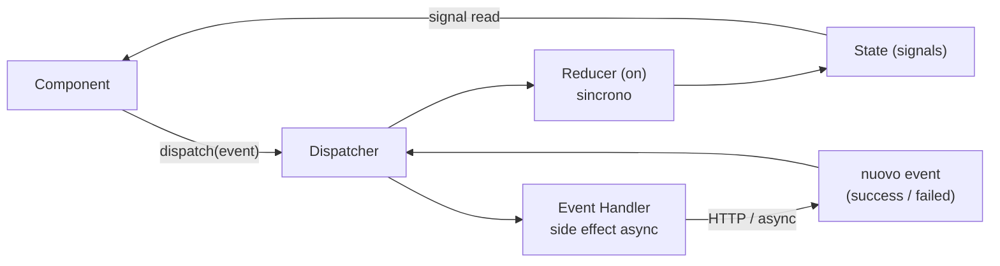

# 09 · State Management with NgRx Signal Store
> 📖 cap.9 · pp.254-297 — *Modern Angular* v2.0.0

Una SPA mantiene lo stato mentre l'utente cambia rotta: dati caricati via HTTP, ma anche interazioni UI (filtri impostati, elementi selezionati). Implementare lo [[glossario#store|store]] (il contenitore centralizzato dello stato) a mano (vedi [[05-state-management-services-signals|cap.5]]) funziona, ma produce **molto codice ripetitivo**: esporre signal read-only per i consumer ma scrivibili dall'interno, integrare le resource per il caricamento, gestire stati di errore e di loading. Il **NgRx SignalStore** (`@ngrx/signals`) elimina gran parte di questo boilerplate ed è oggi la soluzione di state management più diffusa per Angular moderno, integrandosi nativamente con i [[signal]].

In tutto il capitolo lo store è un **service** che incapsula lo stato di una feature, composto da una pila di **features** (`withState`, `withComputed`, ...) passate a `signalStore()`. Alcune features arrivano dalla community via NgRx Toolkit (`@angular-architects/ngrx-toolkit`): `withResource`, `withDevtools`, `withMutations`.

> [!info] Angular 22+
> Le note Angular 22 di questo capitolo: i service usano il decoratore `@Service()` al posto di `@Injectable()` (vedi `FlightClient` nel listing della Mutation API e [[service]]), e la lettura del flight ID dal router sfrutta `withComponentInputBinding` con `input.required<number>()` (sezione *Reactive Methods*).

## A First SignalStore
> 📖 pp.254-262

Installazione: `npm i @ngrx/signals`. Lo store si crea con `signalStore()`. Il primo argomento (opzionale) configura il `providedIn`; tutti gli altri sono **features** che aggiungono funzionalità. Di solito la prima è `withState`, che definisce le proprietà di stato: ognuna diventa un signal **read-only per i consumer** ma aggiornabile dall'interno dello store.

```ts
// src/app/domains/ticketing/feature-booking/flight-search/flight-store.ts
import { computed, inject } from '@angular/core';
import { withResource } from '@angular-architects/ngrx-toolkit';
import {
  patchState,
  signalStore,
  withComputed,
  withMethods,
  withProps,
  withState,
} from '@ngrx/signals';
import { Flight } from '../../data/flight';
import { FlightClient } from '../../data/flight-client';

export const FlightStore = signalStore(
  { providedIn: 'root' },                  // omettere per provider manuale (componente/rotta)
  withState({
    from: 'Graz',
    to: 'Hamburg',
    basket: {} as Record<number, boolean>, // type assertion: TS non inferisce {} → Record
    delayInMin: 0,
  }),
  withProps([/* ... */]),
  withResource([/* ... */]),               // community (NgRx Toolkit): integra la Resource API
  withComputed([/* ... */]),
  withMethods([/* ... */]),
  withHooks([/* ... */]),
);
```

In alternativa alla type assertion si può tipizzare esplicitamente lo stato con `withState<FlightSearchState>({...})`, dichiarando prima l'interfaccia. Il libro preferisce la prima opzione quando non serve un tipo separato altrove, perché è meno verbosa.

**`withProps`** aggiunge proprietà qualunque allo store, anche non-signal: service iniettati, oppure `Subject`/`Observable` per rappresentare eventi. Riceve una funzione che riceve lo store e ritorna le proprietà. Il prefisso `_` rende il membro **privato**: non è solo convenzione, il type system del NgRx esclude i membri `_*` dal tipo esposto ai consumer (vale per tutte le features, non solo `withProps`).

```ts
withProps(() => ({
  _flightClient: inject(FlightClient),     // privato: invisibile ai consumer
})),
```

> [!tip]
> La **stessa feature può comparire più volte** nella pila — utile per definire proprietà che dipendono da altre già definite (es. un `withProps` crea `_filterChanged: new Subject<FlightFilter>(...)`, un secondo `withProps` espone `filterChanged: store._filterChanged.asObservable()`). In alternativa, una sola funzione con `return` esplicito che dichiara più proprietà insieme.

**`withResource`** (community) integra la [[resource|Resource API]]: la funzione proietta lo store in un oggetto di resource. Non importa quale implementazione (`httpResource`, `rxResource`): qui la crea `FlightClient.findResource(from, to)` ricevendo i signal `from` e `to` — quando cambiano, la resource si ri-triggera.

```ts
withResource(
  (store) => ({
    flights: store._flightClient.findResource(store.from, store.to),
  }),
  { errorHandling: 'previous value' },     // 'previous value' | 'undefined value' | 'native'
),
```

`errorHandling` cambia il comportamento di default (leggere `value` in stato di errore lancia un'eccezione): `'previous value'` mantiene l'ultimo valore senza lanciare, `'undefined value'` mette `undefined` (e lo aggiunge al tipo della resource), `'native'` ripristina il comportamento nativo di Angular. Il nome della resource fa da **prefisso** ai membri generati: `flightsValue`, `flightsIsLoading`, `flightsError`, `flightsStatus`, il metodo `flightsHasValue()` e il metodo privato `_flightsReload()`.

**`withComputed`** aggiunge [[computed|computed signals]] derivati dagli altri signal (la controparte dei *selector* dello store NgRx classico; spesso sono **View Model** nella forma utile al componente).

```ts
withComputed((store) => ({
  flightsWithDelays: computed(() =>
    toFlightsWithDelays(store.flightsValue(), store.delayInMin()),
  ),
})),
```

`toFlightsWithDelays` è una funzione **pura** che ricalcola gli orari sommando il ritardo, senza mutare l'array originale (ritorna `[newFlight, ...flights.slice(1)]`).

**`withMethods`** definisce metodi che aggiornano lo stato in modo controllato. Le modifiche passano per `patchState(store, ...)`, chiamabile **solo dentro lo store**, con un **partial state** (aggiorna solo le proprietà fornite) o una **updater function** `(state) => partial` (quando il nuovo stato dipende dal vecchio). Lo stato va trattato come **immutabile**: si crea un nuovo oggetto, mai una mutazione in place.

```ts
withMethods((store) => ({
  updateFilter(from: string, to: string): void {
    patchState(store, { from, to });               // partial: cambia from/to → triggera la resource
  },
  updateBasket(flightId: number, selected: boolean): void {
    patchState(store, (state) => ({                // updater: nuovo basket immutabile
      basket: { ...state.basket, [flightId]: selected },
    }));
  },
  reload(): void {
    store._flightsReload();                         // triggera direttamente la resource
  },
  delay(): void {
    patchState(store, (state) => ({ delayInMin: state.delayInMin + 15 }));
  },
})),
```

Si nota l'interazione tra metodi e features: `updateFilter` cambia `from`/`to` → la resource ricarica; `delay` aggiorna `delayInMin` → il `computed` `flightsWithDelays` si ricalcola.

**`withHooks`** registra funzioni del ciclo di vita: `onInit` (inizializzazione dello store, es. caricamento iniziale) e `onDestroy` (cleanup).

```ts
withHooks((store) => ({
  onInit() { console.log('FlightStore initialized', store.from(), store.to()); },
  onDestroy() { console.log('FlightStore destroyed', store.from(), store.to()); },
})),
```

**Consumare lo store**: si inietta con [[inject]], si leggono i signal, si delega ai metodi per gli aggiornamenti.

```ts
// src/app/domains/ticketing/feature-booking/flight-search/flight-search.ts
export class FlightSearch {
  private readonly store = inject(FlightStore);
  protected readonly filter = linkedSignal(() => ({   // copia scrivibile per il Signal Form
    from: this.store.from(),
    to: this.store.to(),
  }));
  protected readonly filterForm = form(this.filter);  // Signal Form sulla copia
  protected readonly flights = this.store.flightsWithDelays;
  protected readonly isLoading = this.store.flightsIsLoading;
  protected readonly error = this.store.flightsError;
  protected readonly basket = this.store.basket;

  protected search(): void {
    this.store.updateFilter(this.filter().from, this.filter().to);
  }
}
```

> [!tip]
> Si vede il **flusso dati unidirezionale** del [[08-sustainable-architectures|cap.8]]: l'intenzione dell'utente sale verso lo store via metodi (`updateFilter`); lo store fa il lavoro (carica via resource); il risultato scende ai componenti via signal (`flightsWithDelays`, `flightsIsLoading`), consumato in genere via data binding nel template.

Collegamenti: [[signal]] · [[computed]] · [[resource]] · [[inject]] · [[lightweight-store]] · [[05-state-management-services-signals]] · [[08-sustainable-architectures]].

## Inspecting the Store with the Redux DevTools
> 📖 pp.263-265

I **Redux DevTools** (estensione Chrome/Firefox) ispezionano lo stato e le sue transizioni nel tempo, incluso il **time-travel debugging** (puoi tornare indietro a uno stato precedente e "riavvolgere" la sequenza di cambiamenti per vedere come ci sei arrivato). Anche se SignalStore non implementa il pattern Redux, ci si collega con la feature `withDevtools` del NgRx Toolkit: la stringa passata è il nome del *branch* nell'albero DevTools (per distinguere più store).

```ts
import { withDevtools } from '@angular-architects/ngrx-toolkit';

export const FlightStore = signalStore(
  { providedIn: 'root' },
  // ...
  withDevtools('flight'),
);
```

**Disabilitarli in produzione.** Un primo approccio usa `isDevMode()`: a runtime sceglie tra `withDevtools` reale e lo stub `withDevToolsStub` (stessa API, no-op).

```ts
import { isDevMode } from '@angular/core';
import { withDevtools, withDevToolsStub } from '@angular-architects/ngrx-toolkit';

isDevMode() ? withDevtools('flight') : withDevToolsStub('flight'),
```

> [!warning]
> Il check `isDevMode()` è **a runtime**: i DevTools restano comunque nel bundle di produzione. Per escluderli serve un check a **compile-time**, basato su un valore costante. Si genera la coppia di file `environment.ts` / `environment.development.ts` con `ng generate environments` (la CLI sostituisce il primo col secondo in dev), si espone in ciascuno un membro `withDevtools` (rispettivamente `withDevtools` reale e `withDevToolsStub`), e un helper `withDevToolsForDebugMode(name)` chiama `environment.withDevtools(name)`. Nello store si usa `withDevToolsForDebugMode('flight')` al posto di `withDevtools`.

```ts
// src/environments/environment.ts        → produzione
export const environment = { withDevtools: withDevtools };
// src/environments/environment.development.ts → sviluppo
export const environment = { withDevtools: withDevToolsStub };

// src/app/domains/shared/util-common/with-dev-tools-for-debug-mode.ts
export function withDevToolsForDebugMode(name: string) {
  return environment.withDevtools(name);
}
```

## Mutations
> 📖 pp.266-271

Le resource caricano dati, ma Angular non offre una controparte per **modificarli**. Farlo a mano (HttpClient nei metodi) genera boilerplate per stati loading/error e per le chiamate sovrapposte. Il NgRx Toolkit fornisce la **Mutation API** (ispirata a React Query e a un proof-of-concept di Marko Stanimirović, lead di SignalStore), che ricalca la Resource API. Esistono `httpMutation` (cambi rappresentabili come richiesta HTTP) e `rxMutation` (cambi arbitrari che ritornano un Observable). Si aggiungono con `withMutations`.

```ts
// src/app/domains/ticketing/feature-booking/flight-edit/flight-detail-store.ts
withMutations((store) => ({
  saveFlight: httpMutation<Flight, Flight>({   // <tipo argomento, tipo ritorno>
    request: (flight: Flight) => ({
      url: `[...]/flight/${flight.id}`,
      method: 'PUT',
      body: flight,
    }),
    operator: concatOp,                        // semantica delle chiamate sovrapposte
    onSuccess(result, param) {
      store._snackBar.open('Flight updated successfully', 'OK', { duration: 3000 });
    },
    onError(error, param) {
      store._snackBar.open('Failed to update flight', 'OK', { duration: 5000 });
    },
  }),
})),
```

I due type parameter sono il tipo dell'argomento e il tipo del valore di ritorno (qui entrambi `Flight`). La mutation aggiunge allo store il metodo `saveFlight` **più** i signal di stato `saveFlightIsPending` e `saveFlightError`, senza boilerplate. Il `MatSnackBar` di Angular Material si inietta con `withProps`. L'`operator` riflette gli operatori di flattening di RxJS (quelli che decidono come gestire più chiamate sovrapposte: `switchMap`, `mergeMap`, `concatMap`, `exhaustMap`):

- `switchOp` — annulla la chiamata precedente quando ne parte una nuova (conta solo l'ultima).
- `mergeOp` — esegue tutte le chiamate in parallelo, indipendenti.
- `concatOp` — le accoda ed esegue una alla volta. **Default**: preserva l'ordine, evita [[glossario#race-condition|race condition]] (due chiamate che finiscono in ordine imprevedibile, con la più vecchia che rischia di sovrascrivere la più recente), non annulla nulla.
- `exhaustOp` — ignora le nuove finché una è in corso (anti doppio-submit).

> [!tip]
> Come per la resource, conviene spostare i dettagli di protocollo nel `FlightClient`: un metodo `createSaveMutation(options)` che fa lo spread di `options` (con `onSuccess`/`onError` definiti dallo store) dentro `httpMutation`, fissando lì `request` e `operator`. Lo store delega: `saveFlight: store._flightClient.createSaveMutation({ onSuccess, onError })`. Nota: il `FlightClient` è un `@Service()` (Angular 22 — al posto di `@Injectable()`).

**Consumare la mutation.** Il metodo `saveFlight` accetta un `Flight` e ritorna una `Promise` con il risultato in uno di tre stati: `success` (contiene il valore salvato in `result.value`), `error` (oggetto errore in `result.error`), `cancelled` (possibile con `switchOp`/`exhaustOp`).

```ts
// src/app/domains/ticketing/feature-booking/flight-edit/flight-edit.ts
export class FlightEdit {
  private readonly store = inject(FlightDetailStore);
  protected readonly flight = linkedSignal(() => normalizeFlight(this.store.flightValue()));
  // Proprietà aggiunte da withMutations:
  protected readonly isPending = this.store.saveFlightIsPending;
  protected readonly error = this.store.saveFlightError;
  protected readonly flightForm = form(this.flight);
  protected readonly isDisabled = computed(
    () => this.flightForm().invalid() || this.isPending(),
  );

  protected async save(): Promise<void> {
    const result = await this.store.saveFlight(this.flight());
    if (result.status === 'success')      { /* result.value */ }
    else if (result.status === 'error')   { /* result.error */ }
    else                                  { /* cancelled */ }
  }
}
```

Anche qui un [[linked-signal|linkedSignal]] fornisce un signal scrivibile per il Signal Form; `normalizeFlight` adatta il formato della data perché sia usabile con `<input type="datetime-local">`.

**`rxMutation`.** Dal punto di vista di store e componente è **identica** (stessi metodo e signal di stato), ma invece di `request` riceve una `operation` che ritorna un `Observable`:

```ts
createSaveRxMutation(options: Partial<RxMutationOptions<Flight, Flight>>) {
  return rxMutation({
    ...options,
    operation: (flight: Flight) => this.update(flight),   // delega all'HttpClient → Observable
    operator: concatOp,
  });
}
// FlightClient.update() esegue this.http.put<Flight>(url, flight, { headers }) e ritorna l'Observable
```

## Reactive Methods
> 📖 pp.272-277

Lo SignalStore offre due **reactive methods**, ri-eseguiti automaticamente quando i valori passati cambiano. Sono come un [[effect]] esplicito che reagisce **solo** ai valori in ingresso, non agli altri signal usati al loro interno.

**`rxMethod<T>`** (dall'entry point `@ngrx/signals/rxjs-interop`) sfrutta la potenza di RxJS: riceve un Observable, lo fa passare per gli operator forniti e lo ritorna. Si sottoscrive da solo (fa lui la `subscribe`, non devi farla tu), quindi per lavorare col risultato serve un `tap` dentro la pipe. Il chiamante può passare un valore *plain*, un `Signal<T>` o un `Observable<T>`: per signal/observable, ogni nuovo valore attraversa la pipe.

```ts
protected readonly fn = rxMethod<number>((number$) =>
  number$.pipe(
    map((num) => num * 2),
    tap((result) => console.log('Result:', result)),
  ),
);
// uso nel constructor:
const value = signal(0);
this.fn(value);                            // traccia il signal
value.set(100); setTimeout(() => value.set(200), 1000);
// output: Result: 200, poi Result: 400 — il valore iniziale 0 NON passa (glitch-free, cap.3)
```

Esempio realistico nel `PassengerStore`: `updateFilter` è un `rxMethod` che fa `patchState` (loading), poi `switchMap` verso il client, con `tap`/`catchError`.

```ts
updateFilter: rxMethod<PassengerFilter>(
  pipe(
    tap((filter) => patchState(store, {
      name: filter.name, firstName: filter.firstName, isLoading: true, error: null,
    })),
    switchMap((filter) =>
      store._passengerClient.find(filter.name, filter.firstName).pipe(
        tap((passengers) => patchState(store, { passengers, isLoading: false })),
        catchError((error) => {
          patchState(store, { error, isLoading: false });
          return of([]);
        }),
      ),
    ),
  ),
),
```

Per la combinazione `tap` + `catchError`, il package `@ngrx/operators` offre il comodo operatore `tapResponse`:

```ts
import { tapResponse } from '@ngrx/operators';

tapResponse({
  next:  (passengers) => patchState(store, { passengers, isLoading: false }),
  error: (error)      => patchState(store, { error, isLoading: false }),
}),
```

> [!warning]
> `rxMethod` usa internamente un `effect` → va chiamato in un **injection context**. Il cleanup è automatico via il `DestroyRef` del chiamante (niente unsubscribe manuale); si può passare un injector diverso come secondo parametro, o chiamare `.destroy()` sull'oggetto ritornato. Nota la differenza d'uso: nel `constructor` passa il **signal** (`updateFilter(this.filter)` → tracciato, la pipe rigira a ogni cambio), in `search` passa il **valore corrente** (`updateFilter(this.filter())` → una sola esecuzione).

**`signalMethod<T>`** (da `@ngrx/signals`) accetta anch'esso valore o `Signal<T>`, ma **non** usa Observable: è una funzione ordinaria ri-eseguita per ogni nuovo valore.

```ts
connectFlightId: signalMethod<number>((id) => {
  patchState(store, { flightId: id });
}),
```

> [!info] Angular 22+
> Nel `FlightEdit`, l'`id` arriva dal router come `input.required<number>()` perché la rotta è configurata con `withComponentInputBinding`. È quindi un `InputSignal<number>`: nel costruttore basta `this.store.connectFlightId(this.id)` e lo store reagisce a ogni cambio di `id` (es. navigazione a un altro volo), senza sottoscrivere `ActivatedRoute.paramMap`.

> [!warning]
> A differenza di RxJS (operatori di flattening) e della Resource API (semantica `switchMap`), `signalMethod` **non ha alcun meccanismo per le chiamate sovrapposte**. Va bene quando si limita a un `patchState` che triggera a sua volta una resource (come `connectFlightId`).

## Entity Management and Normalization
> 📖 pp.278-286

Lo stato è spesso fatto di **[[glossario#entity-normalization|entità]]** (voli, passeggeri — gli oggetti-dominio identificati da un ID). La feature `withEntities` (da `@ngrx/signals/entities`) riduce il boilerplate e incoraggia best practice come la normalizzazione.

```ts
import { setAllEntities, withEntities } from '@ngrx/signals/entities';

export const NextFlightsStore = signalStore(
  { providedIn: 'root' },
  withState({ isLoading: false, error: null as string | null }),
  withEntities<Flight>(),                       // definisce l'entità Flight
  withProps(() => ({ _ticketClient: inject(TicketClient) })),
  withMethods((store) => ({
    load(): void {
      patchState(store, { isLoading: true, error: null });
      store._ticketClient.find().subscribe({
        next: (flights) =>
          patchState(store, setAllEntities(flights), { isLoading: false }), // più updater insieme
        error: (error) =>
          patchState(store, { error: error.message || 'Error loading flights', isLoading: false }),
      });
    },
  })),
);
```

Gli **updater** pronti all'uso si passano a `patchState`: `addEntity`/`addEntities` (in coda), `prependEntity`/`prependEntities` (in testa), `setEntity`/`setEntities`/`setAllEntities`, `updateEntity`/`updateEntities`/`updateAllEntities`, `upsertEntity`/`upsertEntities` (update se l'ID esiste, altrimenti insert), `removeEntity`/`removeEntities`/`removeAllEntities`. Il consumer legge il signal `entities` (array delle entità).

**Entity Maps.** Internamente `withEntities` non tiene un array ma un **dizionario** `entityMap` (ID → entità) più un signal `ids` (lista ordinata di ID). `entities` è un `computed` derivato dai due (per riordinare basta cambiare l'ordine in `ids`). La forma keyed permette agli updater di accedere alle entità per ID e abilita la normalizzazione.

**ID.** Di default gli updater assumono una proprietà `id`. Se l'identificatore ha altro nome, si specifica `selectId` direttamente nell'updater, oppure — meglio — in una `entityConfig` riusabile:

```ts
import { entityConfig, setAllEntities, withEntities } from '@ngrx/signals/entities';

const flightConfig = entityConfig({
  entity: type<Flight>(),
  selectId: (flight) => flight.flightId,        // ID non chiamato 'id'
});
// withEntities(flightConfig) + patchState(store, setAllEntities(flights, flightConfig))
```

**Più entità nello stesso store.** Si dà un `collection` nella config: i signal generati vengono **prefissati** col nome della collection (es. `flightEntities`, `flightEntityMap`, `flightIds`) — proprietà statiche, tipizzate dal type system, non dinamiche.

```ts
const flightConfig    = entityConfig({ entity: type<Flight>(),    collection: 'flight' });
const passengerConfig = entityConfig({ entity: type<Passenger>(), collection: 'passenger' });
// withEntities(flightConfig), withEntities(passengerConfig)
```

> [!tip]
> Spesso è meglio **splittare le collection in store separati** (uno store per tipo di entità per feature, più magari uno per la UI state) anziché ammassarle in un unico store: con gli store leggeri come SignalStore è la prassi, e tiene gli store piccoli e a responsabilità distinta.

**Normalizzazione.** Mettere strutture annidate dal backend direttamente nello store porta a **duplicati** (lo stesso passeggero su più voli) e a stati incoerenti, e rende difficile rimodellare i dati per le varie viste. Come nei DB relazionali si normalizza: ogni tipo di entità nella sua collection, i riferimenti solo via ID. Una sola istanza per entità, ricomponibile (joinabile, come una *join* SQL che riunisce dati collegati) per ogni vista via `computed`.

```ts
export type FlightState     = Flight    & { passengerIds: number[] };
export type PassengerState  = Passenger & { flightIds: number[] };

withComputed((store) => ({
  flightsWithPassengers: computed<FlightsWithPassengers[]>(() =>
    store.flightEntities().map((f) => ({
      ...f,
      passengers: f.passengerIds.map((p) => store.passengerEntityMap()[p]),
    })),
  ),
  passengersWithFlights: computed<PassengersWithFlights[]>(() =>
    store.passengerEntities().map((p) => ({
      ...p,
      flights: p.flightIds.map((f) => store.flightEntityMap()[f]),
    })),
  ),
})),
```

I dati si normalizzano dal backend (se controllabile, o con un BFF — *Backend For Frontend*, un servizio intermedio che adatta i dati alle esigenze del frontend) oppure lato client dopo il load (con `map`/`reduce`). Si può **saltare** la normalizzazione se l'app legge soltanto i dati o aggiorna sempre l'intera struttura annidata.

## Event API: Flux and Redux
> 📖 pp.287-292

L'**Event API** porta il pattern **Flux** / Redux (il modello a flusso unidirezionale in cui lo stato cambia solo in risposta a eventi, mai con scritture dirette; è quello dello store NgRx "Global") nel mondo dei Signal Store, per **disaccoppiare** gli store dai loro consumer tramite eventi.

> [!info] Mental model
> Quando una feature usa più store, o uno store serve più feature, crescono complessità, rischio di incoerenze e cicli difficili da debuggare (se gli store si notificano a vicenda i cambiamenti). Invece di chiamare i metodi degli store, i componenti **[[glossario#dispatch|dispatchano]] eventi** (cioè "lanciano" un evento nel sistema, senza sapere chi lo riceverà). Gli store registrano dei **[[glossario#reducer|reducer]]** (funzioni che, dato lo stato attuale e un evento, calcolano il nuovo stato) che dicono come aggiornare lo stato in reazione a eventi specifici: se l'evento li riguarda reagiscono, altrimenti lo ignorano. I componenti non conoscono la struttura interna degli store. I **reducer sono sempre sincroni**; per i side effect e l'async ci sono gli **event handler** (erano gli "effects" dell'NgRx Global, rinominati per non confonderli con l'`effect` di Angular): Observable che ricevono eventi e ne pubblicano altri col risultato — un ponte tra eventi. Poiché con SignalStore ci sono **più store** (non uno globale come in Redux), il pattern prevede un **dispatcher** che inoltra gli eventi a tutti gli store.



**Events.** Si definiscono in **event group** (`eventGroup`); ogni evento ha nome e tipo del payload. `source` indica l'origine (utile per il debug).

```ts
import { eventGroup } from '@ngrx/signals/events';
import { type } from '@ngrx/signals';

export const luggageEvents = eventGroup({
  source: 'Luggage Store',
  events: {
    loadLuggageTriggered: type<void>(),
    loadLuggageSucceeded: type<{ luggage: Luggage[] }>(),
    loadLuggageFailed:    type<{ error: string }>(),
  },
});
```

Pattern tipico per le operazioni async: tre eventi (trigger / success / error). Il team NgRx consiglia un `source` **fine-grained** (granulare, specifico anziché generico) che punti al consumer concreto (componente/service/store): es. `loadLuggageTriggered` in un gruppo `luggageOverviewEvents` con source `LuggageOverview` (usato dal componente per il trigger), e gli esiti in `luggageApiEvents` con source `LuggageApi` (usati dai reducer/handler dello store). Così si vede subito chi scatena cosa.

**Reducer** — feature `withReducer`; `on(event, fn)` collega un evento al reducer, che riceve il payload (tipizzato) e ritorna lo stato (partial, patchato sopra lo stato dello store).

```ts
import { withReducer, on } from '@ngrx/signals/events';

withReducer(
  on(luggageEvents.loadLuggageTriggered, () => ({ isLoading: true, error: null })),
  on(luggageEvents.loadLuggageSucceeded, ({ payload }) => ({ luggage: payload.luggage, isLoading: false })),
  on(luggageEvents.loadLuggageFailed,    ({ payload }) => ({ error: payload.error, isLoading: false })),
),
```

Si può associare un **array di eventi** allo stesso reducer: `on([eventA, eventB], () => ({ ... }))`.

**Event Handlers** — feature `withEventHandlers`; tramite il service `Events` ascoltano eventi (`_events.on(...)`) ed eseguono side effect, **emettendo nuovi eventi** col risultato (qui `mapResponse` da `@ngrx/operators`, scorciatoia di `map` + `catchError`).

```ts
import { Events, withEventHandlers } from '@ngrx/signals/events';
import { mapResponse } from '@ngrx/operators';
import { switchMap } from 'rxjs';

withProps(() => ({ _luggageClient: inject(LuggageClient), _events: inject(Events) })),
withEventHandlers((store) => ({
  loadLuggage$: store._events.on(luggageEvents.loadLuggageTriggered).pipe(
    switchMap(({ passengerId }) =>
      store._luggageClient.find(passengerId).pipe(
        mapResponse({
          next:  (luggage: Luggage[]) => luggageEvents.loadLuggageSucceeded({ luggage }),
          error: (error: unknown)     => luggageEvents.loadLuggageFailed({ error: String(error) }),
        }),
      ),
    ),
  ),
})),
```

**Dispatching Events.** I componenti non chiamano più i metodi dello store: dispatchano eventi col service `Dispatcher`. Per leggere lo stato accedono ancora direttamente allo store.

```ts
import { Dispatcher } from '@ngrx/signals/events';

export class LuggageOverview {
  private readonly store = inject(LuggageStore);
  private readonly dispatcher = inject(Dispatcher);
  protected readonly luggage = this.store.luggage;
  protected readonly selected = this.store.selected;
  constructor() {
    this.dispatcher.dispatch(luggageEvents.loadLuggageTriggered({ passengerId: 4711 }));
  }
}
```

In alternativa, gli **eventi self-dispatching** via `injectDispatch`: per ogni evento un metodo che lo dispatcha.

```ts
import { injectDispatch } from '@ngrx/signals/events';

private readonly dispatch = injectDispatch(luggageEvents);
constructor() { this.dispatch.loadLuggageTriggered({ passengerId: 4711 }); }
```

## Custom Features
> 📖 pp.293-296

Le **custom features** sono i blocchi riusabili condivisibili tra store. Anche `withResource`, `withDevtools`, `withEntities` e l'Event API sono custom features. Si definiscono con una **factory** che delega a `signalStoreFeature` — null'altro che una combinazione di altre features.

```ts
// src/app/domains/shared/util-common/call-state.feature.ts
import { computed } from '@angular/core';
import { signalStoreFeature, withComputed, withState } from '@ngrx/signals';

export type CallState = 'init' | 'loading' | 'loaded' | { error: string };

export function withCallState() {
  return signalStoreFeature(
    withState<{ callState: CallState }>({ callState: 'init' }),
    withComputed(({ callState }) => ({
      loading: computed(() => callState() === 'loading'),
      loaded:  computed(() => callState() === 'loaded'),
      error:   computed(() => {
        const state = callState();
        return typeof state === 'object' ? state.error : null;
      }),
    })),
  );
}
```

> [!tip]
> Per cambiare lo stato, meglio **non** aggiungere metodi con `withMethods` dentro la feature (rischio di conflitti tra features): si forniscono **updater** chiamabili con `patchState`, che incapsulano la struttura interna senza che il consumer la conosca.

```ts
export function setLoading(): { callState: CallState } { return { callState: 'loading' }; }
export function setLoaded():  { callState: CallState } { return { callState: 'loaded' }; }
export function setError(error: string): { callState: CallState } { return { callState: { error } }; }
```

**Usare** una custom feature = chiamare la factory nel `signalStore`. I suoi membri (proprietà, computed, updater) sono poi disponibili nello store e ai consumer.

```ts
export const PassengerStore = signalStore(
  { providedIn: 'root' },
  withState({ name: 'Smith', firstName: '', selected: {} as Record<number, boolean>, passengers: [] as Passenger[] }),
  withCallState(),        // custom feature
  withMethods([/* qui posso già usare i membri di CallState, es. setLoading() in patchState */]),
);
```

> [!warning]
> Ogni feature aggiunge membri, quindi **l'ordine conta**: se i metodi registrati con `withMethods` usano il CallState, `withCallState()` deve venire **prima**. Nel consumer: `isLoading = this.store.loading`, `error = this.store.error` (forniti da `withCallState`).

## 🔁 Ripasso lampo

**1.** Che cosa distingue, nel tipo esposto ai consumer, una proprietà `_flightClient` da una `flightClient`? E perché su `basket: {} as Record<...>` serve la type assertion?
> [!success]- Risposta
> Il prefisso `_` rende il membro **privato**: il type system del NgRx esclude i membri che iniziano con `_` dal tipo esposto ai consumer (non è solo convenzione, e vale per tutte le features). La type assertion serve perché TypeScript non riesce a inferire `Record<number, boolean>` dal valore iniziale `{}` (lo vedrebbe come oggetto vuoto). In alternativa si tipizza esplicitamente l'intero stato con `withState<FlightSearchState>({...})`.

**2.** `patchState`: differenza tra passare un partial state e una updater function? Perché lo stato va trattato come immutabile?
> [!success]- Risposta
> Un **partial state** (`patchState(store, { from, to })`) aggiorna solo le proprietà fornite. Una **updater function** (`(state) => partial`) riceve lo stato corrente e ne deriva il partial, utile quando il nuovo stato dipende dal vecchio (es. aggiornare un oggetto/array annidato). Lo stato va trattato come **immutabile** — si crea un nuovo oggetto (`{ ...state.basket, [id]: sel }`) invece di mutare quello esistente — così il cambio di riferimento è rilevabile e i signal a valle si ricalcolano correttamente.

**3.** Come disabilitare i Redux DevTools in produzione **rimuovendoli dal bundle**? Perché `isDevMode()` da solo non basta?
> [!success]- Risposta
> `isDevMode()` è un check a **runtime**: il ramo `withDevtools` resta comunque nel bundle di produzione. Per escluderlo dal bundle serve un check a **compile-time** basato su un valore costante: si genera `environment.ts` / `environment.development.ts` con `ng generate environments` (la CLI li scambia in dev), si espone in ciascuno un membro `withDevtools` (reale vs `withDevToolsStub`) e un helper `withDevToolsForDebugMode(name)` che chiama `environment.withDevtools(name)`; nello store si usa l'helper.

**4.** `httpMutation` vs `rxMutation`: cosa cambia per store e componente? Quali sono i quattro `operator` e qual è il default? Quali stati può avere il risultato della mutation?
> [!success]- Risposta
> Per **store e componente non cambia nulla**: entrambe aggiungono lo stesso metodo e gli stessi signal di stato (`...IsPending`, `...Error`). Differiscono solo nella definizione: `httpMutation` riceve una `request` (config HTTP), `rxMutation` una `operation` che ritorna un `Observable`. Gli operator: `switchOp` (annulla la precedente), `mergeOp` (parallelo), `concatOp` (in coda, **default**), `exhaustOp` (ignora le nuove mentre una è in corso). Il risultato (`Promise`) può essere `success`, `error` o `cancelled` (quest'ultimo solo con `switchOp`/`exhaustOp`).

**5.** `rxMethod` vs `signalMethod`: differenze, gestione delle chiamate sovrapposte, e perché nel constructor si passa il signal mentre in `search` il valore?
> [!success]- Risposta
> `rxMethod` (da `@ngrx/signals/rxjs-interop`) lavora con un **Observable** e i suoi operator (incluso il flattening per le chiamate sovrapposte, es. `switchMap`); `signalMethod` (da `@ngrx/signals`) è una **funzione ordinaria** ri-eseguita per ogni nuovo valore e **non** ha meccanismi per le chiamate sovrapposte. Entrambi accettano valore plain o `Signal<T>`. Nel `constructor` si passa il **signal** (`updateFilter(this.filter)`): viene tracciato e la pipe rigira a ogni cambio. In `search` si passa il **valore corrente** (`updateFilter(this.filter())`): una sola esecuzione su richiesta. Entrambi vanno chiamati in un injection context (`rxMethod` usa un `effect` interno).

**6.** Come sono memorizzate internamente le entità di `withEntities` (`entityMap`, `ids`, `entities`)? Cosa fanno `selectId`/`collection`? Perché normalizzare?
> [!success]- Risposta
> `withEntities` tiene un dizionario `entityMap` (ID → entità) più un signal `ids` (lista ordinata di ID); `entities` è un `computed` derivato dai due (riordinare = cambiare l'ordine in `ids`). `selectId` indica quale proprietà è l'identificatore quando non si chiama `id`; `collection` prefissa i signal generati (es. `flightEntities`, `flightEntityMap`, `flightIds`) per gestire più entità nello stesso store. Si **normalizza** per evitare duplicati e stati incoerenti (una sola istanza per entità) e per ricomporre facilmente le viste via `computed`, riferendo le entità solo tramite ID.

**7.** Event API: ruoli di `eventGroup`, `withReducer`/`on`, `withEventHandlers`, `Dispatcher`/`injectDispatch`? Perché i reducer sono sincroni e gli event handler no?
> [!success]- Risposta
> `eventGroup` definisce un gruppo di eventi (nome + tipo payload + `source`). `withReducer` + `on(event, fn)` collega un evento a un **reducer sincrono** che ritorna un partial state patchato. `withEventHandlers` definisce **event handler** (Observable) che ascoltano eventi via il service `Events`, eseguono side effect async (es. HTTP) e **emettono nuovi eventi** col risultato. I componenti dispatchano con `Dispatcher.dispatch(...)`, oppure ottengono metodi self-dispatching con `injectDispatch(eventGroup)`. I reducer sono **sincroni** perché aggiornano direttamente lo stato in modo deterministico; gli **event handler** gestiscono l'async/side effect, tenendolo separato dall'aggiornamento di stato.

**8.** Come si definisce una custom feature con `signalStoreFeature` e perché l'ordine delle features nello store è rilevante?
> [!success]- Risposta
> Una custom feature è una **factory** che ritorna `signalStoreFeature(...)`, combinando altre features (es. `withState` + `withComputed`); per cambiare lo stato meglio esporre **updater** (funzioni che ritornano un partial da passare a `patchState`) anziché metodi, per non inquinare lo store. L'**ordine conta** perché ogni feature aggiunge membri visibili solo alle features successive: se `withMethods` usa i membri di `withCallState`, quest'ultima va chiamata **prima**.

**In sintesi:**
- Lo store NgRx modella lo stato di feature come **signal** e separa nettamente letture (superficie read-only + view model derivati) e scritture (incapsulate dietro l'API dello store, sempre via `patchState`), realizzando il flusso unidirezionale del [[08-sustainable-architectures|cap.8]].
- Lo store si compone di **features**: `withState`/`withProps`/`withComputed`/`withMethods`/`withHooks` di base, più estensioni community (`withResource`, `withDevtools`, `withMutations`) e le built-in `withEntities` / Event API — tutte costruite come **custom features** (`signalStoreFeature`), quindi estendibili.
- Per i side effect: **Mutations** (write con stati pending/error automatici) e **reactive methods** (`rxMethod` per la potenza di RxJS, `signalMethod` per funzioni pure ri-eseguite) — attenzione a injection context e chiamate sovrapposte.
- Le collection scalano con **entità + normalizzazione**; l'**Event API** (Flux/Redux) disaccoppia store e consumer via dispatch di eventi → reducer (sincroni) ed event handler (async).
