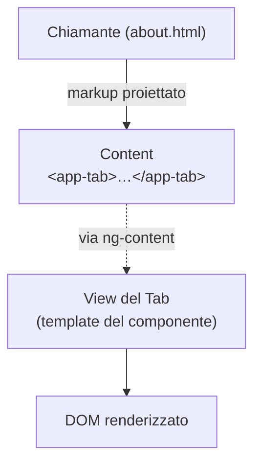

# 10 · Signal Queries & Component Communication
> 📖 cap.10 · pp.287-300 — *Modern Angular* v1.0.4

Le applicazioni e le librerie di componenti sono fatte di tanti componenti che devono collaborare. Il capitolo introduce le **signal queries** e la **composizione di componenti**: come scrivere componenti riutilizzabili estendibili da figli passati dal chiamante, e quali opzioni esistono per farli comunicare.

Filo conduttore: un **tab control** (`TabbedPane` + `Tab`). Lo stesso controllo viene realizzato in **tre varianti** che mostrano altrettante strategie di coordinamento padre-figlio, tutte sotto `src/app/domains/shared/ui-common/`:

| Variante | Strategia | Cartella |
|---|---|---|
| **injection** | i figli iniettano il padre e si registrano | `injection-tabbed-pane/` |
| **query** | il padre interroga i figli con `contentChildren` | `query-tabbed-pane/` |
| **service** | un service condiviso (`TabRegistry`) | `service-tabbed-pane/` |

```bash
ng g c shared/ui-common/tabbed-pane
ng g c shared/ui-common/tab
```

## Content Projection (richiamo)
> 📖 pp.287-288

La [[content-projection]] permette a un componente di **ricevere markup** (es. HTML) dal chiamante e di mostrarlo nel proprio template. Il `Tab` ne ha bisogno per presentare gli elementi che gli vengono passati:

```html
<app-tab title="Upcoming Flights">
  <p>No upcoming flights!</p>
</app-tab>
```

Il componente marca con `<ng-content>` il punto in cui il contenuto proiettato deve comparire.

```ts
// src/app/domains/shared/ui-common/injection-tabbed-pane/tab.ts
import { Component, computed, inject, input } from '@angular/core';
import { TabbedPane } from './tabbed-pane';

@Component({
  selector: 'app-tab',
  imports: [],
  template: `
    @if (visible()) {
      <div class="tab-content">
        <ng-content></ng-content>
      </div>
    }
  `,
  styles: `[...]`,
})
export class Tab {
  private pane = inject(TabbedPane);
  readonly title = input.required<string>();
  protected readonly visible = computed(() => this.pane.currentTab() === this);

  constructor() {
    this.pane.registerTab(this);
  }
}
```

- `title` è un [[signal-input|input()]] obbligatorio.
- `visible` è un [[computed]] che vale `true` solo quando il padre indica *questo* tab come corrente.
- Il template usa `@if (visible())` + `<ng-content>` per proiettare il contenuto solo nel tab attivo.

Uso dal chiamante (la pagina About):

```html
<!-- src/app/shell/about/about.html -->
<h1>About</h1>
<app-tabbed-pane>
  <app-tab title="Upcoming Flights">
    <p>No upcoming flights!</p>
  </app-tab>
  <app-tab title="Operated Flights">
    <p>No operated flights!</p>
  </app-tab>
  <app-tab title="Cancelled Flights">
    <p>No cancelled flights!</p>
  </app-tab>
</app-tabbed-pane>
```

Collegamenti: [[content-projection]] · richiamo da [[02-signal-based-components]].

## Referencing Parent Components (DI del padre)
> 📖 pp.289-291

**Variante injection.** Il `TabbedPane` riceve i `Tab` via content projection e li tiene in un signal `tabs`. Ogni tab **si registra da solo** chiamando `registerTab` nel proprio costruttore, dopo aver **iniettato il padre** con [[inject]].

```ts
// src/app/domains/shared/ui-common/injection-tabbed-pane/tabbed-pane.ts
import { Component, computed, model, signal } from '@angular/core';
import { Tab } from './tab';

@Component({
  selector: 'app-tabbed-pane',
  standalone: true,
  imports: [],
  template: `
    <div class="pane">
      <div class="tabs-header" role="group">
        @for (tab of tabs(); track tab) {
          <button
            class="tab-button"
            [class.active]="tab === currentTab()"
            (click)="activate($index)">
            {{ tab.title() }}
          </button>
        }
      </div>
      <div class="tabs-content">
        <ng-content></ng-content>
      </div>
    </div>
  `,
  styles: `[...]`,
})
export class TabbedPane {
  protected readonly current = model(0);              // indice del tab attivo
  protected readonly tabs = signal<Tab[]>([]);        // riempito dalle registrazioni
  readonly currentTab = computed(() => this.tabs()[this.current()]);

  registerTab(tab: Tab): void {
    this.tabs.update((tabs) => [...tabs, tab]);
  }
  activate(tabIndex: number): void {
    this.current.set(tabIndex);
  }
}
```

- `current` è un [[model-signal|model()]] con l'indice attivo; `currentTab` un [[computed]] che restituisce l'istanza del tab corrente.
- `@for` disegna un bottone per ogni tab (`track tab` sull'istanza), `<ng-content>` proietta i contenuti. Solo il tab con `visible()` true renderizza il proprio contenuto.
- Il `Tab` passa `this` a `registerTab` dal proprio costruttore.

> [!warning] Gotcha
> Per far funzionare il `Tab` **anche senza** un `TabbedPane` padre, inietta con `{ optional: true }`: se Angular non trova un'implementazione per il token, restituisce `undefined` (e non lancia). Poi usa l'optional chaining sulla chiamata.

```ts
private pane = inject(TabbedPane, { optional: true });
constructor() {
  this.pane?.registerTab(this);
}
```

Collegamenti: [[inject]] · DI approfondita in [[05-state-management-services-signals]].

## View and Content
> 📖 pp.291-292

Ogni componente ha non solo una **View** ma anche un **Content**:

- **View** = ciò che è definito dal **template del componente stesso** → determina la presentazione a runtime.
- **Content** = il **markup passato dal chiamante**, che Angular inserisce nell'elemento `<ng-content>` del template tramite Content Projection.



Le query si dividono di conseguenza: `contentChild`/`contentChildren` interrogano il **Content**, `viewChild`/`viewChildren` interrogano la **View**.

### Interacting with Content
> 📖 pp.292-294

**Variante query.** Invece di farsi registrare i tab, il `TabbedPane` li **interroga** con `contentChildren(Tab)`: riceve il tipo `Tab` come filtro e restituisce un signal il cui valore è l'array delle istanze proiettate.

```ts
// src/app/domains/shared/ui-common/query-tabbed-pane/tabbed-pane.ts
import { Component, computed, contentChildren, effect, model } from '@angular/core';
import { Tab } from './tab';

@Component({
  selector: 'app-tabbed-pane',
  standalone: true,
  imports: [],
  template: `
    <div class="pane">
      <div class="tabs-header" role="group">
        @for (tab of tabs(); track tab) {
          <button
            class="tab-button"
            [class.active]="tab === currentTab()"
            (click)="activate($index)">
            {{ tab.title() }}
          </button>
        }
      </div>
      <div class="tabs-content">
        <ng-content></ng-content>
      </div>
    </div>
  `,
})
export class TabbedPane {
  protected readonly current = model(0);
  protected readonly tabs = contentChildren(Tab);   // query sul Content
  readonly currentTab = computed(() => this.tabs()[this.current()]);

  constructor() {
    effect(() => {
      for (const tab of this.tabs()) {
        tab.pane = this;                              // inietta sé stesso in ogni tab
      }
    });
  }
  activate(tabIndex: number): void {
    this.current.set(tabIndex);
  }
}
```

In questa variante il `Tab` **non inietta** il padre: espone un setter `pane` che l'[[effect]] del pane chiama, così ogni tab conosce il proprio genitore.

```ts
// src/app/domains/shared/ui-common/query-tabbed-pane/tab.ts
export class Tab {
  private _pane?: TabbedPane;
  readonly title = input.required<string>();
  protected readonly visible = computed(
    () => this._pane?.currentTab() === this,
  );
  set pane(pane: TabbedPane) {
    this._pane = pane;
  }
}
```

Oltre a `contentChildren` (molti) esiste `contentChild` (esattamente uno). Entrambi accettano anche una **template reference** come filtro:

```ts
readonly firstTab = contentChild(Tab);          // per tipo, singolo

readonly tabs = contentChildren<Tab>('tab');    // per template reference
readonly firstTab2 = contentChild('tab');       // template reference, singolo
```

```html
<app-tab title="A" #tab></app-tab>
<app-tab title="B" #tab></app-tab>
```

Collegamenti: [[signal-queries]] · [[effect]].

### Interacting with the View
> 📖 pp.294-296

Come si interroga il Content, così si interroga la **View** con `viewChild` (un elemento) e `viewChildren` (più elementi). Restituiscono signal che si aggiornano quando gli elementi sono disponibili.

Esempio reale: `ReportingPage` disegna un grafico con **Chart.js**, che ha bisogno di un riferimento a un elemento `<canvas>` del template.

```ts
// src/app/domains/ticketing/feature-reporting/reporting-page/reporting-page.ts
import { afterRenderEffect, Component, ElementRef, signal, viewChild } from '@angular/core';

@Component({
  selector: 'app-reporting-page',
  imports: [/* ... */],
  templateUrl: './reporting-page.html',
  styleUrl: './reporting-page.css',
})
export class ReportingPage {
  readonly canvas = viewChild<ElementRef<HTMLCanvasElement>>('chart');
  protected readonly data = signal<DataItem[]>([]);

  constructor() {
    afterRenderEffect(() => {
      const data = this.data();
      const canvasElm = this.canvas();
      const canvas = canvasElm?.nativeElement;
      if (canvas) {
        this.renderChart(data, canvas);
      }
    });
  }

  private renderChart(data: DataItem[], canvas: HTMLCanvasElement) {
    const chart = new Chart(canvas, { /* ... */ });
    chart.render();
  }
}
```

```html
<!-- .../feature-reporting/reporting-page/reporting-page.html -->
<div class="chart-wrapper">
  <canvas #chart></canvas>
</div>
```

Si usa `afterRenderEffect` per essere certi che la view sia pronta e il canvas già renderizzato prima di disegnarci sopra.

### Mettere in discussione l'uso di viewChild
> 📖 p.296

> [!warning] Gotcha
> Interagire direttamente con la View **sostituisce il data binding dichiarativo** (una feature centrale di Angular) con codice tuo: più difficile da seguire e mantenere, e gli update diretti delle proprietà possono innescare cicli di change detection. Gli autori mettono in discussione **ogni** `viewChild`/`viewChildren` in code review.

L'uso si considera giustificato **solo** quando:
- un controllo di terze parti non permette il data binding per certe proprietà;
- ti serve il DOM (es. Chart.js);
- un padre deve **chiamare un metodo** di un componente figlio.

### Static Child Components
> 📖 p.296

Le quattro query signal-based (`viewChild`, `viewChildren`, `contentChild`, `contentChildren`) accettano un oggetto di **opzioni** come secondo argomento:

- `read`: ottiene un token diverso (es. `ElementRef`).
- `static`: indica se gli elementi sono presenti **prima** o **dopo** la change detection.

```ts
readonly chart = viewChild<ElementRef<HTMLCanvasElement>>('chart', { static: true });
```

> [!tip] Take-away
> Se gli elementi esistono fin dall'inizio (cioè **non** dentro `@if`/`@for`) puoi mettere `static: true` e il signal avrà un valore prima. Altrimenti: i **content children** sono disponibili dopo il controllo del content, i **view children** dopo l'init della view → reagisci con `afterRenderEffect` o `afterNextRender`.

Collegamenti: [[signal-queries]].

## Comunicazione via template variables
> 📖 pp.297

Una **template variable** assegnata a un componente fornisce un **riferimento all'istanza** di quel componente: il template padre può chiamarne i metodi o leggerne le proprietà direttamente.

```html
<h1>About</h1>
<app-tabbed-pane #pane>
  <app-tab title="Upcoming Flights"><p>No upcoming flights!</p></app-tab>
  <app-tab title="Operated Flights"><p>No operated flights!</p></app-tab>
  <app-tab title="Cancelled Flights"><p>No cancelled flights!</p></app-tab>
</app-tabbed-pane>

<button (click)="pane.activate(1)">Activate 2nd tab</button>
```

Con `#pane` il padre può invocare `pane.activate(1)`, ad esempio in un click handler, per passare programmaticamente al secondo tab. È la forma di comunicazione **più esplicita**: si vede a colpo d'occhio chi parla con chi.

## Comunicazione via services
> 📖 pp.297-300

**Variante service.** Un service messo nell'array `providers` di un componente è **condiviso** da quel componente e da tutti i suoi discendenti: tutti accedono alla **stessa istanza** e possono comunicare attraverso di essa.

Qui un `TabRegistry` tiene l'indice corrente e la lista dei tab. **Non** è `providedIn: 'root'`: è fornito a livello del `TabbedPane`, così ogni pane ha la propria istanza.

```ts
// src/app/domains/shared/ui-common/service-tabbed-pane/tab-registry.ts
import { computed, Injectable, Signal, signal } from '@angular/core';

export interface TabInfo {
  title: Signal<string>;
}

// Niente { providedIn: 'root' }! Fornito a livello del tabbed-pane.
@Injectable()
export class TabRegistry {
  private readonly _current = signal(0);
  private readonly _tabs = signal<TabInfo[]>([]);
  readonly current = this._current.asReadonly();
  readonly tabs = this._tabs.asReadonly();
  readonly currentTab = computed(() => this.tabs()[this.current()]);

  registerTab(tab: TabInfo): void {
    this._tabs.update((tabs) => [...tabs, tab]);
  }
  activate(tabIndex: number): void {
    this._current.set(tabIndex);
  }
}
```

Il `TabbedPane` **fornisce** il service e gli **delega** tutto:

```ts
// src/app/domains/shared/ui-common/service-tabbed-pane/tabbed-pane.ts
import { Component, inject } from '@angular/core';
import { TabRegistry } from './tab-registry';

@Component({
  selector: 'app-tabbed-pane',
  standalone: true,
  providers: [TabRegistry],        // istanza locale al pane
  imports: [],
  template: `
    <div class="pane">
      <div class="tabs-header" role="group">
        @for (tab of tabs(); track tab) {
          <button
            class="tab-button"
            [class.active]="tab === currentTab()"
            (click)="activate($index)">
            {{ tab.title() }}
          </button>
        }
      </div>
      <div class="tabs-content">
        <ng-content></ng-content>
      </div>
    </div>
  `,
})
export class TabbedPane {
  protected readonly registry = inject(TabRegistry);
  protected readonly tabs = this.registry.tabs;
  protected readonly currentTab = this.registry.currentTab;

  activate(tabIndex: number): void {
    this.registry.activate(tabIndex);
  }
}
```

Ogni `Tab` inietta lo **stesso** `TabRegistry` e si registra nel costruttore:

```ts
// src/app/domains/shared/ui-common/service-tabbed-pane/tab.ts
import { Component, computed, inject, input } from '@angular/core';
import { TabInfo, TabRegistry } from './tab-registry';

@Component({
  selector: 'app-tab',
  standalone: true,
  imports: [],
  template: `
    @if (visible()) {
      <div class="tab-content">
        <ng-content></ng-content>
      </div>
    }
  `,
})
export class Tab implements TabInfo {
  private registry = inject(TabRegistry);
  readonly title = input.required<string>();
  protected readonly visible = computed(
    () => this.registry.currentTab() === this,
  );

  constructor() {
    this.registry.registerTab(this);
  }
}
```

> [!tip] Take-away
> **Vantaggio:** accoppiamento lasco — pane e tab dipendono solo dall'interfaccia `TabRegistry`, non l'uno dall'altro; la comunicazione attraversa più livelli di gerarchia senza fatica.
> **Svantaggio:** comunicazione **implicita** — a prima vista non si capisce chi parla con chi. Data binding e template reference sono più espliciti.

Collegamenti: [[providers]] · [[inject]] · pattern di store condiviso in [[lightweight-store]] e [[05-state-management-services-signals]] · uso delle query nelle direttive in [[11-directives-templates-containers]].

## 🔁 Ripasso lampo
1. Qual è la differenza tra **View** e **Content** di un componente, e quale coppia di query interroga ciascuno?
2. Nella variante *injection* come fa un `Tab` a registrarsi nel padre, e come lo rendi tollerante all'assenza di un `TabbedPane`?
3. Cosa restituisce `contentChildren(Tab)` e in cosa differisce da `contentChild`? Quali due tipi di filtro accettano?
4. Perché gli autori sconsigliano `viewChild`/`viewChildren`? In quali tre casi lo ritengono giustificato?
5. A cosa serve `static: true` in una query e quando *non* puoi usarlo? Cosa usi per reagire quando gli elementi sono pronti?
6. Confronta comunicazione via **template variable** e via **service**: pro e contro di ciascuna in termini di esplicitezza e accoppiamento.

**Take-away del capitolo:**
- La **Content Projection** (`<ng-content>`) mostra il markup passato dal chiamante; **View** = template del componente, **Content** = markup proiettato.
- **Signal queries**: `viewChild`/`viewChildren` per la View, `contentChild`/`contentChildren` per il Content; opzioni `read` e `static`; tempi di disponibilità gestiti con `afterRenderEffect`/`afterNextRender`.
- Coordinamento padre-figlio in **tre modi**: *injection* (i figli iniettano e registrano), *content query* (il padre interroga), *service condiviso* (`TabRegistry` a livello di componente) → quest'ultimo dà accoppiamento lasco ma comunicazione implicita.
- Le **template variable** danno accesso esterno esplicito all'istanza (`#pane` → `pane.activate(1)`).
- Preferisci il **data binding dichiarativo**: `viewChild`/`viewChildren` solo per DOM/terze parti o per chiamare metodi di un figlio.
