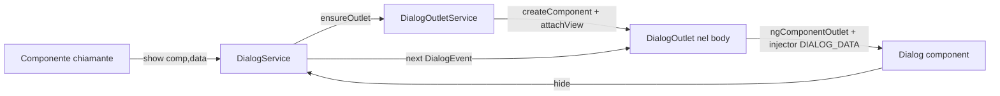

# 11 · Directives, Templates, and Containers
> 📖 cap.11 · pp.312-341 — *Modern Angular* v2.0.0

Le librerie di componenti (Angular Material & co.) non spediscono solo UI pronte: poggiano su una manciata di mattoni che rendono i componenti flessibili e riusabili. Questo capitolo li attraversa partendo da un insieme minimo di costrutti: una **attribute directive** (in due versioni: tooltip), una **DataTable** (structural directive) e un **DialogService** (dynamic components).

Idea cardine: un **componente è solo una directive con un template**. La `@Directive` ha quasi tutte le proprietà di `@Component`, mancano solo quelle legate al template (`template`/`templateUrl`, `styles`/`styleUrls`, `viewProviders`).

## Attribute Directives — definire una directive
> 📖 pp.312-315

Le **attribute directive** aggiungono comportamento a elementi esistenti senza portare una propria view. Il nome riflette la convenzione: il selector punta a elementi con un certo **attributo**. L'esempio sostituisce il classico `(click)` per azioni critiche con un click che prima mostra un dialog di conferma.

```ts
// src/app/domains/shared/ui-common/click-with-warning.directive.ts
import { Dialog } from '@angular/cdk/dialog';
import { Directive, inject, input, output } from '@angular/core';
import { ConfirmComponent } from '../util-common/confirm';

@Directive({
  selector: '[appClickWithWarning]',     // [...] = match per attributo → l'elemento è lo "host"
  exportAs: 'clickWithWarning',           // nome per le template variables
  host: {
    class: 'btn btn-danger',              // binding statico di classi sull'host
    '(click)': 'handleClick($event.shiftKey)', // host listener
  },
})
export class ClickWithWarning {
  private readonly dialog = inject(Dialog);
  readonly warning = input('Are you sure?');
  readonly appClickWithWarning = output<void>();   // stesso nome del selector

  handleClick(shiftKey: boolean): void {
    if (shiftKey) {                       // Shift+click salta la conferma (power users)
      this.appClickWithWarning.emit();
      return;
    }
    const ref = this.dialog.open<boolean>(ConfirmComponent, { data: this.warning() });
    ref.closed.subscribe((result) => {
      if (result) {
        this.appClickWithWarning.emit();
      }
    });
  }
}
```

Si importa nei `imports` del componente standalone che la usa e si applica come attributo:

```html
<!-- about.html -->
<button appClickWithWarning>Delete All!</button>
```

I selector seguono le possibilità CSS, quindi si può restringere: `button[appClickWithWarning]` (solo `<button>`), `div.container button[appClickWithWarning]` (anche dentro un `div.container`).

> [!tip] Take-away
> L'opzione `host` del decorator lega proprietà ed eventi all'elemento host: `class:`/`style.`/binding di proprietà e **host listener** tipo `'(click)': '...'`. È il modo signal-era di fare ciò che un tempo si faceva con `@HostBinding`/`@HostListener`.

## Comunicare con l'ambiente & template variables
> 📖 pp.315-316

Come i componenti, le directive comunicano col chiamante via `input()`/`output()`. Dare allo `output` **lo stesso nome del selector** permette di applicare la directive e impostare il binding in un colpo solo:

```html
<button (appClickWithWarning)="deleteAll()">Delete All!</button>
```

Una directive si referenzia anche con una **template variable**: dietro un elemento possono esserci più directive, quindi serve dire ad Angular quale si intende. Il valore di `exportAs` fa da chiave:

```html
<button (appClickWithWarning)="deleteAll()" #cww="clickWithWarning">Delete All!</button>
<button (click)="cww.handleClick(true)">Don't ask questions!</button>
```

`#cww="clickWithWarning"` dà accesso all'istanza `ClickWithWarning` del bottone, di cui si possono chiamare i metodi pubblici. `exportAs` funziona anche con i componenti, ma di solito è superfluo: Angular assegna già l'istanza del componente alla template variable senza valore esplicito.

## Controlled DOM-Manipulations
> 📖 pp.316-318

A volte una directive deve creare/gestire elementi DOM **fuori dal template** (overlay, tooltip, popover che devono sfuggire a `overflow`/posizionamento dei genitori). È una manipolazione di basso livello: usarla solo se non c'è un'astrazione migliore, e **ripulire sempre** gli elementi creati alla distruzione, pena memory leak e nodi orfani.

```ts
// src/app/domains/shared/ui-common/simple-tooltip.directive.ts
import { afterRenderEffect, DestroyRef, Directive, ElementRef, inject, input } from '@angular/core';

@Directive({
  selector: '[appSimpleTooltip]',
  host: {
    '(mouseover)': 'setHidden(false)',
    '(mouseout)': 'setHidden(true)',
  },
})
export class SimpleTooltip {
  private readonly host = inject(ElementRef<HTMLElement>);   // riferimento all'host
  private tooltipElement: HTMLElement | null = null;
  private readonly destroyRef = inject(DestroyRef);
  readonly tooltipText = input.required<string>({ alias: 'appSimpleTooltip' });

  constructor() {
    afterRenderEffect(() => {            // dopo il render: l'host è già posizionato
      const text = this.tooltipText();
      this.initTooltip();
      this.updateText(text);
    });
    this.destroyRef.onDestroy(() => this.removeTooltip());   // cleanup
  }

  setHidden(hidden: boolean): void {
    if (this.tooltipElement) {
      if (!hidden) {
        this.updatePosition(this.tooltipElement);
      }
      this.tooltipElement.hidden = hidden;
    }
  }

  private initTooltip(): void {
    if (this.tooltipElement) {
      return;
    }
    this.tooltipElement = document.createElement('div');
    this.tooltipElement.className = 'tooltip';
    this.tooltipElement.hidden = true;
    document.body.appendChild(this.tooltipElement);   // appeso a <body>, fuori dal flow
  }

  private updatePosition(tooltipElement: HTMLElement) {
    const rect = this.host.nativeElement.getBoundingClientRect();
    tooltipElement.style.left = `${rect.left + rect.width / 2}px`;
    tooltipElement.style.top = `${rect.top - 8}px`;
  }

  private updateText(tooltipText: string): void {
    if (this.tooltipElement) {
      this.tooltipElement.textContent = tooltipText;
    }
  }

  private removeTooltip() {
    if (this.tooltipElement && this.tooltipElement.parentNode) {
      this.tooltipElement.parentNode.removeChild(this.tooltipElement);
      this.tooltipElement = null;
    }
  }
}
```

Uso:

```html
<button appSimpleTooltip="Click here to book the flight" class="btn btn-default">
  Book Flight
</button>
```

`appSimpleTooltip` fa doppio gioco: marca l'elemento e fa da **nome dell'input** (via `alias`). Allineare il nome di un input al selector è l'unica eccezione lecita all'uso degli alias (di norma sconsigliati dal linter perché introducono indirezione).

> [!warning] Gotcha
> Qui serve `afterRenderEffect`, non un `effect` normale: con un `effect` la logica girerebbe **troppo presto**, prima che l'host sia posizionato, e il tooltip finirebbe nel posto sbagliato.

> [!tip] Take-away
> `DestroyRef.onDestroy(...)` è il mattone generale di cleanup (componenti, directive, servizi). Angular lo usa internamente per distruggere gli `effect` insieme al loro owner: ecco perché `effect` e affini si possono creare solo in un [[injection-context]] (il `DestroyRef` arriva via DI).

Collegamenti: [[inject]] · [[injection-context]] · [[signal-input]].

## Code-based Content Projection — templates & containers
> 📖 pp.319-321

Oltre alla [[content-projection]] dichiarativa (`<ng-content>`), si può renderizzare il contenuto di un **template via codice**: più flessibilità, e si può proiettare lo stesso template più volte con parametri diversi.

- Un **template** (`<ng-template>`) definisce markup che Angular **non renderizza subito**.
- Un **container** è il punto dove quel template può essere istanziato. Angular mette ogni componente e ogni markup statico in un container invisibile; lo si recupera (es. via DI come `ViewContainerRef`) e ci si aggiungono elementi.

Il `Tooltip` riceve un `TemplateRef` e lo renderizza nel view container, invece di creare DOM a mano:

```ts
// src/app/domains/shared/ui-common/tooltip.directive.ts
import {
  afterRenderEffect, DestroyRef, Directive, ElementRef,
  EmbeddedViewRef, inject, input, TemplateRef, ViewContainerRef,
} from '@angular/core';

@Directive({
  selector: '[appTooltip]',
  host: {
    '(mouseover)': 'setHidden(false)',
    '(mouseout)': 'setHidden(true)',
  },
})
export class Tooltip {
  private readonly viewContainer = inject(ViewContainerRef);
  private viewRef: EmbeddedViewRef<unknown> | undefined;
  private host = inject(ElementRef<HTMLElement>);
  private readonly destroyRef = inject(DestroyRef);
  readonly template = input<TemplateRef<unknown> | undefined>(undefined, { alias: 'appTooltip' });

  constructor() {
    afterRenderEffect(() => {
      const template = this.template();
      if (!template) {
        return;
      }
      this.initTooltip(template);
    });
    this.destroyRef.onDestroy(() => this.removeTooltip());
  }

  private removeTooltip() {
    if (this.viewRef) {
      this.viewRef.destroy();
      this.viewRef = undefined;
    }
  }

  initTooltip(template: TemplateRef<unknown>): void {
    if (this.viewRef) {
      this.viewRef.destroy();
    }
    this.viewRef = this.viewContainer.createEmbeddedView(template);   // content projection via codice
    this.viewRef?.rootNodes.forEach((nativeElement) => {
      nativeElement.className = 'tooltip';
      nativeElement.hidden = true;
    });
  }

  setHidden(hidden: boolean): void {
    this.viewRef?.rootNodes.forEach((nativeElement) => {
      if (!hidden) {
        this.updatePosition(nativeElement);
      }
      nativeElement.hidden = hidden;
    });
  }

  private updatePosition(toolTipElement: HTMLElement) {
    const r = this.host.nativeElement.getBoundingClientRect();
    toolTipElement.style.left = `${r.left + r.width / 2}px`;
    toolTipElement.style.top = `${r.top - 8}px`;
  }
}
```

Uso (il template si passa come `TemplateRef`, ottenuto con la variabile `#tmpl`):

```html
<input [appTooltip]="tmpl" placeholder="Passenger Name" style="max-width: 200px" />
<ng-template #tmpl>
  <div class="tooltip">
    <h4>Important Input</h4>
    <p>Enter values with care!</p>
  </div>
</ng-template>
```

- `viewContainer.createEmbeddedView(template)` aggiunge il template al container; si può chiamare **più volte** per più istanze.
- I nodi proiettati sono rappresentati dall'`EmbeddedViewRef`; `rootNodes` dà i loro elementi radice (qui usati per posizionamento + show/hide).
- `viewRef.destroy()` + `DestroyRef` garantiscono che i nodi muoiano con l'host.

## Passare parametri ai template (context object)
> 📖 pp.322-324

Quando si renderizza un template si può passare un **context object** con parametri usabili come variabili nel template.

```ts
interface TooltipContext {
  $implicit: string;   // valore "di default": usabile senza nominare la proprietà
  text: string;
}
```

Si tipizza `TemplateRef`/`EmbeddedViewRef` col context e si passa l'oggetto come **secondo argomento** di `createEmbeddedView`:

```ts
private viewRef: EmbeddedViewRef<TooltipContext> | undefined;
readonly template = input<TemplateRef<TooltipContext> | undefined>(undefined, { alias: 'appTooltip' });

initTooltip(template: TemplateRef<TooltipContext>): void {
  if (this.viewRef) {
    this.viewRef.destroy();
  }
  this.viewRef = this.viewContainer.createEmbeddedView(template, {
    $implicit: 'Tooltip!',
    text: 'Important Information!',
  });
  // ...
}
```

Nel template le variabili si introducono con attributi prefissati `let-`:

```html
<ng-template #tmpl let-title="$implicit" let-body="text">
  <div class="tooltip">
    <h4>{{ title }}</h4>
    <p>{{ body }}</p>
  </div>
</ng-template>
```

Leggilo come una funzione che riceve valori: `let-title` prende `$implicit`, `let-body` prende `text`. Siccome `$implicit` è il default, si può abbreviare `let-title="$implicit"` in **`let-title`**.

> [!tip] Take-away
> `$implicit` è il parametro posizionale "predefinito" di un template: `let-x` (senza `="..."`) lo cattura. Tutti gli altri parametri si nominano esplicitamente (`let-y="propName"`).

Collegamenti: [[content-projection]].

## Structural Directives — desugaring
> 📖 pp.324-326

Una **structural directive** assume che l'host sia un **template** renderizzabile su richiesta (una o più volte) e offre una **microsyntax** compatta per parametri e binding. È il chiamante (non la directive) a decidere l'uso strutturale, prefissando l'attributo con `*`.

Esempio `appTableField` (cella formattata di tabella). Questa scrittura:

```html
<div *appTableField="let data; provide: 'date'; title: 'Departure Date'">
  {{ data | date: 'dd.MM.yyyy HH:mm' }}
</div>
```

è solo zucchero per concetti già visti — fa desugaring in:

```html
<ng-template
  appTableField
  [appTableFieldProvide]="'date'"
  [appTableFieldTitle]="'Departure Date'"
  let-data>
  <div>{{ data | date: 'dd.MM.yyyy HH:mm' }}</div>
</ng-template>
```

Regole della microsyntax:

| Microsyntax | Equivalente |
|---|---|
| `let data` | `<ng-template ... let-data>` (riceve `$implicit`) |
| `provide: 'date'` | `[appTableFieldProvide]="'date'"` |
| `title: 'Departure Date'` | `[appTableFieldTitle]="'Departure Date'"` |

I separatori (`;`) sono ignorati; i nomi della microsyntax vengono **prefissati col selector** (`provide` → `appTableFieldProvide`). Per assegnare parametri **per nome** invece che `$implicit`:

```html
<div *appTableField="let data; [...]; let link=details">
  <a [href]="link">{{ data | date: 'dd.MM.yyyy HH:mm' }}</a>
</div>
<!-- desugars to: -->
<ng-template ... let-link="details"> ... </ng-template>
```

Internamente una structural directive di solito **prende il container corrente e istanzia il template** dentro di esso.

> [!warning] Gotcha
> `let data` cattura `$implicit`; `let link=details` cattura il parametro `details`. Sono cose diverse: il primo è il valore implicito, il secondo è nominato. Per Angular moderno il control flow (`@if`/`@for`) sostituisce le vecchie `*ngIf`/`*ngFor` — le structural directive custom restano utili per costrutti riusabili tipo questa DataTable.

## Implementare una DataTable
> 📖 pp.326-330

DataTable generica: riceve un array di oggetti, e per ogni colonna si passa un template via `*appTableField`.

```html
<app-data-table [data]="flights()">
  <div *appTableField="let data; provide: 'id'; title: 'Flight Id'">{{ data }}</div>
  <div *appTableField="let data; provide: 'from'; title: 'From'">{{ data }}</div>
  <div *appTableField="let data; provide: 'to'; title: 'To'">{{ data }}</div>
  <div *appTableField="let data; provide: 'date'; title: 'Departure Date'">
    {{ data | date: 'dd.MM.yyyy HH:mm' }}
  </div>
</app-data-table>
```

La directive inietta il proprio `TemplateRef` e lo espone come proprietà pubblica; gli `input()` con **alias** sono la chiave della microsyntax:

```ts
// src/app/domains/shared/ui-common/data-table/table-field.directive.ts
import { Directive, inject, input, TemplateRef } from '@angular/core';

@Directive({
  selector: '[appTableField]',
})
export class TableField<T> {
  readonly propName = input.required<keyof T>({ alias: 'appTableFieldProvide' }); // <- "provide"
  readonly title = input.required<string>({ alias: 'appTableFieldTitle' });       // <- "title"
  readonly templateRef = inject(TemplateRef) as TemplateRef<unknown>;             // template della cella
}
```

Il componente tabella raccoglie i `TableField` proiettati con `contentChildren` e renderizza ogni cella con `ngTemplateOutlet`, passando il context `{ $implicit: row[field.propName()] }`:

```ts
// src/app/domains/shared/ui-common/data-table/data-table.ts
import { NgTemplateOutlet } from '@angular/common';
import { Component, contentChildren, input } from '@angular/core';
import { TableField } from './table-field.directive';

@Component({
  selector: 'app-data-table',
  imports: [NgTemplateOutlet],
  template: `
    <table class="table">
      <tr>
        @for (field of fields(); track field) {
          <th>{{ field.title() }}</th>
        }
      </tr>
      @for (row of data(); track row) {
        <tr>
          @for (field of fields(); track field) {
            <td>
              <ng-container
                *ngTemplateOutlet="
                  field.templateRef;
                  context: { $implicit: row[field.propName()] }
                "></ng-container>
            </td>
          }
        </tr>
      }
    </table>
  `,
})
export class DataTable<T extends object> {
  readonly data = input<T[]>([]);
  protected readonly fields = contentChildren<TableField<T>>(TableField);
}
```

`contentChildren(TableField)` popola `fields` con tutti i figli che usano la directive; `ngTemplateOutlet` riceve un `TemplateRef` e un context. Sembra molto boilerplate per una tabella semplice, ma diventa la base per aggiungere sorting, filtering, paginazione, colonne di edit in modo riusabile in tutta l'app.

Collegamenti: [[signal-queries]] (la query `contentChildren`) · [[10-signal-queries-component-communication]].

## Usare ViewContainerRef direttamente
> 📖 pp.330-332

`ngTemplateOutlet` usa internamente un `ViewContainerRef`. Per scenari più complessi lo si usa **direttamente**. Ecco una reimplementazione di `ngTemplateOutlet`:

```ts
// src/app/domains/shared/ui-common/custom-template-outlet.directive.ts
import { Directive, effect, inject, input, TemplateRef, ViewContainerRef } from '@angular/core';

@Directive({
  selector: '[appCustomTemplateOutlet]',
})
export class CustomTemplateOutlet<T extends object> {
  readonly template = input<TemplateRef<unknown> | undefined>(undefined, {
    alias: 'appCustomTemplateOutlet',
  });
  readonly context = input<T>(undefined, {
    alias: 'appCustomTemplateOutletContext',
  });
  private readonly viewContainer = inject(ViewContainerRef);

  constructor() {
    effect(() => {
      const tmpl = this.template();
      const ctx = this.context();
      if (!tmpl) {
        return;
      }
      this.viewContainer.clear();                       // createEmbeddedView solo accoda → pulire prima
      this.viewContainer.createEmbeddedView(tmpl, ctx);
    });
  }
}
```

- `inject(ViewContainerRef)` ottiene il container dell'host.
- `clear()` prima di `createEmbeddedView` perché quest'ultimo **accoda** soltanto.
- L'`effect` aggiorna la view quando `template()` o `context()` cambiano.
- L'oggetto restituito da `createEmbeddedView` dà accesso ai nodi via `rootNodes`. Con la microsyntax (`*appTableField`) c'è **sempre un solo** root element; con `<ng-template>` esplicito possono essercene più di uno:

```html
<ng-template>
  <div>First root element</div>
  <div>Second root element</div>
</ng-template>
```

`ViewContainerRef` ha anche `createComponent` per istanziare dinamicamente un **componente** (controparte: la directive `ngComponentOutlet`).

### Accedere a ViewContainerRef via Signal Queries
Oltre che via injection, il `ViewContainerRef` di una view/content child si ottiene con le [[signal-queries]] usando l'opzione `read`:

```ts
readonly container = viewChild('anchor', { read: ViewContainerRef });
```

Collegamenti: [[signal-queries]].

## Dynamic Components — Modal Dialogs
> 📖 pp.332-338

Aggiungere dinamicamente un componente via codice serve quando il componente da mostrare è noto solo a runtime e può cambiare — caso tipico: un **modal dialog** con contenuto contestuale. Angular offre `ngComponentOutlet`:

```html
<ng-container *ngComponentOutlet="comp; injector: injector"></ng-container>
```

`comp` è il **tipo** del componente, `injector` fornisce i servizi da iniettargli. (Per produzione esistono Overlay/Portal e il `Dialog` pronti della Angular CDK; qui si costruisce una versione semplificata per capire i concetti.)

API d'uso del `DialogService`:

```ts
// about.ts
@Component({ /* ... */ })
export class About {
  private readonly dialogService = inject(DialogService);
  protected showDialog(): void {
    this.dialogService.show(DemoDialog, 'Hello from About Component!');
  }
}
```

Costrutti di supporto — un evento e un `InjectionToken` per passare i dati:

```ts
// dialog-event.ts
export interface DialogEvent {
  component: Type<unknown> | null;
  data: unknown;
}

// dialog.token.ts
export const DIALOG_DATA = new InjectionToken<unknown>('DIALOG_DATA');
```

Il servizio pubblica gli eventi su un `Subject` RxJS (uno stream a cui l'outlet si sottoscrive):

> [!info] Angular 22+
> Negli snippet `@Injectable({ providedIn: 'root' })` ≡ `@Service()` (Angular 22). Dettagli in [[service]].

```ts
// dialog.service.ts (prima versione)
@Injectable({ providedIn: 'root' })
export class DialogService {
  private readonly dialogEvents = new Subject<DialogEvent>();
  readonly dialogEvents$ = this.dialogEvents.asObservable();

  show(comp: Type<unknown>, data: unknown): void {
    this.dialogEvents.next({ component: comp, data });
  }
  hide(): void {
    this.dialogEvents.next({ component: null, data: null });
  }
}
```

Il `DialogOutlet` riceve gli eventi e crea un **injector figlio** che espone `DIALOG_DATA`, poi passa tipo e injector a `ngComponentOutlet`:

```ts
// dialog-outlet.ts
@Component({
  selector: 'app-dialog-outlet',
  imports: [NgComponentOutlet],
  templateUrl: './dialog-outlet.html',
  styleUrl: './dialog-outlet.css',
})
export class DialogOutlet {
  private readonly dialogService = inject(DialogService);
  private readonly parentInjector = inject(Injector);
  protected component: Type<unknown> | null = null;
  protected injector: DestroyableInjector | null = null;

  constructor() {
    this.dialogService.dialogEvents$
      .pipe(takeUntilDestroyed())          // cleanup automatico alla distruzione
      .subscribe((event) => this.processEvent(event));
  }

  private processEvent(event: DialogEvent): void {
    if (this.injector) {
      this.injector.destroy();             // distruggi l'injector precedente
      this.injector = null;
    }
    if (!event.component) {
      this.component = null;
      return;
    }
    this.component = event.component;
    this.injector = Injector.create({
      providers: [{ provide: DIALOG_DATA, useValue: event.data }],
      parent: this.parentInjector,
    });
  }
}
```

```html
<!-- dialog-outlet.html -->
@if (component && injector) {
  <div class="container">
    <div class="background"></div>
    <div class="dialog">
      <ng-container *ngComponentOutlet="component; injector: injector" />
    </div>
  </div>
}
```

Il componente-dialog inietta `DIALOG_DATA` (i dati) e `DialogService` (per chiudersi):

```ts
// demo-dialog.ts
@Component({
  selector: 'app-demo-dialog',
  template: `
    <div class="card">
      <div class="card-body mb-20">
        <h2 class="title">Message</h2>
        <p>{{ message }}</p>
        <button (click)="close()">Close</button>
      </div>
    </div>
  `,
})
export class DemoDialog {
  private readonly data = inject(DIALOG_DATA);
  private readonly dialogService = inject(DialogService);
  protected readonly message = this.data as string;

  close(): void {
    this.dialogService.hide();
  }
}
```

Perché funzioni serve un `<app-dialog-outlet />` in un template attivo (es. `App`).

> [!warning] Gotcha
> Il dialog legge i suoi dati da `inject(DIALOG_DATA)`: i dati arrivano **per DI** tramite l'injector figlio creato dall'outlet, non come `@Input`. Per questo l'outlet deve ricreare (e distruggere) l'injector ad ogni evento.

Collegamenti: [[inject]] · [[providers]].

## Instantiating Component via Code
> 📖 pp.339-341

Le librerie (es. Angular Material) mostrano i dialog **senza** che noi aggiungiamo l'outlet a un template: lo aggiungono **via codice**. Lo fa il `DialogOutletService` con la funzione `createComponent`, attaccando la view all'`ApplicationRef` e inserendone l'elemento nel `<body>`:

```ts
// dialog-outlet-service.ts
import {
  ApplicationRef, ComponentRef, createComponent, DestroyRef,
  DOCUMENT, EnvironmentInjector, inject, Injectable,
} from '@angular/core';
import { DialogOutlet } from './dialog-outlet';

@Injectable({ providedIn: 'root' })
export class DialogOutletService {
  private envInjector = inject(EnvironmentInjector);
  private appRef = inject(ApplicationRef);
  private document = inject(DOCUMENT);
  private destroyRef = inject(DestroyRef);
  private componentRef: ComponentRef<DialogOutlet> | null = null;

  constructor() {
    this.destroyRef.onDestroy(() => this.componentRef?.destroy());
  }

  ensureOutlet() {
    if (!this.componentRef) {                              // idempotente: un solo outlet
      this.componentRef = createComponent(DialogOutlet, {
        environmentInjector: this.envInjector,
      });
      this.appRef.attachView(this.componentRef.hostView);  // entra nel ciclo di change detection
      this.document.body.appendChild(this.componentRef.location.nativeElement);
    }
  }
}
```

`DialogService.show` chiama `ensureOutlet()` prima di emettere l'evento, così l'outlet esiste di sicuro:

```ts
// dialog.service.ts (versione finale)
@Injectable({ providedIn: 'root' })
export class DialogService {
  private dialogOutletService = inject(DialogOutletService);
  private readonly dialogEvents = new Subject<DialogEvent>();
  readonly dialogEvents$ = this.dialogEvents.asObservable();

  show(comp: Type<unknown>, data: unknown): void {
    this.dialogOutletService.ensureOutlet();   // crea l'outlet via codice se manca
    this.dialogEvents.next({ component: comp, data });
  }
  hide(): void {
    this.dialogEvents.next({ component: null, data: null });
  }
}
```

> [!tip] Take-away
> `createComponent(...)` istanzia un componente fuori da ogni template; va poi **registrato** con `appRef.attachView(componentRef.hostView)` (perché riceva change detection) e il suo elemento (`componentRef.location.nativeElement`) inserito nel DOM. Il cleanup è `componentRef.destroy()`, qui legato al `DestroyRef`.



Collegamenti: [[inject]] · [[injection-context]] · [[providers]].

## 🔁 Ripasso lampo
1. Perché si dice che "un componente è solo una directive con un template"? Cosa manca alla `@Directive` rispetto a `@Component`?
2. A cosa serve `exportAs` e come lo si usa con una template variable?
3. Perché nel `SimpleTooltip` serve `afterRenderEffect` e non un `effect`? E perché `DestroyRef`?
4. Fai il desugaring di `*appTableField="let data; provide: 'id'; title: 'Flight Id'"`: cosa diventa, e come si costruiscono i nomi delle proprietà?
5. Cos'è `$implicit` in un context object e come lo si cattura nel template?
6. Differenza tra `createEmbeddedView` e `createComponent` su `ViewContainerRef`? E tra `ngTemplateOutlet` e `ngComponentOutlet`?
7. Nel `DialogService`, come arrivano i dati al componente-dialog e perché serve un injector figlio? Come viene aggiunto l'outlet senza metterlo nel template?

**Take-away del capitolo:**
- Le **directive** sono comportamento riusabile con `input`/`output` e **host bindings/listeners**, senza una view propria; per casi non coperti da astrazioni alte possono fare DOM manipulation controllata (sempre con cleanup via `DestroyRef`).
- **Template + container** (`TemplateRef` + `ViewContainerRef.createEmbeddedView`) sono la content projection via codice; un **context object** passa parametri (`$implicit` + nominati, catturati con `let-`).
- Le **structural directive** (`*`) assumono che l'host sia un template e offrono una microsyntax che fa desugaring in `<ng-template>` + property binding; base di DataTable, tooltip, ecc.
- I **dynamic components** si creano con `ngComponentOutlet` (in template) o `createComponent` + `ApplicationRef.attachView` (via codice); i dati si passano con un `InjectionToken` e un injector figlio.
