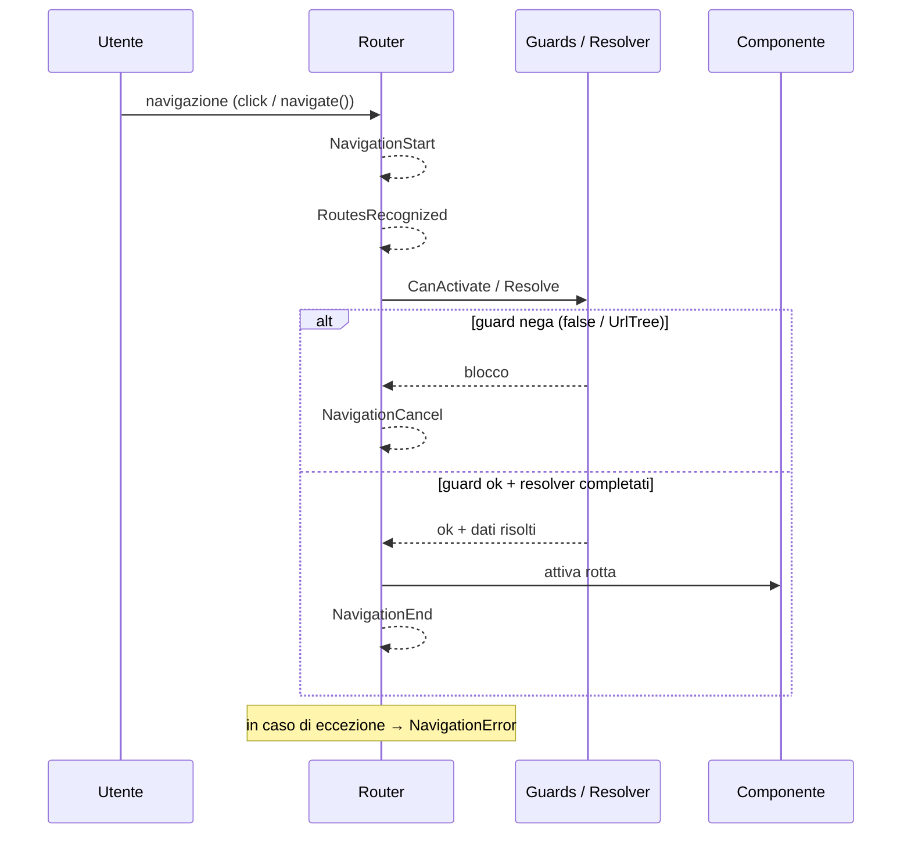

# 12 · Initialization & Route Changes
> 📖 cap.12 · pp.342-356 — *Modern Angular* v2.0.0

Prima di poter usare una feature spesso serve **inizializzarla**: caricare dati, registrare error handler, avviare servizi. Sul frontend questo significa che l'app deve caricare dati prima di proseguire, e tipicamente accade allo **startup** (l'avvio dell'app) e al **cambio rotta**. Il capitolo raccoglie i meccanismi tecnici per agganciarsi a questi momenti: **initializers** (application/environment/platform), [[glossario#guard|guards]] (consentire/negare activation e deactivation, cioè l'entrata e l'uscita da una rotta), **router events**, [[glossario#resolver|resolver]] (caricare dati *prima* dell'attivazione della rotta) e [[glossario#interceptor-httpinterceptor|HttpInterceptors]] (ispezionare/modificare richieste e risposte HTTP).

Tutti questi hook girano in un [[injection-context]], quindi usano [[inject]]`(...)` direttamente invece della constructor injection.

## Initializers
> 📖 pp.342-345

Gli initializer servono per i compiti tecnici da eseguire *prima* che la UI parta davvero: caricare la configurazione a runtime (i valori letti all'avvio, non scritti nel codice), registrare error handler globali, avviare servizi di background. Angular offre tre livelli di hook (punti di aggancio); il più comune è l'**application initializer** (spesso detto `appInitializer`), che può **bloccare il bootstrap** (mettere in pausa l'avvio dell'app) finché il lavoro asincrono non è completo.

### Application Initializers
> 📖 pp.342-344

Un application initializer gira durante `bootstrapApplication`. Se la funzione passata ritorna una **Promise** o un **Observable**, Angular **attende** che si completi prima di renderizzare i componenti: è il punto giusto per caricare config a runtime o altri dati da cui dipende il resto dell'app.

```ts
// src/app/app.config.ts
import {
  ApplicationConfig,
  inject,
  provideAppInitializer,
  provideBrowserGlobalErrorListeners,
} from '@angular/core';
import { routes } from './app.routes';
import { ConfigService } from './domains/shared/util-common/config-service';

export const appConfig: ApplicationConfig = {
  providers: [
    provideBrowserGlobalErrorListeners(),
    provideAppInitializer(() => inject(ConfigService).load()),  // attende la Promise di load()
    // ...
  ],
};
```

L'initializer gira in un [[injection-context]] → può usare [[inject]] direttamente invece della constructor injection. La logica asincrona vera vive nel servizio, che espone i valori caricati:

> [!info] Angular 22+
> Da Angular 22 un service si annota con `@Service()` (in Listing 12-2 importato da `@angular/core`), che corrisponde al vecchio `@Injectable({ providedIn: 'root' })`. Dettagli in [[service]].

```ts
// src/app/domains/shared/util-common/config-service.ts
import { HttpClient } from '@angular/common/http';
import { inject, Service } from '@angular/core';
import { firstValueFrom } from 'rxjs';

export interface Config {
  readonly baseUrl: string;
  readonly model: string;
}

@Service()
export class ConfigService {
  private readonly http = inject(HttpClient);
  private _baseUrl = 'https://demo.angulararchitects.io/api';
  private _model = 'gpt-5-chat-latest';

  get baseUrl() {
    return this._baseUrl;
  }
  get model() {
    return this._model;
  }

  async load(configPath = '/config.json'): Promise<void> {
    const config = await firstValueFrom(this.http.get<Config>(configPath));
    this._model = config.model;
    this._baseUrl = config.baseUrl;
  }
}
```

> [!warning]
> Un application initializer **ritarda il primo render** e può far sembrare lo startup lento. Se ti servono dati solo per una feature specifica, caricali in modo [[glossario#lazy-loading|lazy]] (solo quando servono davvero, es. all'attivazione della rotta, via [[#Resolver]]) invece di bloccare l'intera app.

### Environment Initializers
> 📖 p.344

Mentre `provideAppInitializer` è **globale** (gira col root injector, l'injector radice condiviso da tutta l'app), un **environment initializer** gira quando viene creato un **environment injector** (un injector locale, ad es. quello di una rotta) — utile per setup *feature-* o *route-scoped*, cioè limitati a una singola feature o rotta, quando usi provider a livello di rotta (vedi [[04-router-navigation-lazy-loading]]). Nel demo, la feature route `bookingRoutes` lo registra nel proprio array `providers`.

```ts
// src/app/domains/ticketing/ticketing.routes.ts
export const bookingRoutes: Routes = [
  {
    path: 'booking',
    component: BookingNavigation,
    providers: [
      provideEnvironmentInitializer(() => {
        console.log('init bookingRoutes');
      }),
    ],
    // ...
  },
];
```

L'initializer è agganciato all'injector della rotta. Usi tipici: avviare servizi specifici della feature, configurare logging/telemetria di un'area, registrare listener che devono esistere solo finché vive quell'injector.

### Platform Initializers
> 📖 p.345

Registrato con `providePlatformInitializer`, gira quando viene creata la **platform** Angular, *prima* del bootstrap dell'applicazione. In pratica è usato soprattutto da Angular stesso e da librerie infrastrutturali di basso livello: per il codice applicativo quotidiano sono preferibili `provideAppInitializer` e gli environment initializer route/feature-scoped.

Collegamenti: [[inject]] · [[providers]] · [[injection-context]] · [[service]] · [[04-router-navigation-lazy-loading]].

## Guards
> 📖 pp.345-350

I guard informano l'app sui cambi di rotta: sono **funzioni** che il router chiama in certi momenti, e il cui **valore di ritorno** decide se la navigazione può procedere.

- Decisione **immediata** → `boolean` (oppure `UrlTree` per i redirect).
- Decisione **differita** (serve consultare una web API o chiedere all'utente) → `Observable<boolean>` o `Promise<boolean>`.

Funzioni guard tipizzate (nomi funzionali moderni):

| Tipo | Decide se… |
|---|---|
| `CanActivateFn` | la rotta richiesta può essere **attivata** |
| `CanActivateChildFn` | quali **child route** possono essere attivate |
| `CanMatchFn` | la rotta può fare **match** |
| `CanDeactivateFn` | la rotta può essere **disattivata** (si può lasciare) |

### Preventing Route Activation (CanActivateFn)
> 📖 pp.345-347

Esempio: un auth guard che redirige al login gli utenti non autenticati. Non è una questione di sicurezza — nelle SPA browser-based (le single-page application, dove il codice gira nel browser dell'utente) la **sicurezza va sempre imposta sul backend** — ma di *usability* (comodità d'uso): l'app può reindirizzare l'utente alla pagina di login quando serve (vedi [[16-authentication-authorization]]).

```ts
// src/app/domains/shared/util-auth/auth.guard.ts
import { inject } from '@angular/core';
import {
  ActivatedRouteSnapshot,
  CanActivateFn,
  Router,
  RouterStateSnapshot,
} from '@angular/router';
import { AuthService } from './auth.service';

export const authGuard: CanActivateFn = (
  _route: ActivatedRouteSnapshot,
  _state: RouterStateSnapshot,
) => {
  const authService = inject(AuthService);   // injection context → inject()
  const router = inject(Router);

  if (authService.isLoggedIn()) {
    return true;
  }
  return router.createUrlTree(['/home']);    // UrlTree → redirect a /home
};
```

Il guard riceve dal router lo `ActivatedRouteSnapshot` e il `RouterStateSnapshot`; girando in injection context ottiene `AuthService` e `Router` via `inject()`. Se l'utente è loggato ritorna `true`; altrimenti ritorna un `UrlTree` che fa redirigere il router alla home. Si registra nell'array `canActivate` della rotta:

```ts
// src/app/domains/ticketing/ticketing.routes.ts
import { authGuard } from '../shared/util-auth/auth.guard';

export const bookingRoutes: Routes = [
  {
    path: 'booking',
    component: BookingNavigation,
    children: [
      {
        path: 'flight-edit/:id',
        component: FlightEdit,
        canActivate: [authGuard],
      },
    ],
  },
];
```

> [!warning]
> `canActivate` è un **array**: la navigazione procede solo se **ogni** guard ritorna `true` (o un `UrlTree` per redirect). Basta un `false` per bloccarla.

### Preventing Route Deactivation (CanDeactivateFn)
> 📖 pp.347-350

Un `CanDeactivateFn` può chiedere all'utente se vuole davvero lasciare la rotta, evitando di perdere dati modificati ma non salvati. Riceve come **primo parametro l'istanza del componente** corrente. Qui i componenti proteggibili implementano una piccola interfaccia `FormComponent` con `isDirty()`; il guard usa il CDK `Dialog` per chiedere conferma.

```ts
// src/app/domains/shared/util-common/exit.guard.ts
import { Dialog } from '@angular/cdk/dialog';
import { inject } from '@angular/core';
import {
  ActivatedRouteSnapshot,
  CanDeactivateFn,
  RouterStateSnapshot,
} from '@angular/router';
import { map } from 'rxjs';
import { ConfirmComponent } from './confirm';

export interface FormComponent {
  isDirty(): boolean;
}

export const exitGuard: CanDeactivateFn<FormComponent> = (
  component: FormComponent,       // ← istanza del componente da lasciare
  _currentRoute: ActivatedRouteSnapshot,
  _currentState: RouterStateSnapshot,
  _nextState: RouterStateSnapshot,
) => {
  const dialog = inject(Dialog);

  if (!component.isDirty()) {
    return true;                  // niente modifiche → si può uscire
  }

  const dialogRef = dialog.open<boolean>(ConfirmComponent, {
    data: 'Do you really want to leave without saving?',
  });
  return dialogRef.closed.pipe(map((result) => (result ? true : false)));
};
```

Se `component.isDirty()` è `false`, il guard ritorna subito `true`. Altrimenti apre il dialog e ritorna un `Observable<boolean>` che emette la scelta dell'utente quando clicca "Yes" o "No". Il contenuto del dialog è un piccolo `ConfirmComponent` che chiude con la decisione:

```ts
// src/app/domains/shared/util-common/confirm.ts
import { DIALOG_DATA, DialogRef } from '@angular/cdk/dialog';
import { Component, inject } from '@angular/core';

@Component({
  selector: 'app-confirm',
  template: `
    <div class="card">
      <div class="card-body">
        <p>{{ message }}</p>
        <button (click)="close(true)" class="btn btn-default">Yes</button>
        <button (click)="close(false)" class="btn btn-default">No</button>
      </div>
    </div>
  `,
})
export class ConfirmComponent {
  protected readonly message = inject(DIALOG_DATA) as string;
  private readonly dialogRef = inject(DialogRef) as DialogRef<boolean>;

  close(decision: boolean): void {
    this.dialogRef.close(decision);
  }
}
```

Il componente protetto implementa `FormComponent` esponendo `isDirty()`, così il guard può decidere se mostrare il dialog:

```ts
// src/app/domains/ticketing/feature-booking/flight-edit/flight-edit.ts
import { FormComponent } from '../../../shared/util-common/exit.guard';

@Component({ selector: 'app-flight-edit' /* ... */ })
export class FlightEdit implements FormComponent {
  isDirty(): boolean {
    return this.flightForm().dirty();
  }
}
```

Si registra con la property `canDeactivate` della rotta (qui insieme a `canActivate`):

```ts
// src/app/domains/ticketing/ticketing.routes.ts
{
  path: 'flight-edit/:id',
  component: FlightEdit,
  canActivate: [authGuard],
  canDeactivate: [exitGuard],
}
```

> [!tip]
> I guard moderni sono **funzioni** (`CanActivateFn`, `CanDeactivateFn`, …) che girano in injection context. `CanActivate` protegge l'ingresso; `CanDeactivate` riceve l'**istanza del componente** e protegge l'uscita (es. form dirty).

Collegamenti: [[inject]] · [[injection-context]] · [[16-authentication-authorization]] (auth guard) · [[04-router-navigation-lazy-loading]].

## Router Events
> 📖 pp.350-352

Per reagire all'attività di routing, il router pubblica **eventi** su `router.events` (un Observable). Una selezione:

| Evento | Significato |
|---|---|
| `NavigationStart` | è iniziato il cambio verso una nuova rotta |
| `RoutesRecognized` | il router ha derivato la rotta richiesta dall'URL |
| `NavigationEnd` | il cambio rotta si è **completato** |
| `NavigationCancel` | il cambio è stato **annullato** da un guard |
| `NavigationError` | si è verificato un **errore** durante il cambio |

Sequenza tipica di una navigazione che va a buon fine (o che viene interrotta):



Uso classico: mostrare un **loading indicator** durante i cambi rotta. Il root `App` inietta il `Router` e si sottoscrive all'observable degli eventi:

```ts
// src/app/app.ts
import {
  NavigationCancel,
  NavigationEnd,
  NavigationError,
  NavigationStart,
  Router,
  RouterOutlet,
} from '@angular/router';

@Component({ /* ... */ })
export class App {
  private readonly router = inject(Router);
  protected readonly isLoading = signal(false);

  constructor() {
    this.router.events.subscribe((events) => {
      if (events instanceof NavigationStart) {
        this.isLoading.set(true);
      } else if (
        events instanceof NavigationEnd ||
        events instanceof NavigationError ||
        events instanceof NavigationCancel
      ) {
        this.isLoading.set(false);
      }
    });
  }
}
```

```html
<!-- src/app/app.html -->
@if (isLoading()) {
  <div class="loading-backdrop" aria-busy="true" aria-live="polite">
    <div class="spinner" role="status" aria-label="Loading"></div>
  </div>
}
```

> [!warning]
> Spegnere lo spinner solo su `NavigationEnd` **non basta**: vanno gestiti anche `NavigationError` e `NavigationCancel`, altrimenti l'overlay resta appeso quando un guard blocca o c'è un errore.

## Resolver
> 📖 pp.352-354

Problema: se il componente legge l'id dalla rotta e *poi* inizia a caricare, il caricamento parte **dopo** che la navigazione è completata. Il router emette `NavigationEnd` appena il routing finisce, ma in quel momento il load asincrono può essere ancora in corso: lo spinner basato sugli eventi si spegne troppo presto, l'utente aspetta più del dovuto e il template deve gestire un valore `null`/`undefined`.

I **resolver** risolvono il problema: sono funzioni (`ResolveFn<T>`) che girano **prima** dell'attivazione della rotta. Il router **attende** la Promise/Observable e solo dopo attiva la rotta. Il valore risolto si legge da `route.data`, *oppure* il resolver può **pilotare uno [[glossario#store|store]]** (un contenitore di stato condiviso) che il componente legge.

```ts
// src/app/domains/ticketing/feature-booking/passenger-edit/passenger-resolver.ts
import { inject } from '@angular/core';
import { toObservable } from '@angular/core/rxjs-interop';
import {
  ActivatedRouteSnapshot,
  ResolveFn,
  RouterStateSnapshot,
} from '@angular/router';
import { filter, take } from 'rxjs';
import { PassengerDetailStore } from './passenger-detail-store';

export const passengerResolver: ResolveFn<unknown> = (
  route: ActivatedRouteSnapshot,
  _state: RouterStateSnapshot,
) => {
  const passengerStore = inject(PassengerDetailStore);   // injection context
  const id = route.paramMap.get('id') ?? '0';
  passengerStore.setPassengerId(+id);

  // observable che completa quando il caricamento finisce (o fallisce)
  return toObservable(passengerStore.passengerStatus).pipe(
    filter((status) => status !== 'loading'),
    take(1),
  );
};
```

Il resolver gira in injection context, quindi ottiene `PassengerDetailStore` con `inject()`. Legge l'`id` dalla rotta, chiama `setPassengerId(+id)` e ritorna un observable che completa quando il passeggero è caricato (o quando il load fallisce); il router attende questo observable prima di attivare la rotta. Si assegna a una chiave nell'oggetto `resolve` della rotta:

```ts
// src/app/domains/ticketing/ticketing.routes.ts
import { passengerResolver } from './feature-booking/passenger-edit/passenger-resolver';

{
  path: 'passenger-edit/:id',
  component: PassengerEdit,
  resolve: {
    passenger: passengerResolver,   // chiave → funzione resolver
  },
}
```

L'oggetto `resolve` mappa chiavi a funzioni resolver. Il router esegue ogni resolver e ne attende il risultato. Due modi di consumarlo:
1. **Via `route.data`**: è un Observable i cui valori contengono i dati risolti sotto le stesse chiavi (`data['passenger']`, …).
2. **Via store** (come qui): il resolver alimenta lo store, il componente fa `inject(PassengerDetailStore)` e si lega ai suoi signal; il resolver garantisce che i dati siano in caricamento/pronti *prima* dell'attivazione.

> [!tip]
> Resolver = carica **prima** di attivare la rotta. Così il componente trova i dati già disponibili (niente `null` transitorio) e lo spinner basato sui router events resta coerente, perché `NavigationEnd` arriva solo dopo che il resolver ha completato.

## HttpInterceptors
> 📖 pp.354-356

Gli interceptor sono **funzioni** che ispezionano e modificano le richieste HTTP in uscita e le risposte in entrata. Casi tipici: aggiungere header di autenticazione, error handling globale, supportare formati oltre il JSON.

Seguono il pattern **Chain of Responsibility** (catena di responsabilità: una sequenza di funzioni in cui ognuna fa la sua parte e poi passa il lavoro alla successiva): ogni interceptor può passare la richiesta alla funzione successiva (`next`); in fondo alla catena parte la richiesta vera. Nel demo, l'auth interceptor è un `HttpInterceptorFn` che aggiunge un Bearer token (il token di autenticazione spedito negli header) alle richieste e gestisce gli errori 401/403.

```ts
// src/app/domains/shared/util-auth/auth.interceptor.ts
import { HttpInterceptorFn, HttpStatusCode } from '@angular/common/http';
import { inject } from '@angular/core';
import { catchError, throwError } from 'rxjs';
import { AuthService } from './auth.service';

export const authInterceptor: HttpInterceptorFn = (req, next) => {
  const authService = inject(AuthService);       // injection context

  // req e headers sono immutabili → clona e modifica
  const clonedReq = req.clone({
    headers: req.headers.set(
      'Authorization',
      `Bearer ${authService.authToken()}`,
    ),
  });

  return next(clonedReq).pipe(                    // passa al prossimo della catena
    catchError((error) => {
      if (
        error.status === HttpStatusCode.Unauthorized ||  // 401
        error.status === HttpStatusCode.Forbidden        // 403
      ) {
        console.log('you need to login!');
      }
      return throwError(() => error);
    }),
  );
};
```

L'interceptor riceve la richiesta corrente e la funzione `next`. Girando in injection context ottiene il token con `inject(AuthService)`, clona la richiesta e imposta l'header `Authorization`, poi chiama `next(clonedReq)` e fa passare la risposta in `catchError` per gestire 401/403. Si registra con `provideHttpClient` + `withInterceptors`:

```ts
// src/app/app.config.ts
import { provideHttpClient, withInterceptors } from '@angular/common/http';
import { authInterceptor } from './domains/shared/util-auth/auth.interceptor';

export const appConfig: ApplicationConfig = {
  providers: [
    // ...
    provideHttpClient(withInterceptors([authInterceptor])),
    // ...
  ],
};
```

> [!warning]
> `HttpRequest` e `HttpHeaders` sono **[[equality-immutability|immutabili]]** (non si possono cambiare una volta creati): per modificarli devi `req.clone({ ... })`, cioè crearne una copia modificata, non cambiarli sul posto. E l'**ordine** dell'array in `withInterceptors([...])` determina l'ordine della catena: ogni interceptor riceve la richiesta eventualmente già modificata dai precedenti e la passa al successivo.

Collegamenti: [[inject]] · [[providers]] · [[16-authentication-authorization]] (Bearer token / gestione 401-403).

## 🔁 Ripasso lampo

**1.** Quando un application initializer **blocca** il bootstrap? Cosa deve ritornare la funzione per far attendere Angular?
> [!success]- Risposta
> Un application initializer (`provideAppInitializer`) gira durante `bootstrapApplication`. Se la funzione ritorna una **Promise** o un **Observable**, Angular **attende** che si completi prima di renderizzare i componenti. È il posto giusto per caricare config a runtime; il rovescio è che **ritarda il primo render**.

**2.** Differenza tra `provideAppInitializer`, `provideEnvironmentInitializer` e `providePlatformInitializer`: scope e momento di esecuzione?
> [!success]- Risposta
> `provideAppInitializer` è **globale** (root injector), durante il bootstrap dell'app. `provideEnvironmentInitializer` gira quando viene creato un **environment injector** → setup *feature-/route-scoped* (provider a livello di rotta). `providePlatformInitializer` gira alla creazione della **platform**, *prima* del bootstrap; serve soprattutto ad Angular stesso e a librerie infrastrutturali di basso livello.

**3.** Cosa ritorna un `CanActivateFn` per redirigere invece di bloccare/consentire? E perché `canActivate` è un array?
> [!success]- Risposta
> Per consentire ritorna `true`, per bloccare `false`; per **redirigere** ritorna un `UrlTree` (es. `router.createUrlTree(['/home'])`). `canActivate` è un **array** perché si possono comporre più guard: la navigazione procede solo se **tutti** ritornano `true` (o un `UrlTree`); basta un `false` per bloccarla.

**4.** Quale parametro speciale riceve un `CanDeactivateFn` che un `CanActivateFn` non ha, e a cosa serve?
> [!success]- Risposta
> Riceve come **primo parametro l'istanza del componente** che si sta per lasciare (`CanDeactivateFn<FormComponent>` → `component: FormComponent`). Serve a interrogarne lo stato — qui `component.isDirty()` — per decidere se chiedere conferma all'utente prima di abbandonare la rotta (es. form modificato e non salvato).

**5.** Quali router events vanno gestiti, oltre a `NavigationStart`/`NavigationEnd`, per spegnere correttamente uno spinner?
> [!success]- Risposta
> Anche `NavigationCancel` (un guard ha bloccato la navigazione) e `NavigationError` (eccezione durante il cambio). Se spegni lo spinner solo su `NavigationEnd`, l'overlay resta appeso quando la navigazione viene annullata o fallisce.

**6.** Perché un resolver risolve il problema del "loading indicator spento troppo presto"? Due modi per consumare il valore risolto?
> [!success]- Risposta
> Perché un `ResolveFn<T>` gira **prima** dell'attivazione della rotta e il router **attende** la sua Promise/Observable: `NavigationEnd` arriva solo dopo il completamento, quindi lo spinner basato sugli eventi resta coerente e il componente trova i dati già pronti (niente `null` transitorio). Consumo: (1) via `route.data` (Observable con i dati sotto le stesse chiavi, es. `data['passenger']`); (2) facendo pilotare al resolver uno **store** che il componente legge via `inject()`.

**7.** Perché in un interceptor devi clonare la richiesta? Cosa stabilisce l'ordine in `withInterceptors([...])`?
> [!success]- Risposta
> Perché `HttpRequest` e `HttpHeaders` sono **immutabili**: non puoi mutarli in place, devi `req.clone({ ... })` per produrre una richiesta modificata. L'**ordine dell'array** in `withInterceptors([...])` determina l'ordine della catena (Chain of Responsibility): ogni interceptor riceve la richiesta eventualmente già modificata dai precedenti e la passa a `next`.

**In sintesi:**
- **Initializers**: `provideAppInitializer` blocca il bootstrap finché il lavoro async (Promise/Observable) finisce; gli environment initializer scopano il setup a rotta/feature; i platform initializer sono per infrastruttura di basso livello.
- **Guards**: funzioni che il router chiama per consentire/negare activation (`CanActivateFn`, ritorna `boolean`/`UrlTree`) e deactivation (`CanDeactivateFn`, riceve l'istanza del componente, es. form dirty).
- **Router events** (`NavigationStart/End/Cancel/Error`) permettono di reagire alla navigazione (loading overlay).
- **Resolver** (`ResolveFn<T>`) caricano i dati *prima* dell'attivazione della rotta: il router attende, niente valori `null` transitori.
- **HttpInterceptors** (`HttpInterceptorFn`) formano una catena (Chain of Responsibility): clonano/modificano richieste e risposte; registrati con `provideHttpClient(withInterceptors([...]))`.
- Tutti gli hook girano in [[injection-context]] → usano [[inject]] direttamente.
