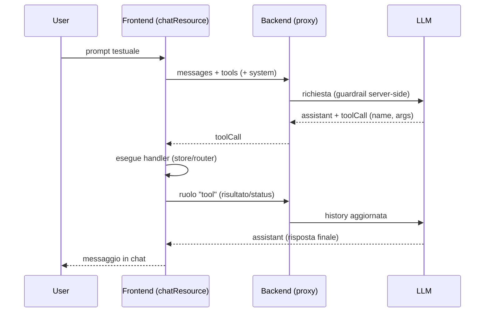

# 13 · Agentic UI & AI Assistants with Hashbrown
> 📖 cap.13 · pp.357-383 — *Modern Angular* v2.0.0

Gli assistenti AI migliorano la UX e abbattono i costi di supporto, ma implementarli porta con sé tanto lavoro tecnico ripetitivo: connessione ai vari LLM, tool calling, gestione dello streaming. **Hashbrown** (`@hashbrownai/*`, progetto open-source sostenuto da due esperti noti della community Angular) toglie di mezzo questa fatica e supporta i principali provider — Gemini (Google), GPT (OpenAI), Azure (Microsoft), Llama (Meta).

Il capitolo estende un'app esistente di flight-booking con tre scenari crescenti:
1. **Assistant con tool calling** (chat testuale che recupera dati e scatena azioni nel frontend).
2. **Generative UI**: l'LLM sceglie e renderizza componenti dentro la chat, non più solo testo.
3. **Natural language queries con code generation**: l'LLM genera JavaScript che gira in sandbox per trasformare i dati e produrre un chart.

## Setting up Hashbrown
> 📖 pp.357-360

Servono pochi pacchetti npm: il core framework-agnostic, il binding Angular e l'adapter del provider.

```bash
npm install @hashbrownai/{core,angular,google}
```

- `@hashbrownai/angular` → API Angular costruita sul core framework-agnostic (esiste anche un binding per React).
- `@hashbrownai/google` → accesso ai modelli Gemini di Google. Per altre famiglie di modelli ci sono pacchetti dedicati (es. `@hashbrownai/openai`).

L'accesso programmatico agli LLM richiede una **API key**, di solito legata a una licenza a pagamento; Gemini offre però un piano free generoso per i test, con key generabile in pochi clic da Google AI Studio. La key **non va mai usata direttamente nel frontend Angular**, altrimenti finirebbe pubblicata sul web: si interpone un backend snello tra frontend e LLM.

```ts
// Listing 13-1 — backend Express (tratto da hashbrown.dev, adattato)
import express from 'express';
import cors from 'cors';
import { Chat } from '@hashbrownai/core';
import { HashbrownGoogle } from '@hashbrownai/google';

const host = process.env['HOST'] ?? 'localhost';
const port = process.env['PORT'] ? Number(process.env['PORT']) : 3000;
const GOOGLE_API_KEY = process.env['GOOGLE_API_KEY'];
if (!GOOGLE_API_KEY) {
  throw new Error('GOOGLE_API_KEY is not set');
}

const app = express();
app.use(cors());
app.use(express.json());

app.post('/api/chat', async (req, res) => {
  const completionParams = req.body as Chat.Api.CompletionCreateParams;
  const response = HashbrownGoogle.stream.text({
    apiKey: GOOGLE_API_KEY,
    request: completionParams,
    // il backend può integrare o sovrascrivere le opzioni del frontend
    transformRequestOptions: (options) => {
      options.model = 'gemini-2.5-flash';            // forza il modello economico
      options.config = options.config || {};
      options.config.systemInstruction = `
        You are Flight42, a UI assistant that helps passengers with finding flights.
        - Voice: clear, helpful, and respectful.
        - Audience: passengers who want to find flights or have questions about booked flights.
        Rules:
        - Only search for flights via the configured tools
        - Never use additional web resources for answering requests
        - Do not propose search filters that are not covered by the provided tools
        - Do not propose any further actions
        - Provide enumerations as markdown lists
      `;
      return options;
    },
  });

  res.header('Content-Type', 'application/octet-stream');
  for await (const chunk of response) {
    res.write(chunk);   // streaming chunk-by-chunk
  }
  res.end();
});

app.listen(port, host, () => {
  console.log(`[ ready ] http://${host}:${port}`);
});
```

`transformRequestOptions` è il meccanismo chiave: il backend integra o sovrascrive le opzioni mandate dal frontend — importante perché queste impostazioni hanno **impatto diretto sui costi**. Qui impone il modello economico e tuttofare `gemini-2.5-flash` e una system instruction che limita rigidamente il modello alle ricerche voli, impedendo agli utenti di consumare risorse LLM costose per richieste fuori ambito. Prima di sovrascriverli, i valori originali del frontend vengono salvati (in `model` e `systemInstructions`), così il server può "negoziare" in modo controllato: su richiesta dell'utente, in casi selezionati, può passare a un modello più potente (e più costoso) o aggiustare la system instruction.

L'URL del server si configura al bootstrap dell'app via `provideHashbrown`:

```ts
// Listing 13-2
import { provideHashbrown } from '@hashbrownai/angular';

bootstrapApplication(AppComponent, {
  providers: [
    provideHttpClient(),
    provideHashbrown({
      baseUrl: 'http://localhost:3000/api/chat',
      middleware: [
        (req) => {
          console.log('[Hashbrown Request]', req);   // log/troubleshooting opzionale
          return req;
        },
      ],
    }),
  ],
});
```

Il `middleware` opzionale qui logga ogni richiesta al server nella console del browser: utile per capire come funziona il sistema e per il troubleshooting.

> [!tip]
> La API key sta **solo nel backend**. Il frontend parla con un proxy che fa da intermediario verso l'LLM e che applica guardrail server-side (scelta del modello, system instruction): è lì che si controllano costi e ambito.

## Using the chatResource
> 📖 pp.361-362

Hashbrown offre varie implementazioni della **Resource API** di Angular (vedi [[resource]]) per chattare con gli LLM. Per la chat testuale si usa `chatResource`.

```ts
// Listing 13-3
@Component({ /* … */ })
export class AssistantChatComponent {
  message = signal('');

  chat = chatResource({
    model: 'gemini-2.5-flash',
    system: `You are Flight42, a UI assistant that helps passengers with finding flights. […]`,
    tools: [
      findFlightsTool,
      toggleFlightSelection,
      showBookedFlights,
      getBookedFlights,
    ],
  });

  submit() {
    const message = this.message();
    this.message.set('');
    this.chat.sendMessage({ role: 'user', content: message });
  }
}
```

- Gli LLM sono **stateless**: `chatResource` rimanda l'intera chat history a ogni richiesta, così il modello può riferirsi ai messaggi precedenti (es. capire cosa significa "questo volo" se la conversazione ruota attorno al volo #4711).
- Supporta il **tool calling**: i tool passati in `tools` sono le funzionalità che il frontend espone (es. `findFlights` per le ricerche); il modello può richiederne l'invocazione.
- `chat.value()` contiene la chat history da mostrare; `sendMessage()` invia un messaggio utente.

```html
<!-- Listing 13-4 — render della chat history -->
@for (message of chat.value(); track $index) {
  <article class="msg assistant">
    <div class="avatar">{{ icons[message.role] }}</div>
    <div>
      <div class="bubble">
        {{ message.content }}
        @if (message.role === 'assistant') {
          @for (toolCall of message.toolCalls; track toolCall.toolCallId) {
            <div [title]="toolCall.args | json">
              Tool Call: {{ toolCall.name }}
            </div>
          }
        }
      </div>
    </div>
  </article>
}
```

`role` indica il mittente del messaggio (`assistant` = LLM, `user` = utente). I messaggi dell'assistant possono contenere richieste di tool call (`toolCalls`), ciascuna con `name` (es. `findFlights`) e gli `args` da passare (es. `{from: 'Graz', to: 'Hamburg'}`).

> [!tip]
> Mostrare "Tool Call: findFlights" va bene per gli sviluppatori, ma confonde l'utente finale. Conviene **tradurre la traccia tecnica** in qualcosa di leggibile come "Loading flights from Graz to Hamburg".

## Providing Tools
> 📖 p.363

I tool sono oggetti creati con `createTool`. Definiscono `name`, `description`, lo `schema` degli argomenti e un `handler`.

```ts
// Listing 13-5
import { createTool } from '@hashbrownai/angular';
import { s } from '@hashbrownai/core';

export const findFlightsTool = createTool({
  name: 'findFlights',
  description: `
    Searches for flights and redirects the user to the result page where
    the found flights are shown.
    Remarks:
    - For the search parameters, airport codes are NOT used but the city
      name. First letter in upper case.
  `,
  schema: s.object('search parameters for flights', {   // Skillet schema
    from: s.string('airport of departure'),
    to: s.string('airport of destination'),
  }),
  handler: async (input) => {
    const store = inject(FlightBookingStore);           // [[inject]] dentro l'handler
    const router = inject(Router);
    store.updateFilter({ from: input.from, to: input.to });
    router.navigate(['/flight-booking/flight-search']);
  },
});
```

- `name` deve essere univoco e conforme alle specifiche del modello (regola pratica: ciò che è valido come nome di variabile in TypeScript va bene anche qui).
- `description` è ciò che l'LLM usa per **decidere se il tool è rilevante** per il task corrente. Idem per le descrizioni testuali dentro lo schema.
- Lo `schema` è scritto in **Skillet**, il linguaggio di schema di Hashbrown (accessibile via `s`). Ricorda librerie come Zod ma è ridotto ai costrutti che gli LLM supportano in modo affidabile. È previsto in futuro anche il supporto a JSON Schema e un ponte verso Zod.
- Lo `handler` riceve l'oggetto definito dallo schema e delega alla logica di sistema (store, router). Può anche **restituire valori al modello**:

```ts
// Listing 13-6 — handler che ritorna dati al modello
export const getLoadedFlights = createTool({
  name: 'getLoadedFlights',
  description: `Returns the currently loaded/ displayed flights`,
  handler: () => {
    const store = inject(FlightBookingStore);
    return Promise.resolve(store.flightsValue());
  },
});
```

> [!warning]
> Skillet **non** descrive formalmente il valore di ritorno dei tool: il modello accetta qualsiasi forma di risposta. Se vuoi informarlo sulla struttura del risultato, descrivila **come testo libero** nella `description`.

## Under the Hood (tool calling)
> 📖 pp.364-365

Guardando i messaggi inviati all'LLM si capisce il meccanismo: la conversazione passa attraverso i ruoli (`user`, `assistant`, `tool`), e l'elenco dei tool con i relativi metadata viene appeso in fondo alla richiesta.

```jsonc
// Listing 13-7 — estratto del payload verso l'LLM
{
  "model": "gpt-5-chat-latest",
  "system": "You are Flight42, a UI assistant [...]",
  "messages": [
    { "role": "user", "content": "Ok, let's search for flights from Graz to Hamburg." },
    { "role": "assistant", "content": "",
      "toolCalls": [
        { "id": "call_AeFJ3xsnNw29EoQVo7hR9Qtu", "index": 0, "type": "function",
          "function": { "name": "findFlights",
                        "arguments": "{\"from\":\"Graz\",\"to\":\"Hamburg\"}" } }
      ] },
    { "role": "tool", "content": { "status": "fulfilled" },
      "toolCallId": "call_AeFJ3xsnNw29EoQVo7hR9Qtu", "toolName": "findFlights" },
    { "role": "assistant", "content": "Here are the available flights [...]",
      "toolCalls": [] }
  ],
  "tools": [
    { "name": "findFlights",
      "description": "Searches for flights [...]",
      "parameters": { /* JSON Schema derivato da Skillet */ } }
  ]
}
```

Sequenza dei ruoli:
- `user` → query testuale dell'utente.
- `assistant` → risponde con un **tool call** (nome del tool + argomenti).
- Hashbrown esegue il tool (search + cambio rotta).
- `tool` → Hashbrown riporta il completamento della chiamata; se il tool restituisce un risultato, lo include in questo messaggio.
- `assistant` → risposta finale all'utente.

L'elenco `tools` (descrizioni testuali + schema degli argomenti) viene trasferito affinché il modello **sappia quali tool ha a disposizione**.



## UI chat con uiChatResource
> 📖 pp.366-369

`uiChatResource` va oltre: oltre al tool calling, l'LLM può **rispondere con componenti** renderizzati direttamente nella chat, non più solo testo. È un rimpiazzo drop-in di `chatResource`.

```ts
// Listing 13-8
@Component({ /* … */ })
export class AssistantChatComponent {
  message = signal('');

  chat = uiChatResource({
    model: 'gpt-5-chat-latest',
    system: `You are a UI assistant that helps with finding flights […]`,
    tools: [findFlightsTool, getLoadedFlights, getBookedFlights],
    components: [flightWidget, messageWidget],   // componenti esposti all'LLM
  });

  submit() {
    const message = this.message();
    this.message.set('');
    this.chat.sendMessage({ role: 'user', content: message });
  }
}
```

I componenti vanno registrati in `components` (componenti Angular descritti via Skillet, come i tool — vedi sotto). **Con `uiChatResource` l'LLM risponde a ogni domanda con uno o più componenti**: per questo si registra anche un `messageWidget`, che riceve e mostra una semplice stringa.

Per renderizzare i componenti scelti dall'LLM si usa `hb-render-message`:

```html
<!-- Listing 13-9 -->
@for (message of messageModels(); track $index) {
  <article class="msg assistant">
    <div class="avatar">{{ message.icon }}</div>
    <div>
      <div class="bubble">
        @if (message.role === 'assistant') {
          <hb-render-message [message]="message" />
        } @else {
          <app-message [data]="message.contentString"></app-message>
        }
        @for (toolCall of message.toolCalls; track toolCall.toolCallId) {
          <!-- … render delle tool call, come in Listing 13-4 -->
        }
      </div>
    </div>
  </article>
}
```

`hb-render-message` serve solo per le risposte dell'assistant (ruolo `assistant`). Le richieste utente, qui, sono puramente testuali e stanno in `content`. Siccome `content` può essere anche un number o JSON, va convertito in stringa prima che `app-message` lo mostri; questa "proiezione" (più la scelta dell'icona per ogni ruolo) si fa con un [[computed]]:

```ts
// Listing 13-10
messageModels = computed(() =>
  this.chat.value().map((message) => ({
    ...message,
    contentString: String(message.content),
    icon: this.icons[message.role] || '❓',
    toolCalls: message.role === 'assistant' ? message.toolCalls : [],
  })),
);
```

## Dumb components con smart wrapper
> 📖 pp.370-371

I componenti offerti all'LLM sono **dumb component** oppure, come `flightWidget`, uno **smart wrapper** intorno a un dumb component (cfr. componenti e input/output in [[02-signal-based-components]]).

```ts
// Listing 13-11
@Component({
  selector: 'app-flight-widget',
  imports: [FlightCardComponent],
  template: `
    <div class="flight">
      <app-flight-card [item]="flight()" [selected]="isSelected()">
        <div>
          @if (isBooked()) {
            <button class="btn btn-default" (click)="checkIn()">Check in</button>
          } @else if (isSelected()) {
            <button class="btn btn-default" (click)="select(false)">Remove</button>
          } @else {
            <button class="btn btn-default" (click)="select(true)">Select</button>
          }
        </div>
      </app-flight-card>
    </div>
  `,
  styles: `
    .flight {
      margin: 20px 0;
    }
  `,
})
export class FlightWidgetComponent {
  router = inject(Router);
  store = inject(FlightBookingStore);

  flight = input.required<Flight>();
  status = input<'booked' | 'other'>('other');

  isBooked = computed(() => this.status() === 'booked');
  isSelected = computed(() => this.store.basket()[this.flight().id]);

  checkIn(): void { this.router.navigate(['/checkin', this.flight().id]); }
  select(selected: boolean): void { this.store.updateBasket(this.flight().id, selected); }
}
```

Il wrapper inoltra i suoi [[signal-input|input]] al dumb component wrappato e ne gestisce gli eventi, scatenando azioni negli store delle feature o cambi rotta. Punto chiave: l'input `status` (`'booked' | 'other'`) — l'LLM deve **derivarne il valore dalla storia della conversazione**; in base al valore il widget sceglie il pulsante da mostrare sul flight card: "Check in" per i voli prenotati, "Select"/"Remove" per i voli trovati in ricerca (aggiungi/rimuovi dal carrello). Come si vedrà a fine sezione, i modelli più piccoli ed economici (es. Gemini Flash) hanno bisogno di un aiuto per questo compito.

## Describing Components
> 📖 pp.371-372

I componenti si descrivono con `exposeComponent`: `name`, `description` (quando usarlo) e schema Skillet di ogni `input`.

```ts
// Listing 13-12
import { exposeComponent } from '@hashbrownai/angular';
import { s } from '@hashbrownai/core';

export const flightWidget = exposeComponent(FlightWidgetComponent, {
  name: 'flightWidget',
  description: `
    Displays a flight or flight ticket. Use this instead of textual
    descriptions of flights or tickets.
  `,
  input: {
    flight: FlightSchema,                       // delega a uno schema esistente
    status: s.enumeration(
      `Whether the flight is booked or not […]`,
      ['booked', 'other'],
    ),
  },
});
```

L'LLM usa la `description` per decidere **quando** usare il componente. Anche i singoli `input` vanno descritti: qui `status` è una `s.enumeration` con due valori possibili, mentre `flight` delega a uno schema riusabile già esistente.

```ts
// Listing 13-13 — schema riusabile
import { s } from '@hashbrownai/core';

export const FlightSchema = s.object('Flight to be displayed', {
  id: s.number('The flight id'),
  from: s.string('Departure city. No code but the city name'),
  to: s.string('Arrival city. No code but the city name'),
  date: s.string('Departure date in ISO format'),
  delay: s.number('If delayed, this represents the delay in minutes'),
});
```

## Under the Hood: Structured Output
> 📖 p.372

Per decidere quali componenti mostrare, Hashbrown istruisce l'LLM a rispondere **solo con documenti JSON** (structured output). Il JSON arriva come stringa in `content` e contiene i componenti da mostrare con i valori dei rispettivi input.

```jsonc
// Listing 13-14 — content = structured output (stringificato)
{
  "role": "assistant",
  "content": "{\"ui\":[{\"messageWidget\":{\"$props\":{\"data\":\"Yes, you have already booked a flight to France.\"}}},{\"flightWidget\":{\"$props\":{\"flightInfo\":{\"id\":2,\"from\":\"London\",\"to\":\"Paris\",\"date\":\"2025-12-05T21:15:10.716Z\",\"delay\":0,\"status\":\"booked\",\"delayInfo\":\"delayed\"}}}}]}",
  "toolCalls": []
}
```

I componenti possibili (con i loro input e descrizioni) vengono passati in una sezione separata di ogni richiesta come **JSON Schema derivato da Skillet**.

## Supporting Different Models
> 📖 p.373

Alcuni modelli (es. Google Gemini) **non supportano (ancora) la combinazione di structured output e tool calling**. Si risolve al bootstrap con la proprietà `emulateStructuredOutput`:

```ts
// Listing 13-15
bootstrapApplication(AppComponent, {
  providers: [
    provideHashbrown({
      baseUrl: 'http://localhost:3000/api/chat',
      emulateStructuredOutput: true,
    }),
  ],
});
```

Con `true`, Hashbrown definisce uno **pseudo-tool** che permette all'LLM di selezionare uno o più componenti dal set offerto, e istruisce il modello a rispondere chiamando quel tool.

## Applying Few-Shot Prompting
> 📖 pp.373-375

Per far rispondere sempre con testo (e, opzionalmente, uno o più componenti), e per aiutare i modelli più deboli ed economici (es. Gemini Flash), si arricchisce con esempi il system prompt della resource.

```text
// Listing 13-16 — estratto del system prompt
## Rules:
- Answer questions with the messageWidget to provide some text to the user.
- When appropriate, *also* answer with other components (widgets), e.g.,
  the flightWidget to display information about a flight or a ticket
- Instead of describing a flight, use the flightWidget
- Don't call the same tool more than once with the same parameters!

## EXAMPLE
- User: Which flights did I book?
- Assistant:
  - UI: messageWidget(You've booked these 3 flights)
  - UI: flightWidget({id: 0, from: '...', to: '...', ...})

## NEGATIVE EXAMPLE
Don't call the same tool several times in a row with the same parameters:
- User: Search for flights from A to B
- Assistant:
  - Tool: findFlights({from: 'A', to: 'B'})
  - Tool: findFlights({from: 'A', to: 'B'})
  - Tool: findFlights({from: 'A', to: 'B'})
```

Mettere esempi nel prompt migliora la qualità delle risposte: più esempi = **few-shot prompting**, un solo esempio = **one-shot prompting**. La stessa tecnica serve anche dentro la `description` di un input, per far inferire correttamente lo `status` (`booked`/`other`):

```ts
// Listing 13-17 — esempi dentro la description dell'enumeration
status: s.enumeration(
  `Whether the flight is booked or not.
   A flight has the status 'booked' **only** when retrieved
   via the tool 'getBookedFlights'.
   ## Example for inferring a status 'booked'
   - User: Which flights did I book?
   - Assistant:
     - Tool: getBookedFlights()
     - UI: flightWidget({flightInfo: { id: 0, ..., status: 'booked' }})
   ## Example for inferring a status 'other'
   - User: Which of the found flights is the earliest one?
   - Assistant:
     - Tool: getLoadedFlights()
     - UI: flightWidget({flightInfo: { id: 0, ..., status: 'other' }})
  `,
  ['booked', 'other'],
),
```

Gli esempi in **prosa** sono facili da scrivere e leggere, ma fragili: componenti o parametri citati potrebbero non esistere più. Hashbrown offre il tag template `prompt`, che verifica gli esempi (in un dialetto XML) contro i componenti effettivamente registrati:

```ts
// Listing 13-18
uiChatResource({
  system: prompt`
    <user>Hello</user>
    <assistant>
      <ui>
        <app-message data="How may I assist you?" />
      </ui>
    </assistant>
  `,
  components: [exposeComponent(MessageComponent, { /* ... */ })],
});
```

> [!warning]
> Il tag `prompt` (con validazione XML vs componenti registrati) funziona **solo per il system prompt nella resource**. Siccome in questo esempio il system prompt viene sovrascritto lato server per sicurezza, e servono comunque esempi dentro le descrizioni dei componenti, si resta vincolati agli **esempi in prosa** non validati.

## Natural Language Queries — Approach
> 📖 pp.376-377

Si va ancora oltre la selezione da un catalogo di componenti: l'app **genera codice** per fornire parti completamente dinamiche. Scenario: l'utente descrive a parole un report ("% di voli in ritardo vs. totale per giorno, ignorando l'orario, ordinati per data"), l'app trasforma i dati e mostra un chart. Per non compromettere la sicurezza, il codice generato gira in **sandbox**.

A prima vista lo scenario sembra risolvibile con i concetti già visti (carica i dati via tool calling, scegli un componente chart, renderizzalo). Il punto cruciale che però sfugge: tra il **recupero** dei dati e la **visualizzazione** serve una **trasformazione** (qui: aggregare totale voli e voli in ritardo per giorno e metterli in relazione). Gli LLM sono addestrati a continuare testo e rispondere, **non** a fare calcoli — però sono ottimi nel **descrivere cosa va fatto**. Quindi: lasciamo che l'LLM derivi i passi di elaborazione dalla richiesta, espressi come **codice JavaScript**.

```js
// Listing 13-19 — codice GENERATO dall'LLM per preparare i dati del chart
const routes = [
  { from: 'Graz', to: 'Hamburg' }, { from: 'Hamburg', to: 'Graz' },
  { from: 'Graz', to: 'New York' }, { from: 'New York', to: 'Graz' },
  { from: 'Paris', to: 'Hamburg' }, { from: 'Hamburg', to: 'Paris' },
  { from: 'Paris', to: 'Graz' }, { from: 'Graz', to: 'Paris' },
];

let flights = [];
routes.forEach((route) => {
  flights = flights.concat(loadFlights(route));   // funzione fornita dall'app
});

// Aggregate by date
const flightsByDate = {};
for (const flight of flights) {
  const date = flight.date.split('T')[0];          // ignora l'orario
  if (!flightsByDate[date]) {
    flightsByDate[date] = { total: 0, delayed: 0 };
  }
  flightsByDate[date].total++;
  if (flight.delay > 0) {
    flightsByDate[date].delayed++;
  }
}

// Create data sorted by date
const data = Object.keys(flightsByDate)
  .sort()
  .map((date) => {
    const total = flightsByDate[date].total;
    const delayed = flightsByDate[date].delayed;
    const percentage = ((delayed / total) * 100) || 0.1;
    return { name: date, value: percentage };
  });

generateChart({ data });   // sink fornito dall'app
```

Il codice delega a due funzioni fornite dall'app: `loadFlights` (recupera i dati) all'inizio e `generateChart` (sink che mostra il chart) alla fine. L'LLM **non genera solo codice**: decide anche quali funzioni dell'app il codice deve invocare. Le funzioni potrebbero anche restituire valori pre-aggregati, per rendere i report più efficienti.

## Implementation with Hashbrown
> 📖 pp.378-379

Due building block: `structuredCompletionResource` + una **runtime JavaScript**.

`structuredCompletionResource` manda una richiesta al modello e ne restituisce la risposta. A differenza di `chatResource`/`uiChatResource` è **stateless**: non è una conversazione lunga, ma una singola risposta a una richiesta concreta. Qui la risposta è un oggetto con un messaggio per l'utente **e** il codice generato. La resource inoltra il codice alla runtime via tool calling; la runtime lo **esegue in sandbox**, senza accesso diretto all'app.

```ts
// Listing 13-20
import {
  createRuntime,
  createRuntimeFunction,
  createToolJavaScript,
  structuredCompletionResource,
} from '@hashbrownai/angular';

@Component({
  selector: 'app-reporting',
  imports: [/* … */],
  templateUrl: './reporting.component.html',
  styleUrl: './reporting.component.css',
})
export class ReportingComponent {
  message = signal('');
  input = signal<string | undefined>(undefined);
  data = signal<DataItem[]>([]);

  runtime = createRuntime({
    functions: [
      createRuntimeFunction(/* ... */),   // loadFlights
      createRuntimeFunction(/* ... */),   // generateChart
    ],
  });

  generator = structuredCompletionResource({
    model: 'gpt-5-chat-latest',
    input: this.input,                     // signal: cambiando, ri-triggera la resource
    system: `
      You are Report42, a UI assistant that [...]
      Take the user's request [...] and generate JavaScript code that [...]
    `,
    schema: s.object(`Whether request was successful`, {
      type: s.enumeration(`Success or error?`, ['success', 'error']),
      message: s.string(`Additional information for the user`),
      code: s.string(`The generated JavaScript code`),
    }),
    tools: [
      createToolJavaScript({ runtime: this.runtime }),   // la runtime è registrata come tool
    ],
  });

  submit(): void {
    this.input.set(this.message());        // copia l'input → triggera la resource
  }
}
```

- Il [[signal]] `message` è legato a una textbox; `submit()` lo copia in `input`, che è il signal di input della resource → la fa partire.
- `createRuntime` riceve le funzioni che il codice generato può chiamare e crea la runtime JS; viene registrata come tool della resource via `createToolJavaScript`.
- Lo `schema` impone la struttura della risposta: esito (`success`/`error`), `message` per l'utente e `code` generato.

## Runtime Functions
> 📖 pp.380-381

`createRuntimeFunction` crea una funzione che il codice generato può chiamare nella runtime. Definisce `name`, `description`, `args` (schema input), `result` (schema output) e `handler`.

```ts
// Listing 13-21 — loadFlights: DATA SOURCE
createRuntimeFunction({
  name: 'loadFlights',
  description: `
    Searches for flights and returns them.
    ## Rule
    For the search parameters, airport codes are NOT used but the city name.
    First letter in upper case.
  `,
  args: s.object('search parameters for flights', {
    from: s.string('airport of departure'),
    to: s.string('airport of destination'),
  }),
  result: s.array(`loaded flights`, FlightSchema),   // qui il result È descritto via Skillet
  handler: async (input) => {
    const flightService = inject(FlightService);
    const result = flightService.find(input.from, input.to);
    return await firstValueFrom(result);
  },
});
```

Il modello valuta `description` e lo schema degli `args` per decidere se e come chiamare la funzione; grazie allo schema del `result` sa anche cosa aspettarsi come ritorno. Il `result` si appoggia allo schema centrale `FlightSchema` (Listing 13-22, identico al Listing 13-13).

```ts
// Listing 13-23 — generateChart: SINK
createRuntimeFunction({
  name: 'generateChart',
  description: `Creates a chart`,
  args: s.object(`Chart description`, {
    data: s.array(
      `name/value pairs to display in chart`,
      s.object(`a single name/value pair to display in the chart`, {
        name: s.string(`name`),
        value: s.number(`the value to display`),
      }),
    ),
  }),
  handler: async (input) => {
    this.data.set(input.data);   // mette i dati della runtime in un signal del componente
  },
});
```

Dettaglio importante: a differenza di `loadFlights` (data source), `generateChart` è un **sink** — il suo handler inoltra i dati ricevuti direttamente al componente, mettendoli nel signal `data`. Il chart vero è renderizzato con **chart.js** dentro un [[effect]] (non mostrato nel libro).

> [!warning]
> Nelle runtime function il `result` **è** descritto via Skillet (es. `s.array(..., FlightSchema)`), così il modello sa cosa aspettarsi come ritorno — a differenza dei tool del `chatResource`, dove il valore di ritorno non era schematizzato.

## System Prompt con One-Shot Prompting
> 📖 pp.382-383

Il system prompt di `structuredCompletionResource` definisce i guardrail per la generazione del codice: i passi chiave, un esempio e regole generali.

```text
// Listing 13-24 — system prompt (estratto)
You are Report42, a UI assistant that helps passengers with creating and
displaying a chart with flight information.
- Voice: clear, helpful, and respectful.
- Audience: power users who want to get a chart

## Your Tasks
1. Take the user's request for a chart and generate JavaScript code that ...
   a) uses the tool _loadFlights_ as often as needed to retrieve the needed data
   b) Aggregate the received data according to the user's request. Replace 0 with 0.1
   c) Pass the data to the tool _generateChart_ to display a chart
2. Pass the JavaScript code to the runtime

## Example for the JavaScript Code
- User: How many flights are there from Graz to London and from Graz to Munich?
- Assistant
  - Code:
    const flights1 = loadFlights({ from: 'Graz', to: 'London' });
    const flights2 = loadFlights({ from: 'Graz', to: 'Munich' });
    const data = [
      { name: 'Graz - London', value: flights1.length },
      { name: 'Graz - Munich', value: flights2.length },
    ];
    generateChart({ data });
  - Answer: Here is your chart.

## Rules
- Never use additional web resources for answering requests
- **Always** pass the generated code to the JavaScript runtime
```

Fornire un solo esempio (**one-shot prompting**) migliora la performance del modello su task come questo.

> [!tip]
> Code generation = l'LLM descrive *come* trasformare i dati (cosa in cui è bravo), non *fa* il calcolo. Il codice gira in **sandbox** con una **allow-list esplicita** di funzioni (`loadFlights` come source, `generateChart` come sink), uno schema strutturato per la risposta ed esempi per la consistenza.

## 🔁 Ripasso lampo

**1.** Perché la API key dell'LLM non va nel frontend e cosa permette di fare `transformRequestOptions` nel backend?
> [!success]- Risposta
> Una key nel frontend verrebbe pubblicata sul web ed esposta a chiunque; si interpone perciò un backend proxy snello tra frontend e LLM, e la key vive solo lì. `transformRequestOptions` permette al backend di **integrare o sovrascrivere** le opzioni mandate dal frontend (es. forzare il modello economico `gemini-2.5-flash`, imporre una system instruction che limita l'ambito): è il punto in cui si applicano i guardrail server-side e si controllano i costi.

**2.** Cosa distingue `chatResource`, `uiChatResource` e `structuredCompletionResource`? Quale è stateless e perché?
> [!success]- Risposta
> `chatResource` = chat testuale con tool calling. `uiChatResource` = drop-in di `chatResource` che oltre ai tool fa **rispondere con componenti** (generative UI). Entrambe sono conversazioni: mantengono la chat history e la rimandano al modello a ogni richiesta. `structuredCompletionResource` è **stateless**: non è una conversazione ma una **singola** richiesta→risposta (qui un oggetto con messaggio + codice generato), quindi non serve trascinarsi dietro la history.

**3.** Cosa definisce `createTool` (name/description/schema/handler) e perché la `description` è critica per l'LLM? Skillet descrive anche il valore di ritorno?
> [!success]- Risposta
> `createTool` definisce `name` (univoco, valido come identificatore TS), `description`, `schema` Skillet degli argomenti e `handler` (esegue il tool, può iniettare con `inject` e restituire valori al modello). La `description` (e i testi nello schema) è ciò con cui l'LLM **decide se il tool è rilevante** per il task. Skillet **non** descrive il valore di ritorno dei tool del `chatResource`: per informare il modello sulla struttura del risultato si scrive testo libero nella `description`.

**4.** Cos'è la generative UI con `exposeComponent` + `hb-render-message`? A cosa serve `emulateStructuredOutput`?
> [!success]- Risposta
> `exposeComponent` descrive un componente Angular per l'LLM (`name`, `description` su quando usarlo, schema Skillet di ogni `input`); l'LLM risponde scegliendo i componenti via **structured output** (JSON), che `hb-render-message` renderizza nella chat. `emulateStructuredOutput: true` è il fallback per i modelli (es. Gemini) che **non supportano structured output + tool calling insieme**: Hashbrown definisce uno pseudo-tool con cui il modello seleziona i componenti.

**5.** Differenza tra one-shot e few-shot prompting? Dove si possono mettere gli esempi e cosa fa il tag template `prompt`?
> [!success]- Risposta
> **One-shot** = un solo esempio nel prompt; **few-shot** = più esempi. Migliorano la qualità delle risposte, soprattutto dei modelli più deboli. Gli esempi si mettono nel **system prompt** della resource e/o dentro la `description` di un input (es. per inferire lo `status`). Il tag template `prompt` valida gli esempi (in un dialetto XML) contro i componenti **registrati**, evitando esempi che citano componenti/parametri inesistenti; funziona però **solo** per il system prompt della resource, non per le descrizioni dei componenti né se il prompt è sovrascritto lato server.

**6.** Nel code generation, che ruolo hanno `createRuntime`, `createRuntimeFunction` e `createToolJavaScript`? Perché l'esecuzione avviene in sandbox?
> [!success]- Risposta
> `createRuntimeFunction` definisce una singola funzione che il codice generato può chiamare (`name`, `description`, `args`, `result` schematizzato, `handler`) — es. `loadFlights` (source) e `generateChart` (sink). `createRuntime` raccoglie queste funzioni e crea la runtime JS. `createToolJavaScript` registra la runtime come **tool** della resource, così l'LLM può inoltrarle il codice. L'esecuzione è in **sandbox** per sicurezza: il codice generato dall'LLM non ha accesso diretto all'app, solo all'**allow-list** di funzioni esposte.

**In sintesi:**
- **Hashbrown** connette Angular a più provider LLM e gestisce il plumbing ripetitivo; sicurezza e costi si controllano con un **backend proxy** (system instruction, scelta del modello via `transformRequestOptions`).
- **Tool calling** trasforma la chat in un'interfaccia che recupera dati e scatena azioni reali: `createTool` + schema **Skillet** + descrizioni testuali rendono le chiamate affidabili. Conviene tradurre le tracce tecniche in messaggi user-friendly.
- **Generative UI** (`uiChatResource` + `exposeComponent`) fa scegliere all'LLM componenti predefiniti via **structured output**, con `emulateStructuredOutput` come fallback e **few/one-shot prompting** per i modelli più deboli.
- **Code generation** (`structuredCompletionResource` + runtime JS) per scenari dinamici: l'LLM genera JavaScript per le trasformazioni, eseguito in **sandbox** con allow-list di funzioni (data source / sink) e schema strutturato per la risposta.
