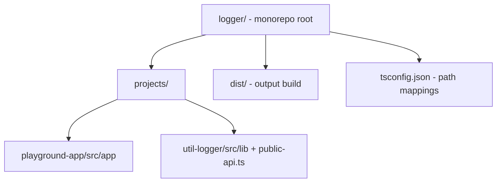
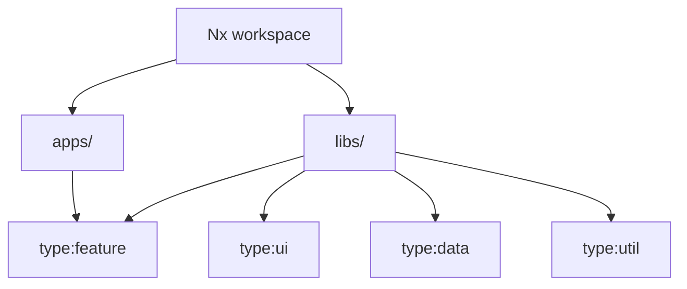

# 14 · Monorepos & Reusable Libraries
> 📖 cap.14 · pp.384-399 — *Modern Angular* v2.0.0

Con un singolo progetto Angular i team raggiungono presto i propri limiti quando il codice cresce. La risposta sono i **monorepo**: un'unica repo che raggruppa più applicazioni e **librerie riutilizzabili**. Le librerie servono a sotto-strutturare un sistema grande (vedi i moduliths del [[08-sustainable-architectures|cap.8]]) e, quando servono altrove, si **pubblicano via npm**.

Il capitolo parte dalla **Angular CLI** (monorepo manuale, build/publish) e poi passa a **Nx**, più potente: build incrementali, module boundaries, cache distribuita e parallelizzazione.

> [!note] Monorepo ≠ solo pubblicazione
> I monorepo non servono solo per creare librerie da pubblicare. In progetti molto grandi suddividono la soluzione complessiva in app/librerie più piccole, più facili da governare. In questo scenario le librerie **non vanno pubblicate su npm**: sono consumate localmente dalle app del monorepo. Termine alternativo a monorepo: **workspace**.

## Angular CLI-based Repos — Creating a Monorepo
> 📖 pp.384-385

Dal punto di vista della CLI un monorepo è un normale progetto Angular. La differenza è che **non vogliamo il `src` centrale**: si genera con `--create-application false`, poi si aggiungono app e librerie dentro `projects/`.

```bash
# Crea il monorepo senza la cartella src centrale
ng new logger --create-application false
cd logger

# Aggiunge librerie e applicazioni (usa i default suggeriti dalla CLI)
ng g lib util-logger
ng g app playground-app
```

Struttura risultante (Listing 14-1): app sotto `projects/<app>/src/app`, lib sotto `projects/<lib>/src/lib` con un `public-api.ts`.



> [!warning] Gotcha
> In un monorepo ogni comando CLI deve indicare **a quale subproject si riferisce** con `--project` (o come argomento posizionale per serve/build):
> ```bash
> ng generate component MyComponent --project playground-app
> ng generate component OtherComponent --project util-logger
> ng serve playground-app -o
> ng build playground-app
> ng build util-logger
> ```

## Structure of Libraries
> 📖 pp.386-388

Come le app, le librerie sono file TypeScript (componenti, servizi, ...) sotto `src/lib`. Una lib contiene anche `ng-package.json`, `package.json` e i `tsconfig.lib*.json` (Listing 14-3). Generiamo un servizio `Logger`:

```bash
ng g service logger --project util-logger
```

> [!info] Angular 22+
> `@Injectable({ providedIn: 'root' })` ≡ `@Service()` (Angular 22). Dettagli in [[service]].

```ts
// projects/util-logger/src/lib/logger.ts
import { Injectable } from '@angular/core';

@Injectable({
  providedIn: 'root',
})
export class Logger {
  log(message: string): void {
    const date = new Date().toISOString().substr(0, 10);
    console.log(`[${date}] ${message}`);
  }
}
```

Perché il servizio sia usabile da fuori va **esportato dal `public-api.ts`**, l'entry point della libreria:

```ts
// projects/util-logger/src/public-api.ts
[...]
export * from './lib/logger';
```

L'entry point è configurato in `ng-package.json` (insieme a `dest`, la cartella dove finisce il pacchetto durante la build):

```json
{
  "$schema": "../../node_modules/ng-packagr/ng-package.schema.json",
  "dest": "../../dist/util-logger",
  "lib": {
    "entryFile": "src/public-api.ts"
  }
}
```

Prima di pubblicare si cura il `package.json` della libreria (Listing 14-7):

```json
{
  "name": "@my/util-logger",
  "version": "0.0.1",
  "peerDependencies": {
    "@angular/common": ">= 11.0.0",
    "@angular/core": ">= 11.0.0"
  },
  "dependencies": {
    "tslib": "^2.0.0"
  }
}
```

- **`name`** — nome con cui il pacchetto è pubblicato e installato. Può avere uno **scope** introdotto con `@` (es. `@my`): mette ordine indicando da quale area arriva il pacchetto (spesso nome azienda/progetto) e fa sì che solo chi ha i diritti possa pubblicare sotto quello scope.
- **`version`** — a ogni pubblicazione serve un numero **ancora disponibile** (non riusato).
- **`peerDependencies`** — dipendenze che il consumer deve installare a parte; supportano range con espressioni booleane. **Da preferire** alle `dependencies` perché non impongono una versione precisa al consumer.
- **`dependencies`** — installate insieme al pacchetto.

> [!warning] Gotcha
> A parte `tslib` (richiesto da TypeScript), l'uso di una `dependency` "convenzionale" va **autorizzato esplicitamente** in `ng-package.json` con `allowedNonPeerDependencies`, altrimenti la CLI non la consente (protezione da uso accidentale):
> ```json
> {
>   "allowedNonPeerDependencies": ["sha-256-js"]
> }
> ```

## Trying Out the Library in the Monorepo
> 📖 pp.389-390

I building block delle librerie si testano come gli altri (vedi [[07-testing-with-vitest|cap.7]]), indicando il nome della lib:

```bash
ng test util-logger
```

Per usare la lib in altri subproject, la CLI imposta dei **path mapping** in `tsconfig.json` (root del monorepo). Di default puntano a `dist/` (Listing 14-10), quindi richiederebbero di **ricompilare la lib dopo ogni modifica** — tedioso ed error-prone. Meglio farli puntare al **sorgente** (al `public-api`), riusando lo scope di `package.json`:

```jsonc
// tsconfig.json (root) — meglio puntare al sorgente, non a dist/
"paths": {
  "@my/util-logger": [
    "projects/util-logger/src/public-api"
  ]
}
```

Tutto ciò che il `public-api` esporta diventa importabile dagli altri subproject tramite il nome mappato — niente più path relativi lunghi e illeggibili:

```ts
import { Logger } from '@my/util-logger';
```

> [!warning] Gotcha
> **Dentro la libreria stessa** non usare il proprio path mapping né importare dal proprio `public-api`: si creano **riferimenti circolari**. Dopo aver cambiato i path mapping, **riavvia l'IDE**.

Prova: si inietta `Logger` nell'`App` di `playground-app` (qui in stile costruttore classico):

```ts
// projects/playground-app/src/app/app.component.ts
import { Component } from '@angular/core';
import { Logger } from '@my/util-logger';   // Add

@Component({
  selector: 'app-root',
  templateUrl: './app.component.html',
  styleUrls: ['./app.component.css'],
})
export class AppComponent {
  title = 'playground-app';
  constructor(private logger: Logger) {      // Add
    logger.log('Manfred was here!');
  }
}
```

Lanciando `ng serve playground-app -o` il messaggio compare nella console JavaScript.

## Building and Publishing the npm Package
> 📖 pp.390-392

Prima di pubblicare, assicurati che il `package.json` della lib (es. `projects/util-logger/package.json`) abbia un **numero di versione univoco**, altrimenti la pubblicazione fallisce. Poi build e publish:

```bash
# Build di produzione → il pacchetto finisce in dist/util-logger
ng build util-logger --prod

# Pubblica sul registry npm pubblico
npm publish dist/util-logger
```

In alternativa puoi usare un **registry npm privato** (in-house). Se non ne hai uno, **Verdaccio** è un server npm gratuito e leggerissimo, eseguibile in locale o come servizio Windows / daemon Linux:

```bash
npm i -g verdaccio
verdaccio
# Verdaccio stampa il suo indirizzo, di default http://localhost:4873

# Al primo avvio crea un utente npm
npm adduser --registry http://localhost:4873

# Pubblica sul registry privato
npm publish dist/util-logger --registry http://localhost:4873
```

> [!tip] Take-away
> Per non ripetere `--registry` a ogni `npm publish`, crea un `.npmrc` (formato .ini) nella root del progetto. Lo puoi mettere **sotto version control** così vale per tutto il team:
> ```ini
> registry=http://localhost:4873
> # oppure un registry per singolo scope:
> @my:registry=http://localhost:4873
> ```

## Consuming the npm Package
> 📖 p.392

Il consumer installa il pacchetto con `npm install` nella propria app Angular e lo usa come visto sopra:

```bash
npm install @my/util-logger --registry http://localhost:4873
# Se ha già configurato il default registry, --registry si può omettere
```

> [!note] Fallback al registry pubblico
> Se si richiede un pacchetto che Verdaccio non conosce, di default delega al **registry npm pubblico** e lo recupera da lì.

## Faster Builds with Nx — Creating an Nx Workspace
> 📖 pp.393-394

Il limite della soluzione CLI: gli sviluppatori devono **sapere quali app sono cambiate** e lanciare a mano la build giusta; il build server, per sicurezza, ricostruisce e testa tutto. Meglio lasciare che sia il **tooling** a capire cosa è cambiato — p.es. calcolando un **hash** dei file sorgente che confluiscono in ogni app: se l'hash cambia, quell'app va ricostruita/ritestata.

**Nx** implementa questa idea e aggiunge molto altro. Supporta anche React e backend Node.js, e integra tool comuni (Jest, Cypress, Playwright, Verdaccio, Storybook) senza setup manuale. Per gli sviluppatori Angular è naturale: la **Nx CLI** si usa come la Angular CLI, basta sostituire `ng` con `nx` (`nx build`, `nx serve`, `nx g app`, `nx g lib`, ...).

```bash
npm i -g nx

# Crea un nuovo workspace Nx (rispondi Enter a tutte le domande per i default)
npx create-nx-workspace@latest my-project
```

> [!note] Migrare o ricreare?
> Esistono script per **migrare** workspace CLI a Nx, ma potrebbero non attivare tutte le feature. L'autore consiglia di **creare un nuovo workspace Nx** e, se serve, copiarci dentro il sorgente esistente.

Convenzione Nx: app in `apps/`, lib in `libs/`. Al prompt del generator scegli `@nx/angular:application` per le app e `@nx/angular:library` per le lib:

```bash
nx g app apps/appName
nx g lib libs/libName
```



> [!warning] Gotcha
> Di default Nx crea librerie **internal**: non pubblicabili, usate solo nel monorepo. Per pubblicarne una servono `--publishable` e `--importPath` (quest'ultimo definisce il nome del pacchetto npm usato negli import):
> ```bash
> nx g lib libs/libName --publishable --importPath @my-company/lib-name
> ```

Il comando `nx graph` mostra il **grafo delle dipendenze** tra app e librerie.

## Module Boundaries
> 📖 pp.395-396

Come Sheriff (vedi [[08-sustainable-architectures]]), anche Nx permette regole su **chi può dipendere da cosa** — i cosiddetti **module boundaries**, definiti però **a livello di libreria/applicazione** (non per cartella). Si configura la regola ESLint `@nx/enforce-module-boundaries` in `eslint.config.js`, dichiarando i `depConstraints` per `sourceTag`:

```js
// eslint.config.js
[...]
'@nx/enforce-module-boundaries': [
  'error',
  {
    depConstraints: [
      {
        sourceTag: 'domain:miles',
        onlyDependOnLibsWithTags: ['domain:miles', 'domain:shared'],
      },
      {
        sourceTag: 'domain:shared',
        onlyDependOnLibsWithTags: ['domain:shared'],
      },
      {
        sourceTag: 'type:app',
        onlyDependOnLibsWithTags: ['type:feature', 'type:ui', 'type:data', 'type:util'],
      },
      {
        sourceTag: 'type:feature',
        onlyDependOnLibsWithTags: ['type:ui', 'type:data', 'type:util'],
      },
      {
        sourceTag: 'type:ui',
        onlyDependOnLibsWithTags: ['type:data', 'type:util'],
      },
      {
        sourceTag: 'type:data',
        onlyDependOnLibsWithTags: ['type:util'],
      },
      {
        sourceTag: 'type:util',
        onlyDependOnLibsWithTags: [],
      },
    ],
  },
],
```

Sono le stesse restrizioni per **layer e domini** introdotte con Sheriff nel [[08-sustainable-architectures|cap.8]]. I tag si dichiarano nel `project.json` della lib/app (Nx lo crea con un array `tags` vuoto da estendere):

```jsonc
// libs/miles/feature-manage/project.json
[...]
"tags": ["domain:miles", "type:feature"],
[...]
```

Violare le regole (es. una UI lib che accede a una feature) genera un **errore di linting**, eseguibile da IDE o da riga di comando:

```bash
nx lint <project-name>

# Per più progetti o per tutti:
nx run-many -t lint -p flights,miles
nx run-many -t lint --all
```

## Nx with Sheriff and Detective
> 📖 p.397

I module boundaries di Nx lavorano **per libreria/applicazione**. Se servono regole **più granulari, per-cartella**, si combina **Sheriff** con Nx; **Detective** funziona con Nx per **visualizzare** setup folder-based. Entrambi sono trattati nel [[08-sustainable-architectures|cap.8]] e nel [[19-forensic-architecture-analysis|cap.19]].

Collegamenti: [[08-sustainable-architectures]] (Sheriff, Detective, moduliths) · [[19-forensic-architecture-analysis]].

## Incremental Builds with Nx
> 📖 p.397

Lo stesso grafo delle dipendenze alimenta le **build incrementali** offerte out of the box. Con `nx build`, se i sorgenti che confluiscono nell'app non sono cambiati, il risultato arriva **subito dalla cache locale** (cartella `.nx`, ignorata dal `.gitignore`):

```bash
nx build miles

# Ricostruire più progetti o tutti (la cache scatta comunque se nulla è cambiato):
npx nx run-many -t build -p flights,miles
npx nx run-many -t build --all
```

Anche unit test, E2E e linting sono incrementali; Nx li **cacha a livello di libreria**: spezzare l'app in più librerie migliora le performance.

> [!warning] Gotcha
> Lo stesso sarebbe possibile per `nx build` rendendo le lib **buildable** (`nx g lib myLib --buildable`), ma in pratica **raramente conviene**: i rebuild incrementali a livello di applicazione sono preferibili.

## Distributed Cache with Nx Cloud
> 📖 p.397

Di default la cache è **locale**. Per andare oltre, una **cache distribuita** condivisa da tutto il team e dal build server permette di beneficiare anche delle build già fatte da altri. La offre **Nx Cloud** (add-on commerciale del Nx gratuito; self-hostabile se non si possono usare provider cloud). Per connettere il workspace basta un comando:

```bash
npx nx connect-to-nx-cloud
```

## Even Faster: Parallelization with Nx Cloud
> 📖 pp.398-399

Per accelerare ulteriormente, Nx Cloud **parallelizza** i task di build. Il grafo delle dipendenze stabilisce l'ordine dei task e quali si possono eseguire in parallelo. Si usano nodi distinti: un **main node** coordina, più **worker node** eseguono i singoli task in parallelo. Nx può perfino generare gli **script CI** che avviano i nodi:

```bash
# Genera un workflow per GitHub (supporta anche --ci circleci e --ci azure)
nx generate @nx/workspace:ci-workflow --ci github
```

Gli script specificano numero di worker e processi paralleli per worker, e dividono i comandi in tre gruppi: **inizializzazione sequenziale**, comandi paralleli sul **main node**, comandi paralleli sugli **agent**. Si attivano quando cambia il branch `main` (push diretto o merge di una PR).

> [!tip] Take-away
> Lo stesso **dependency graph** che disegna `nx graph` è il motore di tutto Nx: module boundaries, build/test/lint **incrementali** con cache, cache **distribuita** e **parallelizzazione**. Più spezzi in librerie ben confinate, più ne guadagni.

## 🔁 Ripasso lampo
1. Perché si crea il monorepo con `ng new logger --create-application false`? Come si generano poi app e librerie?
2. Cos'è il `public-api.ts` e dove si configura l'entry point di una libreria?
3. Perché far puntare i path mapping al **sorgente** anziché a `dist/`? E perché non usare il proprio path mapping **dentro** la libreria?
4. Differenza tra `peerDependencies` e `dependencies` in una lib, e a cosa serve `allowedNonPeerDependencies`?
5. Come si pubblica su un registry privato (Verdaccio) e come si evita di ripetere `--registry`?
6. Su quale livello operano i module boundaries di Nx e quando si combina con Sheriff?
7. Cosa rende possibile, in Nx, build incrementali, cache distribuita e parallelizzazione?

**Take-away del capitolo:**
- Un progetto Angular può essere un **monorepo/workspace** che raggruppa più app eseguibili e **librerie riutilizzabili**; le lib si pubblicano come pacchetti npm o si consumano solo localmente.
- Con la **Angular CLI**: `ng new --create-application false`, `ng g lib`/`ng g app`, export dal `public-api.ts`, path mapping al sorgente, `ng build --prod` + `npm publish` (anche su Verdaccio).
- **Nx** dà più comodità e build più veloci: stessa ergonomia della CLI (`nx` al posto di `ng`), **module boundaries** via ESLint + tag, integrazione con tool comuni, e build/test/lint **incrementali** basati sul dependency graph.
- **Nx Cloud** aggiunge **cache distribuita** e **parallelizzazione** dei task su main/worker node, con script CI generati.
