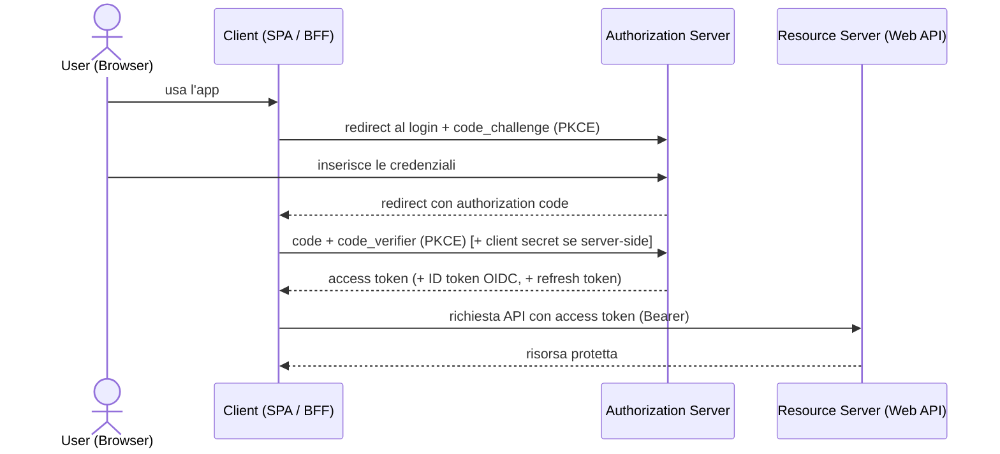
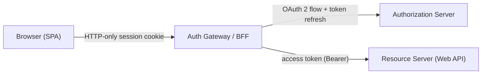

# 16 · Modern Patterns for Authentication & Authorization
> 📖 cap.16 · pp.401-410 — *Modern Angular* v1.0.4

Poche applicazioni gestionali fanno a meno dell'autenticazione. Il capitolo presenta due varianti: la classica **cookie-based authentication** e la **token-based security** con OAuth 2 e OpenID Connect (OIDC). La buona notizia: l'autenticazione moderna si implementa **soprattutto sul server**. Sul frontend non scrivi quasi codice, ma devi capire i concetti per discuterli con i colleghi backend. Per questo il capitolo è più **concettuale** degli altri.

> [!tip] Take-away
> Nelle SPA la **sicurezza va sempre imposta sul backend**. Guard e interceptor lato client (vedi [[12-initialization-route-changes]]) sono questioni di *usability*, non di sicurezza: il vero controllo lo fa il server.

## Cookie-based Authentication
> 📖 pp.401-402

I cookie sembrano antiquati, ma grazie ai **security attribute** introdotti negli ultimi anni sono oggi l'approccio preferito per l'autenticazione in molti scenari. Il client non può influenzare questi attributi: li imposta il **server** quando emette il cookie.

### Security-Attributes for Cookies

- **`HttpOnly`** — il cookie **non è leggibile da JavaScript**: codice malevolo non può rubarlo direttamente.
- **`Secure`** — il cookie viaggia **solo su HTTPS**.
- **`SameSite`** — limita l'invio del cookie nelle richieste **cross-origin**: se un sito compromesso carica la tua pagina in un iframe o le invia un form, il browser non allega i cookie.

Dal punto di vista del client il flusso è semplice:

1. Il client chiama un'API.
2. L'API autentica l'utente ed **emette un cookie**.
3. Il client chiama altre API: il browser **allega automaticamente** i cookie, che indicano all'API quale utente sta facendo la richiesta.

Nel passo 2 l'autenticazione può avvenire via username/password, oppure il backend può delegare a una identity solution esistente (es. Active Directory) e ricevere un **security token firmato** con le informazioni utente.

### Cookies and XSRF
> 📖 p.402

**Cross-Site Request Forgery (CSRF/XSRF)** è un attacco in cui un aggressore fa scatenare a un utente autenticato un'azione a sua insaputa:

1. L'utente fa login sulla tua web app e riceve un cookie.
2. Visita una pagina controllata dall'aggressore.
3. Quella pagina accede alla tua web app (es. un form che invia dati al tuo sito, o un link con certi parametri).
4. L'utente invia il form / segue il link: poiché il browser **allega il cookie**, l'azione viene eseguita a suo nome.

I cookie **`SameSite`** già limitano molto questo attacco. Un'ulteriore mitigazione sono gli **XSRF token** (da non confondere con i security token della sezione successiva): stringhe casuali che l'app Angular riceve dal backend e deve includere nelle **richieste state-changing** (POST/PUT/DELETE) verso la stessa origin, provando così che la richiesta proviene davvero da lei.

`HttpClient` implementa questa protezione **out of the box**: alla load si aspetta il token in un cookie `XSRF-TOKEN`, ne memorizza il valore e lo rispedisce a ogni richiesta nell'header `X-XSRF-TOKEN`. Sul server devi solo: emettere il cookie `XSRF-TOKEN` e verificare l'header `X-XSRF-TOKEN` a ogni richiesta successiva, emettendo un **nuovo token imprevedibile dopo ogni login**.

```ts
// app.config.ts
import { ApplicationConfig } from '@angular/core';
import { provideHttpClient, withXsrfConfiguration } from '@angular/common/http';

export const appConfig: ApplicationConfig = {
  providers: [
    provideHttpClient(
      withXsrfConfiguration({
        cookieName: 'My-Xsrf-Cookie',   // nomi cookie/header personalizzati
        headerName: 'My-Xsrf-Header',
      }),
    ),
  ],
};
```

Una seconda linea di difesa è validare gli header `Origin`/`Referer` inviati dal browser.

> [!warning] Gotcha
> `Origin`/`Referer` possono **mancare per motivi legittimi**: privacy tool, estensioni, proxy aziendali li possono rimuovere, e client vecchi/bloccati non li inviano affatto. Il server deve trattare l'assenza come **inconcludente**, non rifiutare la richiesta, altrimenti taglia fuori utenti validi.

## Token-based Security
> 📖 pp.403-406

Spesso bisogna integrare identity solution esistenti (Active Directory, LDAP) per il **single sign-on**, e il client deve ottenere il diritto di accedere ai servizi **per conto** dell'utente loggato. I **security token** risolvono questi requisiti con eleganza.

> [!warning] Gotcha
> Sia OAuth 2 sia OpenID Connect devono girare **su HTTPS** per essere sicuri. (Le demo del libro lo omettono solo per semplicità.)

### OAuth 2
> 📖 pp.404-405

OAuth (2006, Twitter e Ma.gnolia) e il suo successore **OAuth 2** nascono per permettere a un utente di **delegare parte dei propri diritti a un client senza condividere la password**. Oggi sono usati da Google, Facebook, Microsoft, Salesforce, ecc., sempre più non solo per la delega di diritti (**authorization**) ma anche per il single sign-on (**authentication**).

Vista d'insieme: il client **reindirizza** l'utente a un **Authorization Server** per il login. Una volta autenticato, il client riceve un **access token** che gli dà accesso ai servizi del backend — i **Resource Server** — per conto dell'utente. L'access token comunica al resource server l'utente, i diritti esercitabili e metadati come issuer, data di emissione e scadenza.

Vantaggi:

- Un **account utente centrale** per più client e servizi.
- Il login avviene sull'authorization server: il client **non vede mai la password**.
- L'autenticazione è **disaccoppiata** dal client e integrabile con identity solution esistenti.
- I token aumentano la flessibilità: un servizio può passarli a un altro per dimostrare di agire per conto dell'utente, o scambiarli per token validi in un altro security domain.
- Funziona **senza cookie**: il client accede anche a servizi su altri server (diversa `Origin`); evitare i cookie limita certi attacchi.

Il **formato** dell'access token e la sua validazione sono dettagli implementativi che OAuth 2 non specifica. Spesso si usano **firme digitali** (così il resource server verifica facilmente che il token venga da un authorization server fidato); in alternativa il token può essere un semplice **ID imprevedibile**, col resource server che ricontatta l'authorization server.

### Authenticating Users with OpenID Connect
> 📖 pp.405-406

**OpenID Connect (OIDC)** estende OAuth 2 definendo come i client ottengono informazioni sugli utenti — aspetto che OAuth 2 non copre (l'access token può persino non essere leggibile dal client). OIDC introduce un **ID token** che il client riceve **in aggiunta** all'access token:

- **access token** → per accedere al **backend**.
- **ID token** → il client legge **direttamente** le info utente.

A differenza degli access token, la struttura degli **ID token è prescritta**: sono **sempre JSON Web Token (JWT)**, firmabili e/o cifrabili. OIDC definisce inoltre uno **Userinfo endpoint**: un servizio HTTP che, presentando l'access token, restituisce ulteriori dati sull'utente (indirizzo, foto profilo, …). Quali claim stiano già nell'ID token e quali vadano richiesti via Userinfo è una scelta di configurazione dell'identity solution.

### JSON Web Token
> 📖 pp.405-407

Un **JWT** contiene un oggetto JSON di **claim**: coppie nome/valore che descrivono un soggetto (es. un utente) o il token stesso (validità, audience, …). L'issuer può firmare e/o cifrare l'insieme di claim. Un JWT firmato è composto da **tre sezioni BASE64 separate da un punto**:

```text
eyJ0eXAiOiJKV1QiLCJhbGciOiJSUzI1NiJ9 . eyJuYmYiOjEz[...]BlbmlkIn0 . Nt5pBRqGvDFn[...]1205awFjw
```

1. **Header** — 2. **claims set** — 3. **firma**. L'header in chiaro:

```json
{ "typ": "JWT", "alg": "RS256" }
```

`alg` è l'algoritmo di firma. `RS256` = SHA-256 sui claim + firma digitale **RSA** (asimmetrica): l'issuer firma con la **chiave privata**, chiunque verifica con la **chiave pubblica**.

```json
{
  "nbf": 1388357979,
  "exp": 1388444379,
  "aud": [
    "http://service",
    "http://partner-authsvc",
    "http://myClient"
  ],
  "iss": "http://authsvc",
  "sub": "3ca4ccc8",
  "name": "Manfred Steyer",
  "role": "Manager",
  "company": "ACME"
}
```

- `nbf` (*not before*) / `exp` (*expiration time*) — UNIX timestamp che delimitano la **validità**.
- `aud` (*audience*) — array delle parti per cui il token è emesso (può essere una singola stringa).
- `iss` (*issuer*) — chi ha emesso il token.
- `sub` (*subject*) — il soggetto descritto (qui uno user ID).
- gli altri (`name`, `company`, `role`) descrivono l'utente.

> [!tip] Take-away
> Issuer e consumer possono concordare i nomi dei claim, ma conviene prima verificare se esistono **nomi ufficiali** (es. nella spec OpenID Connect) per evitare collisioni; si possono usare anche identificatori pubblici (URL) come nomi di claim.

### OAuth 2 and OIDC Flows
> 📖 pp.407-408

I **flow** specificano i messaggi da scambiare perché il client ottenga l'access o l'ID token. Per le SPA era stato definito l'**Implicit Flow**, ma oggi si raccomanda l'**Authorization Code Flow** combinato con **PKCE** (*Proof Key for Code Exchange*); l'Implicit Flow è addirittura **deprecato** in OAuth 2.1.



Cosa ti serve sapere:

- **Nuove app** → usa librerie/API che supportano **Authorization Code Flow + PKCE**.
- **App esistenti** sviluppate con l'Implicit Flow restano sicure finché si seguono le best practice correnti.

### Client-side OAuth 2
> 📖 p.408

Agli albori delle SPA si usava OAuth 2 **direttamente sul client**. Librerie come `angular-oauth2-oidc` gestiscono il protocollo e restituiscono un access token, che il client inoltra all'API (es. via un **HttpInterceptor** che aggiunge l'header `Authorization: Bearer ...`, vedi [[12-initialization-route-changes]]).

Ma ci sono problemi seri:

- L'access token è **solo una stringa**: non esiste un modo **sicuro** per conservarlo nel browser. Codice JavaScript malevolo iniettato (gli **injection attack** sono da anni in cima alla OWASP Top 10) può rubarlo.
- Non c'è un buon modo di **rinfrescare** i token nel browser. Per limitare la superficie d'attacco si usano access token **a vita breve** (anche 10 minuti) → serve il **token refresh** senza interazione utente.
- OAuth 2 prevede un **refresh token** scambiabile per un nuovo access token, ma un refresh token rubato consente di impersonare l'utente **a lungo termine**. Per questo OAuth 2 **non consente l'uso di refresh token nei browser**.

> [!warning] Gotcha
> Non esiste storage sicuro nel browser per i token: né `localStorage` né `sessionStorage` né i cookie leggibili da JS proteggono da un'iniezione XSS. Il refresh token nel browser è esplicitamente **sconsigliato**.

### Current Recommendation: Server-side OAuth 2 (BFF)
> 📖 pp.408-409

Per i rischi visti, l'OAuth 2 Working Group (best practice *OAuth 2.0 for Browser-Based Applications*) raccomanda alle app browser-based di **limitare OAuth 2 al lato server**: il flow OAuth 2 gira **sul server** e access/refresh token sono conservati in una **session server-side**. La SPA **non vede mai l'access token**, quindi codice malevolo non può rubarlo.

Per ricordare l'utente, il backend emette un **session cookie** (in alternativa un cookie contenente i token); grazie a `HttpOnly` e `SameSite` questo è più sicuro che maneggiare token nel browser.

Per non spargere logica server nelle API dell'app, la si incapsula in un **reverse proxy** riusabile — un **Backend for Frontend (BFF)**, che l'autore chiama anche **Authentication Gateway**:

- Tutte le chiamate del client passano per il **gateway**.
- Il gateway **ottiene e rinfresca** i token e li **inoltra** al resource server (Web API).
- **Tutti i token restano al gateway**. Il browser riceve solo un cookie **HTTP-only** che rappresenta la sessione utente presso il gateway.



Il gateway può essere un componente riusabile o parte del backend-for-frontend (che include anche la Web API). Vantaggi: poiché i token non raggiungono mai il browser **molti attacchi non si applicano**, e il frontend si semplifica drasticamente (l'utente è autenticato **senza codice frontend**). Per (ri)autenticare o fare logout basta **reindirizzare** l'utente a una URL del gateway; le info sull'utente corrente arrivano da un semplice servizio del gateway; il **token refresh** lo gestisce il gateway on demand.

> [!tip] Take-away
> Per maggiore sicurezza, **non** emettere access token validi su tutti i domini del sistema (sarebbe come girare con una *master key*): ottieni un token **scoped** a un dominio e scambialo per token validi in altri domini **solo quando serve**.

Collegamenti: [[12-initialization-route-changes]] (auth guard come usability; `authInterceptor` che allega il `Bearer` token e gestisce 401/403) · [[17-defer-ssr-hydration]] (il BFF/gateway si combina con il rendering lato server).

## 🔁 Ripasso lampo
1. Cosa fanno i tre attributi `HttpOnly`, `Secure`, `SameSite` e chi li imposta?
2. Come previene `HttpClient` il CSRF out of the box? Quali nomi di cookie/header usa di default e come li personalizzi?
3. Perché il server non deve rifiutare le richieste prive di header `Origin`/`Referer`?
4. Qual è la differenza tra **access token** (OAuth 2) e **ID token** (OIDC)? Che formato ha sempre l'ID token?
5. Cosa indicano i claim `nbf`, `exp`, `aud`, `iss`, `sub`? Cosa significa `alg: RS256`?
6. Quale flow si raccomanda oggi per le SPA e quale è deprecato? A cosa serve PKCE?
7. Perché OAuth 2 client-side è rischioso e perché i refresh token sono vietati nel browser?
8. Come funziona il pattern server-side OAuth 2 / BFF e cosa vede il browser?

**Take-away del capitolo:**
- L'autenticazione moderna avviene **soprattutto sul server**; sul frontend conta capire i concetti.
- **Cookie-based**: sicuro grazie a `HttpOnly`/`Secure`/`SameSite`; `HttpClient` protegge dall'XSRF via cookie `XSRF-TOKEN` + header `X-XSRF-TOKEN` (`withXsrfConfiguration`).
- **Token-based** (OAuth 2 + OIDC): access token per i resource server, ID token + JWT per le info utente; **Authorization Code Flow + PKCE** è lo standard attuale (Implicit Flow deprecato).
- **Raccomandazione attuale**: **server-side OAuth 2 / BFF (Authentication Gateway)** — i token restano sul server, il browser riceve solo un cookie HTTP-only di sessione; usare token **domain-scoped** invece di master token.
