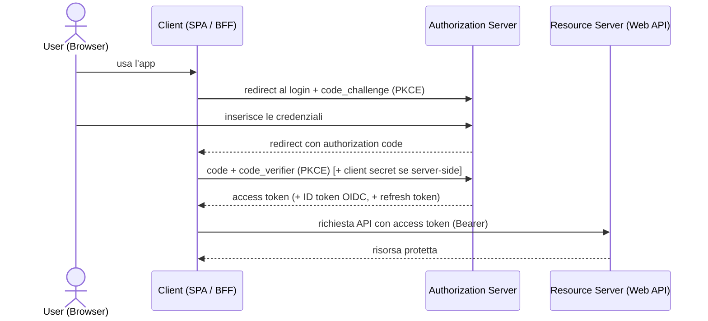
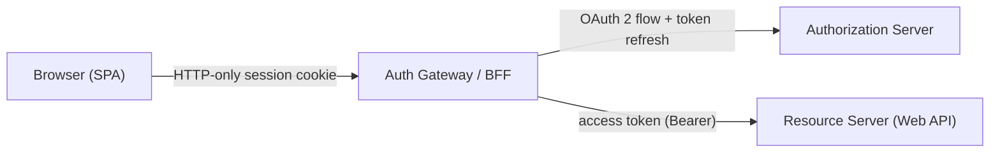

# 16 · Modern Patterns for Authentication & Authorization
> 📖 cap.16 · pp.412-421 — *Modern Angular* v2.0.0

Poche applicazioni gestionali fanno a meno dell'autenticazione. Il capitolo presenta due varianti: prima la classica **cookie-based authentication** (l'utente è riconosciuto da un cookie che il browser allega da solo), poi la **token-based security** con [[glossario#oauth-2-oidc|OAuth 2 e OpenID Connect (OIDC)]] (il client porta con sé un *token*, una stringa che dimostra chi è e cosa può fare). La buona notizia: l'autenticazione moderna si implementa **soprattutto sul server**. Sul frontend non scrivi quasi codice, ma devi capire e saper inquadrare i concetti, anche solo per discuterli con i colleghi backend. Per questo il capitolo è più **concettuale** degli altri.

> [!tip]
> Nelle SPA la **sicurezza va sempre imposta sul backend**. Guard e interceptor lato client (vedi [[12-initialization-route-changes]]) sono questioni di *usability*, non di sicurezza: il vero controllo lo fa il server.

## Cookie-based Authentication
> 📖 pp.412-413

I cookie sembrano antiquati a prima vista, ma grazie ai **security attribute** introdotti negli ultimi anni sono oggi l'approccio preferito per l'autenticazione in molti scenari. Il client non può influenzare questi attributi: li imposta il **server** quando emette il cookie.

### Security-Attributes for Cookies

- **`HttpOnly`** — il cookie **non è leggibile da JavaScript**: codice malevolo non può rubarlo direttamente.
- **`Secure`** — il cookie viaggia **solo su HTTPS**.
- **`SameSite`** — limita l'invio del cookie nelle richieste **cross-origin**: se un sito compromesso carica la tua pagina in un iframe o le invia un form, il browser non allega i cookie al server.

Dal punto di vista del client il flusso è semplice:

1. Il client chiama un'API.
2. L'API autentica l'utente ed **emette un cookie**.
3. Il client chiama altre API: il browser **allega automaticamente** i cookie, che indicano all'API quale utente sta facendo la richiesta.

Nel passo 2 l'autenticazione può avvenire in più modi: l'app può inviare username e password, oppure il backend può **delegare** a una identity solution esistente (es. Active Directory) e ricevere in cambio un **security token firmato** con le informazioni utente.

### Cookies and XSRF
> 📖 p.413

**[[glossario#xsrf-csrf|Cross-Site Request Forgery (CSRF/XSRF)]]** è un attacco in cui un aggressore fa eseguire a un utente già loggato un'azione a sua insaputa, sfruttando il fatto che il browser allega da solo i cookie di quell'utente:

1. L'utente fa login sulla tua web app e riceve un cookie.
2. Visita una pagina controllata dall'aggressore.
3. Quella pagina accede alla tua web app: per esempio offre un form che invia i suoi dati al tuo sito, o un link che chiama la tua pagina con certi parametri.
4. L'utente invia il form o segue il link: poiché il browser **allega il cookie** alle richieste verso il tuo sito, l'azione viene eseguita a suo nome.

I cookie **`SameSite`** già limitano molto questo attacco. Un'ulteriore mitigazione sono gli **XSRF token** (da non confondere con i security token della sezione successiva): stringhe casuali che l'app Angular riceve dal backend e deve includere nelle **richieste state-changing** (cioè quelle che modificano dati lato server: POST/PUT/DELETE) verso la stessa origin, provando così che la richiesta proviene davvero da lei e non da una pagina controllata dall'aggressore.

`HttpClient` implementa questa protezione **out of the box** (già pronta, senza configurarla): al caricamento dell'app si aspetta il token in un cookie `XSRF-TOKEN`, ne memorizza il valore e lo rispedisce al server a ogni richiesta nell'header `X-XSRF-TOKEN`. Sul server devi solo emettere il cookie `XSRF-TOKEN` e verificare l'header `X-XSRF-TOKEN` a ogni richiesta successiva; è importante emettere un **nuovo token, imprevedibile, dopo ogni login** per quell'utente.

Per personalizzare i nomi di cookie e header, usa `withXsrfConfiguration` quando provvedi `HttpClient`:

```ts
// app.config.ts
import { ApplicationConfig } from '@angular/core';
import { provideHttpClient, withXsrfConfiguration } from '@angular/common/http';

export const appConfig: ApplicationConfig = {
  providers: [
    provideHttpClient(
      withXsrfConfiguration({
        cookieName: 'My-Xsrf-Cookie',   // nomi cookie/header personalizzati
        headerName: 'My-Xsrf-Header',
      }),
    ),
  ],
};
```

Una seconda linea di difesa è validare gli header `Origin`/`Referer` inviati dal browser.

> [!warning]
> `Origin`/`Referer` possono **mancare per motivi legittimi**: privacy tool, estensioni del browser e proxy aziendali li possono rimuovere, e alcuni client vecchi o bloccati non li inviano affatto. Il server deve trattare l'assenza come **inconcludente**, non rifiutare la richiesta, altrimenti taglia fuori utenti validi.

## Token-based Security
> 📖 pp.414-417

Spesso bisogna integrare identity solution esistenti (sistemi di gestione delle identità degli utenti, come Active Directory o LDAP) per abilitare il **single sign-on** (un unico login che dà accesso a più applicazioni); inoltre nelle web app moderne il client deve ottenere il diritto di accedere ai servizi **per conto** dell'utente loggato. I **security token** risolvono tutti questi requisiti con eleganza.

> [!warning]
> Sia OAuth 2 sia OpenID Connect devono girare **su HTTPS** per essere sicuri. (La demo del libro lo omette solo per semplicità.)

### OAuth 2
> 📖 pp.415-416

La prima versione di OAuth nasce nel 2006 (Twitter e Ma.gnolia) con l'obiettivo di permettere a un utente di **delegare parte dei propri diritti a un client senza condividere la password**: così, per esempio, un'app può ottenere il diritto di chiamare servizi per conto dell'utente. OAuth e il suo successore **OAuth 2** sono oggi usati da Google, Facebook, Flickr, Microsoft, Salesforce.com e Yahoo!, sempre più non solo per la delega di diritti (**authorization**) ma anche per il single sign-on (**authentication**) — per esempio loggarsi su altri servizi con il proprio account Google.

Vista d'insieme: il client **reindirizza** l'utente a un **Authorization Server** per il login. Quest'ultimo ha accesso agli account utente centrali; una volta autenticato l'utente, il client riceve un **access token** che gli dà accesso ai servizi del backend — i **Resource Server** — per conto dell'utente. L'access token comunica al resource server, fra le altre cose, l'utente e i diritti esercitabili in suo nome; di solito porta anche metadati come issuer, data di emissione e periodo di validità.

Vantaggi:

- Un **account utente centrale** per più client e servizi.
- Il login avviene sull'authorization server: il client **non vede mai la password**.
- L'autenticazione è **disaccoppiata** dal client e integrabile con identity solution esistenti.
- I token aumentano la flessibilità: un servizio può passarli a un altro per dimostrare di agire per conto dell'utente, oppure **scambiarli** per token validi in un altro security domain.
- Funziona **senza cookie**: il client accede anche a servizi su altri server (diversa `Origin`); evitare i cookie limita inoltre certi attacchi.

Il **formato** dell'access token e le misure di validazione sono dettagli implementativi che OAuth 2 non specifica. Spesso si usano **firme digitali**, così il resource server verifica facilmente se il token viene da un authorization server fidato; in alternativa il token può essere un semplice **ID imprevedibile**, col resource server che ricontatta l'authorization server.

### Authenticating Users with OpenID Connect
> 📖 pp.416-417

**OpenID Connect (OIDC)** estende OAuth 2 definendo, fra l'altro, come i client ottengono informazioni sugli utenti — aspetto che OAuth 2 non copre (l'access token può persino non essere leggibile dal client). OIDC introduce un **ID token** che il client riceve **in aggiunta** all'access token:

- **access token** → per accedere al **backend**.
- **ID token** → il client legge **direttamente** le info utente.

A differenza degli access token, la struttura degli **ID token è prescritta** (cioè il formato è fissato dallo standard, non libero): sono **sempre [[glossario#jwt-json-web-token|JSON Web Token (JWT)]]**, firmabili e/o cifrabili. OIDC definisce inoltre uno **Userinfo endpoint**: un servizio HTTP che, presentando l'access token, restituisce ulteriori dati sull'utente (indirizzo postale, foto profilo, …). Quali claim (le singole informazioni sull'utente contenute nel token, vedi sotto) stiano già nell'ID token e quali vadano richiesti via Userinfo è una scelta di configurazione dell'identity solution.

### JSON Web Token
> 📖 pp.416-418

Un **JWT** contiene, fra l'altro, un oggetto JSON di **claim**: coppie nome/valore che descrivono un soggetto (es. un utente). Ci sono anche claim che descrivono il **token stesso** (periodo di validità, audience, …). L'issuer può firmare e/o cifrare l'insieme di claim. Un JWT firmato è composto da **tre sezioni codificate in BASE64, separate da un punto**:

```text
eyJ0eXAiOiJKV1QiLCJhbGciOiJSUzI1NiJ9 . eyJuYmYiOjEz[...]BlbmlkIn0 . Nt5pBRqGvDFn[...]1205awFjw
```

1. **Header** — 2. **claims set** — 3. **firma**. L'header in chiaro:

```json
{ "typ": "JWT", "alg": "RS256" }
```

`alg` è l'algoritmo usato per creare la firma. `RS256` significa che l'issuer ha calcolato un hash **SHA-256** sui claim da firmare e poi ne ha creato una firma digitale **RSA**. Essendo RSA un algoritmo **asimmetrico**, l'issuer firma con la **chiave privata** e chiunque verifica con la **chiave pubblica**.

```json
{
  "nbf": 1388357979,
  "exp": 1388444379,
  "aud": [
    "http://service",
    "http://partner-authsvc",
    "http://myClient"
  ],
  "iss": "http://authsvc",
  "sub": "3ca4ccc8",
  "name": "Manfred Steyer",
  "role": "Manager",
  "company": "ACME"
}
```

- `nbf` (*not before*) / `exp` (*expiration time*) — UNIX timestamp (secondi dal 1 gennaio 1970, 0:00 GMT) che delimitano la **validità** del token.
- `aud` (*audience*) — array JSON delle parti per cui il token è emesso; se è una sola, può essere anche una semplice stringa con il suo identificatore.
- `iss` (*issuer*) — chi ha emesso il token.
- `sub` (*subject*) — il soggetto descritto dai claim (qui uno user ID).
- gli altri (`name`, `company`, `role`) descrivono nome, azienda e ruolo dell'utente.

> [!tip]
> Issuer e consumer possono concordare bilateralmente i nomi dei claim, ma conviene prima verificare se esistono già **nomi ufficiali** per lo scopo (un buon punto di partenza è la spec OpenID Connect) per evitare collisioni e fraintendimenti. Si possono usare anche identificatori pubblici, es. URL, come nomi di claim.

### OAuth 2 and OIDC Flows
> 📖 pp.418-419

I **flow** sono le sequenze di messaggi da scambiare perché il client ottenga l'access o l'ID token. Per le SPA era stato originariamente definito l'**Implicit Flow** — corrisponde alla vista d'insieme descritta sopra — ma oggi si raccomanda l'**Authorization Code Flow** combinato con **[[glossario#pkce|PKCE]]** (*Proof Key for Code Exchange*); l'Implicit Flow è addirittura **deprecato** (sconsigliato e destinato a sparire) con OAuth 2.1.



Cosa ti serve sapere:

- **Nuove app** → usa librerie/API che supportano **Authorization Code Flow + PKCE**.
- **App esistenti** sviluppate con l'Implicit Flow restano sicure finché si seguono le best practice correnti.

### Client-side OAuth 2
> 📖 p.419

Agli albori delle SPA si usava OAuth 2 **direttamente sul client**. Librerie come `angular-oauth2-oidc` gestiscono i dettagli del protocollo e restituiscono un access token, che il client può poi inoltrare all'API — per esempio via un **[[glossario#interceptor-httpinterceptor|HttpInterceptor]]** (un filtro che intercetta le richieste HTTP in uscita) che aggiunge l'header `Authorization: Bearer ...` (vedi [[12-initialization-route-changes]]).

C'è però un problema serio con OAuth 2 client-side:

- L'access token è **solo una stringa** e non esiste un modo **sicuro** per conservarlo nel browser. Codice JavaScript malevolo iniettato nel client può rubarlo — e gli **injection attack** (attacchi in cui l'aggressore inietta codice ostile nella pagina, tipicamente via XSS) figurano da anni in alto nella OWASP Top 10 (la classifica di riferimento dei principali rischi di sicurezza web).
- Non c'è un buon modo di **rinfrescare** i token nel browser. Per limitare la superficie d'attacco si usano access token **a vita breve** (anche 10 minuti) → serve un modo di ottenere un nuovo access token **senza interazione utente**, cioè il **token refresh**.
- OAuth 2 prevede un **refresh token** scambiabile on demand per un nuovo access token (e un nuovo refresh token), ma un refresh token rubato consente di impersonare l'utente **a lungo termine**. Per questo OAuth 2 **non consente l'uso di refresh token nei browser**.

> [!warning]
> Non esiste storage sicuro nel browser per i token: né `localStorage` né `sessionStorage` né i cookie leggibili da JS proteggono da un'iniezione XSS. Il refresh token nel browser è esplicitamente **vietato** da OAuth 2.

### Current Recommendation: Server-side OAuth 2 (BFF)
> 📖 pp.419-420

Per i rischi visti, l'OAuth 2 Working Group raccomanda (nel best practice *OAuth 2.0 for Browser-Based Applications*) alle app browser-based di **limitare OAuth 2 al lato server**: il flow OAuth 2 gira **sul server** e access/refresh token sono conservati in una **session server-side**. La SPA **non vede mai l'access token**, quindi codice malevolo non può rubarlo.

Per ricordare l'utente corrente, il backend emette un **session cookie**; in alternativa alla session server-side può emettere un cookie che contiene i token. Grazie ai security attribute `HttpOnly` e `SameSite` visti sopra, questo è più sicuro che maneggiare token nel browser.

Per non spargere la logica server nelle API dell'app, la si incapsula in un **reverse proxy** riusabile (un intermediario che riceve le richieste del client e le inoltra ai servizi dietro di sé) — un **Backend for Frontend (BFF)**, che l'autore chiama anche **Authentication Gateway**:

- Tutte le chiamate del client passano per il **gateway**.
- Il gateway **ottiene e rinfresca** i token e li **inoltra** al resource server (Web API).
- **Tutti i token restano al gateway**. Il browser riceve solo un cookie **HTTP-only** che rappresenta la sessione utente presso il gateway.



Il gateway può essere un componente riusabile in più progetti, oppure parte del backend-for-frontend (che racchiude tutta la logica server della SPA, Web API inclusa: in quel caso il gateway ne è solo una parte). Vantaggi: poiché i token non raggiungono mai il browser **molti degli attacchi visti non si applicano**, e il frontend si semplifica drasticamente — l'utente è autenticato **senza alcun codice frontend**. Per (ri)autenticare o fare logout basta **reindirizzare** l'utente a una URL del gateway; le info sull'utente corrente arrivano da un semplice servizio del gateway; il **token refresh** lo gestisce il gateway on demand.

> [!tip]
> Per maggiore sicurezza, **non** emettere access token validi su tutti i domini del sistema (sarebbe come girare sempre con una *master key*, una chiave che apre tutto): ottieni un token **scoped** a un dominio (valido solo per quel dominio) e scambialo per token validi in altri domini **solo quando serve**.

Collegamenti: [[12-initialization-route-changes]] (auth guard come usability; `authInterceptor` che allega il `Bearer` token e gestisce 401/403) · [[17-defer-ssr-hydration]] (il BFF/gateway si combina con il rendering lato server).

## 🔁 Ripasso lampo

**1.** Cosa fanno i tre attributi `HttpOnly`, `Secure`, `SameSite` e chi li imposta?
> [!success]- Risposta
> `HttpOnly`: il cookie **non è leggibile da JavaScript** (no furto diretto). `Secure`: il cookie viaggia **solo su HTTPS**. `SameSite`: limita l'invio del cookie nelle richieste **cross-origin**. Li imposta il **server** quando emette il cookie; il client non può influenzarli.

**2.** Come previene `HttpClient` il CSRF out of the box? Quali nomi di cookie/header usa di default e come li personalizzi?
> [!success]- Risposta
> Alla load `HttpClient` legge il token dal cookie `XSRF-TOKEN`, ne memorizza il valore e lo rispedisce a ogni richiesta nell'header `X-XSRF-TOKEN`. Il server emette il cookie e verifica l'header (con un token nuovo e imprevedibile dopo ogni login). Per personalizzare i nomi: `withXsrfConfiguration({ cookieName, headerName })` dentro `provideHttpClient`.

**3.** Perché il server non deve rifiutare le richieste prive di header `Origin`/`Referer`?
> [!success]- Risposta
> Perché quegli header possono mancare per **motivi legittimi**: privacy tool, estensioni del browser e proxy aziendali li rimuovono, e alcuni client vecchi/bloccati non li inviano. L'assenza va trattata come **inconcludente**; rifiutare taglierebbe fuori utenti validi.

**4.** Qual è la differenza tra **access token** (OAuth 2) e **ID token** (OIDC)? Che formato ha sempre l'ID token?
> [!success]- Risposta
> L'**access token** serve al client per accedere al **backend** (i resource server) per conto dell'utente, e può anche non essere leggibile dal client. L'**ID token** (introdotto da OIDC) permette al client di leggere **direttamente** le info utente. L'ID token è **sempre un JSON Web Token (JWT)**, firmabile e/o cifrabile.

**5.** Cosa indicano i claim `nbf`, `exp`, `aud`, `iss`, `sub`? Cosa significa `alg: RS256`?
> [!success]- Risposta
> `nbf` (not before) / `exp` (expiration) = finestra di **validità** (UNIX timestamp). `aud` = **audience**, le parti per cui il token è emesso. `iss` = **issuer**, chi l'ha emesso. `sub` = **subject**, il soggetto descritto (qui uno user ID). `RS256` = hash **SHA-256** sui claim + firma digitale **RSA** (asimmetrica): si firma con chiave privata, si verifica con chiave pubblica.

**6.** Quale flow si raccomanda oggi per le SPA e quale è deprecato? A cosa serve PKCE?
> [!success]- Risposta
> Oggi si raccomanda l'**Authorization Code Flow + PKCE**; l'**Implicit Flow** (originariamente pensato per le SPA) è **deprecato** con OAuth 2.1. **PKCE** (Proof Key for Code Exchange) lega lo scambio del code a un `code_verifier`/`code_challenge` generato dal client, così un authorization code intercettato non basta a ottenere il token.

**7.** Perché OAuth 2 client-side è rischioso e perché i refresh token sono vietati nel browser?
> [!success]- Risposta
> L'access token è **solo una stringa** senza storage sicuro nel browser: un'iniezione XSS può rubarlo (gli injection attack figurano da anni in alto nella OWASP Top 10). Inoltre non c'è un buon modo di rinfrescare i token client-side. Un **refresh token** rubato consente di impersonare l'utente **a lungo termine**, perciò OAuth 2 **non ne consente l'uso nei browser**.

**8.** Come funziona il pattern server-side OAuth 2 / BFF e cosa vede il browser?
> [!success]- Risposta
> Il flow OAuth 2 gira **sul server**; access e refresh token restano in una **session server-side** dietro il gateway/BFF (Authentication Gateway). Tutte le chiamate del client passano per il gateway, che ottiene/rinfresca i token e li inoltra al resource server. Il browser riceve **solo un cookie HTTP-only** di sessione: non vede mai i token, quindi molti attacchi non si applicano.

**In sintesi:**
- L'autenticazione moderna avviene **soprattutto sul server**; sul frontend conta capire i concetti per discuterli col backend.
- **Cookie-based**: sicuro grazie a `HttpOnly`/`Secure`/`SameSite`, spesso preferito quando le sessioni sono gestite server-side; `HttpClient` protegge dall'XSRF via cookie `XSRF-TOKEN` + header `X-XSRF-TOKEN` (`withXsrfConfiguration`), con `Origin`/`Referer` come check addizionale (mai rifiutare se mancano).
- **Token-based** (OAuth 2 + OIDC): access token per i resource server, ID token + JWT per le info utente; **Authorization Code Flow + PKCE** è lo standard attuale (Implicit Flow deprecato).
- **Raccomandazione attuale**: **server-side OAuth 2 / BFF (Authentication Gateway)** — i token restano sul server, il browser riceve solo un cookie HTTP-only di sessione; usare token **domain-scoped** invece di master token validi su tutto il sistema.
