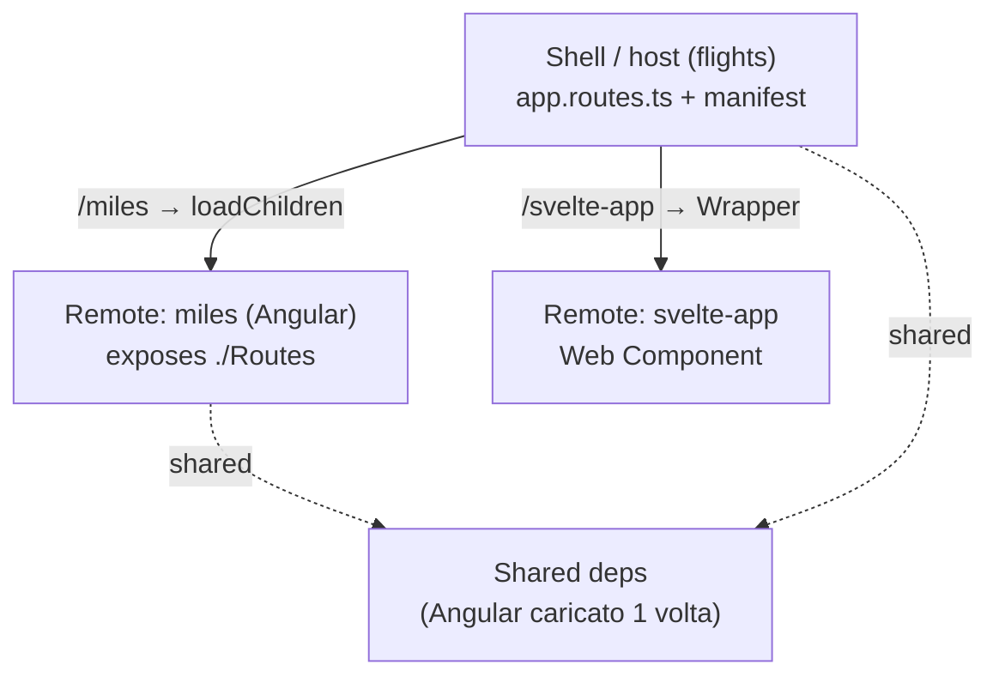

# 18 · Micro Frontends: Scaling Across Multiple Teams
> 📖 cap.18 · pp.423-443 — *Modern Angular* v1.0.4

I sistemi enterprise sono sviluppati da più team cross-funzionali: per farli procedere in autonomia serve **modularizzare verticalmente** il sistema in aree a basso accoppiamento. Finora i verticali erano semplici cartelle (vedi [[08-sustainable-architectures]]); i **Micro Frontends** fanno un passo in più e dedicano a ogni verticale una **applicazione separata**, deployabile in modo indipendente.

Il capitolo spiega cosa sono i Micro Frontends e le loro conseguenze, come implementarli con Angular e **Native Federation**, e come affrontare gli scenari **multi-version / multi-framework** tipici degli ambienti corporate.

## Cosa sono i Micro Frontends — motivazioni
> 📖 pp.423-424

Come i Microservices, offrono vantaggi tecnici e organizzativi: app più piccole rendono più facili test, performance tuning e isolamento dei guasti. Ma il motivo principale nella pratica è la **team autonomy**: i team non si bloccano a vicenda e possono **deployare indipendentemente** in qualsiasi momento — cruciale nei progetti multi-team con catene di comunicazione lunghe.

- Ogni team può scegliere **architettura e stack** più adatti ai propri obiettivi. Mischiare più framework client-side è un **anti-pattern** da evitare di norma, ma può abilitare un **percorso di migrazione** verso un nuovo stack (le soluzioni software sopravvivono allo stack tecnologico medio).
- Build separate → ottimo per gli **incremental builds** (si ri-builda solo ciò che è cambiato; es. Nx). Nota: questa ottimizzazione può essere usata anche **senza** adottare team/deploy separati — c'è dibattito se ciò sia già "micro frontend".
- Onboarding più semplice, scalabilità aggiungendo micro frontend, cicli di rilascio più rapidi.

## Sfide da tenere a mente
> 📖 pp.424-425

Ogni decisione architetturale ha conseguenze, anche negative:

- **UI/UX incoerente**: micro frontend sviluppati separatamente possono divergere nell'aspetto.
- **Più bundle da scaricare** → tempi di caricamento peggiori e maggiore pressione sulla memoria.
- Definire confini verticali netti è **difficile**; integrare tante piccole app in una soluzione unica aggiunge complessità.
- La sfida più grande: si passa da una **compile-time integration** a una **runtime integration**. Non si prevedono facilmente i problemi che nascono quando app sviluppate/deployate separatamente interagiscono a runtime. I framework SPA attuali (Angular in primis) sono pensati per **ottimizzazioni a compile-time** (type check, tree-shaking, build CLI ottimizzata): l'uso "off-label" per i micro frontend ne mina alcuni vantaggi.

> [!tip] Take-away
> Le controindicazioni si compensano (es. **design system** per UI/UX coerente, lazy-loading delle parti). Per approfondire: il [survey su 150+ practitioner](https://www.angulararchitects.io/blog/consequences-of-micro-frontends-survey-results/).

## Self-Contained Systems (SCS)
> 📖 p.425

Un **Self-Contained System** separa il sistema in tanti sistemi indipendenti e collaboranti. Buoni candidati: Domain / Bounded Context in ottica **DDD**. Ogni SCS può avere backend + frontend ed è **molto debolmente accoppiato**.

- Backend: comunicazione via **REST/HTTP** o messaging.
- Frontend: integrazione **solo via hyperlink**.

Un SCS è una combinazione speciale di (gruppo di) microservice + micro frontend. L'approccio a hyperlink è allettante perché **semplicissimo** e integra anche tecnologie diverse (esempio noto: Office 365). **Svantaggio**: si perdono i benefici della SPA — seguire un link ricarica un'intera nuova app e scarica la precedente con tutto il suo stato. Per un'integrazione più fine, si usa Native Federation.

> [!tip] Take-away
> Prima di scegliere Native Federation, valuta se il banale **hyperlink-based SCS** basta: zero infrastruttura, integra anche stack diversi. Lo paghi solo perdendo la continuità della SPA.

## Native Federation
> 📖 pp.426-428

**Module Federation** (in webpack dalla v5) permette di caricare on-demand parti di app compilate e pubblicate separatamente:

- Una **shell** (ufficialmente *host*) definisce segmenti URL che puntano ai Micro Frontends (ufficialmente *remotes*).
- I remote **pubblicano** parti di programma (componenti, moduli) che la shell carica **a runtime**.
- Le **dipendenze sono condivise** a runtime: Angular viene caricato **una sola volta** anche se più micro frontend lo usano.

**Native Federation** (`@angular-architects/native-federation`) porta lo stesso mental model **fuori da webpack**: stessa configurazione, ma funziona con qualsiasi build tool e usa tecnologie **browser-native** (ECMAScript modules + **Import Maps**) per garantire supporto a lungo termine.

- Gira **prima e dopo** il bundler vero e proprio nella build → indipendente dal bundler usato (esbuild, ecc.), che collega via **adapter** intercambiabili.
- A runtime piazza remote e librerie condivise in **bundle ECMAScript** dedicati; le info sui bundle stanno in **file di metadati** (`remoteEntry.json`) che formano la base di un **Import Map** standard, dicendo al browser quali bundle caricare e da dove.



## Setup di un Micro Frontend (remote)
> 📖 pp.429-430

Con Angular CLI c'è lo schematic `ng add`. Aggiunge Native Federation al progetto `miles` configurandolo come **remote**:

```bash
ng add @angular-architects/native-federation --project miles --port 4201 --type remote
```

Genera `federation.config.js` che controlla il comportamento:

```js
// projects/miles/federation.config.js
const {
  withNativeFederation,
  shareAll,
} = require('@angular-architects/native-federation/config');

module.exports = withNativeFederation({
  name: 'miles',                                          // nome univoco del remote
  exposes: {
    // mappa file fisici → nomi corti caricabili dall'host a runtime
    './Component': './projects/miles/src/app/miles-overview.ts',
  },
  shared: {
    ...shareAll({                                         // condivide tutte le deps di package.json
      singleton: true,
      strictVersion: true,
      requiredVersion: 'auto',
    }),
  },
  skip: [                                                 // pacchetti da NON condividere (build/startup più snelli)
    'rxjs/ajax',
    'rxjs/fetch',
    'rxjs/testing',
    'rxjs/webSocket',
  ],
  features: {
    ignoreUnusedDeps: true,                               // ignora deps presenti ma non usate da quest'app
  },
});
```

- `name`: identificatore univoco del remote.
- `exposes`: quali file il remote pubblica all'host. Restano deployati col remote ma caricabili a runtime; l'host vede solo il **nome corto** (`./Component`), non il path completo. Si può esporre qualsiasi componente o **routing config lazy**.
- `shared`: dipendenze condivise con host e altri remote. `shareAll` evita di elencarle tutte (prende le `dependencies` di `package.json`); `skip` le esclude.

## Setup di uno Shell (host)
> 📖 pp.430-432

```bash
ng add @angular-architects/native-federation --project flights --port 4200 --type dynamic-host
```

`type dynamic-host` significa che i remote da caricare sono definiti in un file di configurazione:

```json
// public/federation.manifest.json
{
  "miles": "http://localhost:4201/remoteEntry.json"
}
```

Il manifest sta in `public/` (è un **asset** → scambiabile in deploy per adattarsi all'ambiente) e mappa i nomi dei remote ai loro metadati (`remoteEntry.json`). Anche se `ng add` lo genera, **va controllato** per sistemare porte o rimuovere voci che non sono remote.

`ng add` genera anche un `federation.config.js` per l'host (senza `exposes`, dato che un host di solito non pubblica file — ma nulla vieta di aggiungerlo se l'host fa anche da remote). La feature `ignoreUnusedDeps` è attivata di default e fa ignorare a Native Federation le librerie presenti in `package.json` ma non usate (es. usate solo da altre app dello stesso monorepo).

Il `main.ts`, modificato da `ng add`, **inizializza** Native Federation col manifest:

```ts
// src/main.ts
import { initFederation } from '@angular-architects/native-federation';

initFederation('federation.manifest.json')
  .catch((err) => console.error(err))
  .then((_) => import('./bootstrap'))
  .catch((err) => console.error(err));
```

`initFederation` legge i metadati di ogni remote e genera l'**Import Map**; poi delega a `bootstrap.ts` che avvia Angular nel modo usuale (`bootstrapApplication` / `bootstrapModule`).

Per caricare una parte pubblicata da un remote, l'host usa una **lazy route** con `loadRemoteModule` (vedi anche [[04-router-navigation-lazy-loading]]):

```ts
// src/app/app.routes.ts
import { loadRemoteModule } from '@angular-architects/native-federation';

export const routes: Routes = [
  // ...
  {
    path: 'miles',
    loadComponent: () => loadRemoteModule('miles', './Component'),
  },
  // ...
];
```

`loadRemoteModule(remoteName, exposedName)` prende il nome dal manifest (`miles`) e il nome corto sotto cui il remote pubblica (`./Component`).

> [!warning] Gotcha
> `loadRemoteModule` ritorna l'**intero modulo ECMAScript** ("file"): il componente da caricare deve essere il **default export** (`export default MilesOverview;`). In alternativa, punta all'export con una clausola `then`:
> ```ts
> loadComponent: () => loadRemoteModule('miles', './Component')
>   .then(m => m.MilesOverview),
> ```

## Esporre una router config
> 📖 pp.433-435

Esporre un singolo componente è troppo fine. Spesso si vuole esporre un'**intera feature** di più componenti. Si può esporre qualsiasi costrutto TS/ECMAScript: per feature grossolane, un `NgModule` con subroute o — con Standalone Components — direttamente una **routing config**:

```ts
// projects/miles/src/app/app.routes.ts
import { Routes } from '@angular/router';
import { MilesOverview } from './miles-overview';
import { NextLevelPage } from './next-level-page';

export const routes: Routes = [
  { path: '', pathMatch: 'full', redirectTo: 'home' },
  { path: 'home', component: MilesOverview },
  { path: 'next-level', component: NextLevelPage },
];

export default routes;
```

La si espone sotto `./Routes` nel `federation.config.js` del remote:

```js
// projects/miles/federation.config.js
module.exports = withNativeFederation({
  name: 'miles',
  exposes: {
    './Routes': './projects/miles/src/app/app.routes.ts',
    // ...
  },
  // ...
});
```

Nella shell si instrada direttamente con `loadChildren`:

```ts
// src/app/app.routes.ts
{
  path: 'miles',
  loadChildren: () => loadRemoteModule('miles', './Routes'),
},
```

Anche qui il router prende il **default export**; senza default export si usa la clausola `then`:

```ts
{
  path: 'miles',
  loadChildren: () => loadRemoteModule('miles', './Routes')
    .then(m => m.routes),
},
```

La navigazione della shell linka alle route del remote tramite il **prefisso di path** (`miles/home`, `miles/next-level`):

```html
<!-- src/app/shell/sidebar/sidebar.html -->
<li routerLinkActive="active">
  <a routerLink="miles/home"><p>Miles</p></a>
</li>
<li routerLinkActive="active">
  <a routerLink="miles/next-level"><p>Next Level</p></a>
</li>
```

## Comunicazione tra Micro Frontends
> 📖 pp.435-436

Si può abilitare via **librerie condivise**, ma **con cautela**: i micro frontend nascono per disaccoppiare i frontend; se uno si aspetta info da un altro, succede l'opposto. In pratica si condivide solo qualche **informazione contestuale** (username corrente, client corrente, filtri globali).

Serve prima una shared library (npm package separato o lib del progetto, generabile con `ng g lib util-auth` — vedi [[14-monorepos-libraries]]). Nel progetto demo, `util-auth` espone un service stateful con un `BehaviorSubject` (publish/subscribe):

```ts
// projects/util-auth/src/lib/auth.service.ts
import { Injectable } from '@angular/core';
import { BehaviorSubject } from 'rxjs';

@Injectable({
  providedIn: 'root',
})
export class AuthService {
  userName = new BehaviorSubject<string>('');

  login(userName: string): void {
    this.userName.next(userName);
  }
}
```

Le lib interne al monorepo vanno rese accessibili via **path mapping** nel `tsconfig.json`:

```json
// tsconfig.json
"compilerOptions": {
  "paths": {
    "@flights42/util-auth": ["./projects/util-auth/src/public-api.ts"]
  }
}
```

> [!warning] Gotcha
> Il mapping punta a `public-api.ts` nel **sorgente** della lib (strategia di Nx). La **CLI** invece punta di default alla cartella `dist`: in quel caso va corretto a mano. Inoltre **tutti i partner di comunicazione devono usare lo stesso path mapping**.

## Soluzioni multi-version / multi-framework
> 📖 pp.436-437

Finora si è assunto che shell e remote usino **stesso framework e versione**. Per integrare framework e/o versioni **diversi** servono accorgimenti aggiuntivi. Non è qualcosa da introdurre senza un buon motivo: tipicamente **sistemi legacy** o combinazione di prodotti esistenti in una suite.

### Astrarre i Micro Frontends con Web Components
> 📖 pp.437-438

Primo passo: **astrarre** framework e versioni. Approccio diffuso: **Web Components** che incapsulano interi Micro Frontends — non widget riutilizzabili ideali, ma web component **a grana grossa** che rappresentano interi domini.

Scrivere un Web Component che delega a un framework (invece di scrivere sul DOM) non è difficile. Angular lo semplifica con **`@angular/elements`** (`npm i @angular/elements`), che converte un componente Angular in Web Component (lo *wrappa* in un Web Component creato al volo). Con gli Standalone Components:

```ts
// projects/mfe2/src/bootstrap.ts
import { NgZone } from '@angular/core';

(async () => {
  const app = await createApplication({
    providers: [],
  });

  const mfe2Root = createCustomElement(AppComponent, {
    injector: app.injector,
  });

  customElements.define('mfe2-root', mfe2Root);
})();
```

- Queste righe **sostituiscono il bootstrap** dell'app. `createApplication` crea un'app Angular con root injector (configurato via `providers`).
- Invece di fare bootstrap di un componente, `createCustomElement` trasforma uno standalone component in web component.
- `customElements.define` (API del browser) lo registra come `mfe2-root`: da lì il browser renderizza il componente Angular ovunque compaia `<mfe2-root></mfe2-root>`.

> [!warning] Gotcha
> Il nome del custom element **deve contenere un trattino** (es. `mfe2-root`): è una regola degli Web Components per evitare conflitti con gli elementi HTML esistenti.

Per condividere il Web Component via Native Federation, il file che lo definisce va in `exposes` del `federation.config.js` (nel demo il remote Svelte espone `./web-components`; un remote Angular esporrebbe analogamente il suo file di bootstrap). Così si ha il meglio dei due mondi: Native Federation **condivide** framework/lib quando le versioni coincidono; i Web Components **astraggono** le differenze quando framework/versioni divergono.

### Caricare Web Components nello Shell
> 📖 pp.438-441

Pubblicare il Web Component è solo un lato: va anche **caricato** nella shell. Poiché l'Angular Router lavora **solo con Angular Components**, conviene **wrappare** il Web Component in un componente Angular. Nel demo lo fa `Wrapper`:

```ts
// src/app/domains/shared/ui-federation/wrapper.ts
import { CommonModule } from '@angular/common';
import { Component, effect, ElementRef, inject, input } from '@angular/core';
import { loadRemoteModule } from '@angular-architects/native-federation';

export interface WrapperConfig {
  remoteName: string;
  exposedModule: string;
  elementName: string;
}

export const initWrapperConfig: WrapperConfig = {
  remoteName: '',
  exposedModule: '',
  elementName: '',
};

@Component({
  selector: 'app-wrapper',
  standalone: true,
  imports: [CommonModule],
  templateUrl: './wrapper.html',
  styleUrls: ['./wrapper.css'],
})
export class Wrapper {
  private elm = inject(ElementRef);
  config = input(initWrapperConfig);

  constructor() {
    effect(async () => {
      const { exposedModule, remoteName, elementName } = this.config();
      await loadRemoteModule(remoteName, exposedModule);
      const root = document.createElement(elementName);
      this.elm.nativeElement.appendChild(root);
    });
  }
}
```

`Wrapper` carica il Web Component via Native Federation e crea l'elemento HTML in cui il browser lo renderizza. La config (`remoteName`, `exposedModule`, `elementName`) arriva via `input`, rendendo il componente **riutilizzabile** su più remote.

Dato che `config` è assegnato dal router via `data`, serve attivare `withComponentInputBinding`:

```ts
// src/app/app.config.ts
import { withComponentInputBinding } from '@angular/router';
// ...
provideRouter(routes, withComponentInputBinding()),
```

Poi si definisce la config direttamente nella route:

```ts
// src/app/app.routes.ts
{
  path: 'svelte-app',
  component: Wrapper,
  data: {
    config: {
      remoteName: 'svelte-app',
      exposedModule: './web-components',
      elementName: 'svelte-mfe',
    } as WrapperConfig,
  },
},
```

E si registra il remote nel manifest:

```json
// public/federation.manifest.json
{
  "miles": "http://localhost:4201/remoteEntry.json",
  "svelte-app": "https://kind-grass-08faefd03.4.azurestaticapps.net/remoteEntry.json"
}
```

### Condividere Zone.js
> 📖 p.441

Angular usava **Zone.js** come fondamento della change detection. I nuovi progetti non lo generano più, ma se un progetto esistente lo usa ancora bisogna **condividere l'istanza** di `NgZone`. La shell può esporre il proprio `NgZone` nel namespace globale:

```ts
// Conceptual: shell's root component
@Component({ /* … */ })
export class App {
  constructor() {
    (globalThis as any).ngZone = inject(NgZone);
  }
}
```

I singoli Micro Frontend la riusano in fase di bootstrap:

```ts
// Conceptual: remote's bootstrap
const app = await createApplication({
  providers: [
    (globalThis as any).ngZone
      ? { provide: NgZone, useValue: (globalThis as any).ngZone }
      : [],
    provideRouter(APP_ROUTES),
  ],
});
```

### Web Components con route proprie
> 📖 p.442

Si complica quando anche il micro frontend del Web Component usa il **routing**: due router "litigano" sull'URL (quello della shell e quello del Micro Frontend). Procedura collaudata per non farli interferire:

- A ogni route del Micro Frontend si dà un **prefisso univoco**.
- La shell dice al suo router di guardare **solo il primo segmento** dell'URL: in base a quello carica il Micro Frontend, che decide il routing sui segmenti restanti.

Per stabilire quale parte dell'URL interessa a ciascun router si usa uno **`UrlMatcher`**: funzioni che dicono al router se attivare la route configurata (es. un matcher `startsWith` che verifica se l'URL corrente inizia col segmento passato). Nel demo `miles` è integrato via `loadChildren`, quindi la shell delega `miles/*` al router del remote; per i Web Component con route proprie si usa un pattern simile (matcher sul prefisso, es. `profile`, passando il resto dell'URL al Web Component).

### Workaround per i router nei Web Component
> 📖 pp.442-443

Perché il router reagisca ai cambi di route **dentro** il Web Component serve un'integrazione speciale: l'URL della shell e il router del Micro Frontend possono **andare fuori sync**. Un helper come `connectRouter` sincronizza il router del Micro Frontend con l'URL del browser; il root component del Micro Frontend lo chiama in inizializzazione:

```ts
@Component({ /* … */ })
export class AppComponent implements OnInit {
  constructor() {
    connectRouter();
  }
}
```

> [!warning] Gotcha
> `startsWith` (matcher) e `connectRouter` **non** sono API ufficiali Angular/Native Federation: sono helper di esempio del [`module-federation-plugin-example`](https://github.com/manfredsteyer/module-federation-plugin-example). Vanno scritti/copiati, non sono "out of the box".

## Il costo dei Micro Frontends
> 📖 p.443

Tutti i progetti Micro Frontend di successo (10+ anni di esperienza dell'autore) hanno una cosa in comune: un **platform team** che fornisce supporto via **guideline, esempi e librerie interne**. È necessario perché l'architettura Micro Frontend **non si ottiene con un pulsante** o con `ng new`: qualcuno deve sviluppare le soluzioni viste sopra (es. combinare più router in una shell).

- Il platform team **non deve essere grande**: l'autore ha visto **3 persone supportare 80+ feature team** distribuiti nel mondo — non lavorando con tutti, ma offrendo guideline, esempi e librerie.
- I suoi membri servono solida competenza sui framework usati **e** sui concetti JavaScript sottostanti. Tipicamente partono da shell + primo micro frontend prima di scalare a più team.

> [!tip] Take-away
> I Micro Frontends non sono gratis: la spesa nascosta è **organizzativa** (un platform team), non solo tecnica. Senza quel supporto l'architettura non regge allo scaling.

## 🔁 Ripasso lampo
1. Qual è la motivazione *principale* dietro i Micro Frontends nella pratica, oltre ai benefici tecnici? Perché mischiare più framework è di norma un anti-pattern ma a volte utile?
2. Cosa significa passare da *compile-time integration* a *runtime integration* e perché è la sfida più grande?
3. Cos'è un Self-Contained System e come integra i frontend? Pro e contro rispetto a Native Federation?
4. Cosa fa Native Federation in più rispetto a Module Federation, e quali tecnologie browser-native usa? Quante volte viene caricato Angular?
5. Differenza tra `loadComponent`/`loadRemoteModule` ed esporre una router config con `loadChildren`? Perché serve un default export (o `then`)?
6. Come si integra un micro frontend basato su un *altro* framework? Ruolo di `@angular/elements`, `createCustomElement` e del componente `Wrapper`.
7. Quando un Web Component ha route proprie, come si evita che i due router litighino? Cosa fanno `UrlMatcher`/`startsWith` e `connectRouter`?
8. Perché un platform team è il vero costo dei Micro Frontends?

**Take-away del capitolo:**
- I Micro Frontends spezzano il sistema in app **deployabili separatamente** → autonomia dei team e rilasci più rapidi, ma al prezzo della **runtime integration** e di confini verticali difficili da definire.
- **Native Federation** (`@angular-architects/native-federation`) porta il mental model di Module Federation in Angular **fuori da webpack**, usando **Import Maps + ESM** per caricare i remote on-demand e condividere Angular **una sola volta**. Setup via `ng add` (`--type remote` / `--type dynamic-host`), `exposes` + `shareAll`, manifest, `initFederation`, `loadRemoteModule`.
- Esporre una **routing config** (`./Routes` + `loadChildren`) è più pratico che esporre singoli componenti.
- La comunicazione tra micro frontend si fa con **librerie condivise** (es. `BehaviorSubject`), ma va limitata a poche info contestuali per non ri-accoppiare.
- Per scenari **multi-framework/multi-version** si astraggono i micro frontend con **Web Components** (`@angular/elements`), caricati nella shell via un `Wrapper`; servono accorgimenti per `NgZone`/Zone.js e per i router annidati.
- Il successo richiede un **platform team** (guideline, esempi, librerie): è il costo reale, prevalentemente organizzativo.
