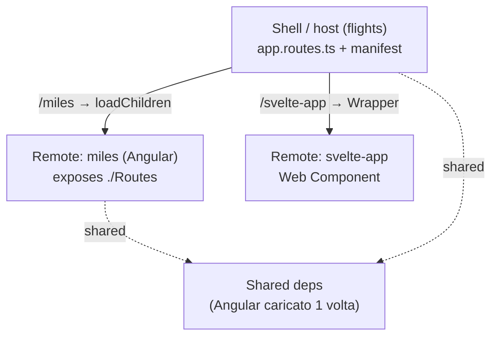

# 18 · Micro Frontends: Scaling Across Multiple Teams
> 📖 cap.18 · pp.435-455 — *Modern Angular* v2.0.0

I sistemi enterprise sono spesso sviluppati da più team cross-funzionali. Per farli procedere in autonomia, riducendo al minimo il bisogno di coordinarsi, conviene **modularizzare verticalmente** il sistema (tagliarlo per [[glossario#vertical-slicing|aree funzionali]] — es. "prenotazioni", "fatturazione" — invece che per livelli tecnici) in aree a basso accoppiamento che ogni team può gestire da sé. Finora nel libro i verticali erano semplici cartelle (vedi [[08-sustainable-architectures]]); i [[glossario#micro-frontend|**Micro Frontends**]] fanno un passo in più: a ogni verticale dedicano una **applicazione separata**, deployabile in modo indipendente (rilasciabile da sola, senza ridistribuire il resto del sistema).

Il capitolo spiega cosa sono i Micro Frontends e le loro conseguenze, come implementarli con Angular e [[glossario#native-federation-module-federation|**Native Federation**]], e come affrontare gli scenari **multi-version / multi-framework** (più micro frontend che girano insieme pur usando versioni diverse di Angular, o framework diversi tra loro) tipici degli ambienti corporate.

## Cosa sono i Micro Frontends — motivazioni
> 📖 pp.435-436

Come i Microservices, offrono vantaggi sia tecnici sia organizzativi: app più piccole rendono più facili test, performance tuning e isolamento dei guasti in una singola parte del sistema. Ma nei casi reali seguiti dall'autore come consulente, il motivo principale è stato la **team autonomy**: i team non si bloccano a vicenda e possono **deployare indipendentemente** in qualsiasi momento. In progetti multi-team in ambienti corporate, con catene di comunicazione e processi decisionali lunghi, questo aspetto diventa rapidamente vitale per il successo del progetto.

- Ogni team può prendere le decisioni — di **architettura e di stack** — più adatte ai propri obiettivi. Mischiare più framework client-side nella stessa applicazione è un **anti-pattern** da evitare, ma può abilitare un **percorso di migrazione** verso un nuovo stack: nelle aziende le soluzioni software sopravvivono allo stack tecnologico medio.
- Build separate → ottimo potenziale per gli **incremental builds** (si ri-builda solo ciò che è cambiato; es. il build system **Nx**). Curiosamente, questa ottimizzazione si può sfruttare anche **senza** allineare i team a singole app o adottare deploy separati — e c'è dibattito se ciò porti già "automaticamente" a un'architettura micro frontend.
- Onboarding più semplice di nuovi membri, scalabilità aggiungendo micro frontend, cicli di rilascio più rapidi.

## Sfide da tenere a mente
> 📖 pp.436-437

Ogni decisione architetturale ha conseguenze, anche negative:

- **UI/UX incoerente**: micro frontend sviluppati separatamente possono divergere nell'aspetto.
- **Più bundle da scaricare** (un bundle è il file JS impacchettato che il browser scarica) → tempi di caricamento peggiori e maggiore pressione sulla memoria.
- Definire confini verticali netti, e implementarli come app separate, è **difficile**. E mentre tante piccole app a prima vista semplificano l'implementazione, integrarle in una soluzione unica aggiunge complessità.
- La sfida più grande osservata in pratica: si passa da una **compile-time integration** (le parti vengono messe insieme e verificate dal compiler quando costruisci l'app) a una **runtime integration** (le parti si incontrano solo nel browser, mentre l'app gira). Non si prevedono facilmente i problemi che nascono quando app sviluppate e deployate separatamente iniziano a interagire a runtime. L'attuale generazione di framework SPA (Angular in primis) è pensata per **ottimizzazioni a compile-time**: il compiler usa i type check (controlli sui tipi) per individuare i conflitti ed emette codice ottimizzato per il [[glossario#tree-shaking|**tree-shaking**]] (rimuovere a build il codice non usato), e la CLI fornisce una build altamente ottimizzata. L'uso "off-label" (cioè in un modo diverso da quello per cui questi strumenti sono nati) necessario ai micro frontend mina alcuni di questi vantaggi.

> [!tip]
> Le controindicazioni si possono compensare: un **design system** (libreria condivisa di componenti e regole grafiche) per la coerenza UI/UX, il [[glossario#lazy-loading|lazy-loading]] (caricare le parti del sistema solo quando servono) delle singole parti del sistema. Per approfondire le strategie di compensazione: il [survey su 150+ practitioner](https://www.angulararchitects.io/blog/consequences-of-micro-frontends-survey-results/).

## Self-Contained Systems (SCS)
> 📖 p.437

L'approccio **Self-Contained System** separa la funzionalità di un sistema più grande in tanti sistemi indipendenti e collaboranti. Buoni candidati: Domain / Bounded Context in ottica **DDD** (Domain-Driven Design — il metodo che ritaglia il software intorno alle aree di business e ai loro confini netti). Ogni SCS può avere un backend e un frontend ed è **molto debolmente accoppiato** (le parti dipendono il meno possibile l'una dall'altra).

- Backend: comunicazione preferita via **REST/HTTP** o messaging.
- Frontend: integrazione gestita **unicamente via hyperlink**.

Un SCS si può vedere come una combinazione speciale di microservice + micro frontend (o di un piccolo gruppo di microservice e micro frontend correlati). L'approccio a hyperlink è allettante perché **davvero semplice** da realizzare e integra senza problemi anche tecnologie diverse: lo si vede spesso nelle product suite, dove si resta a lungo su un'applicazione prima di passare a un'altra (esempio noto: Office 365). **Svantaggio**: si perdono i benefici della SPA — seguire un link carica un'intera nuova app e scarica la precedente, con tutto il suo stato. Per un'integrazione più fine si usa Native Federation.

> [!tip]
> Prima di scegliere Native Federation, valuta se basta il banale **hyperlink-based SCS**: zero infrastruttura, integra anche stack diversi. Lo paghi solo perdendo la continuità della SPA.

## Native Federation
> 📖 pp.438-440

**Module Federation** (in webpack dalla v5) è spesso visto come un punto di svolta per i micro frontend: permette di caricare **on-demand** (solo al momento del bisogno) parti di app compilate e pubblicate separatamente.

- Una **shell** (ufficialmente *host*) definisce segmenti URL che puntano ai Micro Frontends (ufficialmente *remotes*).
- I remote **pubblicano** parti di programma (componenti, moduli Angular) che la shell carica **a runtime**.
- Le **dipendenze sono condivise** a runtime: Angular viene caricato **una sola volta** anche se più micro frontend lo usano.

**Native Federation** (`@angular-architects/native-federation`) porta lo stesso mental model (modo di ragionare, stessi concetti) **fuori da webpack**: stesse opzioni e configurazione di Module Federation, ma funziona con qualsiasi build tool e usa tecnologie **browser-native** (già parte degli standard del browser, senza strumenti extra): ECMAScript modules (i moduli JS standard, con `import`/`export`) + **Import Maps** (una mappa che dice al browser dove trovare ogni modulo da importare). Così garantisce supporto a lungo termine dai browser e abilita implementazioni alternative.

- Gira **prima e dopo** il bundler vero e proprio nella build → indipendente dal bundler usato (esbuild, ecc.). Dovendo anch'esso creare qualche bundle, delega al bundler scelto, collegato via **adapter** intercambiabili.
- A runtime piazza remote e librerie condivise in **bundle ECMAScript** dedicati e conformi agli standard; le info su questi bundle stanno in **file di metadati** (`remoteEntry.json`) che formano la base di un **Import Map** standard, dicendo al browser quali bundle caricare e da dove.



Il progetto demo è `flights42`: una shell (`flights`) e remote come `miles` (Angular) e `svelte-app` ([[glossario#web-component-custom-element|Web Component]] basato su Svelte — un elemento HTML personalizzato, standard del browser, che incapsula un componente di un altro framework).

## Setup di un Micro Frontend (remote)
> 📖 pp.441-442

Per Angular e la CLI, Native Federation offre uno schematic `ng add` (uno schematic è uno script della CLI che genera/modifica i file del progetto per te). Questo comando aggiunge Native Federation al progetto `miles` e lo configura come **remote** che funge da Micro Frontend:

```bash
ng add @angular-architects/native-federation --project miles --port 4201 --type remote
```

Lo schematic crea anche un `federation.config.js` che ne controlla il comportamento:

```js
// projects/miles/federation.config.js
const {
  withNativeFederation,
  shareAll,
} = require('@angular-architects/native-federation/config');

module.exports = withNativeFederation({
  name: 'miles',                                          // nome univoco del remote
  exposes: {
    // mappa i file fisici a nomi corti caricabili dall'host a runtime
    './Component': './projects/miles/src/app/miles-overview.ts',
  },
  shared: {
    ...shareAll({                                         // condivide tutte le deps di package.json
      singleton: true,
      strictVersion: true,
      requiredVersion: 'auto',
    }),
  },
  skip: [                                                 // pacchetti da NON condividere (build/startup più snelli)
    'rxjs/ajax',
    'rxjs/fetch',
    'rxjs/testing',
    'rxjs/webSocket',
  ],
  features: {
    ignoreUnusedDeps: true,                               // ignora le deps presenti ma non usate da quest'app
  },
});
```

- `name`: identificatore univoco del remote.
- `exposes`: quali file il remote pubblica all'host. Restano buildati e deployati col remote, ma sono caricabili nell'host a runtime; siccome l'host non si cura del path completo, `exposes` lo mappa a un **nome corto** (`./Component`). Nel demo `miles` pubblica il componente `MilesOverview`; al suo posto si potrebbe pubblicare qualsiasi componente o una **routing config lazy**.
- `shared`: le dipendenze che il remote vuole condividere con host e altri remote. `shareAll` evita di elencarle tutte (prende le `dependencies` di `package.json`); i pacchetti che `shareAll` **non** deve condividere si elencano in `skip`, migliorando leggermente le performance di build e di avvio.

## Setup di uno Shell (host)
> 📖 pp.442-444

Anche l'host che fa da Micro Frontend Shell si configura con `ng add`:

```bash
ng add @angular-architects/native-federation --project flights --port 4200 --type dynamic-host
```

`--type dynamic-host` significa che i remote da caricare sono definiti in un file di configurazione:

```json
// public/federation.manifest.json
{
  "miles": "http://localhost:4201/remoteEntry.json"
}
```

Il manifest viene generato di default nella cartella `public/` dell'host. Trattandolo come **asset**, può essere scambiato in fase di deploy per adattare l'app all'ambiente. Mappa i nomi dei remote ai loro metadati (il `remoteEntry.json` che Native Federation aggiunge in build). Anche se `ng add` lo genera, **va controllato** per sistemare le porte o rimuovere voci che non sono remote.

`ng add` genera anche un `federation.config.js` per l'host. Manca l'entry `exposes`, dato che un host di norma non pubblica file ad altri host — ma nulla vieta di aggiungerlo se l'host fa anche da remote. La feature opzionale `ignoreUnusedDeps`, attivata dallo schematic per tutti i nuovi progetti, fa ignorare a Native Federation le librerie presenti in `package.json` ma non usate dall'app (es. usate solo da altre app dello stesso [[glossario#monorepo|monorepo]] — un unico repository che contiene più progetti).

Il `main.ts`, anch'esso modificato da `ng add`, **inizializza** Native Federation col manifest:

```ts
// src/main.ts
import { initFederation } from '@angular-architects/native-federation';

initFederation('federation.manifest.json')
  .catch((err) => console.error(err))
  .then((_) => import('./bootstrap'))
  .catch((err) => console.error(err));
```

`initFederation` legge i metadati di ogni remote e genera l'**Import Map** che il browser usa per caricare i pacchetti condivisi e i moduli esposti; poi il flusso delega a `bootstrap.ts`, che avvia Angular nel modo usuale (`bootstrapApplication` o `bootstrapModule`).

Per caricare una parte pubblicata da un remote, l'host va esteso con una **lazy route** che usa `loadRemoteModule` (vedi anche [[04-router-navigation-lazy-loading]]):

```ts
// src/app/app.routes.ts
import { loadRemoteModule } from '@angular-architects/native-federation';

export const routes: Routes = [
  // ...
  {
    path: 'miles',
    loadComponent: () => loadRemoteModule('miles', './Component'),
  },
  // ...
];
```

`loadRemoteModule(remoteName, exposedName)` prende il nome dal manifest (`miles`) e il nome corto sotto cui il remote pubblica il file desiderato (`./Component`).

> [!warning]
> `loadRemoteModule` ritorna l'**intero modulo ECMAScript** ("file"): il componente da caricare deve quindi essere il **default export** (`export default MilesOverview;`). In alternativa, punta all'export con una clausola `then`:
> ```ts
> loadComponent: () => loadRemoteModule('miles', './Component')
>   .then(m => m.MilesOverview),
> ```

## Esporre una router config
> 📖 pp.445-447

Esporre un singolo componente è un po' troppo a grana fine. Spesso si vuole esporre un'**intera feature** fatta di più componenti. Si può esporre qualsiasi costrutto TypeScript/ECMAScript: per feature grossolane, un `NgModule` con subroute oppure — con gli Standalone Components — direttamente una **routing config**. Nel demo, `miles` usa quest'ultimo approccio:

```ts
// projects/miles/src/app/app.routes.ts
import { Routes } from '@angular/router';
import { MilesOverview } from './miles-overview';
import { NextLevelPage } from './next-level-page';

export const routes: Routes = [
  { path: '', pathMatch: 'full', redirectTo: 'home' },
  { path: 'home', component: MilesOverview },
  { path: 'next-level', component: NextLevelPage },
];

export default routes;
```

La si espone sotto `./Routes` nel `federation.config.js` del remote:

```js
// projects/miles/federation.config.js
module.exports = withNativeFederation({
  name: 'miles',
  exposes: {
    './Routes': './projects/miles/src/app/app.routes.ts',
    // ...
  },
  // ...
});
```

Nella shell si instrada direttamente verso questa routing config con `loadChildren`:

```ts
// src/app/app.routes.ts
{
  path: 'miles',
  loadChildren: () => loadRemoteModule('miles', './Routes'),
},
```

Anche qui il router prende il **default export**; senza default export si usa una clausola `then`:

```ts
{
  path: 'miles',
  loadChildren: () => loadRemoteModule('miles', './Routes')
    .then(m => m.routes),
},
```

La navigazione della shell linka alle route del remote tramite il **prefisso di path** (`miles/home`, `miles/next-level`):

```html
<!-- src/app/shell/sidebar/sidebar.html -->
<li routerLinkActive="active">
  <a routerLink="miles/home"><p>Miles</p></a>
</li>
<li routerLinkActive="active">
  <a routerLink="miles/next-level"><p>Next Level</p></a>
</li>
```

## Comunicazione tra Micro Frontends
> 📖 pp.447-448

Si può abilitare via **librerie condivise**, ma **con cautela**: i micro frontend nascono per disaccoppiare i frontend tra loro; se un frontend si aspetta informazioni da un altro, succede l'opposto. Nella pratica si condivide solo qualche **informazione contestuale** (username corrente, client corrente, qualche filtro globale).

Serve prima una shared library: un npm package sviluppato a parte oppure una libreria interna al progetto Angular (generabile con `ng g lib util-auth` — vedi [[14-monorepos-libraries]]). Nel demo, `util-auth` espone un service stateful (un servizio che conserva uno stato, qui il valore corrente) che usa un RxJS `BehaviorSubject` (un contenitore osservabile che tiene l'ultimo valore e lo "trasmette" a chi è in ascolto) per un meccanismo publish/subscribe (uno pubblica i cambi, gli altri si iscrivono e vengono notificati), così le parti interessate vengono notificate sui cambi di valore:

> [!info] Angular 22+
> `@Service()` (senza argomenti) è il nuovo equivalente del vecchio `@Injectable({ providedIn: 'root' })`: dichiara un service iniettabile e registrato nello scope root. Qui la fonte usa proprio `@Service()`. Dettagli in [[service]].

```ts
// projects/util-auth/src/lib/auth.service.ts
import { Service } from '@angular/core';
import { BehaviorSubject } from 'rxjs';

@Service()
export class AuthService {
  userName = new BehaviorSubject<string>('');

  login(userName: string): void {
    this.userName.next(userName);
  }
}
```

Le lib interne al monorepo vanno rese accessibili via **path mapping** (in `tsconfig.json` si dice a TypeScript che un nome breve come `@flights42/util-auth` corrisponde a un certo file su disco) nel `tsconfig.json`:

```json
// tsconfig.json
"compilerOptions": {
  "paths": {
    "@flights42/util-auth": ["./projects/util-auth/src/public-api.ts"]
  }
}
```

> [!warning]
> Il mapping punta a `public-api.ts` nel **sorgente** della lib (strategia usata anche da Nx). La **CLI** invece punta di default alla cartella `dist`: in quel caso va corretto a mano. Inoltre **tutti i partner di comunicazione devono usare lo stesso path mapping**.

## Soluzioni multi-version / multi-framework
> 📖 pp.448-449

Finora si è assunto che shell e remote usino **stesso framework e versione**. Per integrare micro frontend basati su framework e/o versioni **diversi** servono accorgimenti aggiuntivi. Non è qualcosa da introdurre senza un buon motivo: tipicamente **sistemi legacy** (vecchi sistemi ancora in uso, difficili da aggiornare) o la combinazione di prodotti esistenti in una suite.

### Astrarre i Micro Frontends con Web Components
> 📖 pp.449-450

Primo passo: **astrarre** i diversi framework e versioni (nasconderne le differenze dietro un'interfaccia comune, così la shell li tratta tutti allo stesso modo). Approccio diffuso: usare **Web Components** che incapsulano interi Micro Frontends — non i Web Components ideali nel senso di widget riutilizzabili, ma web component **a grana grossa** (grossi, non piccoli widget) che rappresentano interi domini (es. un'app Svelte caricata in una shell Angular).

Scrivere un Web Component che delega a un framework (gli passa il lavoro di disegnare la UI), invece di scrivere direttamente sul DOM, non è difficile. Angular lo semplifica con **`@angular/elements`** (`npm i @angular/elements`), che converte un componente Angular in Web Component — tecnicamente lo *wrappa* (lo avvolge) in un Web Component creato al volo. Con gli Standalone Components:

```ts
// projects/mfe2/src/bootstrap.ts
import { NgZone } from '@angular/core';

(async () => {
  const app = await createApplication({
    providers: [],
  });

  const mfe2Root = createCustomElement(AppComponent, {
    injector: app.injector,
  });

  customElements.define('mfe2-root', mfe2Root);
})();
```

- Queste righe **sostituiscono il bootstrap** dell'app (l'avvio normale di Angular). `createApplication` crea un'app Angular con un root injector (il contenitore radice della [[glossario#dependency-injection-di|dependency injection]], da cui si recuperano i servizi), configurato tramite l'array `providers`.
- Invece di fare il bootstrap di un componente, `createCustomElement` trasforma uno standalone component in web component.
- `customElements.define` (API del browser) lo registra col nome `mfe2-root`: da lì il browser renderizza il web component (e quindi il componente Angular dietro di esso) ovunque compaia `<mfe2-root></mfe2-root>` nel markup.

> [!warning]
> Il nome del custom element **deve contenere un trattino** (es. `mfe2-root`): è una regola degli Web Components per evitare conflitti con gli elementi HTML esistenti.

Per condividere il Web Component via Native Federation, il file che lo definisce va in `exposes` nel `federation.config.js`. Nel demo il remote Svelte espone `./web-components`; un remote Angular esporrebbe analogamente il suo file di bootstrap. Così si ha il meglio dei due mondi: Native Federation **condivide** framework e librerie quando le versioni coincidono; i Web Components **astraggono** le differenze quando framework/versioni divergono.

### Caricare Web Components nello Shell
> 📖 pp.450-453

Pubblicare il Web Component è solo un lato della medaglia: va anche **caricato** nella shell. Poiché l'Angular Router lavora **solo con Angular Components**, conviene **wrappare** il Web Component in un componente Angular. Nel demo lo fa il componente `Wrapper`:

```ts
// src/app/domains/shared/ui-federation/wrapper.ts
import { CommonModule } from '@angular/common';
import { Component, effect, ElementRef, inject, input } from '@angular/core';
import { loadRemoteModule } from '@angular-architects/native-federation';

export interface WrapperConfig {
  remoteName: string;
  exposedModule: string;
  elementName: string;
}

export const initWrapperConfig: WrapperConfig = {
  remoteName: '',
  exposedModule: '',
  elementName: '',
};

@Component({
  selector: 'app-wrapper',
  standalone: true,
  imports: [CommonModule],
  templateUrl: './wrapper.html',
  styleUrls: ['./wrapper.css'],
})
export class Wrapper {
  private elm = inject(ElementRef);
  config = input(initWrapperConfig);

  constructor() {
    effect(async () => {
      const { exposedModule, remoteName, elementName } = this.config();
      await loadRemoteModule(remoteName, exposedModule);
      const root = document.createElement(elementName);
      this.elm.nativeElement.appendChild(root);
    });
  }
}
```

Il `Wrapper` carica il Web Component via Native Federation e crea l'elemento HTML in cui il browser lo renderizza. La config (`remoteName`, `exposedModule`, `elementName`) arriva via l'`input` `config`, rendendo il componente **riutilizzabile** su più remote Web Component.

Dato che ci aspettiamo che `config` venga assegnato dal router, serve attivare la feature `withComponentInputBinding`:

```ts
// src/app/app.config.ts
import { withComponentInputBinding } from '@angular/router';
// ...
provideRouter(routes, withComponentInputBinding()),
```

Dopodiché si definiscono i dati chiave del `Wrapper` direttamente nella route:

```ts
// src/app/app.routes.ts
{
  path: 'svelte-app',
  component: Wrapper,
  data: {
    config: {
      remoteName: 'svelte-app',
      exposedModule: './web-components',
      elementName: 'svelte-mfe',
    } as WrapperConfig,
  },
},
```

E si registra il remote `svelte-app` nel manifest:

```json
// public/federation.manifest.json
{
  "miles": "http://localhost:4201/remoteEntry.json",
  "svelte-app": "https://kind-grass-08faefd03.4.azurestaticapps.net/remoteEntry.json"
}
```

### Condividere Zone.js
> 📖 p.453

In origine Angular usava la libreria [[glossario#zoneless-zonejs|**Zone.js**]] come fondamento della [[glossario#change-detection|change detection]] (il meccanismo con cui Angular si accorge dei cambiamenti e aggiorna la UI). I nuovi progetti non la generano più, ma se un progetto esistente la usa ancora bisogna **condividere l'istanza** di `NgZone` (il service che rappresenta Zone.js dentro Angular). La `App` component della shell può esporre il proprio `NgZone` nel namespace globale (`globalThis`, un oggetto visibile a tutto il codice nella pagina):

```ts
// Conceptual: shell's root component
@Component({ /* … */ })
export class App {
  constructor() {
    (globalThis as any).ngZone = inject(NgZone);
  }
}
```

I singoli Micro Frontend riusano quell'istanza in fase di bootstrap:

```ts
// Conceptual: remote's bootstrap
const app = await createApplication({
  providers: [
    (globalThis as any).ngZone
      ? { provide: NgZone, useValue: (globalThis as any).ngZone }
      : [],
    provideRouter(APP_ROUTES),
  ],
});
```

### Web Components con route proprie
> 📖 p.454

Si complica quando anche il micro frontend dentro il Web Component usa il **routing**: due router "duellano" sull'URL (quello della shell e quello del Micro Frontend). Procedura collaudata per non farli interferire:

- A ogni route del Micro Frontend si dà un **prefisso univoco**.
- La shell dice al suo router di guardare **solo il primo segmento** dell'URL: in base a quel segmento carica il Micro Frontend, che poi decide il routing sui segmenti restanti.

Per stabilire quale parte dell'URL interessa a ciascun router si usa uno **`UrlMatcher`**: funzioni che dicono al router se la route configurata va attivata (es. un matcher `startsWith` che verifica se l'URL corrente inizia col segmento passato). Nel demo `miles` è integrato via `loadChildren`, quindi la shell delega `miles/*` al router del remote; per i Web Component con route proprie si usa un pattern simile (un matcher sul prefisso del segmento, es. `profile`, passando il resto dell'URL al Web Component).

### Workaround per i router nei Web Component
> 📖 pp.454-455

Perché il router reagisca ai cambi di route **dentro** il Web Component serve un'integrazione speciale: l'URL della shell e il router del Micro Frontend possono **andare fuori sync**. Un helper come `connectRouter` sincronizza il router del Micro Frontend con l'URL del browser; il root component del Micro Frontend lo chiama in fase di inizializzazione:

```ts
@Component({ /* … */ })
export class AppComponent implements OnInit {
  constructor() {
    connectRouter();
  }
}
```

> [!warning]
> `startsWith` (il matcher) e `connectRouter` **non** sono API ufficiali di Angular o Native Federation: sono helper di esempio del [`module-federation-plugin-example`](https://github.com/manfredsteyer/module-federation-plugin-example). Vanno scritti o copiati, non sono disponibili "out of the box".

## Il costo dei Micro Frontends
> 📖 p.455

Tutti i progetti Micro Frontend di successo visti dall'autore in 10+ anni hanno una cosa in comune: un **platform team** che fornisce supporto via **guideline, esempi e librerie interne**. È necessario perché un'architettura Micro Frontend **non si ottiene premendo un pulsante** o chiamando `ng new`: qualcuno deve sviluppare le soluzioni viste sopra (es. combinare più router in una singola shell).

- Il platform team **non deve essere grande**: l'autore ha visto **3 persone supportare 80+ feature team** distribuiti nel mondo — ovviamente non lavorando con tutti, ma offrendo servizi come guideline, esempi e librerie.
- Ai suoi membri serve una solida comprensione dei framework usati **e** dei concetti JavaScript sottostanti. Tipicamente partono da shell + primo micro frontend prima di scalare a più team.

> [!tip]
> I Micro Frontends non sono gratis: la spesa nascosta è **organizzativa** (un platform team), non solo tecnica. Senza quel supporto l'architettura non regge allo scaling.

## 🔁 Ripasso lampo

**1.** Qual è la motivazione *principale* dietro i Micro Frontends nella pratica, oltre ai benefici tecnici? Perché mischiare più framework è di norma un anti-pattern ma a volte utile?
> [!success]- Risposta
> La motivazione principale è la **team autonomy**: i team non si bloccano a vicenda e possono **deployare indipendentemente** in qualsiasi momento — vitale nei progetti multi-team con catene di comunicazione lunghe. Mischiare più framework client-side nella stessa app è un anti-pattern (incoerenza, overhead), ma può abilitare un **percorso di migrazione** verso un nuovo stack, dato che in azienda le soluzioni software sopravvivono allo stack tecnologico medio.

**2.** Cosa significa passare da *compile-time integration* a *runtime integration* e perché è la sfida più grande?
> [!success]- Risposta
> Significa che app sviluppate e deployate **separatamente** non vengono più integrate e verificate dal compiler in fase di build, ma iniziano a interagire solo **a runtime**. È la sfida più grande perché non si prevedono facilmente i conflitti che emergono lì, e i framework SPA come Angular sono pensati per **ottimizzazioni a compile-time** (type check, tree-shaking, build CLI ottimizzata): l'uso off-label per i micro frontend mina alcuni di quei vantaggi.

**3.** Cos'è un Self-Contained System e come integra i frontend? Pro e contro rispetto a Native Federation?
> [!success]- Risposta
> Un **SCS** separa il sistema in tanti sistemi indipendenti, molto debolmente accoppiati, ciascuno con backend + frontend (buoni candidati: Domain/Bounded Context DDD). I frontend si integrano **unicamente via hyperlink**. **Pro**: semplicissimo, zero infrastruttura, integra anche stack diversi. **Contro**: si perdono i benefici della SPA — seguire un link carica un'intera nuova app e scarica la precedente con tutto il suo stato. Native Federation costa più infrastruttura ma dà un'integrazione fine mantenendo la continuità della SPA.

**4.** Cosa fa Native Federation in più rispetto a Module Federation, e quali tecnologie browser-native usa? Quante volte viene caricato Angular?
> [!success]- Risposta
> Native Federation porta lo stesso mental model di Module Federation **fuori da webpack**: stesse opzioni e configurazione, ma funziona con qualsiasi build tool (gira prima e dopo il bundler, collegato via adapter). Usa tecnologie **browser-native**: **ECMAScript modules** e **Import Maps**, per supporto a lungo termine. Le dipendenze condivise (come **Angular**) vengono caricate **una sola volta**, anche se più micro frontend le usano.

**5.** Differenza tra `loadComponent`/`loadRemoteModule` ed esporre una router config con `loadChildren`? Perché serve un default export (o `then`)?
> [!success]- Risposta
> `loadComponent` + `loadRemoteModule('miles', './Component')` carica un **singolo componente** esposto dal remote. Esporre una **router config** sotto `./Routes` e instradarla con `loadChildren` carica un'**intera feature** di più componenti (più pratico). In entrambi i casi `loadRemoteModule` ritorna l'**intero modulo ECMAScript**: il router prende il **default export**, quindi il componente/le routes devono essere `export default`; in mancanza, si punta all'export desiderato con una clausola `.then(m => m.MilesOverview)` o `.then(m => m.routes)`.

**6.** Come si integra un micro frontend basato su un *altro* framework? Ruolo di `@angular/elements`, `createCustomElement` e del componente `Wrapper`.
> [!success]- Risposta
> Si **astrae** il micro frontend dentro un **Web Component** a grana grossa. Con `@angular/elements`, `createCustomElement` trasforma uno standalone component in web component, registrato via `customElements.define('mfe2-root', ...)` (il nome deve contenere un trattino). Lato shell, poiché l'Angular Router lavora solo con Angular Components, il `Wrapper` (un componente Angular) carica il Web Component via `loadRemoteModule` in un `effect` e ne crea l'elemento HTML con `document.createElement`, ricevendo la config via `input` per essere riutilizzabile.

**7.** Quando un Web Component ha route proprie, come si evita che i due router litighino? Cosa fanno `UrlMatcher`/`startsWith` e `connectRouter`?
> [!success]- Risposta
> Si dà a ogni route del micro frontend un **prefisso univoco** e si dice alla shell di guardare **solo il primo segmento**: in base a quello carica il micro frontend, che decide il routing sui segmenti restanti. Un **`UrlMatcher`** (es. `startsWith`) dice al router se attivare la route in base al prefisso. **`connectRouter`** sincronizza il router del micro frontend con l'URL del browser, così non vanno fuori sync. Attenzione: `startsWith` e `connectRouter` sono helper di esempio (`module-federation-plugin-example`), non API ufficiali.

**8.** Perché un platform team è il vero costo dei Micro Frontends?
> [!success]- Risposta
> Perché l'architettura Micro Frontend **non arriva premendo un pulsante** né con `ng new`: qualcuno deve sviluppare le soluzioni (combinare più router in una shell, ecc.) e offrire **guideline, esempi e librerie interne**. Il costo è prevalentemente **organizzativo**, non solo tecnico — anche se il team può essere piccolo (3 persone per 80+ feature team). Senza quel supporto l'architettura non regge allo scaling.

**In sintesi:**
- I Micro Frontends spezzano il sistema in app **deployabili separatamente** → autonomia dei team e rilasci più rapidi, ma al prezzo della **runtime integration** e di confini verticali difficili da definire.
- **Native Federation** (`@angular-architects/native-federation`) porta il mental model di Module Federation in Angular **fuori da webpack**, usando **Import Maps + ESM** per caricare i remote on-demand e condividere Angular **una sola volta**. Setup via `ng add` (`--type remote` / `--type dynamic-host`), `exposes` + `shareAll`, manifest, `initFederation`, `loadRemoteModule`.
- Esporre una **routing config** (`./Routes` + `loadChildren`) è più pratico che esporre singoli componenti.
- La comunicazione tra micro frontend si fa con **librerie condivise** (es. un `BehaviorSubject` in `@Service()`), ma va limitata a poche info contestuali per non ri-accoppiare i frontend.
- Per scenari **multi-framework/multi-version** si astraggono i micro frontend con **Web Components** (`@angular/elements`), caricati nella shell via un `Wrapper`; servono accorgimenti per `NgZone`/Zone.js e per i router annidati.
- Il successo richiede un **platform team** (guideline, esempi, librerie): è il costo reale, prevalentemente organizzativo.
