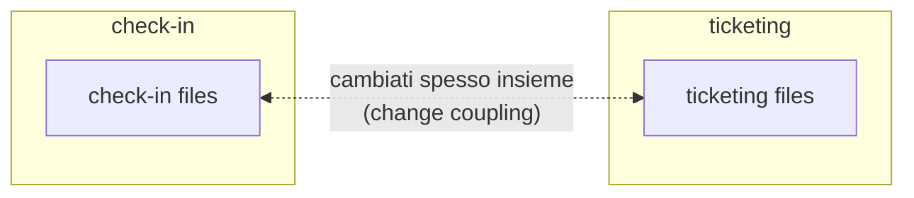

# 19 · Analyzing Your Architecture with Forensic Techniques
> 📖 cap.19 · pp.456-465 — *Modern Angular* v2.0.0

Dei buoni **domain boundary** rendono un sistema manutenibile nel lungo periodo (vedi [[08-sustainable-architectures]]). Ma come capire se la struttura definita all'inizio è ancora valida, e dove conviene migliorarla? L'approccio ovvio è analizzare le **dipendenze** fra le parti dell'app. La **forensic analysis** va oltre: tenendo conto anche dei **dati storici** del version control, scopre pattern nascosti che le sole dipendenze non rivelano.

Il capitolo mostra cosa può rivelare, dal punto di vista architetturale, la forensic analysis di un'app Angular. Lo strumento usato è **Detective** (open-source, di Angular Architects), ispirato al libro *Your Code as a Crime Scene* di Adam Tornhill, di cui implementa parzialmente le idee.

## The Example Application Examined
> 📖 p.456

L'app demo è divisa in **due domini**, più un'area `shared` che fornisce componenti tecnici riusabili (logging, authentication). Detective deriva il diagramma della struttura direttamente dal codice sorgente.

```text
              shared (logging, authentication, ...)
               ▲                    ▲
   (dipendenze)│ più spesse          │ meno
               │                    │
           ticketing             booking
```

Il collegamento `ticketing → shared` è disegnato **più spesso** di `booking → shared`: indica più dipendenze (il tooltip mostra il numero concreto). A prima vista tutto torna: due domini separati che condividono qualche implementazione tecnica.

Aprendo i tre blocchi (drill-down) si vede che **dentro** ogni dominio ci sono molte dipendenze. Anche questo è un buon segno: significa che ogni dominio si occupa di un'area di responsabilità coerente. È la **high cohesion**: idealmente la maggior parte dei cambiamenti resta isolata dentro un dominio e non tocca gli altri.

> [!tip]
> **High cohesion** dentro i domini e **low coupling** fra i domini sono due facce della stessa medaglia: entrambi servono a far evolvere i domini in modo il più possibile indipendente. Lo sviluppatore non deve tenere a mente tutto il sistema → meno carico cognitivo, più focus, meno errori, lead time più brevi. Idealmente il taglio dei domini correla anche con la struttura dei team, dando team self-sufficient che si concentrano ciascuno sul proprio dominio (vedi [[#Team Alignment and Conway's Law]]).

## Analyzing Layering
> 📖 pp.457-458

Questa prima analisi strutturale rivela però un potenziale problema: la feature `feature-next-flight` dipende da `feature-my-tickets`. Non è per forza un male, ma può portare a catene di dipendenze e persino a **cicli**. Per prevenirlo, i domini si suddividono in **layer**, dove ogni layer può comunicare solo con i layer inferiori.

```text
feature   → smart components: controllo del caso d'uso, NON pensati per il riuso
ui        → dumb / presentational components: riusabili, indipendenti dal caso d'uso
domain    → tipi che rappresentano gli oggetti ricevuti + servizi che parlano col backend
util      → funzioni ausiliarie (authentication, logging, ...)
```

Questi layer si allineano alle idee del team **Nx** e si sono dimostrati validi nei progetti degli autori, soprattutto perché bilanciano bene beneficio e overhead. Sono anche adattabili al singolo progetto: alcuni clienti splittano il layer `data` in due (un layer fa data access, l'altro fornisce i tipi associati), così i dumb component vedono solo i tipi, dato che non devono parlare autonomamente col backend.

La funzionalità che `feature-my-tickets` vuole condividere con `feature-next-flights` può essere gestita in vari modi:
- spostare dumb component e servizi nei layer `ui` e `data`;
- **ammorbidire un po' il layering**, lasciando che i feature component dei domini accedano ai feature component in `shared`: dato che la comunicazione va in una sola direzione, non si creano cicli;
- introdurre un ulteriore layer, es. `sub-feature`, fra `feature` e `ui`.

> [!tip]
> Le scoperte dell'analisi della struttura non danno una risposta automatica: portano a **discussioni** e quindi a **decisioni deliberate** sull'evoluzione del progetto. I metodi forensi delle sezioni seguenti aggiungono informazioni e basi di discussione che vanno ben oltre il semplice grafo delle dipendenze.

Collegamenti: [[08-sustainable-architectures]] (architecture matrix, layer, Sheriff/Detective).

## Forensic Analysis for Architects: A Brief Overview
> 📖 p.459

Le idee della forensic code analysis (dal libro *Your Code as a Crime Scene* di Adam Tornhill) applicano concetti della criminalistica all'esame del codice sorgente. Usando i **dati storici** del source code management si identificano gli **hotspot**: aree complesse cambiate di frequente, che possono segnalare debolezze architetturali capaci di rendere il sistema instabile e difficile da mantenere nel lungo periodo.

Tenendo conto della **dimensione temporale** emergono altre informazioni nascoste sull'evoluzione dell'architettura:
- **change coupling**: file cambiati spesso insieme, e quindi con dipendenze non ovvie → aiuta a valutare la modularizzazione attuale;
- **team alignment**: allineamento fra la struttura dei team e quella dei moduli → permette ai team di concentrarsi su parti specifiche e lavorare in modo più autonomo, migliorando la qualità del codice e riducendo il rischio di errori.

## Using Detective
> 📖 p.459

Per analizzare un progetto, dalla root si eseguono questi comandi:

```bash
npm i @softarc/detective -D
npx detective
```

> [!warning]
> Detective assume che **Git** sia installato e configurato per il progetto analizzato: si aspetta la sottocartella `.git` nella cartella in cui viene lanciato. Senza la storia Git non c'è analisi forense.

Collegamenti: Detective compare già in [[08-sustainable-architectures]] (visualizzazione dipendenze) e in [[14-monorepos-libraries]] (uso con Nx, insieme a Sheriff).

## Change Coupling
> 📖 p.460

Il coupling visto finora nasce direttamente dalle dipendenze fra moduli ECMAScript, e si deduce dagli statement `import`/`export` del codice. Il **change coupling** è un coupling meno ovvio: identifica i **file cambiati frequentemente insieme**. Questi file sono logicamente accoppiati e possono evidenziare problemi nei domain boundary — per esempio mina l'obiettivo, visto sopra, per cui la maggior parte dei cambiamenti dovrebbe restare in un solo dominio.



Nella demo emerge che il coupling fra i domini `check-in` e `ticketing` **non è basso** come sembrava dopo l'analisi strutturale. Sapendo che i domain boundary perfetti non esistono, questo insight diventa base di discussione: si può ritagliare diversamente l'intersezione fra i domini per favorire cohesion più alta e coupling più basso, puntando a una migliore separation of concerns. Qui aiuta l'idea di **bounded context** del Domain-driven Design.

> [!tip]
> Se la discussione conclude che le alternative hanno svantaggi maggiori, la decisione è **mantenere** l'implementazione attuale. Anche in quel caso l'analisi è servita: ha reso consapevoli dei trade-off necessari.

## Hotspots as an Indicator of Architectural Problems
> 📖 pp.461-462

Se lo **stesso file** viene modificato molto spesso può esserci un problema di architettura e di modularizzazione: magari un componente centrale da cui troppi domini dipendono, oppure un file editato di continuo per motivi diversi, segno che ha troppe responsabilità. Inoltre è ormai noto che un alto **code churn** (molte modifiche agli stessi file) correla con un tasso di errore più elevato.

Ovviamente conta se il file è semplice o complesso: un file con la lista delle voci di menu, che cresce di poche righe a ogni nuova feature, ha churn alto ma **non è critico**, perché la sua struttura non è complessa. Per questo Tornhill raccomanda di pesare il **churn** contro la **complessità**.

Sulla scelta della metrica di complessità Tornhill nota che, in fondo, conta poco quale si sceglie. Cita uno studio sull'attività cerebrale degli sviluppatori mentre leggono codice:
- la conclusione è che le metriche di complessità **non predicono granché bene** la difficoltà di comprensione del codice;
- ciò che incide di più è la **dimensione del vocabolario** usato (numero di variabili, funzioni, classi, ...) e, parzialmente correlata, la **lunghezza del codice** esaminato;
- per questo nel libro Tornhill usa le **Lines of Code** come misura di complessità; nel suo prodotto **Code Scene** usa invece la **cyclomatic complexity di McCabe** (conta il numero di percorsi nel codice). **Detective supporta entrambe le metriche.**

Moltiplicando il tasso di churn per una misura di complessità, l'analisi degli hotspot dà contesto in più per individuare le sezioni problematiche. La metrica risultante è l'**Hotspot Score**: più alto = area potenzialmente più rischiosa.

> [!warning]
> Non esiste una soglia universale che dica quale score indica un problema serio: l'hotspot score è una **proposta di prioritizzazione**, non un giudizio assoluto. Le aree con valori più alti vanno guardate più da vicino.

Per il suo taglio architetturale, Detective **aggrega gli hotspot a livello di modulo**: a colpo d'occhio vedi quale dominio/modulo contiene quanti file sopra una certa soglia (cliccando il modulo compaiono i file). Le **medie sono omesse di proposito**, per evitare che tanti file non critici nascondano i pochi critici.

Nella demo gli hotspot non preoccupano: due-tre cambiamenti totali e una cyclomatic complexity ≤ 6 a livello di file non giustificano nessun allarme.

## Team Alignment and Conway's Law
> 📖 pp.462-463

Già nel 1968 l'informatico americano **Melvin Conway** osservò che la struttura delle applicazioni riflette le strutture di comunicazione degli sviluppatori (**Conway's Law**). La spiegazione classica e vivida: se tre team costruiscono insieme un compilatore, finisci con un compilatore a tre fasi.

Conviene quindi allineare la struttura dei team all'architettura software desiderata — il cosiddetto **Inverse Conway Maneuver**. Se un team è responsabile di un intero dominio, ciò promuove il low coupling fra domini; concentrarsi su un solo dominio riduce anche il carico cognitivo.

Ma l'allineamento *ufficiale* fra team e domini non garantisce che sia *praticato*. Per individuare la discrepanza si analizzano i **commit**: si verifica se i team riescono davvero a concentrarsi sui propri domini.

> [!warning]
> Prima serve **mappare gli username del version control ai team**. Con Detective si adatta un apposito file di configurazione (i dettagli sono nel Readme del progetto).

Nella demo non c'è un allineamento chiaro fra team e domini: sembra piuttosto che i team Alpha e Beta supportino il team Gamma. La situazione va indagata: forse serve un'altra struttura di team che correli meglio con i domain boundary, oppure sono i domain boundary a dover essere aggiustati. Altre cause possibili: aderenza a vecchie strutture organizzative, distribuzione dei task fra team per ragioni tecniche, fattori storici — es. Gamma ha iniziato a sviluppare prima degli altri team, poi Alpha ha preso in carico `ticketing`. Ipotesi del genere si testano in fretta **limitando il periodo di analisi**.

Poiché `shared` non è un'unità omogenea ma una collezione eterogenea di moduli riusabili, l'analisi va **ripetuta a livello di modulo**, per vedere se ci sono dei lead author. Per i moduli tecnici riusabili, però, contano più le **responsabilità chiare** dell'allineamento stretto team/codice: tra l'altro evitano che contributi di team diversi causino breaking change.

Assegnando gli **ex membri** a un team artificiale a parte si può anche scoprire una **perdita di conoscenza** dovuta alla loro uscita. L'approccio si estende a ragionamenti **what-if**, per capire se la conoscenza vada distribuita meglio all'interno dei team.

## From Detective to Code Scene
> 📖 p.464

La forensic analysis descritta può essere migliorata ulteriormente:
- **raggruppare i commit** dello stesso feature branch o che referenziano lo stesso ticket ID, per non perdere il change coupling quando un dominio viene cambiato in commit separati;
- negli hotspot, considerare anche **come è distribuita la conoscenza**: se una sola persona conosce il codice dell'hotspot, la sua criticità aumenta;
- vedere come il sistema **è evoluto nel tempo** (coupling, team alignment e hotspot sono migliorati o peggiorati nelle ultime iterazioni?).

Il prodotto commerciale **Code Scene** (di Adam Tornhill) implementa queste opzioni e offre molte altre analisi.

## Critical Review
> 📖 p.464

È sorprendente quanti pattern nascosti la forensic analysis riesca a rivelare, e quanto bene combacino con i temi tipici dell'architettura software: coupling, cohesion, team alignment.

> [!warning]
> Nonostante l'entusiasmo, la forensic analysis è **solo un pezzo del puzzle**, non un sostituto della valutazione qualitativa dell'architettura. Resta da valutare: se l'architettura supporta davvero gli obiettivi (performance, security, usability), se sono state prese decisioni deliberate sui temi chiave (state management, authentication), se i pattern definiti sono implementati bene e hanno ancora senso, e se le assunzioni iniziali sui trade-off si sono rivelate corrette.

Non sostituisce nemmeno le **interviste agli stakeholder** (product manager, sviluppatori): in tutte le architecture review condotte dall'autore, gli sviluppatori avevano una forte intuizione delle aree da migliorare. I valori ottenuti **non vanno usati come target** da raggiungere: indicano aree sottili da esaminare più da vicino.

## 🔁 Ripasso lampo

**1.** Qual è la differenza fra il coupling derivato dagli `import`/`export` e il **change coupling**? Cosa rivela quest'ultimo che il primo non vede?
> [!success]- Risposta
> Il coupling da `import`/`export` deriva dalle dipendenze statiche fra moduli ECMAScript: si legge dal codice. Il **change coupling** è ricavato dai **dati storici** del version control e identifica i file **cambiati frequentemente insieme**: dipendenze *logiche* non ovvie che gli import non mostrano, e che possono segnalare boundary deboli (cambiamenti che attraversano più domini).

**2.** Perché un alto **code churn** non è di per sé critico? Come si pesa contro la complessità e quale metrica usa Detective (vs. Code Scene)?
> [!success]- Risposta
> Un file semplice (es. la lista delle voci di menu) può avere churn alto senza essere problematico, perché la sua struttura non è complessa. Per questo Tornhill pesa il **churn × complessità** → **Hotspot Score**. Detective supporta **entrambe** le metriche di complessità: **Lines of Code** (usata da Tornhill nel libro) e **cyclomatic complexity di McCabe** (usata nel prodotto Code Scene).

**3.** Cos'è l'**Hotspot Score** e perché non esiste una soglia universale? Perché Detective aggrega a livello di modulo e omette le medie?
> [!success]- Risposta
> È churn × complessità: più alto = area potenzialmente più rischiosa. Non c'è una soglia assoluta che indichi un problema serio; lo score è solo una **proposta di prioritizzazione**. Detective aggrega **per modulo** per il suo taglio architetturale (vedi a colpo d'occhio quanti file sopra soglia ha ogni dominio), e **omette le medie** così che tanti file non critici non nascondano i pochi critici.

**4.** Cosa afferma **Conway's Law** e cos'è l'**Inverse Conway Maneuver**? Come si verifica se l'allineamento team/dominio è davvero praticato?
> [!success]- Risposta
> Conway's Law: la struttura del software riflette le strutture di comunicazione di chi lo costruisce (tre team → compilatore a tre fasi). L'**Inverse Conway Maneuver** ribalta la cosa: si allinea volutamente la struttura dei team all'architettura desiderata (un team per dominio → low coupling, meno carico cognitivo). Per verificare se è praticato si **analizzano i commit** (dopo aver mappato gli username ai team), controllando se ciascun team si concentra davvero sul proprio dominio.

**5.** Quali sono i quattro layer tipici (`feature` / `ui` / `domain` / `util`) e perché un layer può comunicare solo con quelli inferiori?
> [!success]- Risposta
> `feature` = smart component (controllo del caso d'uso, non riusabili); `ui` = dumb/presentational component (riusabili, indipendenti dal caso d'uso); `domain` = tipi degli oggetti + servizi verso il backend; `util` = funzioni ausiliarie (authentication, logging). Il vincolo "solo verso layer inferiori" rende la comunicazione **unidirezionale**, così non si formano catene di dipendenze né **cicli**.

**6.** Perché la forensic analysis NON sostituisce una valutazione qualitativa dell'architettura?
> [!success]- Risposta
> È solo un pezzo del puzzle: i valori non sono target, ma indicatori di aree da esaminare. Restano da valutare qualitativamente cose che i dati storici non dicono — se l'architettura supporta gli obiettivi (performance, security, usability), se le decisioni sui temi chiave sono deliberate, se i pattern hanno ancora senso, se i trade-off iniziali reggono. E non sostituisce le **interviste agli stakeholder**, che spesso hanno una forte intuizione delle aree critiche.

**In sintesi:**
- La **forensic analysis** guarda non solo al codice attuale ma alla sua **storia nel version control**, scoprendo pattern non ovvi; richiede una repo **Git**.
- **Change coupling** (file cambiati insieme) e **hotspot** (churn × complessità, con LoC o cyclomatic complexity) segnalano boundary deboli e aree rischiose da prioritizzare, non verdetti assoluti.
- Analizzando i commit si verifica il **team alignment** con i domini (Conway's Law / Inverse Conway Maneuver) e si scoprono lead author e perdita di conoscenza.
- **Detective** (open-source) implementa parte di queste idee; **Code Scene** (commerciale) le estende. Restano un complemento, non un sostituto, della valutazione qualitativa e delle interviste agli stakeholder.
