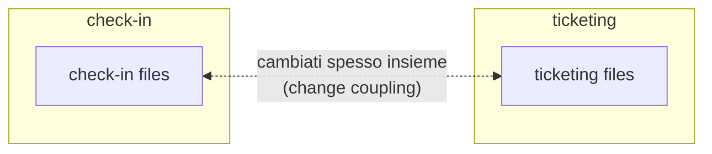

# 19 · Analyzing Your Architecture with Forensic Techniques
> 📖 cap.19 · pp.456-465 — *Modern Angular* v2.0.0

Buoni **domain boundaries** rendono un sistema manutenibile nel lungo periodo (vedi [[08-sustainable-architectures]]), ma come capire se la struttura iniziale è ancora valida e dove serve migliorare? Un approccio ovvio è analizzare le **dipendenze** fra le parti dell'app. La **forensic analysis** va oltre: usando i dati storici del version control scopre pattern nascosti che le sole dipendenze non rivelano.

Il capitolo applica queste tecniche a un'app Angular con lo strumento open-source **Detective** (di Angular Architects), ispirato al libro *Your Code as a Crime Scene* di Adam Tornhill.

## L'app di esempio esaminata
> 📖 p.456

L'applicazione demo è divisa in **due domini** più un'area `shared` con componenti tecnici riusabili (logging, authentication). Detective deriva il diagramma della struttura direttamente dal codice sorgente.

```text
              shared (logging, authentication, ...)
               ▲                    ▲
   (dipendenze)│ più spesse          │ meno
               │                    │
           ticketing             booking
```

Il collegamento `ticketing → shared` è disegnato **più spesso**: indica più dipendenze rispetto a `booking → shared` (il tooltip mostra il numero concreto). A prima vista tutto torna: due domini separati che condividono qualche implementazione tecnica.

Aprendo i tre blocchi (drill-down) si vede che **dentro** ogni dominio ci sono molte dipendenze: è un buon segno, perché significa che ogni dominio tratta un'area di responsabilità coerente. Questo è **high cohesion**: idealmente la maggior parte dei cambiamenti resta isolata dentro un dominio e non tocca gli altri.

> [!tip] Take-away
> **High cohesion** dentro i domini e **low coupling** fra i domini sono due facce della stessa medaglia: entrambi servono a far evolvere i domini in modo indipendente, riducendo il carico cognitivo (più focus, meno errori, lead time più brevi). Idealmente il taglio dei domini correla anche con la struttura dei team → team self-sufficient (vedi [[#Team alignment e legge di Conway]]).

## Analyzing layering
> 📖 pp.457-458

La prima analisi strutturale rivela un potenziale problema: la feature `feature-next-flight` dipende da `feature-my-tickets`. Non è per forza un male, ma può portare a catene di dipendenze e persino a **cicli**. Per prevenirlo, i domini si suddividono in **layer**, dove ogni layer può comunicare solo con i layer inferiori.

```text
feature   → smart components: controllo del caso d'uso, NON riusabili
ui        → dumb/presentational components: riusabili, indipendenti dal caso d'uso
domain    → tipi degli oggetti ricevuti + servizi che parlano col backend
util      → funzioni ausiliarie (authentication, logging, ...)
```

Questi layer si allineano alle idee del team **Nx** e bilanciano bene beneficio e overhead. Sono adattabili: alcuni progetti splittano `domain` in due (data access vs. tipi), così i dumb component vedono solo i tipi (non parlano col backend).

Per condividere funzionalità da `feature-my-tickets` verso `feature-next-flights` ci sono varie opzioni:
- spostare dumb component e servizi nei layer `ui` e `data`;
- **ammorbidire il layering** lasciando che i feature component nei domini accedano ai feature component in `shared` (la comunicazione va in una sola direzione → niente cicli);
- introdurre un ulteriore layer, es. `sub-feature`, fra `feature` e `ui`.

> [!tip] Take-away
> Le scoperte dell'analisi strutturale non danno una risposta automatica: portano a **discussioni e decisioni deliberate**. I metodi forensi delle sezioni seguenti aggiungono basi di discussione che vanno ben oltre il semplice grafo delle dipendenze.

Collegamenti: [[08-sustainable-architectures]] (architecture matrix, layer, Sheriff/Detective).

## Forensic analysis per architetti: panoramica
> 📖 p.459

Le idee di forensic code analysis (libro *Your Code as a Crime Scene* di Adam Tornhill) applicano concetti della criminalistica al codice sorgente. Usando i **dati storici** del source control si identificano gli **hotspot**: aree complesse e cambiate di frequente, che possono segnalare debolezze architetturali rendendo il sistema instabile e difficile da mantenere.

Tenendo conto della **dimensione temporale** emergono altre informazioni nascoste:
- **change coupling**: file cambiati spesso insieme → dipendenze non ovvie, utili a valutare la modularizzazione attuale;
- **team alignment**: allineamento fra struttura dei team e struttura dei moduli → team più autonomi, miglior qualità del codice, meno rischio di errori.

## Usare Detective
> 📖 p.459

Per analizzare un progetto, dalla root si esegue:

```bash
npm i @softarc/detective -D
npx detective
```

> [!warning] Gotcha
> Detective assume che **Git** sia installato e configurato per il progetto: si aspetta la sottocartella `.git` nella cartella in cui viene lanciato. Senza la storia Git non c'è analisi forense.

Collegamenti: Detective compare già in [[08-sustainable-architectures]] (visualizzazione dipendenze) e in [[14-monorepos-libraries]] (uso con Nx, insieme a Sheriff).

## Change coupling
> 📖 p.460

Il coupling visto finora deriva direttamente dalle dipendenze fra moduli ECMAScript (deducibile da `import`/`export`). Il **change coupling** è un coupling meno ovvio: identifica i **file cambiati frequentemente insieme**. Sono logicamente accoppiati e possono evidenziare problemi nei domain boundary — minano l'obiettivo per cui la maggior parte dei cambiamenti dovrebbe restare in un solo dominio.



Nella demo emerge che il coupling fra i domini `check-in` e `ticketing` **non è basso** come sembrava dall'analisi strutturale. Sapendo che i domain boundary perfetti non esistono, questo insight diventa base di discussione: si può ritagliare diversamente il dominio per favorire cohesion e ridurre il coupling (aiuta l'idea di **bounded context** del Domain-driven Design).

> [!tip] Take-away
> Se la discussione conclude che le alternative hanno svantaggi maggiori, si **mantiene** l'implementazione attuale: comunque l'analisi è servita a rendere consapevoli del trade-off.

## Hotspot come indicatore di problemi architetturali
> 📖 pp.461-462

Se lo **stesso file** viene modificato molto spesso può esserci un problema di architettura/modularizzazione: magari un componente centrale da cui troppi domini dipendono, o che ha troppe responsabilità. Inoltre è noto che un alto **code churn** (molte modifiche agli stessi file) correla con un tasso di errore più alto.

Però conta se il file è semplice o complesso: un file con la lista delle voci di menu che cresce di poche righe a ogni feature ha churn alto ma **non è critico**, perché la struttura è semplice. Per questo Tornhill pesa il **churn** contro la **complessità**.

Sulla metrica di complessità:
- secondo uno studio sull'attività cerebrale degli sviluppatori, le metriche di complessità non predicono granché bene la difficoltà di comprensione;
- ciò che incide di più è la **dimensione del vocabolario** (numero di variabili, funzioni, classi) e, parzialmente correlata, la **lunghezza del codice**;
- per questo nel libro Tornhill usa le **Lines of Code** come misura; nel prodotto **CodeScene** usa invece la **cyclomatic complexity di McCabe** (numero di percorsi nel codice). **Detective supporta entrambe.**

Il **Hotspot Score** = churn × complessità. Più alto = area potenzialmente più rischiosa.

> [!warning] Gotcha
> Non esiste una soglia universale: il hotspot score è una **proposta di prioritizzazione**, non un giudizio assoluto. Le aree con valori più alti vanno guardate più da vicino.

Detective, per il suo taglio architetturale, **aggrega gli hotspot a livello di modulo**: a colpo d'occhio vedi quale dominio/modulo contiene quanti file sopra una certa soglia (cliccando un modulo compaiono i file). Le **medie sono omesse di proposito**, per evitare che tanti file non critici nascondano i pochi critici.

Nella demo gli hotspot non preoccupano: due-tre cambiamenti totali e cyclomatic complexity ≤ 6 a livello di file non giustificano allarmi.

## Team alignment e legge di Conway
> 📖 pp.462-463

Già nel 1968 **Melvin Conway** osservò che la struttura delle applicazioni riflette le strutture di comunicazione degli sviluppatori (**Conway's Law**): se tre team costruiscono insieme un compilatore, finisci con un compilatore a tre fasi.

Conviene quindi allineare la struttura dei team all'architettura desiderata — il cosiddetto **Inverse Conway Maneuver**. Un team responsabile di un dominio promuove il low coupling fra domini e riduce il carico cognitivo.

Ma l'allineamento *ufficiale* non garantisce che sia *praticato*. Per verificarlo si analizzano i **commit**: si controlla se i team riescono davvero a concentrarsi sui propri domini.

> [!warning] Gotcha
> Prima serve **mappare gli username del version control ai team**: con Detective si adatta un file di configurazione (dettagli nel Readme del progetto).

Nella demo non c'è un allineamento chiaro fra team e domini: sembra piuttosto che i team Alpha e Beta supportino il team Gamma. Va indagato: forse serve un'altra struttura di team, o forse i domain boundary vanno aggiustati. Cause possibili: aderenza a vecchie strutture organizzative, distribuzione dei task per ragioni tecniche, fattori storici (es. Gamma ha iniziato prima, poi Alpha ha preso `ticketing` — ipotesi testabile **limitando il periodo di analisi**).

Poiché `shared` è una collezione eterogenea di moduli riusabili (non un'unità omogenea), l'analisi va **ripetuta a livello di modulo** per vedere se ci sono lead author. Per i moduli tecnici riusabili contano più le **responsabilità chiare** dell'allineamento stretto team/codice (evitano breaking change da contributi di team diversi).

Assegnando gli **ex membri** a un team artificiale a parte si può scoprire una **perdita di conoscenza** dovuta alla loro uscita; l'approccio si estende a ragionamenti **what-if** per capire se la conoscenza va distribuita meglio nei team.

## Da Detective a CodeScene
> 📖 p.464

La forensic analysis descritta può essere migliorata ulteriormente:
- **raggruppare i commit** dello stesso feature branch o con lo stesso ticket ID, per non perdere il change coupling quando un dominio viene cambiato in commit separati;
- negli hotspot, considerare anche **come la conoscenza è distribuita**: se una sola persona conosce il codice dell'hotspot, la criticità aumenta;
- vedere come il sistema **è evoluto nel tempo** (coupling, team alignment, hotspot migliorano o peggiorano nelle ultime iterazioni?).

Il prodotto commerciale **CodeScene** (di Adam Tornhill) implementa queste opzioni e offre molte altre analisi.

## Review critica
> 📖 p.464

> [!warning] Gotcha
> La forensic analysis è **solo un pezzo del puzzle**, non un sostituto della valutazione qualitativa dell'architettura. Serve comunque valutare: se l'architettura supporta gli obiettivi (performance, security, usability), se sono state prese decisioni deliberate sui temi chiave (state management, authentication), se i pattern definiti sono implementati bene e hanno ancora senso, se le assunzioni sui trade-off si sono rivelate corrette.

Non sostituisce nemmeno le **interviste agli stakeholder** (product manager, sviluppatori): in tutte le architecture review dell'autore gli sviluppatori avevano una forte intuizione delle aree da migliorare. I valori ottenuti **non sono target** da raggiungere: indicano aree sottili da esaminare più da vicino.

## 🔁 Ripasso lampo
1. Qual è la differenza fra il coupling derivato dagli `import`/`export` e il **change coupling**? Cosa rivela quest'ultimo che il primo non vede?
2. Perché un alto **code churn** non è di per sé critico? Come si pesa contro la complessità e quale metrica usa Detective (vs. CodeScene)?
3. Cos'è il **Hotspot Score** e perché non esiste una soglia universale? Perché Detective aggrega a livello di modulo e omette le medie?
4. Cosa afferma la **legge di Conway** e cos'è l'**Inverse Conway Maneuver**? Come si verifica se l'allineamento team/dominio è davvero praticato?
5. Quali sono i quattro layer tipici (`feature`/`ui`/`domain`/`util`) e perché un layer può comunicare solo con quelli inferiori?
6. Perché la forensic analysis NON sostituisce una valutazione qualitativa dell'architettura?

**Take-away del capitolo:**
- La **forensic analysis** guarda non solo al codice attuale ma alla sua **storia nel version control**, scoprendo pattern non ovvi; richiede una repo **Git**.
- **Change coupling** (file cambiati insieme) e **hotspot** (churn × complessità) segnalano boundary deboli e aree rischiose da prioritizzare, non verdetti assoluti.
- Analizzando i commit si verifica il **team alignment** con i domini (legge di Conway / Inverse Conway Maneuver) e si scoprono lead author e perdita di conoscenza.
- **Detective** (open-source) implementa parte di queste idee; **CodeScene** (commerciale) le estende. Restano un complemento, non un sostituto, della valutazione qualitativa e delle interviste agli stakeholder.
